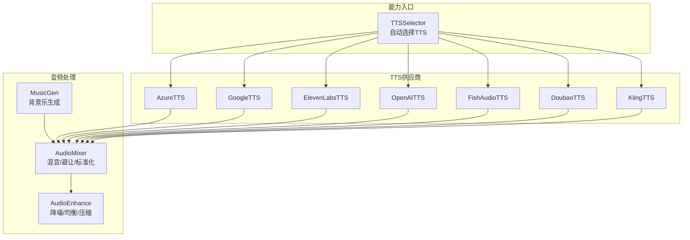
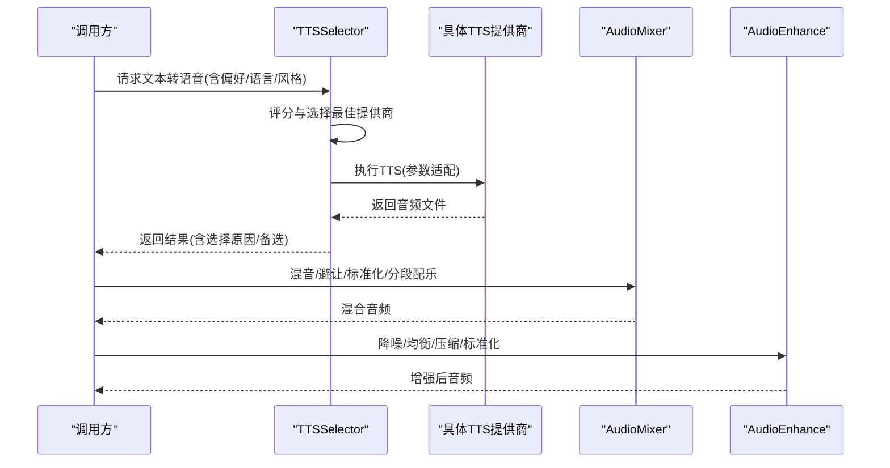
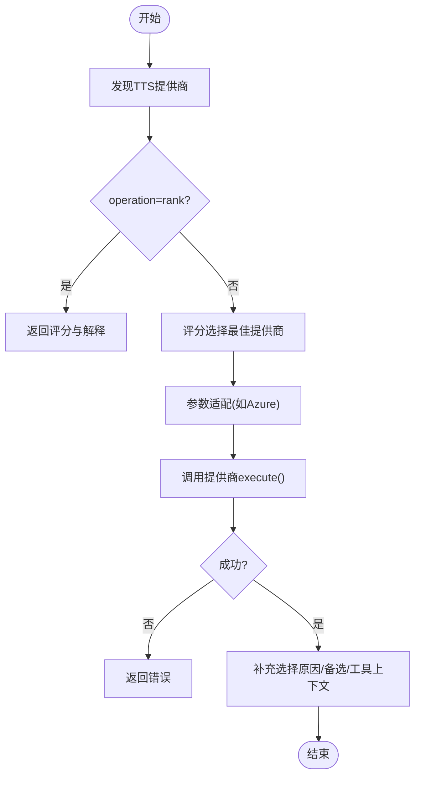
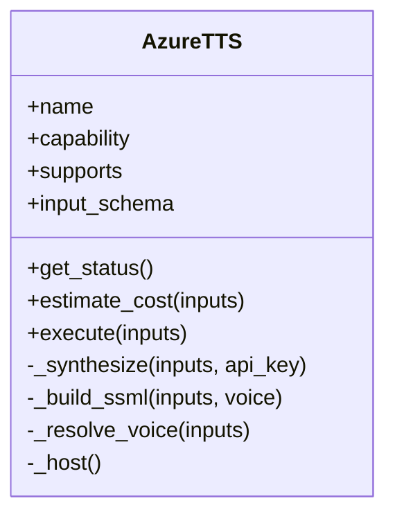
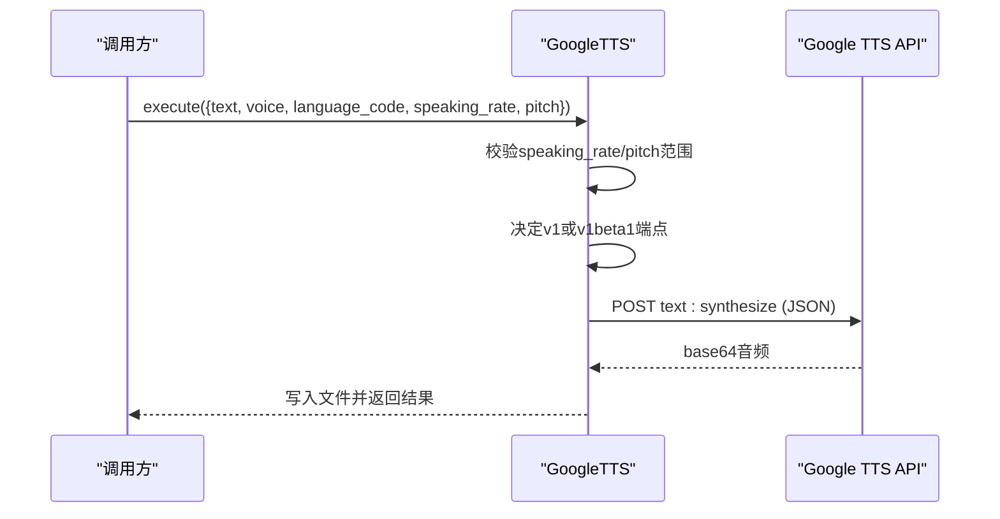
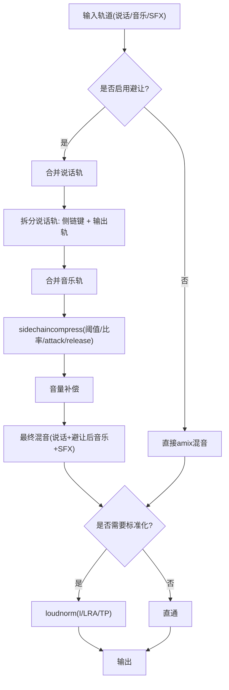
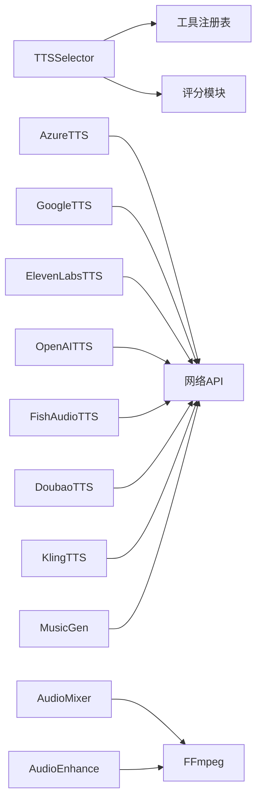

# 音频处理工具

<cite>
**本文引用的文件**
- [tools/audio/tts_selector.py](file://tools/audio/tts_selector.py)
- [tools/audio/azure_tts.py](file://tools/audio/azure_tts.py)
- [tools/audio/google_tts.py](file://tools/audio/google_tts.py)
- [tools/audio/elevenlabs_tts.py](file://tools/audio/elevenlabs_tts.py)
- [tools/audio/openai_tts.py](file://tools/audio/openai_tts.py)
- [tools/audio/fish_audio_tts.py](file://tools/audio/fish_audio_tts.py)
- [tools/audio/doubao_tts.py](file://tools/audio/doubao_tts.py)
- [tools/audio/kling_tts.py](file://tools/audio/kling_tts.py)
- [tools/audio/music_gen.py](file://tools/audio/music_gen.py)
- [tools/audio/audio_mixer.py](file://tools/audio/audio_mixer.py)
- [tools/audio/audio_enhance.py](file://tools/audio/audio_enhance.py)
</cite>

## 目录
1. [简介](#简介)
2. [项目结构](#项目结构)
3. [核心组件](#核心组件)
4. [架构总览](#架构总览)
5. [详细组件分析](#详细组件分析)
6. [依赖关系分析](#依赖关系分析)
7. [性能与质量优化](#性能与质量优化)
8. [故障排查指南](#故障排查指南)
9. [结论](#结论)
10. [附录](#附录)

## 简介
本文件面向OpenMontage的音频处理工具，系统梳理语音合成（TTS）、音乐生成、音频混音与后期处理等能力。文档覆盖：
- 多供应商TTS接入与选择策略（Azure、ElevenLabs、Google、OpenAI、Fish Audio、Doubao、Kling等）
- 背景音乐生成与音效增强
- 音频混音（含人声避让、淡入淡出、响度标准化、分段配乐）
- 音频格式转换、降噪、均衡与压缩
- 流水线设计（实时与批处理）、多语言与情感表达控制
- 成本估算、重试与幂等、错误诊断

## 项目结构
OpenMontage将音频能力以“工具”形式组织在 tools/audio 目录下，每个供应商或功能模块一个类，统一通过 BaseTool 抽象暴露输入输出、状态、成本估算、重试策略等元信息。tts_selector 作为能力级入口，自动发现并路由到具体 TTS 提供商；audio_mixer 与 audio_enhance 提供本地 FFmpeg 驱动的混音与增强；music_gen 调用 ElevenLabs Music API 生成背景乐。

图表来源
- [tools/audio/tts_selector.py:15-33](file://tools/audio/tts_selector.py#L15-L33)
- [tools/audio/audio_mixer.py:26-43](file://tools/audio/audio_mixer.py#L26-L43)
- [tools/audio/audio_enhance.py:80-100](file://tools/audio/audio_enhance.py#L80-L100)
- [tools/audio/music_gen.py:28-51](file://tools/audio/music_gen.py#L28-L51)

章节来源
- [tools/audio/tts_selector.py:15-33](file://tools/audio/tts_selector.py#L15-L33)
- [tools/audio/audio_mixer.py:26-43](file://tools/audio/audio_mixer.py#L26-L43)
- [tools/audio/audio_enhance.py:80-100](file://tools/audio/audio_enhance.py#L80-L100)
- [tools/audio/music_gen.py:28-51](file://tools/audio/music_gen.py#L28-L51)

## 核心组件
- TTSSelector：能力级TTS选择器，自动注册并评分选择最佳TTS提供商，支持“rank”模式用于预检推荐，支持用户偏好与允许列表过滤，适配不同供应商的参数差异。
- AzureTTS：基于REST SSML的高品质神经TTS，支持语速、音调、风格化表达，输出MP3/WAV。
- GoogleTTS：支持多语种与多种声音（Chirp/Studio/Journey），可走API Key或服务账号鉴权，支持SSML。
- ElevenLabsTTS：高质量多语言TTS，支持稳定性、相似度、风格、速度等参数，适合口播与多语种。
- OpenAITTS：通用TTS回退路径，支持模型、音色、指令与多种响应格式。
- FishAudioTTS：支持参考音色克隆与S2系列模型，提供采样温度、Top-P、重复惩罚等可控性。
- DoubaoTTS：中文自然语音，支持句/词级时间戳对齐，异步提交+轮询流程。
- KlingTTS：官方Kling TTS，需显式voice_id，支持回调与账户用量诊断。
- MusicGen：调用ElevenLabs Music API生成纯音乐，默认强制无 vocals 以配合旁白。
- AudioMixer：FFmpeg驱动的混音、人声避让、提取、全链路混音（mix+duck+normalize）、分段配乐。
- AudioEnhance：预设与自定义FFmpeg滤镜链，实现降噪、均衡、压缩、响度标准化。

章节来源
- [tools/audio/tts_selector.py:15-33](file://tools/audio/tts_selector.py#L15-L33)
- [tools/audio/azure_tts.py:42-86](file://tools/audio/azure_tts.py#L42-L86)
- [tools/audio/google_tts.py:33-78](file://tools/audio/google_tts.py#L33-L78)
- [tools/audio/elevenlabs_tts.py:24-67](file://tools/audio/elevenlabs_tts.py#L24-L67)
- [tools/audio/openai_tts.py:24-65](file://tools/audio/openai_tts.py#L24-L65)
- [tools/audio/fish_audio_tts.py:31-74](file://tools/audio/fish_audio_tts.py#L31-L74)
- [tools/audio/doubao_tts.py:26-70](file://tools/audio/doubao_tts.py#L26-L70)
- [tools/audio/kling_tts.py:30-65](file://tools/audio/kling_tts.py#L30-L65)
- [tools/audio/music_gen.py:28-51](file://tools/audio/music_gen.py#L28-L51)
- [tools/audio/audio_mixer.py:26-43](file://tools/audio/audio_mixer.py#L26-L43)
- [tools/audio/audio_enhance.py:80-100](file://tools/audio/audio_enhance.py#L80-L100)

## 架构总览
TTS能力通过统一选择器对外暴露，内部按供应商特性进行参数适配与执行；音频处理层以FFmpeg为核心，结合可选pydub，完成混音、避让、标准化与增强；音乐生成通过云端API产出背景乐，再进入混音管线。

图表来源
- [tools/audio/tts_selector.py:190-225](file://tools/audio/tts_selector.py#L190-L225)
- [tools/audio/audio_mixer.py:257-278](file://tools/audio/audio_mixer.py#L257-L278)
- [tools/audio/audio_enhance.py:130-181](file://tools/audio/audio_enhance.py#L130-L181)

## 详细组件分析

### TTSSelector（TTS选择器）
- 自动发现所有 capability="tts" 的工具，构建候选集
- 支持 operation=rank 返回评分排序与解释
- 支持 preferred_provider 与 allowed_providers 限制
- 为Azure TTS做参数适配（rate/pitch/output_format）
- 输出包含 selected_tool、selected_provider、provider_score、alternatives_considered

图表来源
- [tools/audio/tts_selector.py:157-188](file://tools/audio/tts_selector.py#L157-L188)
- [tools/audio/tts_selector.py:190-225](file://tools/audio/tts_selector.py#L190-L225)
- [tools/audio/tts_selector.py:227-256](file://tools/audio/tts_selector.py#L227-L256)
- [tools/audio/tts_selector.py:258-298](file://tools/audio/tts_selector.py#L258-L298)

章节来源
- [tools/audio/tts_selector.py:15-33](file://tools/audio/tts_selector.py#L15-L33)
- [tools/audio/tts_selector.py:190-225](file://tools/audio/tts_selector.py#L190-L225)
- [tools/audio/tts_selector.py:227-256](file://tools/audio/tts_selector.py#L227-L256)
- [tools/audio/tts_selector.py:258-298](file://tools/audio/tts_selector.py#L258-L298)

### AzureTTS（Azure AI Speech）
- 使用REST v1端点发送SSML，支持prosody(rate/pitch)、express-as风格
- 输出MP3/WAV，支持自定义endpoint
- 成本按字符估算，具备重试策略与幂等键

图表来源
- [tools/audio/azure_tts.py:42-86](file://tools/audio/azure_tts.py#L42-L86)
- [tools/audio/azure_tts.py:176-188](file://tools/audio/azure_tts.py#L176-L188)
- [tools/audio/azure_tts.py:221-288](file://tools/audio/azure_tts.py#L221-L288)

章节来源
- [tools/audio/azure_tts.py:42-86](file://tools/audio/azure_tts.py#L42-L86)
- [tools/audio/azure_tts.py:176-188](file://tools/audio/azure_tts.py#L176-L188)
- [tools/audio/azure_tts.py:221-288](file://tools/audio/azure_tts.py#L221-L288)

### GoogleTTS（Google Cloud TTS）
- 支持API Key与服务账号两种认证
- 支持SSML、多语言、多种声音（Chirp/Studio/Journey）
- 根据声音类型选择v1/v1beta1端点

图表来源
- [tools/audio/google_tts.py:158-170](file://tools/audio/google_tts.py#L158-L170)
- [tools/audio/google_tts.py:189-219](file://tools/audio/google_tts.py#L189-L219)
- [tools/audio/google_tts.py:221-313](file://tools/audio/google_tts.py#L221-L313)

章节来源
- [tools/audio/google_tts.py:33-78](file://tools/audio/google_tts.py#L33-L78)
- [tools/audio/google_tts.py:158-170](file://tools/audio/google_tts.py#L158-L170)
- [tools/audio/google_tts.py:189-219](file://tools/audio/google_tts.py#L189-L219)
- [tools/audio/google_tts.py:221-313](file://tools/audio/google_tts.py#L221-L313)

### ElevenLabsTTS（ElevenLabs）
- 支持稳定性、相似度、风格、速度等细粒度控制
- 输出mp3/wav，支持多种output_format
- 成本按字符估算，具备重试策略

章节来源
- [tools/audio/elevenlabs_tts.py:24-67](file://tools/audio/elevenlabs_tts.py#L24-L67)
- [tools/audio/elevenlabs_tts.py:139-160](file://tools/audio/elevenlabs_tts.py#L139-L160)
- [tools/audio/elevenlabs_tts.py:162-213](file://tools/audio/elevenlabs_tts.py#L162-L213)

### OpenAITTS（OpenAI）
- 支持gpt-4o-mini-tts的instructions指令
- 支持多种response_format与speed
- 流式写入文件并探测时长

章节来源
- [tools/audio/openai_tts.py:24-65](file://tools/audio/openai_tts.py#L24-L65)
- [tools/audio/openai_tts.py:117-141](file://tools/audio/openai_tts.py#L117-L141)
- [tools/audio/openai_tts.py:143-198](file://tools/audio/openai_tts.py#L143-L198)

### FishAudioTTS（fish.audio）
- 支持参考音色克隆（reference_id）与S2系列模型
- 支持温度、Top-P、重复惩罚、归一化、延迟模式
- 成本按UTF-8字节估算，免费额度有有效期

章节来源
- [tools/audio/fish_audio_tts.py:31-74](file://tools/audio/fish_audio_tts.py#L31-L74)
- [tools/audio/fish_audio_tts.py:258-279](file://tools/audio/fish_audio_tts.py#L258-L279)
- [tools/audio/fish_audio_tts.py:292-339](file://tools/audio/fish_audio_tts.py#L292-L339)
- [tools/audio/fish_audio_tts.py:341-406](file://tools/audio/fish_audio_tts.py#L341-L406)

### DoubaoTTS（豆包语音）
- 中文自然语音，支持句/词级时间戳
- 异步提交+轮询，支持usage返回与成本对账
- 错误诊断提示（授权、配额、语言等）

章节来源
- [tools/audio/doubao_tts.py:26-70](file://tools/audio/doubao_tts.py#L26-L70)
- [tools/audio/doubao_tts.py:178-212](file://tools/audio/doubao_tts.py#L178-L212)
- [tools/audio/doubao_tts.py:214-292](file://tools/audio/doubao_tts.py#L214-L292)
- [tools/audio/doubao_tts.py:333-394](file://tools/audio/doubao_tts.py#L333-L394)

### KlingTTS（Kling官方）
- 需要显式voice_id，支持多语言与语速
- 支持回调URL与账户用量诊断
- 兼容即时返回与异步轮询两种形态

章节来源
- [tools/audio/kling_tts.py:30-65](file://tools/audio/kling_tts.py#L30-L65)
- [tools/audio/kling_tts.py:120-192](file://tools/audio/kling_tts.py#L120-L192)
- [tools/audio/kling_tts.py:194-226](file://tools/audio/kling_tts.py#L194-L226)
- [tools/audio/kling_tts.py:228-341](file://tools/audio/kling_tts.py#L228-L341)

### MusicGen（背景音乐生成）
- 调用ElevenLabs Music API，默认force_instrumental=true避免与人声冲突
- 支持duration_seconds约束，成本按时长估算
- 失败时给出明确安装指引

章节来源
- [tools/audio/music_gen.py:28-51](file://tools/audio/music_gen.py#L28-L51)
- [tools/audio/music_gen.py:96-130](file://tools/audio/music_gen.py#L96-L130)
- [tools/audio/music_gen.py:132-188](file://tools/audio/music_gen.py#L132-L188)

### AudioMixer（混音与避让）
- 操作：mix、duck、extract、full_mix、segmented_music
- full_mix一次完成：多轨混音+人声避让+标准化，支持target_duration精确时长
- segmented_music：仅在指定时间段播放背景音乐，边界平滑淡入淡出
- 使用FFmpeg侧链压缩实现ducking，loudnorm标准化目标可配置（平台LUFS）

图表来源
- [tools/audio/audio_mixer.py:205-223](file://tools/audio/audio_mixer.py#L205-L223)
- [tools/audio/audio_mixer.py:280-338](file://tools/audio/audio_mixer.py#L280-L338)
- [tools/audio/audio_mixer.py:340-445](file://tools/audio/audio_mixer.py#L340-L445)
- [tools/audio/audio_mixer.py:479-667](file://tools/audio/audio_mixer.py#L479-L667)
- [tools/audio/audio_mixer.py:669-776](file://tools/audio/audio_mixer.py#L669-L776)

章节来源
- [tools/audio/audio_mixer.py:26-43](file://tools/audio/audio_mixer.py#L26-L43)
- [tools/audio/audio_mixer.py:257-278](file://tools/audio/audio_mixer.py#L257-L278)
- [tools/audio/audio_mixer.py:479-667](file://tools/audio/audio_mixer.py#L479-L667)
- [tools/audio/audio_mixer.py:669-776](file://tools/audio/audio_mixer.py#L669-L776)

### AudioEnhance（降噪与增强）
- 内置预设：clean_speech、noise_reduce、normalize_only、podcast、broadcast、voice_clarity
- 支持自定义af滤镜链，视频输入保持视频流copy仅处理音频
- 输出可配置编码与比特率

章节来源
- [tools/audio/audio_enhance.py:25-77](file://tools/audio/audio_enhance.py#L25-L77)
- [tools/audio/audio_enhance.py:80-128](file://tools/audio/audio_enhance.py#L80-L128)
- [tools/audio/audio_enhance.py:130-187](file://tools/audio/audio_enhance.py#L130-L187)

## 依赖关系分析
- 外部依赖
  - FFmpeg：AudioMixer与AudioEnhance的核心引擎
  - 网络API：各TTS与MusicGen供应商
  - 可选pydub：AudioMixer高级混音（未必需）
- 内部耦合
  - TTSSelector依赖工具注册表与评分模块，解耦具体提供商
  - 各TTS提供商遵循BaseTool接口，便于统一管理与替换
  - 音频处理层与TTS层松耦合，通过文件路径传递产物

图表来源
- [tools/audio/tts_selector.py:157-188](file://tools/audio/tts_selector.py#L157-L188)
- [tools/audio/audio_mixer.py:36-41](file://tools/audio/audio_mixer.py#L36-L41)
- [tools/audio/audio_enhance.py:90-92](file://tools/audio/audio_enhance.py#L90-L92)

章节来源
- [tools/audio/tts_selector.py:157-188](file://tools/audio/tts_selector.py#L157-L188)
- [tools/audio/audio_mixer.py:36-41](file://tools/audio/audio_mixer.py#L36-L41)
- [tools/audio/audio_enhance.py:90-92](file://tools/audio/audio_enhance.py#L90-L92)

## 性能与质量优化
- 多语言与情感表达
  - GoogleTTS：多语言与多声音（Chirp/Studio/Journey），SSML控制停顿与强调
  - AzureTTS：SSML prosody与express-as风格，适合沉稳/新闻播报
  - ElevenLabsTTS：stability/similarity/style/speed精细控制
  - FishAudioTTS：temperature/top_p/repetition_penalty调节表现力
  - DoubaoTTS：中文自然度与时间戳对齐，适合字幕同步
  - KlingTTS：多语言与语速控制，需显式voice_id
- 音频质量优化
  - 响度标准化：loudnorm目标可配置（-16 LUFS播客，-14 LUFS短视频平台）
  - 人声避让：sidechaincompress阈值/比率/attack/release可调
  - 降噪与均衡：预设或自定义af链，提升清晰度与听感
  - 分段配乐：仅在叙事段落播放音乐，边界淡入淡出避免突兀
- 实时与批处理
  - 实时：优先选择低延迟供应商（如OpenAI/Fish low latency），小段文本流式合成
  - 批处理：批量TTS+full_mix一次性混音，target_duration对齐视频时长
- 成本与幂等
  - 各提供商提供estimate_cost与idempotency_key_fields，便于预算与缓存
  - 重试策略：针对超时/限流/配额等错误自动重试

[本节为通用指导，不直接分析具体文件]

## 故障排查指南
- 凭据与环境变量
  - Azure：AZURE_SPEECH_KEY + AZURE_SPEECH_REGION/AZURE_TTS_ENDPOINT
  - Google：GOOGLE_TTS_API_KEY或GOOGLE_APPLICATION_CREDENTIALS
  - ElevenLabs：ELEVENLABS_API_KEY
  - OpenAI：OPENAI_API_KEY
  - Fish：FISH_AUDIO_API_KEY
  - Doubao：DOUBAO_SPEECH_API_KEY + DOUBAO_SPEECH_VOICE_TYPE
  - Kling：KLING_API_KEY
- 常见错误
  - 缺少API Key：各提供商execute首检并返回安装说明
  - 参数越界：GoogleTTS speaking_rate/pitch范围校验
  - 任务失败：Doubao/Kling异步任务轮询失败或无音频URL
  - 资源不可用：FFmpeg未安装导致AudioMixer/AudioEnhance失败
- 诊断建议
  - 使用TTSSelector的operation=rank查看评分与备选
  - 检查provider_score与alternatives_considered
  - 查看错误消息中的敏感信息已脱敏（如Doubao/Fish）

章节来源
- [tools/audio/azure_tts.py:176-188](file://tools/audio/azure_tts.py#L176-L188)
- [tools/audio/google_tts.py:158-170](file://tools/audio/google_tts.py#L158-L170)
- [tools/audio/elevenlabs_tts.py:139-160](file://tools/audio/elevenlabs_tts.py#L139-L160)
- [tools/audio/openai_tts.py:117-141](file://tools/audio/openai_tts.py#L117-L141)
- [tools/audio/fish_audio_tts.py:287-339](file://tools/audio/fish_audio_tts.py#L287-L339)
- [tools/audio/doubao_tts.py:178-212](file://tools/audio/doubao_tts.py#L178-L212)
- [tools/audio/kling_tts.py:138-192](file://tools/audio/kling_tts.py#L138-L192)
- [tools/audio/audio_mixer.py:257-278](file://tools/audio/audio_mixer.py#L257-L278)
- [tools/audio/audio_enhance.py:130-181](file://tools/audio/audio_enhance.py#L130-L181)

## 结论
OpenMontage的音频处理工具以统一的BaseTool抽象与TTSSelector能力入口，实现了多供应商TTS的灵活选择与参数适配；借助FFmpeg强大的滤镜能力，提供了从混音、避让到标准化的完整后期处理链；同时通过MusicGen与多供应商TTS，满足从旁白到背景乐的端到端生产需求。通过成本估算、重试与幂等机制，兼顾了可靠性与经济性，适用于实时与批处理场景。

[本节为总结，不直接分析具体文件]

## 附录
- 典型流水线示例
  - 旁白生成：TTSSelector -> 供应商TTS -> AudioEnhance（clean_speech）
  - 背景乐生成：MusicGen -> AudioMixer.full_mix（含duck与normalize）
  - 分段配乐：AudioMixer.segmented_music（按片段播放音乐）
  - 字幕对齐：DoubaoTTS enable_timestamp -> 生成时间戳 -> 字幕制作
- 关键参数速查
  - 响度目标：loudnorm_target（-16播客，-14短视频）
  - 避让强度：duck_level（dB）或music_volume_during_speech（线性）
  - 时长对齐：target_duration（full_mix）
  - 情感控制：Azure express-as / ElevenLabs style / Fish temperature/top_p

[本节为概念性内容，不直接分析具体文件]