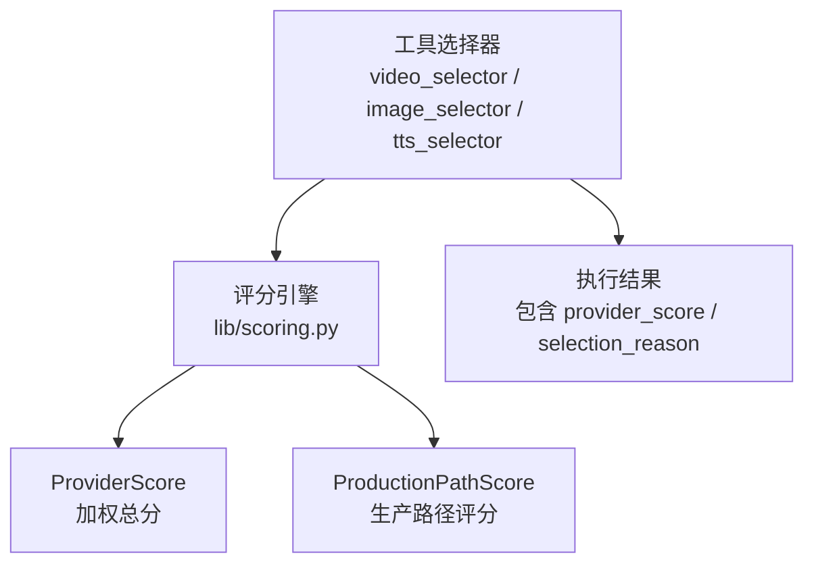
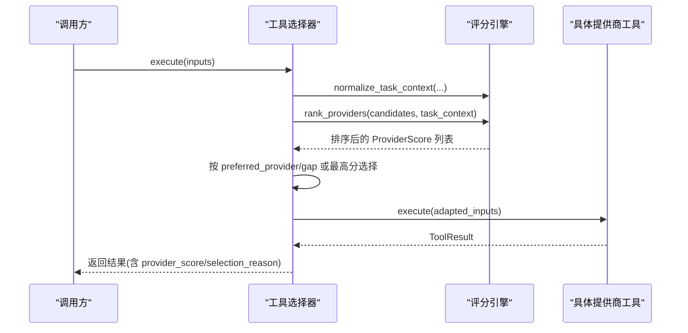
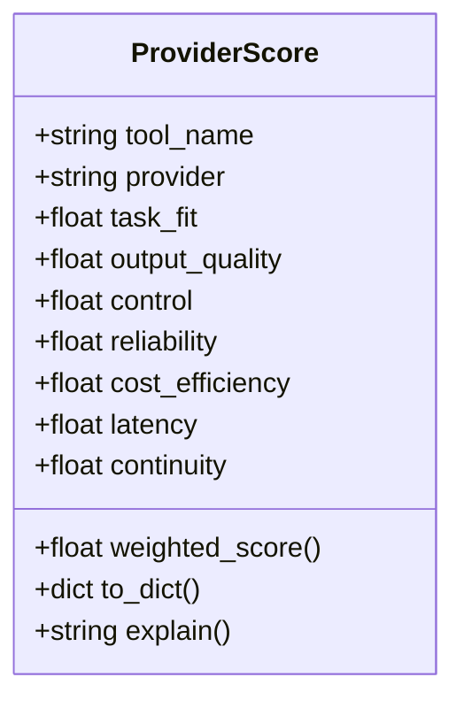
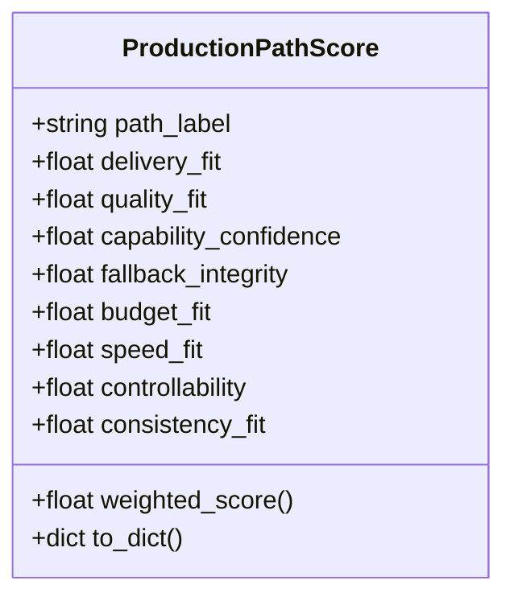
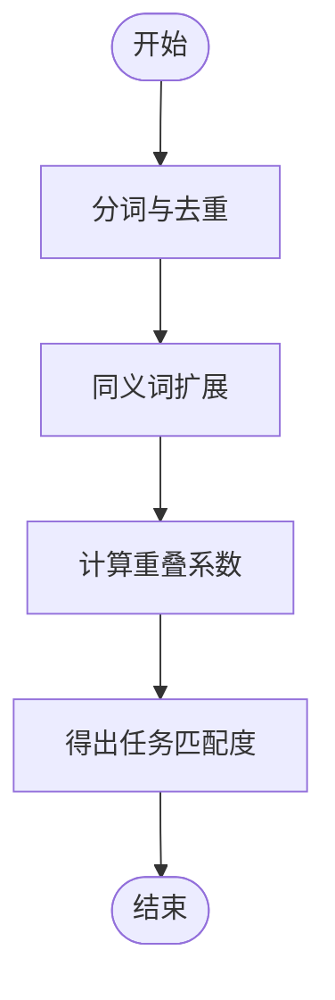
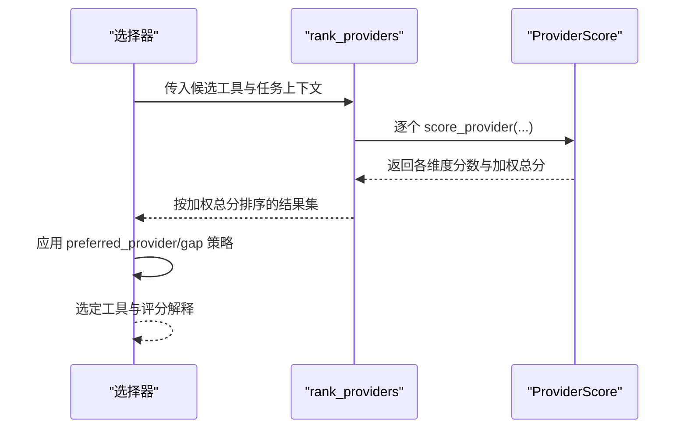
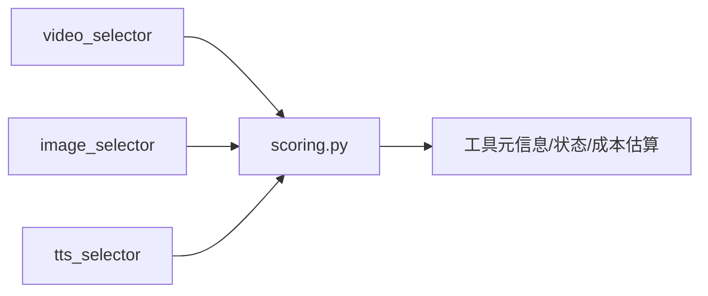

# 评分引擎

<cite>
**本文引用的文件**
- [lib/scoring.py](file://lib/scoring.py)
- [tools/video/video_selector.py](file://tools/video/video_selector.py)
- [tools/graphics/image_selector.py](file://tools/graphics/image_selector.py)
- [tools/audio/tts_selector.py](file://tools/audio/tts_selector.py)
- [tests/tools/test_scoring.py](file://tests/tools/test_scoring.py)
</cite>

## 目录
1. [简介](#简介)
2. [项目结构](#项目结构)
3. [核心组件](#核心组件)
4. [架构总览](#架构总览)
5. [详细组件分析](#详细组件分析)
6. [依赖关系分析](#依赖关系分析)
7. [性能考量](#性能考量)
8. [故障排查指南](#故障排查指南)
9. [结论](#结论)
10. [附录](#附录)

## 简介
本文件为 OpenMontage 的“评分引擎”提供系统化、可操作的文档。该引擎将原本“首个可用即选择”的朴素策略，升级为基于多维度加权评分的自动化决策：对每个候选提供商计算任务匹配度、输出质量、控制能力、可靠性、成本效益、延迟与连续性等维度的分数，并据此排序与选择。其目标是让每次提供商选择都可解释、可审计、可优化。

## 项目结构
评分引擎的核心实现位于 lib/scoring.py；视频、图像、语音三大类工具选择器在各自 selector 中调用评分引擎进行候选排序与最终选择。测试用例覆盖关键词分词与语义加分逻辑。

图表来源
- [lib/scoring.py:21-107](file://lib/scoring.py#L21-L107)
- [tools/video/video_selector.py:308-366](file://tools/video/video_selector.py#L308-L366)
- [tools/graphics/image_selector.py:218-332](file://tools/graphics/image_selector.py#L218-L332)
- [tools/audio/tts_selector.py:190-225](file://tools/audio/tts_selector.py#L190-L225)

章节来源
- [lib/scoring.py:1-115](file://lib/scoring.py#L1-L115)
- [tools/video/video_selector.py:308-499](file://tools/video/video_selector.py#L308-L499)
- [tools/graphics/image_selector.py:218-409](file://tools/graphics/image_selector.py#L218-L409)
- [tools/audio/tts_selector.py:180-324](file://tools/audio/tts_selector.py#L180-L324)

## 核心组件
- ProviderScore：对单个提供商在特定任务上下文下的多维评分与加权总分，支持人类可读解释与字典序列化。
- ProductionPathScore：对整条生产路径的综合评分（交付适配、质量适配、能力置信度、回退完整性、预算适配、速度适配、可控性、一致性适配）。
- 评分函数族：关键词重叠、同义词扩展、任务匹配度、控制能力、成本效益、延迟、连续性、标准化任务上下文、提供商类型识别、以及 score_provider/rank_providers/format_ranking 等入口。

章节来源
- [lib/scoring.py:21-107](file://lib/scoring.py#L21-L107)
- [lib/scoring.py:114-359](file://lib/scoring.py#L114-L359)
- [lib/scoring.py:373-557](file://lib/scoring.py#L373-L557)

## 架构总览
评分引擎被三类工具选择器统一调用：
- 视频生成选择器：构造任务上下文，调用 rank_providers 得到排序，再结合 preferred_provider 与 gap 阈值做最终选择。
- 图像生成选择器：同样通过 normalize_task_context + rank_providers 完成排序与选择。
- TTS 选择器：以文本输入作为 prompt，走相同流程。

图表来源
- [tools/video/video_selector.py:308-366](file://tools/video/video_selector.py#L308-L366)
- [tools/graphics/image_selector.py:218-332](file://tools/graphics/image_selector.py#L218-L332)
- [tools/audio/tts_selector.py:190-225](file://tools/audio/tts_selector.py#L190-L225)
- [lib/scoring.py:297-359](file://lib/scoring.py#L297-L359)
- [lib/scoring.py:533-557](file://lib/scoring.py#L533-L557)

## 详细组件分析

### ProviderScore 数据结构与权重
- 字段
  - tool_name、provider：标识工具名称与提供商。
  - 七个维度（均归一化到 0-1）：
    - task_fit：任务匹配度（权重 30%）
    - output_quality：输出质量（权重 20%）
    - control：控制能力（权重 15%）
    - reliability：可靠性（权重 15%）
    - cost_efficiency：成本效益（权重 10%）
    - latency：延迟（权重 5%）
    - continuity：连续性（权重 5%）
- 加权总分：weighted_score = sum(维度 × 对应权重)
- 辅助方法：to_dict() 用于序列化；explain() 输出人类可读解释，展示前三大贡献维度。

图表来源
- [lib/scoring.py:21-70](file://lib/scoring.py#L21-L70)

章节来源
- [lib/scoring.py:21-70](file://lib/scoring.py#L21-L70)

### ProductionPathScore 数据结构与权重
- 字段
  - path_label：路径标签
  - delivery_fit：交付适配（权重 25%）
  - quality_fit：质量适配（权重 20%）
  - capability_confidence：能力置信度（权重 15%）
  - fallback_integrity：回退完整性（权重 10%）
  - budget_fit：预算适配（权重 10%）
  - speed_fit：速度适配（权重 8%）
  - controllability：可控性（权重 7%）
  - consistency_fit：一致性适配（权重 5%）
- 加权总分：weighted_score = sum(维度 × 对应权重)
- 辅助方法：to_dict() 用于序列化。

图表来源
- [lib/scoring.py:77-107](file://lib/scoring.py#L77-L107)

章节来源
- [lib/scoring.py:77-107](file://lib/scoring.py#L77-L107)

### 评分算法实现要点

#### 关键词重叠与同义词扩展
- 关键词重叠：使用“重叠系数”而非 Jaccard，避免长描述工具被惩罚，更关注“意图是否被工具能力覆盖”。
- 同义词簇：内置多组同义词（如 cinematic/film/movie/trailer/dramatic/epic 等），当意图或 best_for 命中任一簇时，自动扩展集合参与匹配。
- 分词：正则分词，忽略标点与大小写，保证相近表达仍能匹配。

图表来源
- [lib/scoring.py:114-202](file://lib/scoring.py#L114-L202)

章节来源
- [lib/scoring.py:114-202](file://lib/scoring.py#L114-L202)

#### 任务匹配度（task_fit）
- 输入：工具的 best_for、任务意图、风格关键词。
- 过程：分别计算“意图 vs best_for”和“风格 vs best_for”的重叠，加权合并并加基础偏移，限制上限为 1.0。
- 特殊规则：
  - 运动需求但仅图像能力：大幅降低 task_fit。
  - 偏好生成视觉且为素材型提供商：适度下调 task_fit 与 output_quality。
  - 需要参考条件（reference_to_video/reference_image/multiple_reference_images）：提升 task_fit 与控制能力；否则下调。
  - 图像编辑需求：若支持 image_edit/style_transfer/multiple_reference_images，则提升 task_fit 与控制能力；否则下调。
  - 电影级/预告片/戏剧性等信号：若提供商具备多项高级特性（原生音频、多镜头、镜头控制、口型同步、电影级质量），给予额外加分。

章节来源
- [lib/scoring.py:205-231](file://lib/scoring.py#L205-L231)
- [lib/scoring.py:467-519](file://lib/scoring.py#L467-L519)

#### 控制能力（control）
- 依据 supports 字典中的功能开关，赋予不同创意影响权重（如 controlnet、reference_image、style_transfer、inpainting、img2img、negative_prompt、custom_size、aspect_ratio、seed）。
- 未提供 supports 时给保守默认值。

章节来源
- [lib/scoring.py:234-256](file://lib/scoring.py#L234-L256)

#### 可靠性（reliability）
- 优先使用历史成功率；否则根据运行状态（available/degraded/unavailable）与稳定性级别（production/beta/experimental）给出基线。

章节来源
- [lib/scoring.py:400-410](file://lib/scoring.py#L400-L410)

#### 成本效益（cost_efficiency）
- 免费或低于阈值：高分；超过剩余预算：零分；无预算信息时按绝对成本分段打分。

章节来源
- [lib/scoring.py:259-282](file://lib/scoring.py#L259-L282)

#### 延迟（latency）
- 优先使用历史 p50 延迟映射到 0-1 分数；否则按运行时类型（local/local_gpu/hybrid/api）启发式打分。

章节来源
- [lib/scoring.py:424-445](file://lib/scoring.py#L424-L445)

#### 连续性（continuity）
- 若已锁定提供商集合非空，则同一提供商得分高，不同提供商得分低；无上下文时给中等分。

章节来源
- [lib/scoring.py:285-294](file://lib/scoring.py#L285-L294)

#### 输出质量（output_quality）
- 优先使用 measured quality；否则按稳定性与 tier 映射，并对“generate-tier + production”给予小幅加分。

章节来源
- [lib/scoring.py:453-466](file://lib/scoring.py#L453-L466)

#### 标准化任务上下文（normalize_task_context）
- 将松散的任务上下文规范化为 scorer 期望的结构：合并 intent/style/brief/goal/platform/needs/prompt，推导 style_keywords、asset_type、motion_required、budget_remaining_usd，并推断是否偏好生成视觉、是否需要参考条件、是否需要图像编辑。

章节来源
- [lib/scoring.py:297-359](file://lib/scoring.py#L297-L359)

### 提供商选择逻辑
- 统一入口：rank_providers(tools, task_context) 对所有候选计算 ProviderScore 并按 weighted_score 降序排列。
- 选择策略：
  - 首选模式：若指定 preferred_provider，且其最佳候选与第一名差距不超过配置阈值（preferred_provider_gap），则尊重用户偏好。
  - 默认模式：返回加权最高且可选的提供商。
- 结果注入：执行成功后，结果中包含 provider_score、selection_reason、alternatives_considered 等可解释字段。

图表来源
- [lib/scoring.py:533-542](file://lib/scoring.py#L533-L542)
- [tools/video/video_selector.py:368-440](file://tools/video/video_selector.py#L368-L440)
- [tools/graphics/image_selector.py:334-365](file://tools/graphics/image_selector.py#L334-L365)
- [tools/audio/tts_selector.py:258-288](file://tools/audio/tts_selector.py#L258-L288)

章节来源
- [lib/scoring.py:533-542](file://lib/scoring.py#L533-L542)
- [tools/video/video_selector.py:368-440](file://tools/video/video_selector.py#L368-L440)
- [tools/graphics/image_selector.py:334-365](file://tools/graphics/image_selector.py#L334-L365)
- [tools/audio/tts_selector.py:258-288](file://tools/audio/tts_selector.py#L258-L288)

## 依赖关系分析
- 选择器对评分引擎的依赖：
  - video_selector、image_selector、tts_selector 均在 execute 中调用 normalize_task_context 与 rank_providers，并将评分结果写入返回数据。
- 评分引擎内部依赖：
  - 工具元信息：name、provider、best_for、supports、stability、tier、runtime、quality_score、historical_success_rate、latency_p50_seconds 等。
  - 工具状态：get_status().value 决定可靠性基线。
  - 成本估算：estimate_cost(task_context) 用于成本效益评分。

图表来源
- [tools/video/video_selector.py:308-366](file://tools/video/video_selector.py#L308-L366)
- [tools/graphics/image_selector.py:218-332](file://tools/graphics/image_selector.py#L218-L332)
- [tools/audio/tts_selector.py:190-225](file://tools/audio/tts_selector.py#L190-L225)
- [lib/scoring.py:373-530](file://lib/scoring.py#L373-L530)

章节来源
- [tools/video/video_selector.py:308-499](file://tools/video/video_selector.py#L308-L499)
- [tools/graphics/image_selector.py:218-409](file://tools/graphics/image_selector.py#L218-L409)
- [tools/audio/tts_selector.py:180-324](file://tools/audio/tts_selector.py#L180-L324)
- [lib/scoring.py:373-530](file://lib/scoring.py#L373-L530)

## 性能考量
- 分词与同义词扩展：基于正则与集合操作，复杂度近似 O(N+M)，N/M 为关键词数量，开销较低。
- 评分函数：多为常数时间或线性扫描，整体适合批量候选评估。
- 建议：
  - 合理维护 best_for 与 supports，减少无效关键词膨胀。
  - 提供准确的 historical_success_rate、latency_p50_seconds、quality_score，可减少启发式误差。
  - 控制候选规模，避免过多无关工具进入评分。

[本节为通用指导，不直接分析具体文件]

## 故障排查指南
- 问题：所有提供商可靠性均为 0.0
  - 原因：旧代码误用枚举字符串导致分支不匹配。
  - 解决：确保使用 get_status().value 获取小写状态值。
- 问题：任务匹配度对带标点的意图不敏感
  - 验证：测试用例断言分词会去除尾部标点，保持匹配稳定。
- 问题：未考虑预算导致成本效益失真
  - 检查：task_context 中是否提供 budget_remaining_usd；若无，将按绝对成本启发式打分。
- 问题：偏好提供商未被选中
  - 检查：preferred_provider_gap 阈值是否过严；确认所选提供商在 rankings 中存在且满足 gap 条件。
- 问题：结果缺少可解释信息
  - 检查：execute 成功分支是否正确写入 provider_score 与 selection_reason；必要时启用 rank 模式查看完整排名。

章节来源
- [lib/scoring.py:388-410](file://lib/scoring.py#L388-L410)
- [tests/tools/test_scoring.py:35-48](file://tests/tools/test_scoring.py#L35-L48)
- [tools/video/video_selector.py:308-366](file://tools/video/video_selector.py#L308-L366)
- [tools/graphics/image_selector.py:218-332](file://tools/graphics/image_selector.py#L218-L332)
- [tools/audio/tts_selector.py:190-225](file://tools/audio/tts_selector.py#L190-L225)

## 结论
OpenMontage 的评分引擎通过七维加权模型与丰富的语义匹配机制，实现了从“可用即选”到“可解释的最优选择”的升级。ProviderScore 与 ProductionPathScore 提供了清晰的评分结构与解释能力；选择器层将评分结果与业务约束（如偏好、预算、可用性）结合，形成稳健的自动化决策流程。通过持续完善工具元信息与历史指标，可进一步提升选择的准确性与可解释性。

[本节为总结性内容，不直接分析具体文件]

## 附录

### 评分调优指南
- 调整权重：如需强调某维度（如成本控制），可在 ProviderScore.weighted_score 中相应提高权重，并在选择器层配合预算约束。
- 增强语义匹配：扩展 _SYNONYM_CLUSTERS，补充领域术语；完善 best_for 描述，使其更贴近实际能力。
- 提升可靠性与质量：为工具提供 historical_success_rate、quality_score、latency_p50_seconds，使评分更贴近真实表现。
- 控制能力细化：在 supports 中明确标注关键能力开关，以便 control 评分更准确。
- 连续性优化：在多阶段流水线中传递 locked_providers，鼓励风格一致性与资源复用。

[本节为通用指导，不直接分析具体文件]

### 示例：如何查看评分与解释
- 在视频/图像/TTS 选择器中设置 operation=rank，返回 rankings 与 explanation，便于人工校验。
- 执行成功后，结果中包含 provider_score（各维度分数与加权总分）与 selection_reason（简要解释）。

章节来源
- [tools/video/video_selector.py:313-326](file://tools/video/video_selector.py#L313-L326)
- [tools/graphics/image_selector.py:226-236](file://tools/graphics/image_selector.py#L226-L236)
- [tools/audio/tts_selector.py:196-206](file://tools/audio/tts_selector.py#L196-L206)
- [lib/scoring.py:545-557](file://lib/scoring.py#L545-L557)