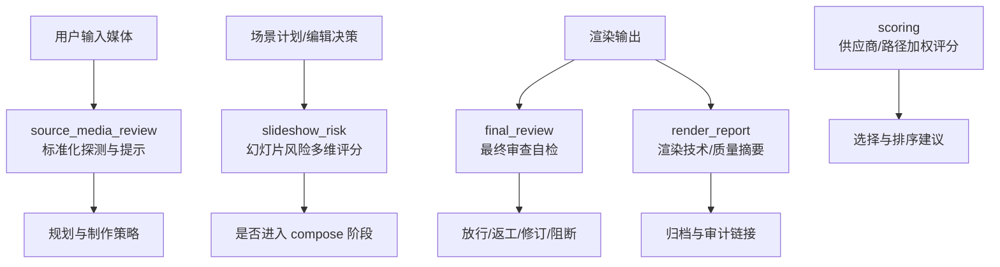
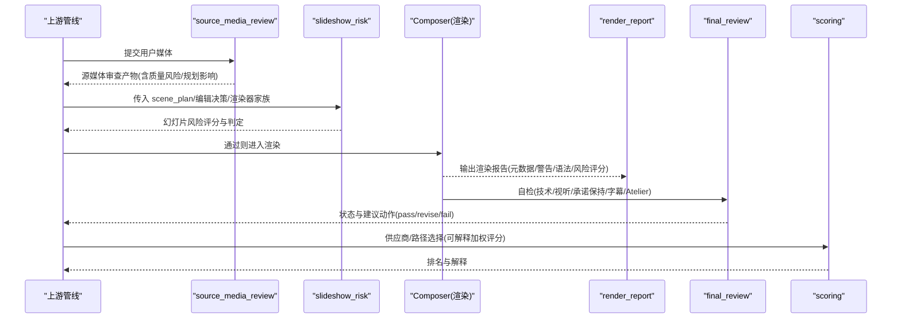
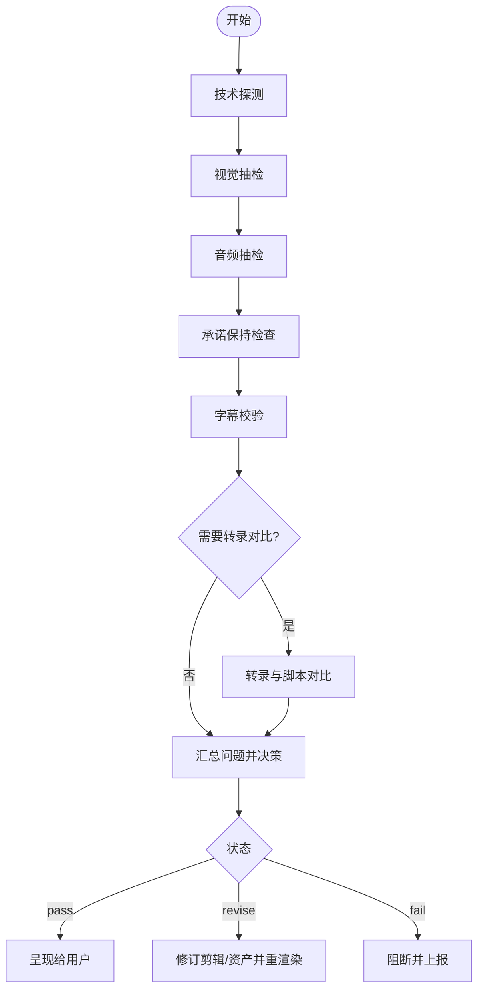
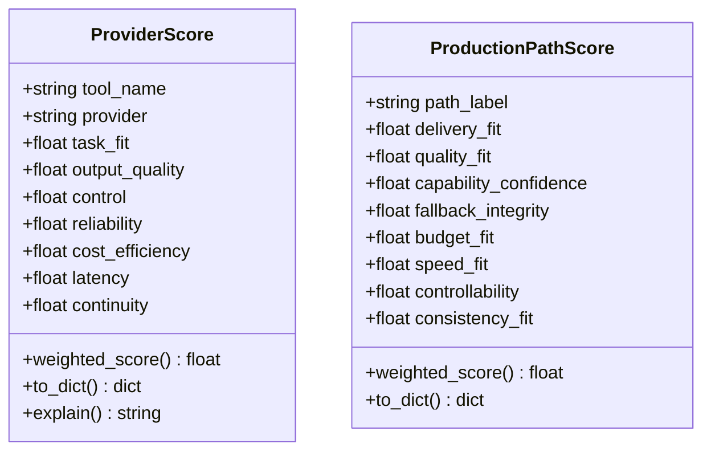
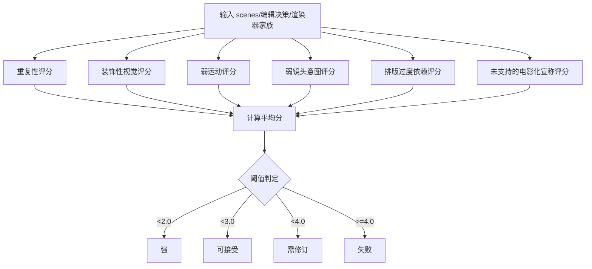
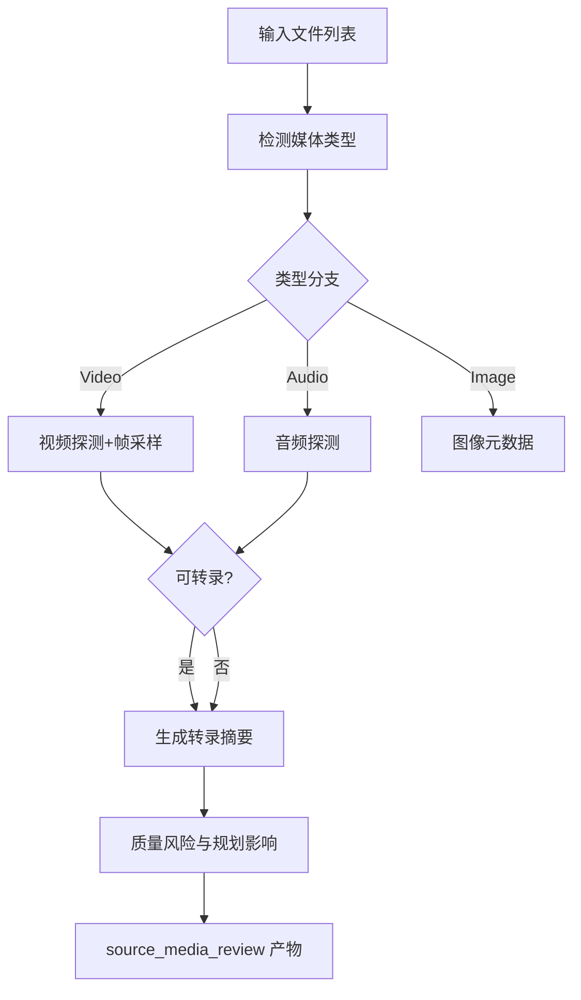
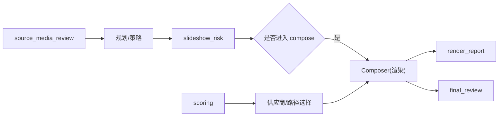

# 质量报告系统

<cite>
**本文引用的文件**
- [final_review.schema.json](file://schemas/artifacts/final_review.schema.json)
- [review.schema.json](file://schemas/artifacts/review.schema.json)
- [render_report.schema.json](file://schemas/artifacts/render_report.schema.json)
- [scoring.py](file://lib/scoring.py)
- [slideshow_risk.py](file://lib/slideshow_risk.py)
- [source_media_review.py](file://lib/source_media_review.py)
- [test_scoring.py](file://tests/tools/test_scoring.py)
- [test_source_media_review_empty.py](file://tests/lib/test_source_media_review_empty.py)
</cite>

## 目录
1. [简介](#简介)
2. [项目结构](#项目结构)
3. [核心组件](#核心组件)
4. [架构总览](#架构总览)
5. [详细组件分析](#详细组件分析)
6. [依赖关系分析](#依赖关系分析)
7. [性能考量](#性能考量)
8. [故障排查指南](#故障排查指南)
9. [结论](#结论)
10. [附录](#附录)

## 简介
本文件为 OpenMontage 的质量报告系统提供全面文档，覆盖三类报告与评估体系：
- 最终审查报告（final_review）：对渲染产出的自检与放行决策。
- 阶段性评审报告（review）：各阶段的结构化评审发现与处置。
- 渲染报告（render_report）：Composer 在渲染后输出的技术/质量摘要。

同时说明评估标准、指标体系、生成机制、解读方法与定制选项，帮助团队实现“自动化评估 + 人工审核集成 + 多源数据聚合”的闭环质量管理。

## 项目结构
质量报告相关能力由“Schema 契约 + 评分引擎 + 媒体探针”三部分构成：
- Schema 契约：定义三类报告的字段、枚举与约束，确保跨阶段产物一致可审计。
- 评分引擎：提供供应商/生产路径加权评分与“幻灯片风险”多维评估。
- 媒体探针：对用户输入媒体进行标准化探测、采样与风险提示，形成 source_media_review 产物。

图表来源
- [source_media_review.py:215-331](file://lib/source_media_review.py#L215-L331)
- [slideshow_risk.py:26-87](file://lib/slideshow_risk.py#L26-L87)
- [final_review.schema.json:1-171](file://schemas/artifacts/final_review.schema.json#L1-L171)
- [render_report.schema.json:1-64](file://schemas/artifacts/render_report.schema.json#L1-L64)
- [scoring.py:21-107](file://lib/scoring.py#L21-L107)

章节来源
- [final_review.schema.json:1-171](file://schemas/artifacts/final_review.schema.json#L1-L171)
- [review.schema.json:1-36](file://schemas/artifacts/review.schema.json#L1-L36)
- [render_report.schema.json:1-64](file://schemas/artifacts/render_report.schema.json#L1-L64)
- [scoring.py:1-557](file://lib/scoring.py#L1-L557)
- [slideshow_risk.py:1-256](file://lib/slideshow_risk.py#L1-L256)
- [source_media_review.py:1-396](file://lib/source_media_review.py#L1-L396)

## 核心组件
- 最终审查报告（final_review）
  - 目的：证明 Composer 在呈现给用户前已检查实际渲染视频，并给出放行/修订/阻断建议。
  - 关键检查项：技术探测、视觉抽检、音频抽检、承诺保持（运行时/渲染器家族一致性）、字幕校验、可选转录对比、Atelier 专属规则。
  - 状态与动作：status 为 pass/revise/fail；recommended_action 指导下一步（呈现、重渲染、修订剪辑/资产、阻断、重新授权）。

- 阶段性评审报告（review）
  - 目的：记录各阶段（idea/script/scene_plan/assets/edit/compose/publish）的结构化发现与处置。
  - 关键字段：stage、round、findings（id/severity/category/description/disposition/agent_response）。

- 渲染报告（render_report）
  - 目的：记录渲染产出元数据、耗时、警告、验证备注、使用的渲染语法、幻灯片风险评分、以及到 final_review 的可追溯引用。
  - 关键字段：outputs[]、render_time_seconds、warnings、verification_notes、render_grammar、slideshow_risk_score、decision_log_ref、final_review_ref。

- 评分引擎（scoring）
  - ProviderScore：针对单一供应商的多维加权评分（任务匹配、输出质量、可控性、可靠性、成本效率、延迟、连续性），并提供解释文本。
  - ProductionPathScore：针对整条生产路径的加权评分（交付契合、质量契合、能力信心、回退完整性、预算契合、速度契合、可控性、一致性契合）。
  - 语义匹配与同义词扩展、控制力权重、成本/延迟启发式、运动需求惩罚、电影级特性加分等。

- 幻灯片风险评分（slideshow_risk）
  - 六维度：重复性、装饰性视觉、弱运动、弱镜头意图、排版过度依赖、未支持的“电影化”宣称。
  - 判定阈值：<2.0 强，<3.0 可接受，<4.0 需修订，≥4.0 失败（不应进入 compose）。

- 源媒体审查（source_media_review）
  - 目标：对用户输入媒体进行标准化探测、帧采样、转录摘要与质量风险提示，并推导规划影响。
  - 支持类型：video/audio/image；通过工具注册表调用 audio_probe/frame_sampler/transcriber，或回退到 ffprobe/PIL。

章节来源
- [final_review.schema.json:1-171](file://schemas/artifacts/final_review.schema.json#L1-L171)
- [review.schema.json:1-36](file://schemas/artifacts/review.schema.json#L1-L36)
- [render_report.schema.json:1-64](file://schemas/artifacts/render_report.schema.json#L1-L64)
- [scoring.py:21-107](file://lib/scoring.py#L21-L107)
- [slideshow_risk.py:26-87](file://lib/slideshow_risk.py#L26-L87)
- [source_media_review.py:215-331](file://lib/source_media_review.py#L215-L331)

## 架构总览
质量报告系统以“契约先行、评分驱动、探针支撑”的方式串联端到端流程：
- 输入侧：源媒体审查（source_media_review）提供素材可用性与风险提示，影响后续制作策略。
- 规划侧：幻灯片风险评分（slideshow_risk）对 scene_plan 进行多维评估，决定是否进入 compose。
- 执行侧：Composer 渲染产出，生成 render_report，并在 post-render 自检中生成 final_review。
- 决策侧：依据 final_review 的 status 与 recommended_action 决定呈现、返工或阻断。
- 辅助侧：scoring 为供应商/路径选择提供可解释的加权评分，贯穿资源选择与质量控制。

图表来源
- [source_media_review.py:215-331](file://lib/source_media_review.py#L215-L331)
- [slideshow_risk.py:26-87](file://lib/slideshow_risk.py#L26-L87)
- [render_report.schema.json:1-64](file://schemas/artifacts/render_report.schema.json#L1-L64)
- [final_review.schema.json:1-171](file://schemas/artifacts/final_review.schema.json#L1-L171)
- [scoring.py:21-107](file://lib/scoring.py#L21-L107)

## 详细组件分析

### 最终审查报告（final_review）
- 触发时机：Compose 完成后、呈现给用户之前。
- 检查维度
  - 技术探测：容器有效性、时长、分辨率、帧率、是否有音轨、编码、文件大小、问题列表。
  - 视觉抽检：从开头/中段/高潮/结尾抽样帧，检测黑场、叠加损坏、缺失素材、不可读文字。
  - 音频抽检：旁白/音乐是否存在、意外静音、削波、混音可懂度。
  - 承诺保持：交付承诺是否遵守、实际使用的渲染器家族与运行时、运行时替换检测、静默降级检测。
  - 字幕校验：是否应存在、是否实际存在、覆盖率、时间漂移。
  - 转录对比（可选）：转录与脚本一致性、词准确率。
  - Atelier 专属：禁止导入库存创意库、艺术方向声明等。
- 决策输出：status（pass/revise/fail）、issues_found、recommended_action（present_to_user/re_render/revise_edit/revise_assets/block/re_author）。

图表来源
- [final_review.schema.json:1-171](file://schemas/artifacts/final_review.schema.json#L1-L171)

章节来源
- [final_review.schema.json:1-171](file://schemas/artifacts/final_review.schema.json#L1-L171)

### 阶段性评审报告（review）
- 适用范围：idea → script → scene_plan → assets → edit → compose → publish。
- 结构化发现：每个 finding 包含 id、severity（critical/suggestion/nitpick）、category、description、disposition（accepted/rejected/pending）、agent_response。
- 作用：将人工/Agent 评审意见沉淀为可追踪、可复用的决策依据，便于后续阶段回溯与改进。

章节来源
- [review.schema.json:1-36](file://schemas/artifacts/review.schema.json#L1-L36)

### 渲染报告（render_report）
- 内容要点：
  - outputs[]：每个输出的 path/format/codec/audio_codec/resolution/fps/duration_seconds/file_size_bytes/platform_target。
  - render_time_seconds：渲染耗时。
  - warnings/verification_notes：警告与验证备注。
  - render_grammar：使用的渲染语法家族（如 cinematic-trailer/documentary-montage 等）。
  - slideshow_risk_score：幻灯片风险平均分值与判定。
  - decision_log_ref/final_review_ref：决策日志与最终审查的引用，建立可审计链路。
- 用途：归档、审计、趋势分析与下游消费（如看板、报表、自动化门禁）。

章节来源
- [render_report.schema.json:1-64](file://schemas/artifacts/render_report.schema.json#L1-L64)

### 评分引擎（scoring）
- ProviderScore
  - 维度：task_fit、output_quality、control、reliability、cost_efficiency、latency、continuity。
  - 加权总分：按固定权重计算，支持 to_dict() 与 explain() 输出可读解释。
- ProductionPathScore
  - 维度：delivery_fit、quality_fit、capability_confidence、fallback_integrity、budget_fit、speed_fit、controllability、consistency_fit。
  - 加权总分：用于比较不同生产路径的整体优劣。
- 算法要点
  - 语义匹配：基于分词与同义词簇的关键词重叠系数，避免标点与近义词导致的误判。
  - 控制力权重：对不同“可控特征”赋予差异化权重（如 controlnet > reference_image > style_transfer 等）。
  - 成本/延迟启发式：结合历史 p50 延迟与预算剩余估算成本效率。
  - 运动需求惩罚：若任务要求动态但工具仅静态图像，则大幅降低 task_fit。
  - 电影级特性加分：当视频任务具有 cinematic/trailer 等信号时，对具备 native_audio/multi_shot/camera_direction/lip_sync/cinematic_quality 的供应商给予额外加分。

图表来源
- [scoring.py:21-107](file://lib/scoring.py#L21-L107)

章节来源
- [scoring.py:21-107](file://lib/scoring.py#L21-L107)
- [scoring.py:373-530](file://lib/scoring.py#L373-L530)
- [test_scoring.py:9-48](file://tests/tools/test_scoring.py#L9-L48)

### 幻灯片风险评分（slideshow_risk）
- 六维度评分（越低越好）：
  - repetition：场景类型/描述/景别重复度过高。
  - decorative_visuals：缺乏信息/叙事角色与镜头意图，偏向装饰。
  - weak_motion：有运动但无叙事目的。
  - weak_shot_intent：缺少 shot_intent 的场景比例过高。
  - typography_overreliance：文本/统计卡片占比过高。
  - unsupported_cinematic_claims：声称“电影化”但缺乏相应结构（英雄时刻、运动、灯光等）。
- 判定阈值：<2.0 强，<3.0 可接受，<4.0 需修订，≥4.0 失败（不应进入 compose）。

图表来源
- [slideshow_risk.py:26-87](file://lib/slideshow_risk.py#L26-L87)
- [slideshow_risk.py:90-256](file://lib/slideshow_risk.py#L90-L256)

章节来源
- [slideshow_risk.py:26-87](file://lib/slideshow_risk.py#L26-L87)
- [slideshow_risk.py:90-256](file://lib/slideshow_risk.py#L90-L256)

### 源媒体审查（source_media_review）
- 功能：识别媒体类型，执行技术探测（优先工具注册表，回退 ffprobe/PIL），抽取代表性帧，尝试转录，生成质量风险与规划影响。
- 输出：files[]（每条含 technical_probe/representative_frames/quality_risks/content_summary/usable_for）、summary、planning_implications。
- 边界：若无用户媒体，返回 files=[] 且仍为合法产物，表示“完全生成式生产”。

图表来源
- [source_media_review.py:29-38](file://lib/source_media_review.py#L29-L38)
- [source_media_review.py:41-117](file://lib/source_media_review.py#L41-L117)
- [source_media_review.py:120-187](file://lib/source_media_review.py#L120-L187)
- [source_media_review.py:190-213](file://lib/source_media_review.py#L190-L213)
- [source_media_review.py:215-331](file://lib/source_media_review.py#L215-L331)

章节来源
- [source_media_review.py:215-331](file://lib/source_media_review.py#L215-L331)
- [test_source_media_review_empty.py:19-29](file://tests/lib/test_source_media_review_empty.py#L19-L29)

## 依赖关系分析
- 组件耦合
  - final_review 依赖技术探测、视听抽检、承诺保持与字幕校验等子检查，综合得出状态与动作。
  - render_report 聚合 outputs、渲染耗时、警告与验证备注，并引用 final_review 与决策日志，形成审计链。
  - slideshow_risk 依赖 scene_plan 与可选的 edit_decisions/renderer_family，输出风险判定。
  - scoring 独立于具体渲染流程，为供应商/路径选择提供可解释评分。
  - source_media_review 依赖工具注册表（audio_probe/frame_sampler/transcriber），并回退到系统工具。

图表来源
- [source_media_review.py:215-331](file://lib/source_media_review.py#L215-L331)
- [slideshow_risk.py:26-87](file://lib/slideshow_risk.py#L26-L87)
- [render_report.schema.json:1-64](file://schemas/artifacts/render_report.schema.json#L1-L64)
- [final_review.schema.json:1-171](file://schemas/artifacts/final_review.schema.json#L1-L171)
- [scoring.py:21-107](file://lib/scoring.py#L21-L107)

章节来源
- [source_media_review.py:215-331](file://lib/source_media_review.py#L215-L331)
- [slideshow_risk.py:26-87](file://lib/slideshow_risk.py#L26-L87)
- [render_report.schema.json:1-64](file://schemas/artifacts/render_report.schema.json#L1-L64)
- [final_review.schema.json:1-171](file://schemas/artifacts/final_review.schema.json#L1-L171)
- [scoring.py:21-107](file://lib/scoring.py#L21-L107)

## 性能考量
- 探针与采样
  - 优先使用工具注册表的 audio_probe/frame_sampler/transcriber，失败时回退到 ffprobe/PIL，避免阻塞。
  - 帧采样默认取 4 个时间点，平衡覆盖与开销。
- 评分计算
  - ProviderScore/ProductionPathScore 均为 O(n) 线性扫描与常数权重计算，开销低。
  - 幻灯片风险评分对 scenes 列表进行多次遍历，复杂度 O(n)，适合中等规模场景。
- 渲染与自检
  - final_review 的自检应在渲染完成后尽快执行，避免长尾等待；可将耗时检查（如转录对比）设为可选。
- 建议
  - 对大体积媒体，限制采样数量与转录长度，减少 IO 与 CPU 压力。
  - 缓存工具状态与历史成功率，减少重复探测与网络请求。

[本节为通用性能建议，不直接分析具体文件]

## 故障排查指南
- 无法探测媒体
  - 现象：technical_probe 为空或报错。
  - 处理：确认工具注册表中 audio_probe 可用；若不可用，检查系统 ffprobe 是否安装；记录 quality_risks 中的错误信息。
- 转录失败
  - 现象：transcript_summary 缺失。
  - 处理：检查 transcriber 状态；若不可用，跳过转录对比但仍可完成其他检查。
- 幻灯片风险判定失败
  - 现象：verdict=fail，阻止进入 compose。
  - 处理：根据各维度 reason 调整场景设计（增加镜头意图、减少重复、补充运动与灯光等）。
- 最终审查未通过
  - 现象：status=revise/fail，recommended_action 指向重渲染/修订/阻断。
  - 处理：依据 issues_found 逐项修复（黑场、字幕漂移、运行时替换、缺失素材等），必要时回滚到上一 checkpoint。
- 供应商评分异常
  - 现象：某供应商得分偏低或被误判。
  - 处理：检查 best_for、supports、stability/tier、历史成功率与延迟；必要时调整任务上下文（intent/style_keywords/budget）。

章节来源
- [source_media_review.py:41-117](file://lib/source_media_review.py#L41-L117)
- [source_media_review.py:120-187](file://lib/source_media_review.py#L120-L187)
- [slideshow_risk.py:90-256](file://lib/slideshow_risk.py#L90-L256)
- [final_review.schema.json:1-171](file://schemas/artifacts/final_review.schema.json#L1-L171)
- [scoring.py:373-530](file://lib/scoring.py#L373-L530)

## 结论
OpenMontage 的质量报告系统通过严格的 Schema 契约、可解释的评分引擎与标准化的媒体探针，实现了从“源媒体审查 → 规划风险评估 → 渲染自检 → 审计归档”的全链路质量治理。团队可据此：
- 明确各类报告的含义与使用场景。
- 基于多维指标持续优化内容与体验。
- 将自动化评估与人工审核有机结合，提升交付质量与可追溯性。

[本节为总结性内容，不直接分析具体文件]

## 附录

### 评估标准与指标体系
- 视觉质量标准
  - 清晰度：分辨率、码率、像素密度（来自技术探测）。
  - 色彩质量：可通过后期调色与风格化（参考样式/调色技能）间接保障。
  - 构图评估：镜头语言（景别、运动、灯光）与意图（shot_intent）充分性。
  - 情感传达效果：通过叙事角色、英雄时刻、节奏与转场设计体现。
- 音频质量指标
  - 旁白/音乐存在性、意外静音、削波、混音可懂度（来自音频抽检）。
- 内容相关性评估
  - 转录与脚本一致性、字幕覆盖率与时间漂移（来自字幕校验与可选转录对比）。
- 用户体验评分
  - 幻灯片风险（重复性、装饰性、弱运动、弱意图、排版过度、未支持的电影化宣称）。
  - 供应商/路径选择的加权评分（任务匹配、质量、可控性、可靠性、成本、延迟、连续性）。

章节来源
- [final_review.schema.json:1-171](file://schemas/artifacts/final_review.schema.json#L1-L171)
- [slideshow_risk.py:26-87](file://lib/slideshow_risk.py#L26-L87)
- [scoring.py:21-107](file://lib/scoring.py#L21-L107)

### 报告生成机制
- 自动化评估
  - 源媒体审查自动探测与风险提示。
  - 幻灯片风险自动多维评分。
  - 最终审查自动技术/视听/承诺保持/字幕校验。
- 人工审核集成
  - 阶段性评审报告记录人工/Agent 发现与处置，支持多轮迭代。
- 多源数据聚合
  - render_report 聚合 outputs、耗时、警告、验证备注，并链接 final_review 与决策日志。

章节来源
- [source_media_review.py:215-331](file://lib/source_media_review.py#L215-L331)
- [review.schema.json:1-36](file://schemas/artifacts/review.schema.json#L1-L36)
- [render_report.schema.json:1-64](file://schemas/artifacts/render_report.schema.json#L1-L64)

### 报告解读指南
- 评分含义
  - 幻灯片风险：分数越低越好，阈值划分强/可接受/需修订/失败。
  - Provider/Path 评分：0-1 归一化，越高越优；explain() 提供前三大贡献维度。
- 改进建议生成
  - 依据各维度 reason 与 violations 定位问题（如重复、弱意图、排版过度）。
  - 结合 source_media_review 的 planning_implications 调整制作策略。
- 趋势分析方法
  - 基于 render_report 的 outputs 与 slideshow_risk_score 进行跨版本对比。
  - 跟踪 final_review 的 status 分布与 recommended_action 变化，评估质量趋势。

章节来源
- [slideshow_risk.py:26-87](file://lib/slideshow_risk.py#L26-L87)
- [scoring.py:52-70](file://lib/scoring.py#L52-L70)
- [source_media_review.py:300-331](file://lib/source_media_review.py#L300-L331)

### 报告定制选项
- 自定义指标
  - 在 review.findings 中扩展 category 与 agent_response，记录业务特定指标。
  - 在 final_review.checks 中按需启用/禁用可选检查（如转录对比）。
- 报告模板
  - 基于 Schema 的严格字段约束，可在上层 UI/导出层进行模板化展示。
- 导出格式支持
  - 所有报告均为结构化 JSON，便于导出为 CSV/HTML/PDF 等下游格式。

章节来源
- [review.schema.json:1-36](file://schemas/artifacts/review.schema.json#L1-L36)
- [final_review.schema.json:1-171](file://schemas/artifacts/final_review.schema.json#L1-L171)
- [render_report.schema.json:1-64](file://schemas/artifacts/render_report.schema.json#L1-L64)