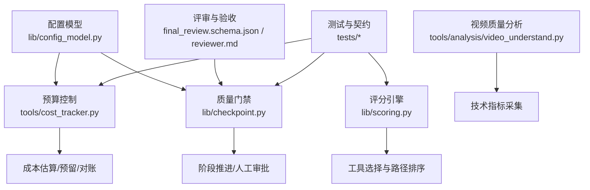
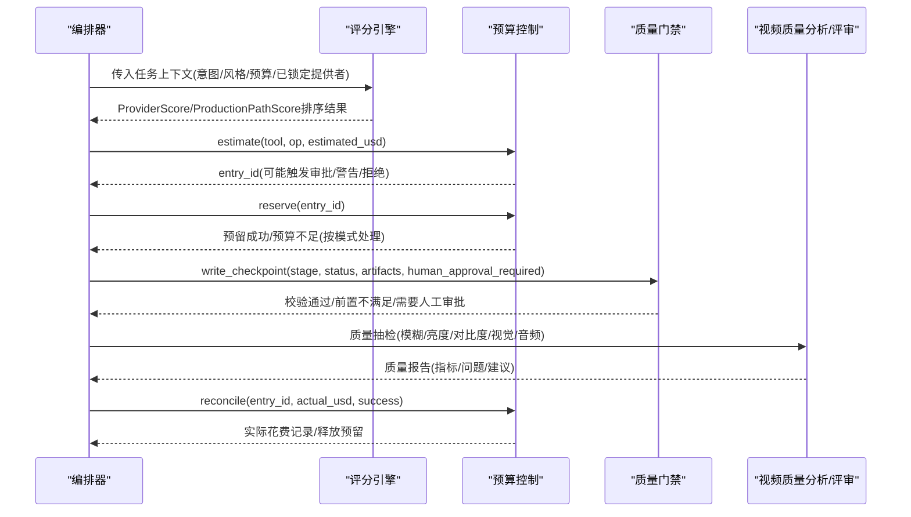
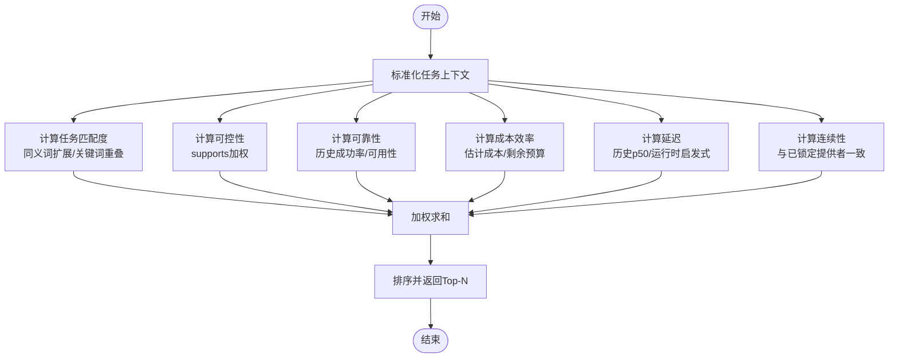
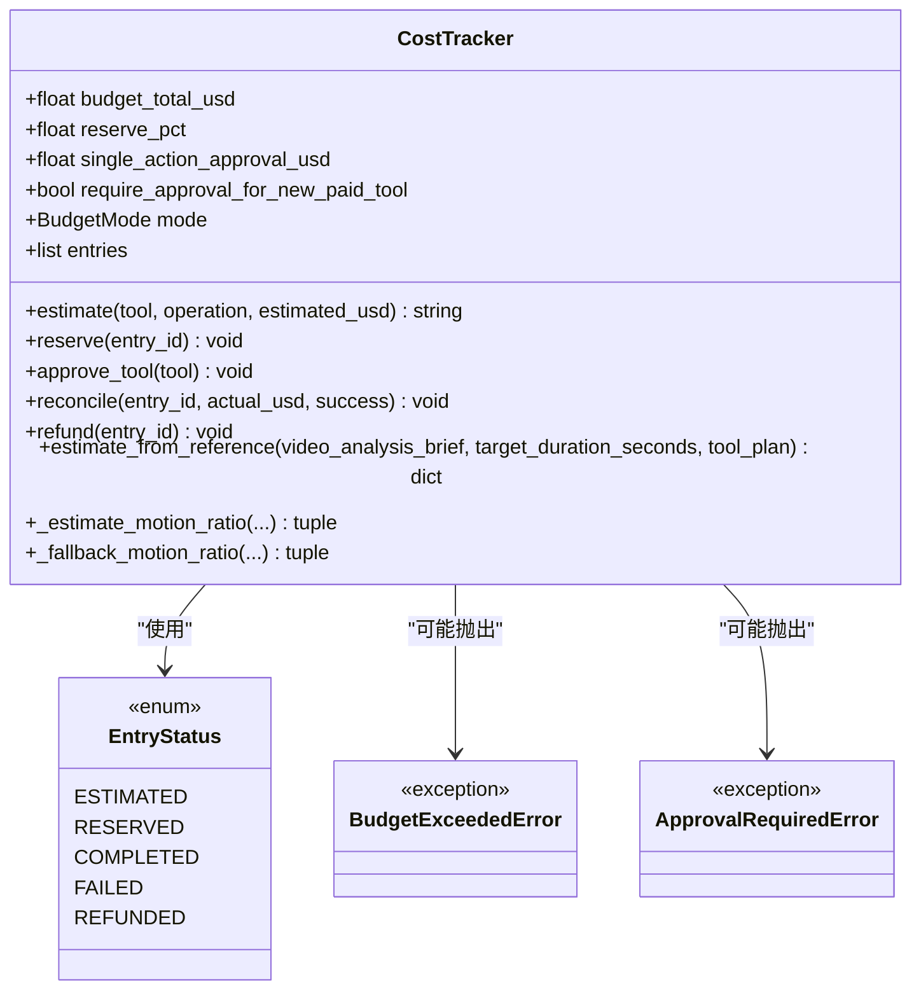
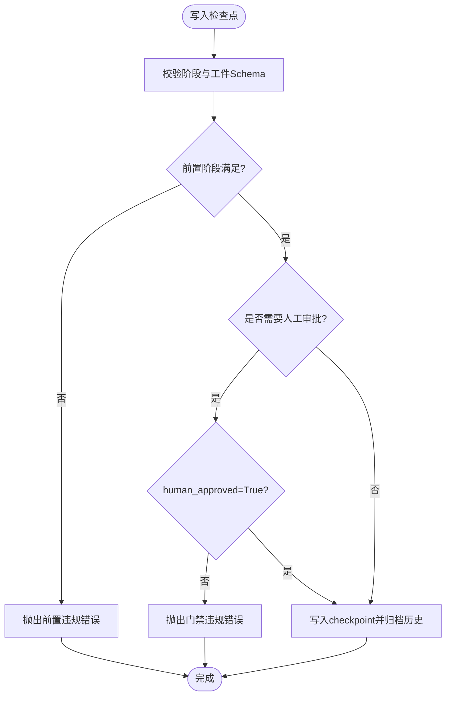
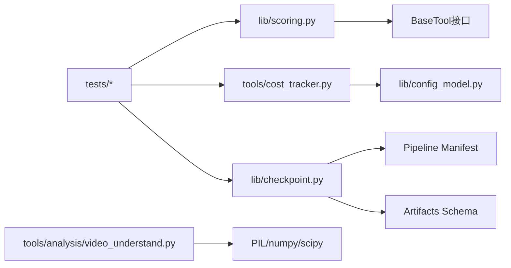

# 质量治理系统

<cite>
**本文引用的文件**
- [lib/scoring.py](file://lib/scoring.py)
- [tools/cost_tracker.py](file://tools/cost_tracker.py)
- [lib/checkpoint.py](file://lib/checkpoint.py)
- [lib/config_model.py](file://lib/config_model.py)
- [tools/analysis/video_understand.py](file://tools/analysis/video_understand.py)
- [skills/meta/reviewer.md](file://skills/meta/reviewer.md)
- [skills/meta/checkpoint-protocol.md](file://skills/meta/checkpoint-protocol.md)
- [schemas/artifacts/final_review.schema.json](file://schemas/artifacts/final_review.schema.json)
- [schemas/artifacts/render_report.schema.json](file://schemas/artifacts/render_report.schema.json)
- [schemas/artifacts/proposal_packet.schema.json](file://schemas/artifacts/proposal_packet.schema.json)
- [tests/tools/test_scoring.py](file://tests/tools/test_scoring.py)
- [tests/contracts/test_phase0_contracts.py](file://tests/contracts/test_phase0_contracts.py)
- [tests/tools/test_cost_tracker_governance.py](file://tests/tools/test_cost_tracker_governance.py)
- [tests/qa/QA_PLAN.md](file://tests/qa/QA_PLAN.md)
</cite>

## 目录
1. [简介](#简介)
2. [项目结构](#项目结构)
3. [核心组件](#核心组件)
4. [架构总览](#架构总览)
5. [详细组件分析](#详细组件分析)
6. [依赖关系分析](#依赖关系分析)
7. [性能考量](#性能考量)
8. [故障排查指南](#故障排查指南)
9. [结论](#结论)
10. [附录](#附录)

## 简介
本文件面向OpenMontage的质量治理系统，系统性说明评分引擎、预算控制与质量门禁三大子系统的设计与实现，并给出报告格式、评估标准、调优指南与排障方法。目标是帮助读者理解：
- 多维度质量评估指标与权重分配策略
- 自动化评分机制如何驱动工具选择与生产路径决策
- 成本追踪、预算限制与费用优化策略
- 检查点协议、质量阈值设置与失败处理流程
- 视觉、音频、内容相关性等指标的评估与报告规范
- 质量调优与稳定性保障的最佳实践

## 项目结构
质量治理相关代码主要分布在以下模块：
- 评分引擎：lib/scoring.py（ProviderScore、ProductionPathScore、评分函数）
- 预算控制：tools/cost_tracker.py（CostTracker、BudgetMode、估算/预留/对账）
- 质量门禁：lib/checkpoint.py（Checkpoint写入、前置阶段校验、人工审批门控）
- 配置模型：lib/config_model.py（预算模式、检查点策略、输出参数）
- 视频质量分析：tools/analysis/video_understand.py（模糊度、亮度、对比度等技术指标）
- 评审与验收：skills/meta/reviewer.md、schemas/artifacts/final_review.schema.json、render_report.schema.json
- 测试与契约：tests/tools/test_scoring.py、tests/contracts/test_phase0_contracts.py、tests/tools/test_cost_tracker_governance.py、tests/qa/QA_PLAN.md

**图表来源**
- [lib/scoring.py:1-557](file://lib/scoring.py#L1-L557)
- [tools/cost_tracker.py:1-524](file://tools/cost_tracker.py#L1-L524)
- [lib/checkpoint.py:1-634](file://lib/checkpoint.py#L1-L634)
- [lib/config_model.py:1-93](file://lib/config_model.py#L1-L93)
- [tools/analysis/video_understand.py:331-392](file://tools/analysis/video_understand.py#L331-L392)
- [schemas/artifacts/final_review.schema.json:34-70](file://schemas/artifacts/final_review.schema.json#L34-L70)

**章节来源**
- [lib/scoring.py:1-557](file://lib/scoring.py#L1-L557)
- [tools/cost_tracker.py:1-524](file://tools/cost_tracker.py#L1-L524)
- [lib/checkpoint.py:1-634](file://lib/checkpoint.py#L1-L634)
- [lib/config_model.py:1-93](file://lib/config_model.py#L1-L93)

## 核心组件
- 评分引擎：提供ProviderScore与ProductionPathScore两类加权评分对象，支持任务匹配、输出质量、可控性、可靠性、成本效率、延迟、连续性等多维度打分，并对“电影级”“参考条件”“图像编辑”等场景进行语义增强与惩罚。
- 预算控制：CostTracker负责估算、预留、对账与持久化；支持OBSERVE/WARN/CAP三种模式，单动作审批阈值与新增付费工具审批开关；基于参考视频的结构与节奏进行成本估算。
- 质量门禁：Checkpoint写入时强制校验阶段顺序、必需工件、Schema一致性，以及是否需人工审批；未通过前置或审批的门禁将抛出错误阻止推进。
- 视频质量分析：抽取帧后计算模糊度、亮度、对比度，并标记质量问题；结合VLM模式用于描述、QA与质量门控。
- 评审与验收：最终审查包含媒体元数据、视觉抽检、音频抽检与问题清单；评审技能在scene_plan与edit阶段运行幻灯片风险评分。

**章节来源**
- [lib/scoring.py:21-107](file://lib/scoring.py#L21-L107)
- [tools/cost_tracker.py:40-180](file://tools/cost_tracker.py#L40-L180)
- [lib/checkpoint.py:160-192](file://lib/checkpoint.py#L160-L192)
- [tools/analysis/video_understand.py:343-388](file://tools/analysis/video_understand.py#L343-L388)
- [schemas/artifacts/final_review.schema.json:34-70](file://schemas/artifacts/final_review.schema.json#L34-L70)
- [skills/meta/reviewer.md:177-203](file://skills/meta/reviewer.md#L177-L203)

## 架构总览
质量治理系统由评分引擎驱动工具与路径选择，预算控制约束成本，质量门禁确保阶段推进合规，视频质量分析与评审验收形成闭环反馈。

**图表来源**
- [lib/scoring.py:373-542](file://lib/scoring.py#L373-L542)
- [tools/cost_tracker.py:101-180](file://tools/cost_tracker.py#L101-L180)
- [lib/checkpoint.py:422-564](file://lib/checkpoint.py#L422-L564)
- [tools/analysis/video_understand.py:343-388](file://tools/analysis/video_understand.py#L343-L388)

## 详细组件分析

### 评分引擎：多维度质量评估与权重分配
- 指标体系
  - 任务匹配(task_fit)：基于best_for与意图/风格的关键词重叠与同义词扩展，考虑生成视觉偏好、参考条件、图像编辑需求。
  - 输出质量(output_quality)：优先使用历史质量分数，否则基于稳定性与层级调整。
  - 可控性(control)：根据supports字段中创意控制能力加权计分。
  - 可靠性(reliability)：历史成功率或运行时状态映射。
  - 成本效率(cost_efficiency)：结合估计成本与剩余预算的相对比例。
  - 延迟(latency)：历史p50或运行时类型启发式。
  - 连续性(continuity)：与已锁定提供者的匹配度。
- 权重分配
  - ProviderScore加权：task_fit(0.30)、output_quality(0.20)、control(0.15)、reliability(0.15)、cost_efficiency(0.10)、latency(0.05)、continuity(0.05)。
  - ProductionPathScore加权：delivery_fit(0.25)、quality_fit(0.20)、capability_confidence(0.15)、fallback_integrity(0.10)、budget_fit(0.10)、speed_fit(0.08)、controllability(0.07)、consistency_fit(0.05)。
- 自动化评分机制
  - normalize_task_context统一输入，提取intent/style_keywords/asset_type等。
  - score_provider计算各维度得分并进行场景增强/惩罚（如电影级特性、参考到视频、图像编辑）。
  - rank_providers返回按加权总分降序的工具列表。

**图表来源**
- [lib/scoring.py:297-359](file://lib/scoring.py#L297-L359)
- [lib/scoring.py:373-542](file://lib/scoring.py#L373-L542)

**章节来源**
- [lib/scoring.py:21-107](file://lib/scoring.py#L21-L107)
- [lib/scoring.py:114-232](file://lib/scoring.py#L114-L232)
- [lib/scoring.py:234-295](file://lib/scoring.py#L234-L295)
- [lib/scoring.py:373-542](file://lib/scoring.py#L373-L542)
- [tests/tools/test_scoring.py:1-47](file://tests/tools/test_scoring.py#L1-L47)

### 预算控制系统：成本追踪、预算限制与费用优化
- 成本追踪
  - estimate记录预估成本并生成条目ID。
  - reserve执行前预留预算，依据模式(OBSERVE/WARN/CAP)决定是否允许超支或要求审批。
  - reconcile在执行后记录实际花费并释放预留。
  - refund取消预留。
- 预算限制
  - 单动作审批阈值：超过阈值需人工批准（非OBSERVE模式）。
  - 新增付费工具审批：首次使用付费工具需批准（可配置）。
  - 可用预算=总预算-已花费-已预留-保留准备金(reserve_pct)。
- 费用优化策略
  - 基于参考视频的estimate_from_reference：按节奏密度估算场景数、运动比例、TTS字数、图像/视频片段数量，加入重试缓冲与置信度评估，输出明细项与范围。
  - motion_ratio按场景类型与风格启发式推断，避免线性缩放导致的低质量产出。
  - 成本效率评分在ProviderScore中结合剩余预算与估计成本，引导低成本高质选择。

**图表来源**
- [tools/cost_tracker.py:22-180](file://tools/cost_tracker.py#L22-L180)
- [tools/cost_tracker.py:183-484](file://tools/cost_tracker.py#L183-L484)

**章节来源**
- [tools/cost_tracker.py:40-180](file://tools/cost_tracker.py#L40-L180)
- [tools/cost_tracker.py:183-484](file://tools/cost_tracker.py#L183-L484)
- [tests/contracts/test_phase0_contracts.py:475-506](file://tests/contracts/test_phase0_contracts.py#L475-L506)
- [tests/tools/test_cost_tracker_governance.py:1-60](file://tests/tools/test_cost_tracker_governance.py#L1-L60)

### 质量门禁机制：检查点协议、质量阈值与失败处理
- 检查点协议
  - 每个阶段完成后写入checkpoint，包含stage/status/artifacts及可选review/cost_snapshot/metadata。
  - 写入前校验：阶段有效性、必需工件存在且符合Schema、前置阶段完成且必要的人工审批已通过。
  - 归档历史：覆盖completed/awaiting_human的旧checkpoint会复制到history目录，in_progress心跳不归档。
- 质量阈值设置
  - 视频质量阈值：模糊度>100、亮度50-200、对比度>30作为通过标准（来自video_understand使用指南）。
  - 幻灯片风险评分：在scene_plan与edit阶段运行，平均≥4.0为CRITICAL，≥3.0为SUGGESTION。
- 失败处理流程
  - 前置不满足或Schema校验失败：抛出CheckpointValidationError阻止推进。
  - 需要人工审批但未通过：抛出GATE VIOLATION错误，要求先写awaiting_human并提交人类审批后再写completed。
  - 预算超限：在CAP模式下抛出BudgetExceededError；在WARN模式下记录警告但不阻断。

**图表来源**
- [lib/checkpoint.py:160-192](file://lib/checkpoint.py#L160-L192)
- [lib/checkpoint.py:284-346](file://lib/checkpoint.py#L284-L346)
- [lib/checkpoint.py:422-564](file://lib/checkpoint.py#L422-L564)
- [skills/meta/checkpoint-protocol.md:102-108](file://skills/meta/checkpoint-protocol.md#L102-L108)

**章节来源**
- [lib/checkpoint.py:160-192](file://lib/checkpoint.py#L160-L192)
- [lib/checkpoint.py:284-346](file://lib/checkpoint.py#L284-L346)
- [lib/checkpoint.py:422-564](file://lib/checkpoint.py#L422-L564)
- [skills/meta/checkpoint-protocol.md:102-108](file://skills/meta/checkpoint-protocol.md#L102-L108)
- [skills/meta/reviewer.md:177-203](file://skills/meta/reviewer.md#L177-L203)
- [tools/analysis/video_understand.py:343-388](file://tools/analysis/video_understand.py#L343-L388)

### 质量报告格式与评估标准
- 最终审查(final_review.schema.json)
  - 媒体元数据：duration_seconds、resolution、fps、has_audio、codec、file_size_bytes、issues。
  - 视觉抽检：frames_sampled、frame_paths、black_frames_detected、broken_overlays、missing_assets、unreadable_text、issues。
  - 音频抽检：narration_present、music_present等布尔标志与问题列表。
- 渲染报告(render_report.schema.json)
  - 记录compose阶段的渲染产物与问题，供门禁与评审消费。
- 提案包(proposal_packet.schema.json)
  - 记录每阶段工具选择、估计成本、质量权衡与回退策略，支撑预算与质量决策。
- 评估标准
  - 视觉质量：模糊度、亮度、对比度阈值；黑帧、遮挡、缺失资产、不可读文本检测。
  - 音频质量：旁白与音乐存在性、混音平衡、无削波。
  - 内容相关性：基于video_underdescribe/qa模式验证画面与意图匹配度。

**章节来源**
- [schemas/artifacts/final_review.schema.json:34-70](file://schemas/artifacts/final_review.schema.json#L34-L70)
- [schemas/artifacts/render_report.schema.json](file://schemas/artifacts/render_report.schema.json)
- [schemas/artifacts/proposal_packet.schema.json:75-105](file://schemas/artifacts/proposal_packet.schema.json#L75-L105)
- [tools/analysis/video_understand.py:343-388](file://tools/analysis/video_understand.py#L343-L388)

## 依赖关系分析
- 评分引擎依赖工具信息（get_info/get_status/estimate_cost），并通过normalize_task_context整合任务上下文。
- 预算控制依赖配置模型中的BudgetMode与路径配置，持久化cost_log.json。
- 质量门禁依赖pipeline manifest解析阶段顺序与人工审批默认值，校验artifacts Schema。
- 视频质量分析依赖PIL/numpy/scipy进行技术测量，并结合VLM进行描述与QA。
- 测试覆盖评分tokenization、预算控制行为与治理规则。

**图表来源**
- [lib/scoring.py:373-542](file://lib/scoring.py#L373-L542)
- [tools/cost_tracker.py:183-484](file://tools/cost_tracker.py#L183-L484)
- [lib/checkpoint.py:51-76](file://lib/checkpoint.py#L51-L76)
- [lib/checkpoint.py:124-192](file://lib/checkpoint.py#L124-L192)
- [tools/analysis/video_understand.py:343-388](file://tools/analysis/video_understand.py#L343-L388)

**章节来源**
- [lib/scoring.py:373-542](file://lib/scoring.py#L373-L542)
- [tools/cost_tracker.py:183-484](file://tools/cost_tracker.py#L183-L484)
- [lib/checkpoint.py:51-76](file://lib/checkpoint.py#L51-L76)
- [lib/checkpoint.py:124-192](file://lib/checkpoint.py#L124-L192)
- [tools/analysis/video_understand.py:343-388](file://tools/analysis/video_understand.py#L343-L388)

## 性能考量
- 评分引擎
  - 使用同义词簇与分词器提升匹配精度，避免严格Jaccard带来的误判。
  - 对“电影级”特性进行额外加分，鼓励高质量但成本更高的选择。
- 预算控制
  - 基于参考视频的节奏密度估算场景与片段数量，减少过度生成造成的浪费。
  - 重试缓冲与置信度评估提高估算鲁棒性。
- 质量门禁
  - 仅对completed/awaiting_human进行归档，避免频繁心跳写入影响性能。
  - Schema校验与前置检查在写入时集中执行，降低后续处理开销。
- 视频质量分析
  - 采样关键帧而非全帧分析，平衡准确性与性能。
  - 使用快速指标（模糊度、亮度、对比度）进行初步筛选，复杂VLM仅在必要时调用。

[本节为通用指导，无需特定文件引用]

## 故障排查指南
- 评分相关问题
  - 现象：工具选择不合理或稳定性差。
  - 排查：检查任务上下文是否完整（intent/style_keywords/budget_remaining_usd/locked_providers），确认工具get_info与get_status返回值正确。
  - 参考：[lib/scoring.py:373-542](file://lib/scoring.py#L373-L542)，[tests/tools/test_scoring.py:1-47](file://tests/tools/test_scoring.py#L1-L47)
- 预算超限或审批阻塞
  - 现象：reserve抛出BudgetExceededError或ApprovalRequiredError。
  - 排查：确认BudgetMode、single_action_approval_usd、require_approval_for_new_paid_tool配置；检查可用预算与预留金额。
  - 参考：[tools/cost_tracker.py:117-180](file://tools/cost_tracker.py#L117-L180)，[tests/contracts/test_phase0_contracts.py:475-506](file://tests/contracts/test_phase0_contracts.py#L475-L506)，[tests/tools/test_cost_tracker_governance.py:1-60](file://tests/tools/test_cost_tracker_governance.py#L1-L60)
- 门禁违规或前置不满足
  - 现象：write_checkpoint抛出CheckpointValidationError或GATE VIOLATION。
  - 排查：确认前置阶段已完成且必要的人工审批已通过；检查artifacts是否符合Schema；确认pipeline_type与阶段顺序。
  - 参考：[lib/checkpoint.py:160-192](file://lib/checkpoint.py#L160-L192)，[lib/checkpoint.py:284-346](file://lib/checkpoint.py#L284-L346)，[lib/checkpoint.py:422-564](file://lib/checkpoint.py#L422-L564)，[skills/meta/checkpoint-protocol.md:102-108](file://skills/meta/checkpoint-protocol.md#L102-L108)
- 视频质量不达标
  - 现象：模糊度过高、曝光异常、对比度不足。
  - 排查：调整采样策略与阈值；检查渲染参数与编码设置；结合final_review与render_report定位问题。
  - 参考：[tools/analysis/video_understand.py:343-388](file://tools/analysis/video_understand.py#L343-L388)，[schemas/artifacts/final_review.schema.json:34-70](file://schemas/artifacts/final_review.schema.json#L34-L70)
- 端到端质量验证
  - 按照QA_PLAN分阶段运行脚本，逐项检查音频、图像、视频与智能校验结果。
  - 参考：[tests/qa/QA_PLAN.md:1-73](file://tests/qa/QA_PLAN.md#L1-L73)

**章节来源**
- [lib/scoring.py:373-542](file://lib/scoring.py#L373-L542)
- [tests/tools/test_scoring.py:1-47](file://tests/tools/test_scoring.py#L1-L47)
- [tools/cost_tracker.py:117-180](file://tools/cost_tracker.py#L117-L180)
- [tests/contracts/test_phase0_contracts.py:475-506](file://tests/contracts/test_phase0_contracts.py#L475-L506)
- [tests/tools/test_cost_tracker_governance.py:1-60](file://tests/tools/test_cost_tracker_governance.py#L1-L60)
- [lib/checkpoint.py:160-192](file://lib/checkpoint.py#L160-L192)
- [lib/checkpoint.py:284-346](file://lib/checkpoint.py#L284-L346)
- [lib/checkpoint.py:422-564](file://lib/checkpoint.py#L422-L564)
- [skills/meta/checkpoint-protocol.md:102-108](file://skills/meta/checkpoint-protocol.md#L102-L108)
- [tools/analysis/video_understand.py:343-388](file://tools/analysis/video_understand.py#L343-L388)
- [schemas/artifacts/final_review.schema.json:34-70](file://schemas/artifacts/final_review.schema.json#L34-L70)
- [tests/qa/QA_PLAN.md:1-73](file://tests/qa/QA_PLAN.md#L1-L73)

## 结论
OpenMontage的质量治理系统通过评分引擎、预算控制与质量门禁三大子系统协同工作，实现了从工具选择、成本控制到阶段推进的全链路治理。配合视频质量分析与评审验收，系统能够在保证质量的同时优化成本与稳定性。建议在生产环境中：
- 明确任务上下文与风格关键词，提升评分准确性
- 合理设置预算模式与审批阈值，避免不必要的阻塞或超支
- 严格执行质量门禁与人工审批，确保阶段推进合规
- 持续收集质量指标与成本数据，迭代优化权重与阈值

[本节为总结性内容，无需特定文件引用]

## 附录
- 配置模型要点
  - BudgetMode：observe/warn/cap，控制预算宽松程度
  - CheckpointPolicy：guided/manual_all/auto_noncreative，控制检查点策略
  - OutputConfig：默认格式、编码、分辨率、帧率、CRF等
  - 参考：[lib/config_model.py:16-73](file://lib/config_model.py#L16-L73)

**章节来源**
- [lib/config_model.py:16-73](file://lib/config_model.py#L16-L73)