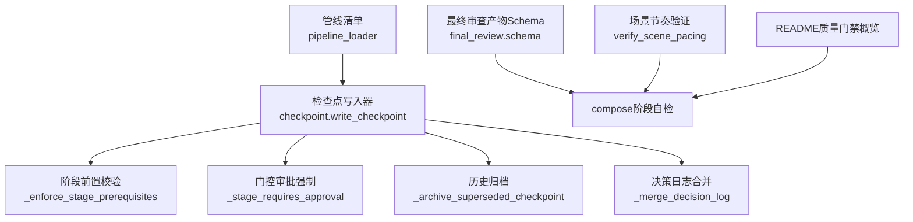
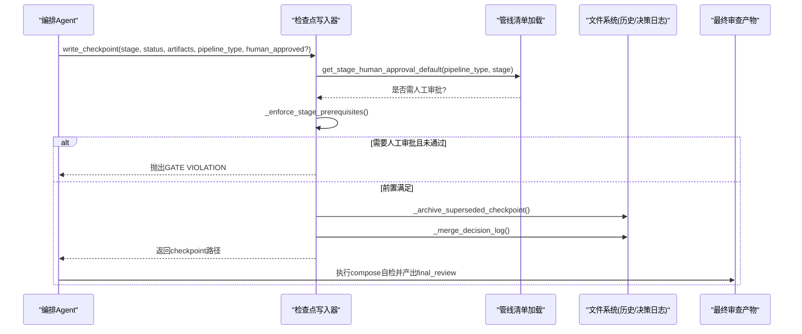
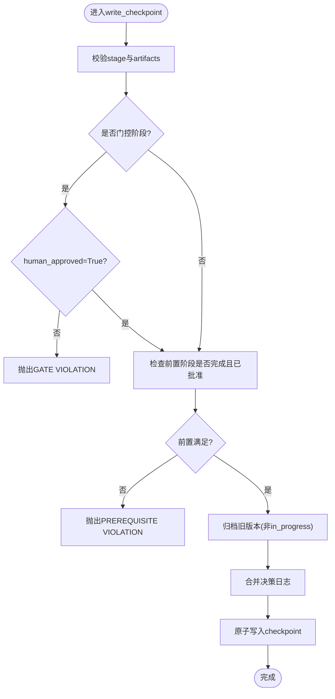
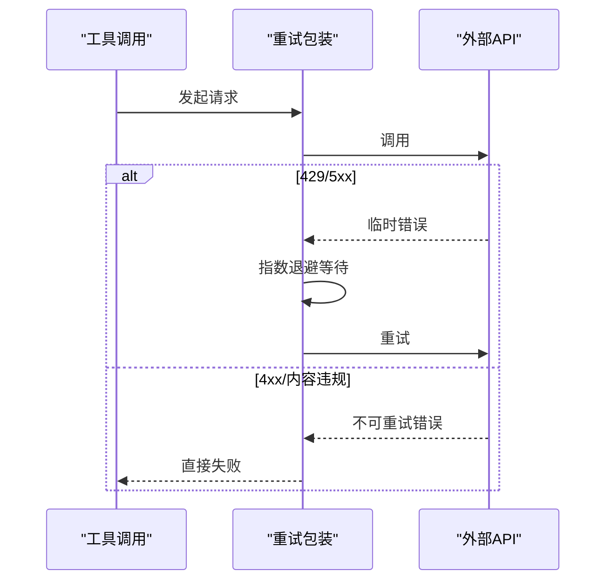
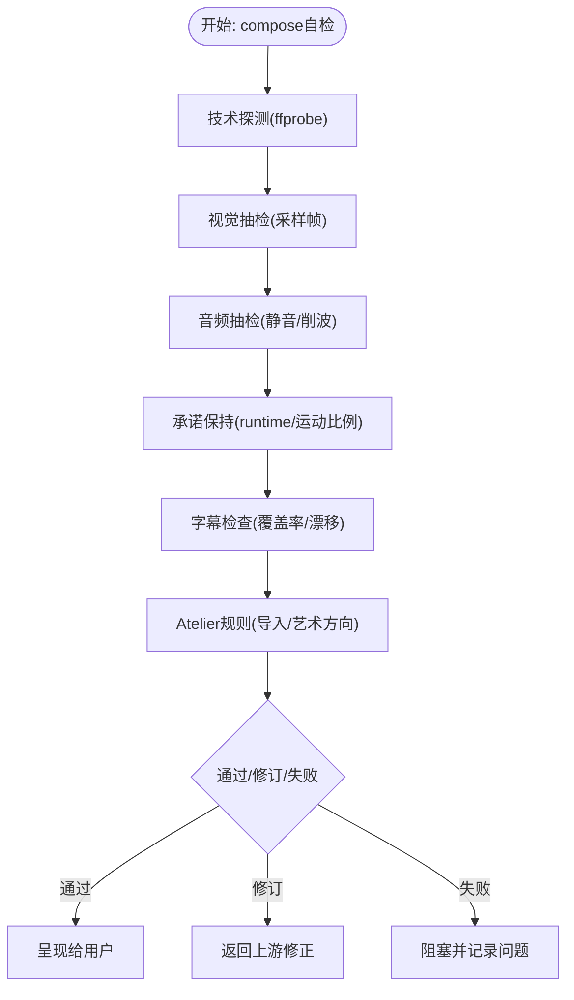
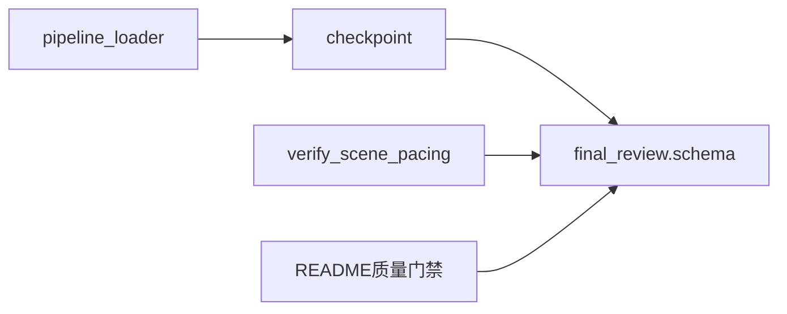

# 质量门禁系统

<cite>
**本文引用的文件**
- [lib/checkpoint.py](file://lib/checkpoint.py)
- [lib/pipeline_loader.py](file://lib/pipeline_loader.py)
- [schemas/artifacts/final_review.schema.json](file://schemas/artifacts/final_review.schema.json)
- [skills/meta/checkpoint-protocol.md](file://skills/meta/checkpoint-protocol.md)
- [README.md](file://README.md)
- [lib/verify_scene_pacing.py](file://lib/verify_scene_pacing.py)
- [tests/lib/test_checkpoint_prerequisites.py](file://tests/lib/test_checkpoint_prerequisites.py)
- [tests/backlot/test_gate_scenarios.py](file://tests/backlot/test_gate_scenarios.py)
- [tests/tools/test_grok_video_quality_score.py](file://tests/tools/test_grok_video_quality_score.py)
- [.agents/skills/bfl-api/references/error-handling.md](file://.agents/skills/bfl-api/references/error-handling.md)
- [.agents/skills/bfl-api/references/rate-limiting.md](file://.agents/skills/bfl-api/references/rate-limiting.md)
- [skills/pipelines/explainer/executive-producer.md](file://skills/pipelines/explainer/executive-producer.md)
</cite>

## 目录
1. [简介](#简介)
2. [项目结构](#项目结构)
3. [核心组件](#核心组件)
4. [架构总览](#架构总览)
5. [详细组件分析](#详细组件分析)
6. [依赖关系分析](#依赖关系分析)
7. [性能考量](#性能考量)
8. [故障排查指南](#故障排查指南)
9. [结论](#结论)
10. [附录](#附录)

## 简介
本文件面向OpenMontage的质量门禁系统，系统性说明检查点协议（阶段验证、前置条件检查、状态持久化）、质量阈值设置（视觉/音频/内容相关性/性能指标）、失败处理流程（自动重试、降级策略、人工干预触发）、各类质量检查类型（场景节奏验证、素材质量评估、一致性检查、合规性验证），以及配置与排障方法。文档以代码级事实为依据，辅以流程图与时序图帮助理解。

## 项目结构
质量门禁相关能力由“检查点协议”“管线清单约束”“最终审查产物”“场景节奏校验”“错误重试/限流参考”等模块共同构成：
- 检查点协议：负责阶段推进、门控审批、历史归档与决策日志合并。
- 管线清单：声明各阶段的“是否需要人工审批”和“审查焦点”。
- 最终审查产物：定义渲染后自检的JSON结构，覆盖技术探测、视觉抽检、音频抽检、承诺保持、字幕检查等。
- 场景节奏验证：确保画面步骤与旁白提示对齐，防止时长溢出或不足。
- 错误重试/限流：提供可复用的指数退避与熔断模式参考。
- 质量门禁总览：在README中给出人类审批门、预合成校验、渲染后自审、幻灯片风险评分、源媒体检测等高层规则。

**图表来源**
- [lib/checkpoint.py:251-346](file://lib/checkpoint.py#L251-L346)
- [lib/checkpoint.py:422-564](file://lib/checkpoint.py#L422-L564)
- [lib/pipeline_loader.py:173-190](file://lib/pipeline_loader.py#L173-L190)
- [schemas/artifacts/final_review.schema.json:1-171](file://schemas/artifacts/final_review.schema.json#L1-L171)
- [lib/verify_scene_pacing.py:83-131](file://lib/verify_scene_pacing.py#L83-L131)
- [README.md:656-662](file://README.md#L656-L662)

**章节来源**
- [lib/checkpoint.py:1-634](file://lib/checkpoint.py#L1-L634)
- [lib/pipeline_loader.py:173-190](file://lib/pipeline_loader.py#L173-L190)
- [schemas/artifacts/final_review.schema.json:1-171](file://schemas/artifacts/final_review.schema.json#L1-L171)
- [lib/verify_scene_pacing.py:1-135](file://lib/verify_scene_pacing.py#L1-L135)
- [README.md:656-662](file://README.md#L656-L662)

## 核心组件
- 检查点写入与读取：write_checkpoint/read_checkpoint/get_latest_checkpoint/get_next_stage/get_completed_stages
- 阶段与门控：get_pipeline_stages、_stage_requires_approval、_enforce_stage_prerequisites
- 历史归档与决策日志：_archive_superseded_checkpoint、_merge_decision_log
- 最终审查产物：final_review.schema定义的输出自检结构
- 场景节奏验证：trace/assert_alignment用于画面步骤与旁白对齐
- 错误重试/限流：指数退避与熔断模式参考实现

**章节来源**
- [lib/checkpoint.py:51-76](file://lib/checkpoint.py#L51-L76)
- [lib/checkpoint.py:251-346](file://lib/checkpoint.py#L251-L346)
- [lib/checkpoint.py:422-564](file://lib/checkpoint.py#L422-L564)
- [schemas/artifacts/final_review.schema.json:1-171](file://schemas/artifacts/final_review.schema.json#L1-L171)
- [lib/verify_scene_pacing.py:83-131](file://lib/verify_scene_pacing.py#L83-L131)
- [.agents/skills/bfl-api/references/error-handling.md:148-197](file://.agents/skills/bfl-api/references/error-handling.md#L148-L197)
- [.agents/skills/bfl-api/references/rate-limiting.md:67-88](file://.agents/skills/bfl-api/references/rate-limiting.md#L67-L88)

## 架构总览
质量门禁贯穿“计划—生成—合成—发布”全链路，关键节点如下：
- 计划阶段：研究、提案、脚本、分镜、资产均可能设为人工审批门。
- 合成阶段：渲染前进行交付承诺校验；渲染后进行最终审查（技术探测、视觉/音频抽检、承诺保持、字幕检查）。
- 发布阶段：元数据与打包校验。
- 全程：检查点记录阶段状态、人工审批证据、成本快照、错误信息、决策日志引用。

**图表来源**
- [lib/checkpoint.py:251-346](file://lib/checkpoint.py#L251-L346)
- [lib/checkpoint.py:422-564](file://lib/checkpoint.py#L422-L564)
- [lib/pipeline_loader.py:173-190](file://lib/pipeline_loader.py#L173-L190)
- [schemas/artifacts/final_review.schema.json:1-171](file://schemas/artifacts/final_review.schema.json#L1-L171)

**章节来源**
- [lib/checkpoint.py:251-564](file://lib/checkpoint.py#L251-L564)
- [lib/pipeline_loader.py:173-190](file://lib/pipeline_loader.py#L173-L190)
- [schemas/artifacts/final_review.schema.json:1-171](file://schemas/artifacts/final_review.schema.json#L1-L171)

## 详细组件分析

### 检查点协议（阶段验证、前置条件检查、状态持久化）
- 阶段验证：validate_checkpoint校验stage/status/artifacts符合清单与schema；write_checkpoint在写入前再次校验。
- 前置条件检查：_enforce_stage_prerequisites要求所有前置阶段为completed且必要时具备human_approved，否则抛出PREREQUISITE VIOLATION。
- 状态持久化：write_checkpoint原子写入（先.tmp再replace），对非in_progress的历史版本进行归档至history/；同时合并decision_log到项目级决策日志。
- 门控审批：_stage_requires_approval从管线清单读取human_approval_default；若处于门控阶段且status=completed但human_approved=False，抛出GATE VIOLATION。

**图表来源**
- [lib/checkpoint.py:251-346](file://lib/checkpoint.py#L251-L346)
- [lib/checkpoint.py:422-564](file://lib/checkpoint.py#L422-L564)

**章节来源**
- [lib/checkpoint.py:124-191](file://lib/checkpoint.py#L124-L191)
- [lib/checkpoint.py:251-346](file://lib/checkpoint.py#L251-L346)
- [lib/checkpoint.py:422-564](file://lib/checkpoint.py#L422-L564)
- [tests/lib/test_checkpoint_prerequisites.py:29-46](file://tests/lib/test_checkpoint_prerequisites.py#L29-L46)
- [tests/backlot/test_gate_scenarios.py:30-44](file://tests/backlot/test_gate_scenarios.py#L30-L44)

### 质量阈值设置
- 视觉质量阈值：最终审查产物包含visual_spotcheck字段，支持黑帧检测、覆盖层破损、缺失素材、不可读文本等布尔标记与问题列表。
- 音频质量阈值：audio_spotcheck字段包含旁白/音乐存在性、意外静音、削波检测、混音可懂度等。
- 内容相关性阈值：transcript_comparison可选地对比转录与源脚本，提供word_accuracy与匹配结果。
- 性能指标阈值：technical_probe记录duration_seconds、resolution、fps、codec、file_size_bytes等；promise_preservation记录render_runtime_used与motion_ratio_actual等。

这些阈值与判定逻辑由compose阶段的自检流程填充final_review，并在提交给Backlot或用户前进行pass/revise/fail决策。

**章节来源**
- [schemas/artifacts/final_review.schema.json:1-171](file://schemas/artifacts/final_review.schema.json#L1-L171)
- [README.md:656-662](file://README.md#L656-L662)

### 失败处理流程（自动重试、降级策略、人工干预触发）
- 自动重试：参考错误分类与指数退避策略，对429/5xx等临时错误进行重试，对4xx/内容违规等不可重试错误直接失败。
- 降级策略：当管线清单加载失败时，门控策略回退到调用方传入的human_approval_required标志，避免阻断运行但保留可见降级。
- 人工干预触发：门控阶段必须写awaiting_human并等待人类批准后再写completed+human_approved=True；违反将抛错。

**图表来源**
- [.agents/skills/bfl-api/references/error-handling.md:148-197](file://.agents/skills/bfl-api/references/error-handling.md#L148-L197)
- [.agents/skills/bfl-api/references/rate-limiting.md:67-88](file://.agents/skills/bfl-api/references/rate-limiting.md#L67-L88)

**章节来源**
- [.agents/skills/bfl-api/references/error-handling.md:148-197](file://.agents/skills/bfl-api/references/error-handling.md#L148-L197)
- [.agents/skills/bfl-api/references/rate-limiting.md:67-88](file://.agents/skills/bfl-api/references/rate-limiting.md#L67-L88)
- [lib/checkpoint.py:251-281](file://lib/checkpoint.py#L251-L281)
- [skills/meta/checkpoint-protocol.md:102-108](file://skills/meta/checkpoint-protocol.md#L102-L108)

### 质量检查类型
- 场景节奏验证：verify_scene_pacing.trace计算每步视频时间，assert_alignment校验旁白提示与可视地标对齐，并检查是否溢出/不足场景时长。
- 素材质量评估：source_media_review与最终审查中的technical_probe/visual/audio spotcheck对输入/输出进行探测与抽样检查。
- 一致性检查：promise_preservation核对实际运行时与提案锁定的运行时是否一致，检测silent_downgrade与runtime_swap。
- 合规性验证：subtitle_check与atelier-only规则（如禁止导入stock创意库）保障内容与风格合规。

**图表来源**
- [schemas/artifacts/final_review.schema.json:1-171](file://schemas/artifacts/final_review.schema.json#L1-L171)
- [lib/verify_scene_pacing.py:83-131](file://lib/verify_scene_pacing.py#L83-L131)

**章节来源**
- [lib/verify_scene_pacing.py:33-131](file://lib/verify_scene_pacing.py#L33-L131)
- [schemas/artifacts/final_review.schema.json:1-171](file://schemas/artifacts/final_review.schema.json#L1-L171)
- [README.md:656-662](file://README.md#L656-L662)

### 质量门禁配置指南
- 阈值调优：
  - 视觉：调整视觉抽检的阈值（如黑帧、可读性）与采样帧数量。
  - 音频：设定静音/削波阈值与混音可懂度判断。
  - 内容相关性：配置转录匹配与词准确率阈值。
  - 性能：限制分辨率、码率、时长范围，监控motion_ratio_actual。
- 自定义检查规则：
  - 在管线清单中为阶段设置review_focus与human_approval_default，细化审查关注点与门控强度。
  - 在compose阶段扩展final_review.checks，增加领域特定检查项。
- 报告生成：
  - final_review作为标准产物，汇总issues_found与recommended_action，便于自动化与人工审阅。
  - decision_log累积跨阶段决策，供审计与回放。

**章节来源**
- [lib/pipeline_loader.py:173-190](file://lib/pipeline_loader.py#L173-L190)
- [schemas/artifacts/final_review.schema.json:1-171](file://schemas/artifacts/final_review.schema.json#L1-L171)
- [lib/checkpoint.py:388-419](file://lib/checkpoint.py#L388-L419)

## 依赖关系分析
- checkpoint依赖pipeline_loader获取阶段顺序与门控默认值。
- final_review.schema被compose阶段自检使用，驱动pass/revise/fail决策。
- verify_scene_pacing与compose阶段结合，确保叙事与画面同步。
- README质量门禁概览指导整体策略，包括人类审批门、预合成校验、渲染后自审、幻灯片风险评分、源媒体检测。

**图表来源**
- [lib/pipeline_loader.py:173-190](file://lib/pipeline_loader.py#L173-L190)
- [lib/checkpoint.py:251-346](file://lib/checkpoint.py#L251-L346)
- [schemas/artifacts/final_review.schema.json:1-171](file://schemas/artifacts/final_review.schema.json#L1-L171)
- [lib/verify_scene_pacing.py:83-131](file://lib/verify_scene_pacing.py#L83-L131)
- [README.md:656-662](file://README.md#L656-L662)

**章节来源**
- [lib/pipeline_loader.py:173-190](file://lib/pipeline_loader.py#L173-L190)
- [lib/checkpoint.py:251-346](file://lib/checkpoint.py#L251-L346)
- [schemas/artifacts/final_review.schema.json:1-171](file://schemas/artifacts/final_review.schema.json#L1-L171)
- [lib/verify_scene_pacing.py:83-131](file://lib/verify_scene_pacing.py#L83-L131)
- [README.md:656-662](file://README.md#L656-L662)

## 性能考量
- 原子写入与历史归档：避免部分写入导致的状态不一致，归档仅针对非in_progress版本，减少I/O开销。
- 采样式质检：视觉/音频抽检采用有限帧采样，降低长视频处理成本。
- 清单缓存：get_pipeline_stages在无法加载清单时回退到稳定顺序，保证可恢复性。
- 重试与限流：对外部API调用采用指数退避与熔断模式，避免雪崩与资源浪费。

[本节为通用指导，不直接分析具体文件]

## 故障排查指南
- 门控违规（GATE VIOLATION）：
  - 现象：尝试将门控阶段写为completed但未设置human_approved=True。
  - 排查：确认管线清单中该阶段human_approval_default是否为true；按协议先写awaiting_human，待人工批准后写completed+human_approved=True。
  - 依据：门控逻辑与错误消息。
- 前置条件违规（PREREQUISITE VIOLATION）：
  - 现象：当前阶段的前置阶段未完成或未批准。
  - 排查：检查前置阶段checkpoint是否存在且status=completed；若需审批则确认human_approved=True。
- 最终审查失败：
  - 现象：final_review.status为revise或fail。
  - 排查：查看checks下的issues数组，定位technical_probe/visual/audio/promise/subtitle/atelier的具体问题，按recommended_action修正。
- 外部服务限流/超时：
  - 现象：429/5xx错误。
  - 排查：启用指数退避重试；若持续失败，考虑熔断与降级策略。

**章节来源**
- [lib/checkpoint.py:251-346](file://lib/checkpoint.py#L251-L346)
- [lib/checkpoint.py:422-564](file://lib/checkpoint.py#L422-L564)
- [schemas/artifacts/final_review.schema.json:1-171](file://schemas/artifacts/final_review.schema.json#L1-L171)
- [.agents/skills/bfl-api/references/error-handling.md:148-197](file://.agents/skills/bfl-api/references/error-handling.md#L148-L197)
- [.agents/skills/bfl-api/references/rate-limiting.md:67-88](file://.agents/skills/bfl-api/references/rate-limiting.md#L67-L88)

## 结论
OpenMontage的质量门禁系统以检查点协议为核心，结合管线清单的门控策略与最终审查产物，形成“计划—生成—合成—发布”的全链路质量控制。通过严格的阶段验证、前置条件检查、状态持久化与历史归档，配合视觉/音频/内容相关性/性能指标的阈值化检查，以及自动重试、降级与人工干预机制，确保输出质量可控、可追溯、可回滚。建议在生产环境中持续优化阈值与自定义检查规则，完善报告与审计能力。

[本节为总结，不直接分析具体文件]

## 附录
- 质量门禁总览与执行限制：各阶段门控（G1-G8与FINAL）的检查项与失败动作，以及反循环保护（最大修订次数、预算与时间上限）。
- 质量评分与供应商选择：quality_score用于排序与优选高质量供应商，确保生成质量基线。

**章节来源**
- [skills/pipelines/explainer/executive-producer.md:316-340](file://skills/pipelines/explainer/executive-producer.md#L316-L340)
- [tests/tools/test_grok_video_quality_score.py:1-24](file://tests/tools/test_grok_video_quality_score.py#L1-L24)