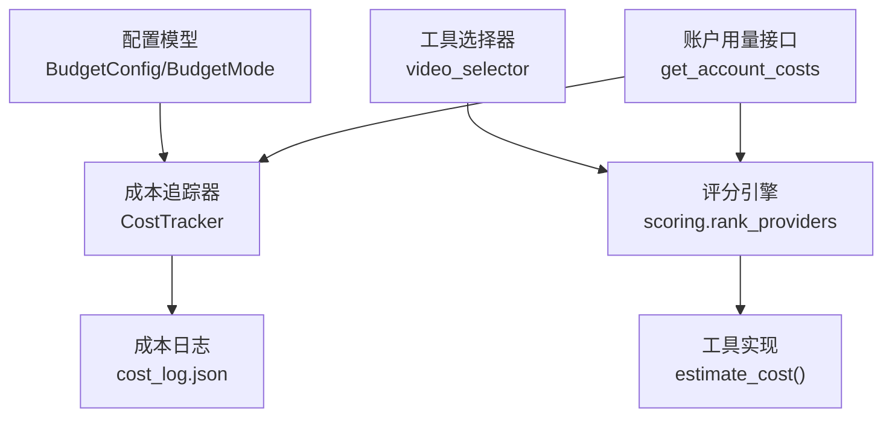
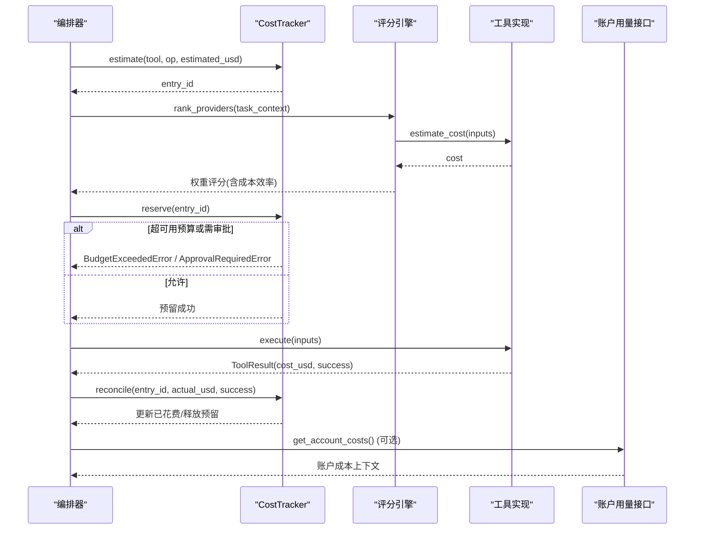
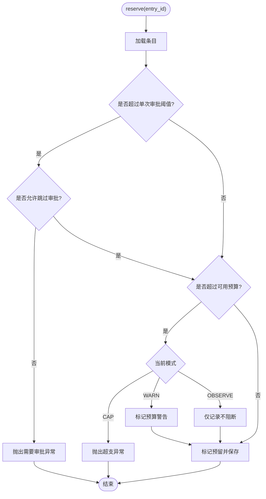
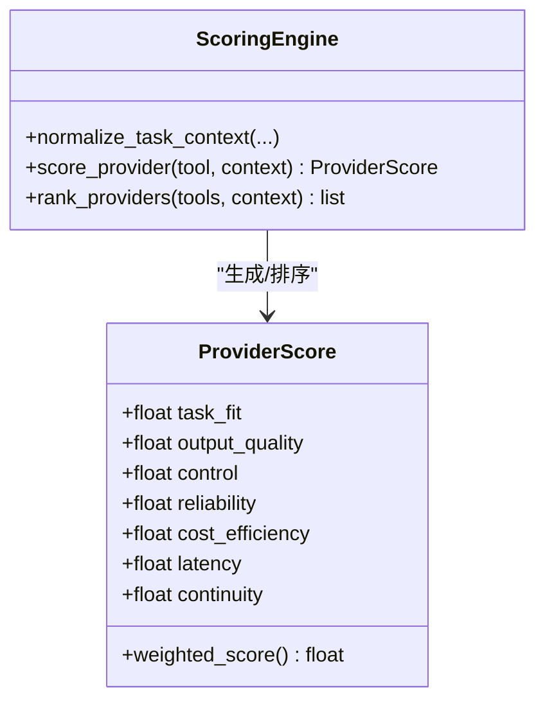
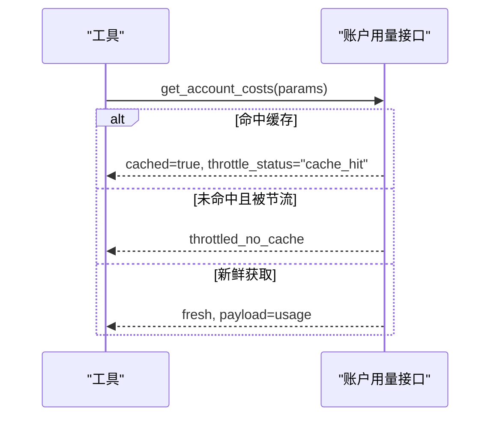
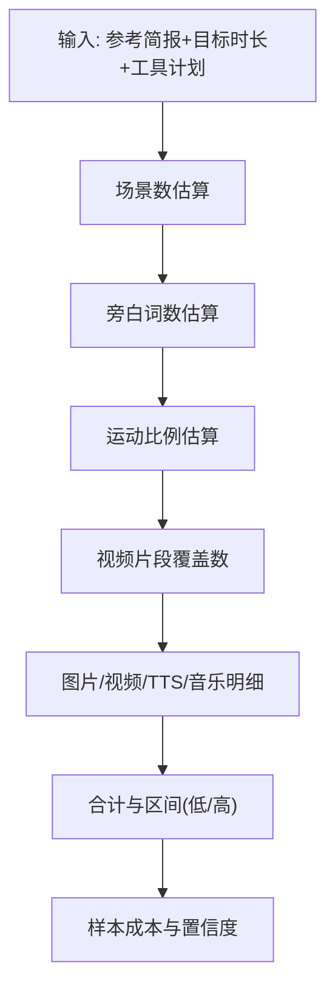

# 预算控制系统

<cite>
**本文引用的文件**
- [tools/cost_tracker.py](file://tools/cost_tracker.py)
- [lib/config_model.py](file://lib/config_model.py)
- [lib/scoring.py](file://lib/scoring.py)
- [schemas/artifacts/cost_log.schema.json](file://schemas/artifacts/cost_log.schema.json)
- [tools/_kling/account.py](file://tools/_kling/account.py)
- [tests/tools/test_cost_tracker_governance.py](file://tests/tools/test_cost_tracker_governance.py)
- [tests/contracts/test_kling_official_core.py](file://tests/contracts/test_kling_official_core.py)
- [tools/video/video_selector.py](file://tools/video/video_selector.py)
- [skills/pipelines/explainer/asset-director.md](file://skills/pipelines/explainer/asset-director.md)
- [skills/pipelines/explainer/proposal-director.md](file://skills/pipelines/explainer/proposal-director.md)
</cite>

## 目录
1. [简介](#简介)
2. [项目结构](#项目结构)
3. [核心组件](#核心组件)
4. [架构总览](#架构总览)
5. [详细组件分析](#详细组件分析)
6. [依赖关系分析](#依赖关系分析)
7. [性能与成本优化](#性能与成本优化)
8. [故障排除指南](#故障排除指南)
9. [结论](#结论)
10. [附录](#附录)

## 简介
本文件为 OpenMontage 的预算控制系统提供全面文档，覆盖成本追踪机制（实时费用监控、API 调用计费、资源使用统计）、预算限制策略（全局预算设置、单任务预算控制、超支预警机制）、费用优化策略（成本效益评分、免费工具优先、批量处理优化）、成本估算方法（API 调用成本、本地计算资源消耗、第三方服务费用），以及预算管理最佳实践与故障排除。

## 项目结构
OpenMontage 的预算控制由“配置模型 + 成本追踪器 + 评分引擎 + 外部账户用量”共同构成：
- 配置模型定义预算模式、阈值与保留比例等全局策略。
- 成本追踪器负责估计、预留、核销与持久化，贯穿执行生命周期。
- 评分引擎在工具选择时考虑成本效率，结合剩余预算进行加权打分。
- 第三方账户用量接口用于获取账户级成本上下文，辅助估算与诊断。

**图表来源**
- [lib/config_model.py:16-41](file://lib/config_model.py#L16-L41)
- [tools/cost_tracker.py:40-171](file://tools/cost_tracker.py#L40-L171)
- [lib/scoring.py:373-542](file://lib/scoring.py#L373-L542)
- [tools/_kling/account.py:72-107](file://tools/_kling/account.py#L72-L107)

**章节来源**
- [lib/config_model.py:16-41](file://lib/config_model.py#L16-L41)
- [tools/cost_tracker.py:40-171](file://tools/cost_tracker.py#L40-L171)
- [lib/scoring.py:373-542](file://lib/scoring.py#L373-L542)
- [tools/_kling/account.py:72-107](file://tools/_kling/account.py#L72-L107)

## 核心组件
- 预算配置与模式
  - 支持观察、警告、封顶三种模式；可配置总预算、预留比例、单次操作审批阈值、新付费工具审批开关。
- 成本追踪器
  - 记录估计、预留、完成/失败、退款状态；计算已用、预留、剩余与可用预算；支持按条目级别持久化。
- 评分引擎
  - 将成本效率纳入多维权重评分；当无预算信息时使用绝对成本启发式；对免费或低成本工具给予更高性价比评分。
- 账户用量集成
  - 通过账户 API 获取成本上下文，用于估算增强与错误诊断提示。

**章节来源**
- [lib/config_model.py:16-41](file://lib/config_model.py#L16-L41)
- [tools/cost_tracker.py:40-171](file://tools/cost_tracker.py#L40-L171)
- [lib/scoring.py:259-282](file://lib/scoring.py#L259-L282)
- [tools/_kling/account.py:72-107](file://tools/_kling/account.py#L72-L107)

## 架构总览
预算控制贯穿“计划—预估—预留—执行—核销—报告”全链路：
- 计划阶段：基于参考分析与目标时长生成成本明细与范围。
- 预估阶段：工具实现 estimate_cost 返回成本；评分引擎结合剩余预算打分。
- 预留阶段：CostTracker.reserve 检查阈值与预算，触发警告或阻断。
- 执行阶段：工具执行后回传实际成本。
- 核销阶段：reconcile 更新实际花费并释放预留。
- 报告阶段：cost_snapshot 输出快照；cost_log.json 持久化审计。

**图表来源**
- [tools/cost_tracker.py:101-171](file://tools/cost_tracker.py#L101-L171)
- [lib/scoring.py:373-542](file://lib/scoring.py#L373-L542)
- [tools/_kling/account.py:72-107](file://tools/_kling/account.py#L72-L107)

## 详细组件分析

### 成本追踪器 CostTracker
- 职责
  - 维护条目状态机：estimated → reserved → completed/failed/refunded。
  - 计算预算指标：已花费、预留、剩余、可用（扣除预留保留）。
  - 审批与限制：单次操作阈值、新付费工具首次使用审批、CAP/WARN/OBSERVE 模式。
  - 持久化：写入 cost_log.json，支持重启恢复。
- 关键流程
  - 估计：记录估计值与时间戳。
  - 预留：校验阈值与预算，必要时抛出异常或标记警告。
  - 核销：根据结果写入实际花费并释放预留。
  - 退款：取消预留且不产生花费。
- 复杂度
  - 预算属性为 O(n) 遍历条目；常用操作近似 O(1) 查找与写入。
- 错误处理
  - 超支在 CAP 模式下抛出异常；WARN 模式记录警告字段；OBSERVE 仅记录不阻断。

**图表来源**
- [tools/cost_tracker.py:117-171](file://tools/cost_tracker.py#L117-L171)

**章节来源**
- [tools/cost_tracker.py:40-171](file://tools/cost_tracker.py#L40-L171)
- [tests/tools/test_cost_tracker_governance.py:15-57](file://tests/tools/test_cost_tracker_governance.py#L15-L57)

### 预算配置与模式
- 模式
  - observe：仅记录，不阻断。
  - warn：记录警告，允许继续。
  - cap：严格阻断超支。
- 参数
  - total_usd：总预算。
  - reserve_pct：预留保留比例，降低可用预算以缓冲波动。
  - single_action_approval_usd：单次操作审批阈值。
  - require_approval_for_new_paid_tool：新付费工具首次使用需审批。

**章节来源**
- [lib/config_model.py:16-41](file://lib/config_model.py#L16-L41)

### 评分引擎的成本效率
- 成本效率评分
  - 免费或零成本工具获得最高性价比分。
  - 当存在剩余预算时，按“估计成本/剩余预算”比率分段打分；超出预算则得最低分。
  - 无预算信息时，采用绝对成本启发式分级。
- 工具选择
  - 通过 rank_providers 综合任务匹配、质量、可控性、可靠性、成本效率、延迟、连续性等维度排序。
  - 视频任务若需要运动能力，会惩罚不支持视频的图像类工具。

**图表来源**
- [lib/scoring.py:21-50](file://lib/scoring.py#L21-L50)
- [lib/scoring.py:259-282](file://lib/scoring.py#L259-L282)
- [lib/scoring.py:373-542](file://lib/scoring.py#L373-L542)

**章节来源**
- [lib/scoring.py:259-282](file://lib/scoring.py#L259-L282)
- [lib/scoring.py:373-542](file://lib/scoring.py#L373-L542)

### 账户用量与实时费用上下文
- 账户成本查询
  - 通过账户端点获取成本数据，带缓存与节流状态，避免频繁请求。
  - 支持按 API 身份与作用域键控缓存，不同账号隔离。
- 工具集成
  - 部分工具在估算时可选择包含账户用量上下文，以便更贴近真实成本环境。
  - 出错时返回错误信息，不影响主流程。

**图表来源**
- [tools/_kling/account.py:72-107](file://tools/_kling/account.py#L72-L107)
- [tests/contracts/test_kling_official_core.py:274-315](file://tests/contracts/test_kling_official_core.py#L274-L315)

**章节来源**
- [tools/_kling/account.py:72-107](file://tools/_kling/account.py#L72-L107)
- [tests/contracts/test_kling_official_core.py:274-315](file://tests/contracts/test_kling_official_core.py#L274-L315)

### 成本估算方法
- 参考驱动估算
  - 基于参考视频的结构分析、节奏风格、旁白字数、运动比例，结合工具计划（图片/视频/TTS/音乐）生成明细项与总成本区间。
  - 考虑重试缓冲与样本成本，给出置信度与假设说明。
- 工具级估算
  - 每个工具实现 estimate_cost，依据输入参数（如时长、帧数、模型、数量）计算成本。
  - 工具选择器在估算前筛选候选并按评分选择最优工具。

**图表来源**
- [tools/cost_tracker.py:183-398](file://tools/cost_tracker.py#L183-L398)

**章节来源**
- [tools/cost_tracker.py:183-398](file://tools/cost_tracker.py#L183-L398)
- [tools/video/video_selector.py:294-306](file://tools/video/video_selector.py#L294-L306)

### 预算限制策略
- 全局预算设置
  - 通过配置模型设定总预算、预留比例与模式。
- 单任务预算控制
  - 单次操作阈值触发审批；新付费工具首次使用需审批。
  - 预留阶段检查可用预算，CAP 模式直接阻断，WARN 模式记录警告。
- 超支预警机制
  - WARN 模式下记录预算警告字段与消息；CAP 模式抛出异常；OBSERVE 仅记录。

**章节来源**
- [lib/config_model.py:16-41](file://lib/config_model.py#L16-L41)
- [tools/cost_tracker.py:117-171](file://tools/cost_tracker.py#L117-L171)
- [tests/tools/test_cost_tracker_governance.py:15-57](file://tests/tools/test_cost_tracker_governance.py#L15-L57)

### 费用优化策略
- 成本效益评分
  - 评分引擎将成本效率纳入加权评分，优先高性价比工具。
- 免费工具优先
  - 免费或本地工具在成本效率维度得分更高；在无预算信息时仍按绝对成本启发式偏好低成本方案。
- 批量处理优化
  - 先产出少量样片确认风格与质量，再批量生成，减少浪费。
  - 通过工具选择器路由到更优提供者，结合预算上下文动态调整。

**章节来源**
- [lib/scoring.py:259-282](file://lib/scoring.py#L259-L282)
- [skills/pipelines/explainer/asset-director.md:58-82](file://skills/pipelines/explainer/asset-director.md#L58-L82)
- [skills/pipelines/explainer/proposal-director.md:332-355](file://skills/pipelines/explainer/proposal-director.md#L332-L355)

## 依赖关系分析
- 模块耦合
  - CostTracker 依赖配置模型中的 BudgetMode 与阈值。
  - 评分引擎依赖工具的 estimate_cost 与状态信息，结合预算上下文计算成本效率。
  - 账户用量接口为估算与诊断提供外部上下文，具备缓存与节流。
- 外部依赖
  - 第三方账户 API 用于获取成本数据；工具实现可能调用外部 API 产生费用。
- 潜在循环依赖
  - 当前设计为单向依赖：配置→追踪器→评分→工具→账户用量，未见循环。

**图表来源**
- [lib/config_model.py:16-41](file://lib/config_model.py#L16-L41)
- [tools/cost_tracker.py:40-171](file://tools/cost_tracker.py#L40-L171)
- [lib/scoring.py:373-542](file://lib/scoring.py#L373-L542)
- [tools/_kling/account.py:72-107](file://tools/_kling/account.py#L72-L107)

**章节来源**
- [lib/config_model.py:16-41](file://lib/config_model.py#L16-L41)
- [tools/cost_tracker.py:40-171](file://tools/cost_tracker.py#L40-L171)
- [lib/scoring.py:373-542](file://lib/scoring.py#L373-L542)
- [tools/_kling/account.py:72-107](file://tools/_kling/account.py#L72-L107)

## 性能与成本优化
- 成本控制技巧
  - 合理设置预留比例，缓冲波动同时保证可用预算。
  - 启用单次操作审批阈值，防止大额误操作。
  - 对新付费工具要求首次审批，逐步放开权限。
- 资源使用统计
  - 通过 cost_snapshot 定期输出已花费、预留、剩余快照。
  - 借助账户用量接口获取账户级成本上下文，辅助定位异常。
- 批量与采样
  - 先小批量样片验证，再扩展至全量，降低试错成本。
  - 利用评分引擎的多维打分，选择性价比更高的提供者。

[本节为通用指导，无需特定文件引用]

## 故障排除指南
- 常见问题
  - 预算计算错误
    - 检查 CostTracker 的条目状态是否正确流转（estimated→reserved→completed/failed）。
    - 确认预留保留比例与可用预算计算逻辑未被覆盖。
  - 费用异常
    - 核对工具 estimate_cost 是否与输入参数一致（时长、帧数、模型、数量）。
    - 检查账户用量接口是否因节流或缓存导致数据不一致。
- 排查步骤
  - 查看 cost_log.json 中条目详情与时间戳，定位异常条目。
  - 切换预算模式至 observe 临时放行，配合 warn 模式收集警告信息。
  - 使用账户用量接口的错误提示，判断是否为余额或资源包问题。
- 测试用例参考
  - 预算治理测试覆盖警告标记、批准工具持久化等行为。
  - 账户用量缓存与节流测试确保接口行为符合预期。

**章节来源**
- [tools/cost_tracker.py:40-171](file://tools/cost_tracker.py#L40-L171)
- [tests/tools/test_cost_tracker_governance.py:15-57](file://tests/tools/test_cost_tracker_governance.py#L15-L57)
- [tests/contracts/test_kling_official_core.py:274-315](file://tests/contracts/test_kling_official_core.py#L274-L315)

## 结论
OpenMontage 的预算控制系统通过“配置—追踪—评分—账户用量”形成闭环，既能在执行前预估与控制成本，又能在执行后核销与审计。结合成本效益评分与免费工具优先策略，系统能够在质量与成本之间取得平衡；通过样例先行与批量优化，进一步降低浪费。建议在生产环境中启用 warn 或 cap 模式，并配合账户用量接口进行持续监控与调优。

[本节为总结性内容，无需特定文件引用]

## 附录
- 成本日志 Schema
  - 版本、预算总额、已用、预留、条目数组（ID、工具、操作、状态、时间戳、金额、详情）。
  - 用于持久化审计与报表生成。

**章节来源**
- [schemas/artifacts/cost_log.schema.json:1-36](file://schemas/artifacts/cost_log.schema.json#L1-L36)