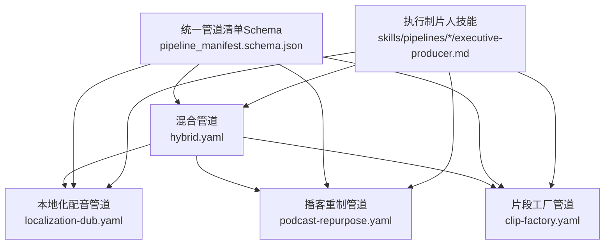
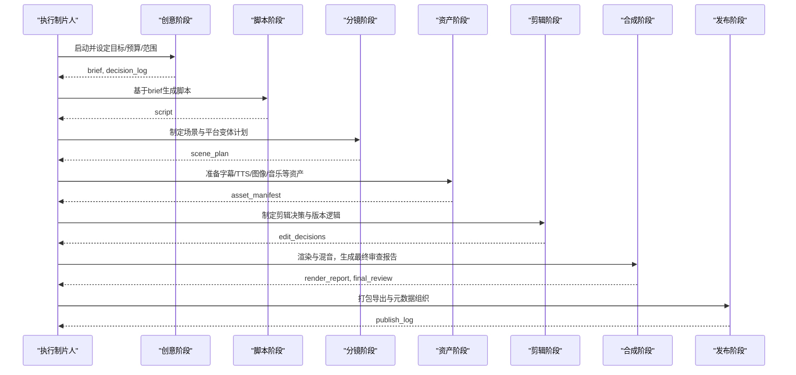
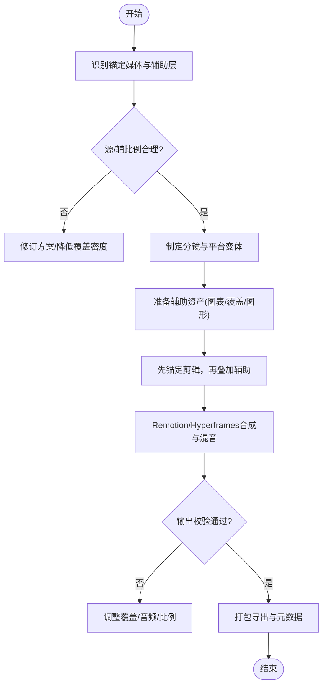
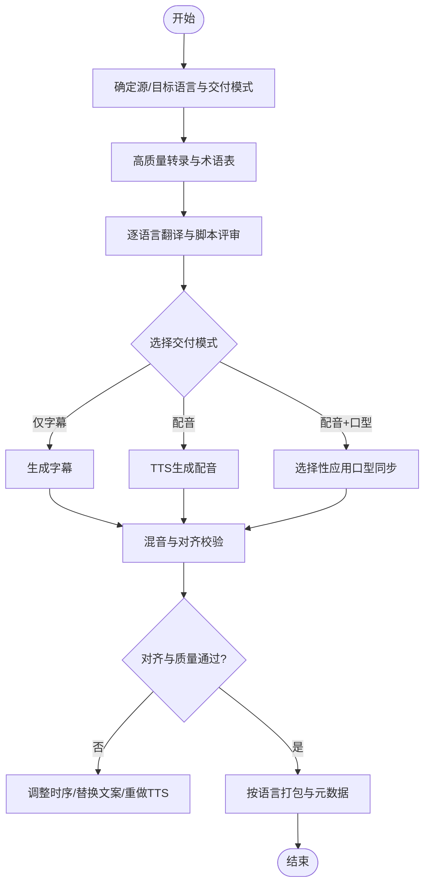
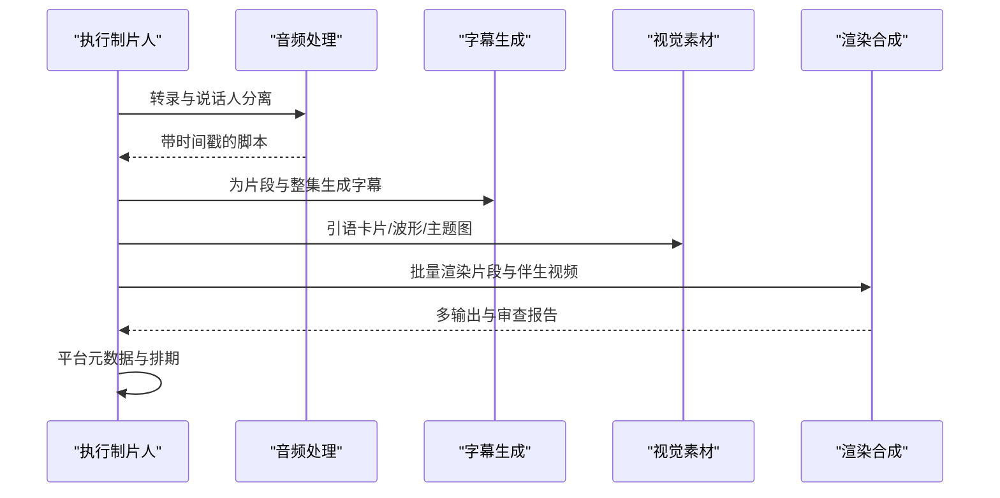
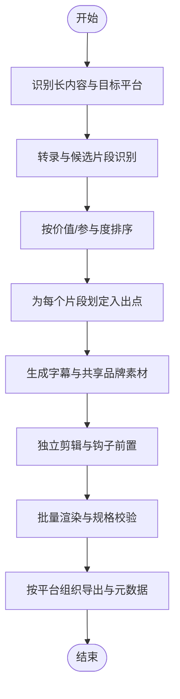

# 其他管道类型

<cite>
**本文引用的文件**
- [pipeline_defs/hybrid.yaml](file://pipeline_defs/hybrid.yaml)
- [pipeline_defs/localization-dub.yaml](file://pipeline_defs/localization-dub.yaml)
- [pipeline_defs/podcast-repurpose.yaml](file://pipeline_defs/podcast-repurpose.yaml)
- [pipeline_defs/clip-factory.yaml](file://pipeline_defs/clip-factory.yaml)
- [schemas/pipelines/pipeline_manifest.schema.json](file://schemas/pipelines/pipeline_manifest.schema.json)
- [skills/pipelines/hybrid/executive-producer.md](file://skills/pipelines/hybrid/executive-producer.md)
- [skills/pipelines/localization-dub/executive-producer.md](file://skills/pipelines/localization-dub/executive-producer.md)
- [skills/pipelines/podcast-repurpose/executive-producer.md](file://skills/pipelines/podcast-repurpose/executive-producer.md)
- [skills/pipelines/clip-factory/executive-producer.md](file://skills/pipelines/clip-factory/executive-producer.md)
</cite>

## 目录
1. [简介](#简介)
2. [项目结构](#项目结构)
3. [核心组件](#核心组件)
4. [架构总览](#架构总览)
5. [详细组件分析](#详细组件分析)
6. [依赖关系分析](#依赖关系分析)
7. [性能考量](#性能考量)
8. [故障排查指南](#故障排查指南)
9. [结论](#结论)
10. [附录](#附录)

## 简介
本章节面向OpenMontage的“其他预定义管道类型”，聚焦四类特殊用途工作流：混合管道、本地化配音管道、播客重制管道与片段工厂管道。它们分别解决以下问题：
- 混合模式：将真实素材与生成/设计的辅助元素（图表、覆盖层、图形等）组合，强调源素材与辅助层的平衡与跨媒介一致性。
- 本地化配音：基于转录文本进行多语言字幕、配音与可选口型同步，保证翻译准确性、时间对齐与语种一致性。
- 播客重制：从音频或视频播客中提取高光片段、生成引语卡片与完整剧集伴生视频，保持原音频质量并适配多平台。
- 片段工厂：对长内容批量抽取短视频片段，确保每个片段独立可懂、钩子前置、风格一致且按平台优化。

这些管道均通过“执行制片人（EP）”编排，串联idea→script→scene_plan→assets→edit→compose→publish七个阶段，并在各阶段设置质量门禁与人工审批点，保障产出质量与可追溯性。

## 项目结构
四个管道的定义位于 pipeline_defs 目录下，各自包含阶段、工具、产物与策略；对应的执行策略与质量门禁在 skills/pipelines/<管道名>/executive-producer.md 中描述；统一的管道清单Schema在 schemas/pipelines/pipeline_manifest.schema.json 中约束。

图示来源
- [pipeline_defs/hybrid.yaml:1-228](file://pipeline_defs/hybrid.yaml#L1-L228)
- [pipeline_defs/localization-dub.yaml:1-208](file://pipeline_defs/localization-dub.yaml#L1-L208)
- [pipeline_defs/podcast-repurpose.yaml:1-213](file://pipeline_defs/podcast-repurpose.yaml#L1-L213)
- [pipeline_defs/clip-factory.yaml:1-207](file://pipeline_defs/clip-factory.yaml#L1-L207)
- [schemas/pipelines/pipeline_manifest.schema.json:1-197](file://schemas/pipelines/pipeline_manifest.schema.json#L1-L197)
- [skills/pipelines/hybrid/executive-producer.md:1-130](file://skills/pipelines/hybrid/executive-producer.md#L1-L130)
- [skills/pipelines/localization-dub/executive-producer.md:1-134](file://skills/pipelines/localization-dub/executive-producer.md#L1-L134)
- [skills/pipelines/podcast-repurpose/executive-producer.md:1-136](file://skills/pipelines/podcast-repurpose/executive-producer.md#L1-L136)
- [skills/pipelines/clip-factory/executive-producer.md:1-137](file://skills/pipelines/clip-factory/executive-producer.md#L1-L137)

章节来源
- [pipeline_defs/hybrid.yaml:1-228](file://pipeline_defs/hybrid.yaml#L1-L228)
- [pipeline_defs/localization-dub.yaml:1-208](file://pipeline_defs/localization-dub.yaml#L1-L208)
- [pipeline_defs/podcast-repurpose.yaml:1-213](file://pipeline_defs/podcast-repurpose.yaml#L1-L213)
- [pipeline_defs/clip-factory.yaml:1-207](file://pipeline_defs/clip-factory.yaml#L1-L207)
- [schemas/pipelines/pipeline_manifest.schema.json:1-197](file://schemas/pipelines/pipeline_manifest.schema.json#L1-L197)

## 核心组件
- 执行制片人（EP）：负责串行编排七阶段，维护累计状态（预算、时长、目标、问题日志），在各阶段后执行跨阶段检查与质量门禁，必要时发起修订或回退。
- 导演技能（Director Skills）：每个阶段对应一个导演技能，负责产出具体工件（brief、script、scene_plan、asset_manifest、edit_decisions、render_report、final_review、publish_log）。
- 工具集：各阶段声明 required_tools / optional_tools / tools_available，如 transcriber、subtitle_gen、video_compose、audio_mixer、video_trimmer、lip_sync、audio_enhance 等。
- 样式剧本（Playbook）：提供视觉与排版约束，确保输出风格一致。
- 校验与契约：通过JSON Schema对管道清单与工件进行强校验，避免非法配置与不一致数据。

章节来源
- [skills/pipelines/hybrid/executive-producer.md:1-130](file://skills/pipelines/hybrid/executive-producer.md#L1-L130)
- [skills/pipelines/localization-dub/executive-producer.md:1-134](file://skills/pipelines/localization-dub/executive-producer.md#L1-L134)
- [skills/pipelines/podcast-repurpose/executive-producer.md:1-136](file://skills/pipelines/podcast-repurpose/executive-producer.md#L1-L136)
- [skills/pipelines/clip-factory/executive-producer.md:1-137](file://skills/pipelines/clip-factory/executive-producer.md#L1-L137)
- [schemas/pipelines/pipeline_manifest.schema.json:1-197](file://schemas/pipelines/pipeline_manifest.schema.json#L1-L197)

## 架构总览
所有四类管道遵循相同的EP编排模型：以“执行制片人”为中心，依次驱动idea→script→scene_plan→assets→edit→compose→publish，每阶段产出标准化工件并通过质量门禁。不同管道在阶段内可用的工具、关注点与成功标准上有所差异。

图示来源
- [pipeline_defs/hybrid.yaml:46-228](file://pipeline_defs/hybrid.yaml#L46-L228)
- [pipeline_defs/localization-dub.yaml:44-208](file://pipeline_defs/localization-dub.yaml#L44-L208)
- [pipeline_defs/podcast-repurpose.yaml:46-213](file://pipeline_defs/podcast-repurpose.yaml#L46-L213)
- [pipeline_defs/clip-factory.yaml:45-207](file://pipeline_defs/clip-factory.yaml#L45-L207)

## 详细组件分析

### 混合管道（Hybrid）
- 适用场景：采访+图表、产品演示+覆盖层、屏幕录制+配套图形、蒙太奇+插入素材等需要“源素材为主、辅助增强为辅”的视频制作。
- 关键特性：
  - 明确锚定媒体（source footage）与辅助层（diagrams/overlays/graphics）的职责边界。
  - 限制并发覆盖层数量，避免画面过载。
  - 支持多平台比例变体，并确保可读性。
  - 合成阶段通常使用Remotion将源视频与React覆盖层一次合成。
- 阶段要点：
  - idea：识别锚定媒体与辅助层合理性。
  - script：区分“源主导节拍”和“辅助主导节拍”。
  - scene_plan：确保源素材视觉优先，控制叠加密度。
  - assets：复用模板，避免生成素材喧宾夺主。
  - edit：先保证锚定剪辑连贯，再添加辅助视觉。
  - compose：验证源/辅平衡、比例变体可读性与音频一致性。
  - publish：组织英雄版与衍生版，元数据反映实际源混配。
- 输出格式：由compose阶段经video_compose/audio_mixer等工具生成最终视频与报告；publish阶段输出可发布的包与元数据。
- 自定义扩展：允许自定义脚本、样式剧本与技能；不建议自定义工具。

图示来源
- [pipeline_defs/hybrid.yaml:46-228](file://pipeline_defs/hybrid.yaml#L46-L228)
- [skills/pipelines/hybrid/executive-producer.md:46-113](file://skills/pipelines/hybrid/executive-producer.md#L46-L113)

章节来源
- [pipeline_defs/hybrid.yaml:1-228](file://pipeline_defs/hybrid.yaml#L1-L228)
- [skills/pipelines/hybrid/executive-producer.md:1-130](file://skills/pipelines/hybrid/executive-producer.md#L1-L130)

### 本地化配音管道（Localization Dub）
- 适用场景：已有单语视频，需生产多语言字幕、配音与可选口型同步的版本，强调翻译准确、时间对齐与语种一致性。
- 关键特性：
  - 以转录为起点，逐语言生成脚本与字幕。
  - 支持三种交付模式：仅字幕、配音、配音+口型同步。
  - 管理术语表与受保护词，避免品牌/技术词被误译。
  - 控制口型同步适用范围（正面清晰口型镜头）。
- 阶段要点：
  - idea：明确源语言、目标语言、交付模式与术语表。
  - script：保证转录质量与翻译可审读，预估时长膨胀风险。
  - scene_plan：评估配音可行性与时序漂移风险。
  - assets：为每种语言生成字幕与配音，按需应用口型同步。
  - edit：尽量保留源结构，仅在时序强制时调整。
  - compose：逐语种校验可懂度、字幕与语音对齐、版本标签清晰。
  - publish：按语言包组织输出与元数据。
- 输出格式：多语言视频包（含字幕轨道或烧录字幕）、配音轨、最终审查报告与发布日志。
- 自定义扩展：允许自定义脚本、样式剧本与技能；不建议自定义工具。

图示来源
- [pipeline_defs/localization-dub.yaml:44-208](file://pipeline_defs/localization-dub.yaml#L44-L208)
- [skills/pipelines/localization-dub/executive-producer.md:47-115](file://skills/pipelines/localization-dub/executive-producer.md#L47-L115)

章节来源
- [pipeline_defs/localization-dub.yaml:1-208](file://pipeline_defs/localization-dub.yaml#L1-L208)
- [skills/pipelines/localization-dub/executive-producer.md:1-134](file://skills/pipelines/localization-dub/executive-producer.md#L1-L134)

### 播客重制管道（Podcast Repurpose）
- 适用场景：将播客音频或视频播客转化为可视化内容，包括音频波形片段、引语卡片、带字幕的短视频以及可选的整集伴生视频。
- 关键特性：
  - 全剧转录与说话人分离，定位高光时刻与话题过渡。
  - 多种输出类型：audiogram片段、引语驱动片段、完整伴生视频。
  - 严格保持原始音频质量，轻量级视觉处理。
- 阶段要点：
  - idea：识别播客形式（单人/访谈/小组）、输出类型与平台目标。
  - script：转录+标注可引用片段与章节标记。
  - scene_plan：为每类输出规划视觉处理方式与章节结构。
  - assets：为所有输出生成字幕，准备图片/图表/音乐等。
  - edit：确保片段开头快速抓人，引语与字幕时机正确。
  - compose：批量渲染所有输出，校验音频保真与布局。
  - publish：按平台优化元数据，建议发布时间表。
- 输出格式：多个短视频片段（不同比例/分辨率）、可选整集伴生视频、字幕与元数据。
- 自定义扩展：允许自定义脚本、样式剧本与技能；不建议自定义工具。

图示来源
- [pipeline_defs/podcast-repurpose.yaml:46-213](file://pipeline_defs/podcast-repurpose.yaml#L46-L213)
- [skills/pipelines/podcast-repurpose/executive-producer.md:46-118](file://skills/pipelines/podcast-repurpose/executive-producer.md#L46-L118)

章节来源
- [pipeline_defs/podcast-repurpose.yaml:1-213](file://pipeline_defs/podcast-repurpose.yaml#L1-L213)
- [skills/pipelines/podcast-repurpose/executive-producer.md:1-136](file://skills/pipelines/podcast-repurpose/executive-producer.md#L1-L136)

### 片段工厂管道（Clip Factory）
- 适用场景：从长内容（网络研讨会、直播、演讲、访谈）批量抽取短视频片段，用于社交媒体分发。
- 关键特性：
  - 基于转录与场景检测识别候选片段并排序。
  - 每个片段独立可懂，钩子前置（前2-3秒）。
  - 按平台定制比例与时长，批量保持一致性。
- 阶段要点：
  - idea：识别内容类型、目标平台与片段数量。
  - script：全量转录+候选片段排名，确保自包含。
  - scene_plan：为每个片段划定干净入出点与平台构图。
  - assets：为每个片段生成字幕与共享标题/钩子/品牌素材。
  - edit：确保每个剪辑独立且钩子到位。
  - compose：批量渲染，校验平台规格与音频水平。
  - publish：按平台组织导出与元数据，建议发布顺序。
- 输出格式：N个短视频片段（不同比例/分辨率）、字幕与元数据。
- 自定义扩展：允许自定义脚本、样式剧本与技能；不建议自定义工具。

图示来源
- [pipeline_defs/clip-factory.yaml:45-207](file://pipeline_defs/clip-factory.yaml#L45-L207)
- [skills/pipelines/clip-factory/executive-producer.md:46-118](file://skills/pipelines/clip-factory/executive-producer.md#L46-L118)

章节来源
- [pipeline_defs/clip-factory.yaml:1-207](file://pipeline_defs/clip-factory.yaml#L1-L207)
- [skills/pipelines/clip-factory/executive-producer.md:1-137](file://skills/pipelines/clip-factory/executive-producer.md#L1-L137)

## 依赖关系分析
- 阶段依赖：所有管道均依赖前一阶段的工件作为输入（例如script依赖brief，scene_plan依赖script等），由manifest中的required_artifacts_in与produces字段约束。
- 工具依赖：各阶段声明required_tools/optional_tools/tools_available，如transcriber、subtitle_gen、video_compose、audio_mixer、video_trimmer、lip_sync、audio_enhance等。
- 样式与策略：compatible_playbooks限定推荐与兼容的样式；extensions控制是否允许自定义脚本/样式/技能/工具。
- 执行限制：orchestration定义默认预算、最大修订次数、最大退回次数与最大运行时间。

图示来源
- [pipeline_defs/hybrid.yaml:46-228](file://pipeline_defs/hybrid.yaml#L46-L228)
- [pipeline_defs/localization-dub.yaml:44-208](file://pipeline_defs/localization-dub.yaml#L44-L208)
- [pipeline_defs/podcast-repurpose.yaml:46-213](file://pipeline_defs/podcast-repurpose.yaml#L46-L213)
- [pipeline_defs/clip-factory.yaml:45-207](file://pipeline_defs/clip-factory.yaml#L45-L207)
- [schemas/pipelines/pipeline_manifest.schema.json:76-154](file://schemas/pipelines/pipeline_manifest.schema.json#L76-L154)

章节来源
- [schemas/pipelines/pipeline_manifest.schema.json:1-197](file://schemas/pipelines/pipeline_manifest.schema.json#L1-L197)

## 性能考量
- 预算与时间上限：各管道在orchestration中设置了默认预算与最大运行时间，避免无限迭代。
- 工具链效率：合理使用video_compose与audio_mixer进行一次性合成与混音，减少重复编码。
- 资源复用：在混合与片段工厂中，复用模板与共享素材可降低生成成本。
- 平台变体：提前规划比例与分辨率，避免后期多次转码。
- 质量控制：通过阶段门禁尽早发现问题，减少返工成本。

[本节为通用指导，不直接分析具体文件]

## 故障排查指南
- 混合管道常见问题：
  - 辅助层喧宾夺主：检查overlay密度与源/辅比例，必要时降低覆盖层数量。
  - 多平台可读性：确认文字在不同比例下仍清晰可读。
  - 音频一致性：确保生成元素与源音频电平一致。
- 本地化配音常见问题：
  - 时长膨胀：部分语言会延长20-30%，需调整时序或精简文案。
  - 口型同步失败：仅对正面清晰口型镜头应用，避免无效尝试。
  - 术语误译：强化术语表与受保护词校验。
- 播客重制常见问题：
  - 音频降级：禁止降低原音频质量，保持无损或高码率。
  - 片段不可独立：确保每个片段有足够上下文与钩子。
  - 伴生视频过度制作：保持轻触式视觉（波形、字幕、主题图）。
- 片段工厂常见问题：
  - 钩子后置：将最精彩部分前置到前2-3秒。
  - 音频电平不一致：对所有片段进行归一化处理。
  - 平台规格不符：按目标平台设置分辨率与比例。

章节来源
- [skills/pipelines/hybrid/executive-producer.md:124-130](file://skills/pipelines/hybrid/executive-producer.md#L124-L130)
- [skills/pipelines/localization-dub/executive-producer.md:127-134](file://skills/pipelines/localization-dub/executive-producer.md#L127-L134)
- [skills/pipelines/podcast-repurpose/executive-producer.md:130-136](file://skills/pipelines/podcast-repurpose/executive-producer.md#L130-L136)
- [skills/pipelines/clip-factory/executive-producer.md:130-137](file://skills/pipelines/clip-factory/executive-producer.md#L130-L137)

## 结论
四类管道围绕不同内容形态与分发目标提供了端到端的工作流：混合管道强调源与辅助的平衡，本地化配音管道专注多语言一致性与时间对齐，播客重制管道实现音频内容的可视化与多平台分发，片段工厂管道则高效批量生产社交短视频。通过EP编排、阶段门禁与统一Schema约束，可在保证质量的前提下提升规模化生产能力。

[本节为总结性内容，不直接分析具体文件]

## 附录
- 管道选择建议：
  - 若内容以真实素材为主且需增强说明：选择混合管道。
  - 若需多语言版本与口型同步：选择本地化配音管道。
  - 若以音频播客为核心并需多平台短视频：选择播客重制管道。
  - 若需从长内容批量抽取短视频：选择片段工厂管道。
- 配置选项参考：
  - 预算与时间：在orchestration中设置budget_default_usd与max_wall_time_minutes。
  - 工具可用性：在stages中声明required_tools/optional_tools/tools_available。
  - 样式兼容：在compatible_playbooks中指定推荐与兼容样式。
  - 扩展权限：在extensions中控制custom_scripts/custom_playbooks/custom_skills/custom_tools。
- 输出格式与校验：
  - 合成阶段输出视频与审查报告，发布阶段输出可发布包与元数据。
  - 所有工件与清单通过JSON Schema校验，确保一致性。

章节来源
- [pipeline_defs/hybrid.yaml:12-24](file://pipeline_defs/hybrid.yaml#L12-L24)
- [pipeline_defs/localization-dub.yaml:11-23](file://pipeline_defs/localization-dub.yaml#L11-L23)
- [pipeline_defs/podcast-repurpose.yaml:13-25](file://pipeline_defs/podcast-repurpose.yaml#L13-L25)
- [pipeline_defs/clip-factory.yaml:12-24](file://pipeline_defs/clip-factory.yaml#L12-L24)
- [schemas/pipelines/pipeline_manifest.schema.json:170-193](file://schemas/pipelines/pipeline_manifest.schema.json#L170-L193)