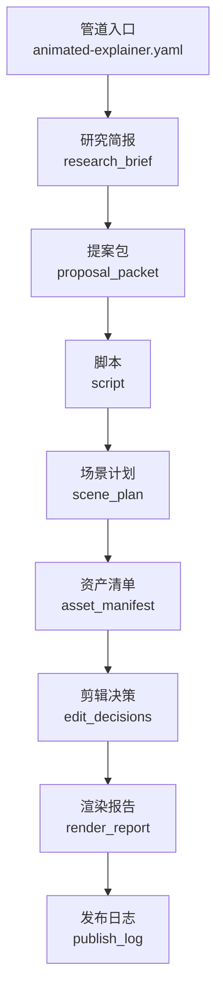
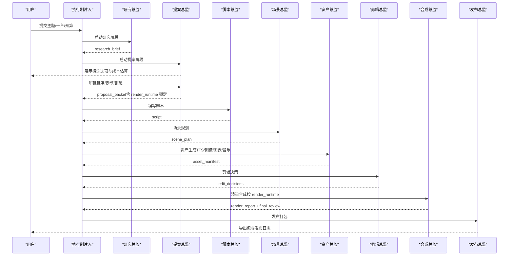
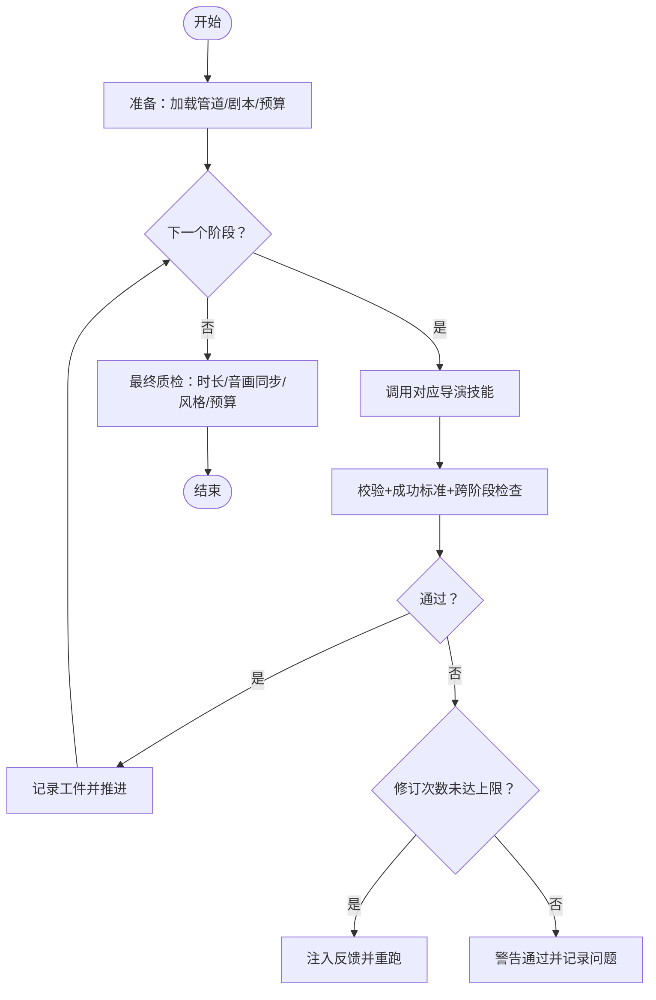
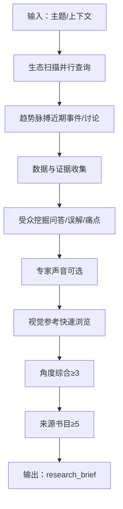
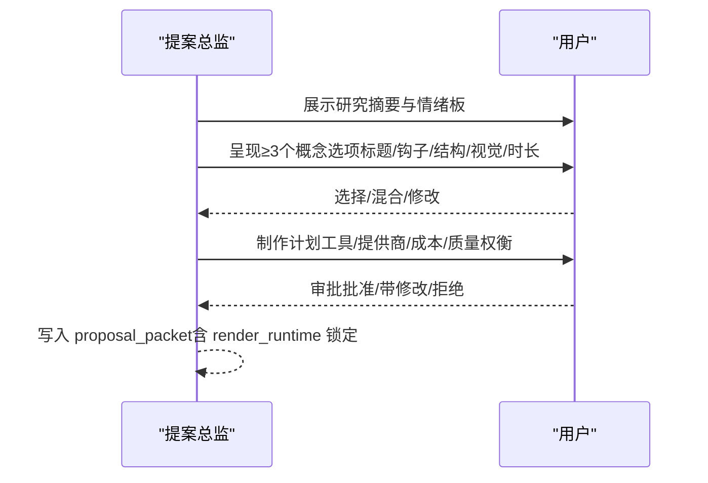
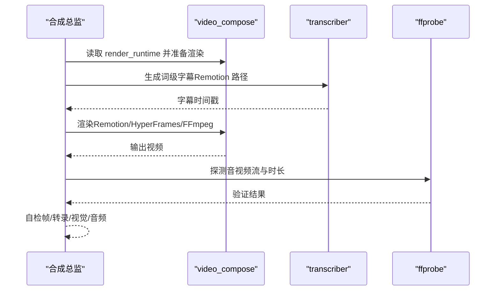

# 动画解释器管道

<cite>
**本文引用的文件**
- [animated-explainer.yaml](file://pipeline_defs/animated-explainer.yaml)
- [executive-producer.md](file://skills/pipelines/explainer/executive-producer.md)
- [research-director.md](file://skills/pipelines/explainer/research-director.md)
- [proposal-director.md](file://skills/pipelines/explainer/proposal-director.md)
- [script-director.md](file://skills/pipelines/explainer/script-director.md)
- [scene-director.md](file://skills/pipelines/explainer/scene-director.md)
- [asset-director.md](file://skills/pipelines/explainer/asset-director.md)
- [edit-director.md](file://skills/pipelines/explainer/edit-director.md)
- [compose-director.md](file://skills/pipelines/explainer/compose-director.md)
- [publish-director.md](file://skills/pipelines/explainer/publish-director.md)
- [research_brief.schema.json](file://schemas/artifacts/research_brief.schema.json)
- [proposal_packet.schema.json](file://schemas/artifacts/proposal_packet.schema.json)
- [export_bundle.py](file://tools/publishers/export_bundle.py)
</cite>

## 目录
1. [简介](#简介)
2. [项目结构](#项目结构)
3. [核心组件](#核心组件)
4. [架构总览](#架构总览)
5. [详细组件分析](#详细组件分析)
6. [依赖关系分析](#依赖关系分析)
7. [性能与成本考量](#性能与成本考量)
8. [故障排查指南](#故障排查指南)
9. [结论](#结论)
10. [附录：端到端使用示例](#附录端到端使用示例)

## 简介
本文件为 OpenMontage 的“动画解释器管道”提供系统化、可操作的文档。该管道面向教育类动画解释视频，采用“研究优先”的制作流程：在生成任何素材之前，先进行深度调研、提出多套创意方案并明确成本估算，经用户审批后再进入脚本、场景规划、素材生成、剪辑决策、视频合成与发布打包阶段。管道通过严格的阶段门控、质量检查标准与预算治理，确保最终产出既专业又可控。

## 项目结构
- 管道定义位于 pipeline_defs/animated-explainer.yaml，定义了 8 个串行阶段（research → proposal → script → scene_plan → assets → edit → compose → publish）以及每阶段的输入/输出、工具可用性、检查点与人类审批策略。
- 各阶段由对应的导演技能驱动，位于 skills/pipelines/explainer/ 下，包含执行协议、质量门禁、失败回退与最佳实践。
- 关键工件（artifacts）通过 schemas/artifacts/*.schema.json 进行强类型校验，保证跨阶段数据契约一致。
- 发布打包通过 tools/publishers/export_bundle.py 完成本地离线导出，生成标准化的导出目录与 publish_log。

**图表来源**
- [animated-explainer.yaml:61-270](file://pipeline_defs/animated-explainer.yaml#L61-L270)

**章节来源**
- [animated-explainer.yaml:1-270](file://pipeline_defs/animated-explainer.yaml#L1-L270)

## 核心组件
- 执行制片人（Executive Producer）：维护累计状态、串行编排各阶段、执行质量门禁、预算与风格一致性控制、必要时将工作退回上游。
- 研究总监（Research Director）：基于网络搜索构建 research_brief，覆盖内容生态、趋势、数据点、受众洞察、专家声音与角度候选。
- 提案总监（Proposal Director）：将研究转化为至少 3 个不同概念选项，给出制作计划、成本估算、质量/成本权衡，并通过人类审批门禁。
- 脚本总监（Script Director）：依据选定概念与研究撰写带增强提示的旁白脚本，控制时长与节奏。
- 场景总监（Scene Director）：将脚本拆解为视觉场景，指定所需资产、过渡与样式约束。
- 资产总监（Asset Director）：生成旁白、图像、图表、代码片段与背景音乐，形成 asset_manifest，并执行样本预览与预算治理。
- 剪辑总监（Edit Director）：组装时间线、字幕、音频层与淡入淡出/ducking，形成 edit_decisions。
- 合成总监（Compose Director）：根据 render_runtime（Remotion/HyperFrames/FFmpeg）进行渲染、混音与字幕烧录，执行前后验证与自检。
- 发布总监（Publish Director）：生成 SEO 元数据、缩略图概念、章节标记，并使用 export_bundle 进行本地打包导出。

**章节来源**
- [executive-producer.md:1-424](file://skills/pipelines/explainer/executive-producer.md#L1-L424)
- [research-director.md:1-344](file://skills/pipelines/explainer/research-director.md#L1-L344)
- [proposal-director.md:1-558](file://skills/pipelines/explainer/proposal-director.md#L1-L558)
- [script-director.md:1-269](file://skills/pipelines/explainer/script-director.md#L1-L269)
- [scene-director.md:1-264](file://skills/pipelines/explainer/scene-director.md#L1-L264)
- [asset-director.md:1-291](file://skills/pipelines/explainer/asset-director.md#L1-L291)
- [edit-director.md:1-171](file://skills/pipelines/explainer/edit-director.md#L1-L171)
- [compose-director.md:1-446](file://skills/pipelines/explainer/compose-director.md#L1-L446)
- [publish-director.md:1-174](file://skills/pipelines/explainer/publish-director.md#L1-L174)

## 架构总览
下图展示了从主题到发布的完整流水线，包括人类审批门、预算治理与运行时选择。

**图表来源**
- [animated-explainer.yaml:61-270](file://pipeline_defs/animated-explainer.yaml#L61-L270)
- [executive-producer.md:78-136](file://skills/pipelines/explainer/executive-producer.md#L78-L136)
- [proposal-director.md:11-31](file://skills/pipelines/explainer/proposal-director.md#L11-L31)
- [compose-director.md:9-19](file://skills/pipelines/explainer/compose-director.md#L9-L19)

## 详细组件分析

### 执行制片人（Executive Producer）
- 职责：串行编排 8 个阶段；在每个阶段后执行 schema 校验、成功标准与跨阶段检查；维护累计预算、时长、风格锚点与修订计数；必要时将工作退回上游。
- 关键机制：
  - 预生产阶段（research、proposal）零成本，proposal 必须获得人类审批才能继续。
  - 预算治理：超过阈值时降级工具或跳过可选资产。
  - 风格一致性：跨阶段传递 style_anchors，确保视觉统一。
  - 反循环保护：限制每阶段修订次数、发送回退次数与总耗时。

**图表来源**
- [executive-producer.md:78-136](file://skills/pipelines/explainer/executive-producer.md#L78-L136)
- [executive-producer.md:138-171](file://skills/pipelines/explainer/executive-producer.md#L138-L171)

**章节来源**
- [executive-producer.md:1-424](file://skills/pipelines/explainer/executive-producer.md#L1-L424)

### 研究总监（Research Director）
- 输入：主题、受众/平台提示、参考视频分析（可选）。
- 输出：research_brief（结构化 JSON），包含内容生态、趋势、数据点、受众洞察、专家声音、角度候选与来源书目。
- 质量要求：至少 3 个数据点、3 个不同角度、5 个以上来源引用；所有数据需附 URL 与可信度评级。
- 典型流程：并行搜索（生态扫描、趋势、数据、受众、专家、视觉参考）→ 角度综合 → 提交前 schema 校验。

**图表来源**
- [research-director.md:64-211](file://skills/pipelines/explainer/research-director.md#L64-L211)
- [research-director.md:213-251](file://skills/pipelines/explainer/research-director.md#L213-L251)

**章节来源**
- [research-director.md:1-344](file://skills/pipelines/explainer/research-director.md#L1-L344)
- [research_brief.schema.json:1-246](file://schemas/artifacts/research_brief.schema.json#L1-L246)

### 提案总监（Proposal Director）
- 输入：research_brief、工具可用性、风格剧本。
- 输出：proposal_packet（概念选项、选定概念、制作计划、成本估算、人类审批）。
- 关键规则：
  - 必须呈现两种渲染运行时（Remotion/HyperFrames）供用户选择，并在 decision_log 中记录选择理由。
  - 提供至少 3 个真正不同的概念方向，附带可视化身份设计与质量/成本权衡矩阵。
  - 明确音乐来源与 TTS 语音选择，给出替代路径与预算建议。
  - 审批门禁：未经人类批准不得进入下一阶段。

**图表来源**
- [proposal-director.md:11-31](file://skills/pipelines/explainer/proposal-director.md#L11-L31)
- [proposal-director.md:129-313](file://skills/pipelines/explainer/proposal-director.md#L129-L313)
- [proposal-director.md:405-447](file://skills/pipelines/explainer/proposal-director.md#L405-L447)

**章节来源**
- [proposal-director.md:1-558](file://skills/pipelines/explainer/proposal-director.md#L1-L558)
- [proposal_packet.schema.json:1-379](file://schemas/artifacts/proposal_packet.schema.json#L1-L379)

### 脚本总监（Script Director）
- 输入：proposal_packet.selected_concept、research_brief（可选）、风格剧本。
- 输出：script（分段旁白、增强提示、发音指南、TTS 交付提示）。
- 要点：
  - 严格遵循目标时长与语速（约 150 WPM），控制词数与增强提示密度（每 8-10 秒至少一个）。
  - 使用 voice_performance 计划指导 TTS 的节奏、停顿与强调。
  - 将研究数据点与受众洞察融入叙事弧（钩子→铺垫→推进→高潮→收尾）。

**章节来源**
- [script-director.md:1-269](file://skills/pipelines/explainer/script-director.md#L1-L269)

### 场景总监（Scene Director）
- 输入：script、proposal_packet、风格剧本。
- 输出：scene_plan（场景类型、起止时间、所需资产、过渡与样式约束）。
- 要点：
  - 将每个脚本段落分解为 1-3 个视觉场景，确保全时段覆盖且无间隙。
  - 使用 Remotion 原生模板（hero_title、stat_card、bar_chart、line_chart、pie_chart、kpi_grid、comparison、callout、progress_bar、text_card）优先于静态图片。
  - 遵守风格剧本的过渡、色彩、节奏规则，避免连续同类型场景过多。

**章节来源**
- [scene-director.md:1-264](file://skills/pipelines/explainer/scene-director.md#L1-L264)

### 资产总监（Asset Director）
- 输入：scene_plan、script、proposal_packet、风格剧本。
- 输出：asset_manifest（旁白、图像、图表、代码片段、背景音乐等资产清单与成本）。
- 要点：
  - 生成前进行样本预览（TTS/图像/音乐），避免批量浪费。
  - 预算治理：超支时切换更便宜提供商或减少资产数量。
  - 严格校验：所有文件存在、时长匹配、风格一致、成本在预算内。

**章节来源**
- [asset-director.md:1-291](file://skills/pipelines/explainer/asset-director.md#L1-L291)

### 剪辑总监（Edit Director）
- 输入：asset_manifest、scene_plan、script。
- 输出：edit_decisions（时间线、转场、字幕、音频层与 ducking 配置）。
- 要点：
  - 确保时间线完整覆盖、无黑帧或重叠；所有资源引用有效。
  - 字幕启用并符合风格；音乐在旁白期间自动降低音量（ducking）。
  - 遵循风格剧本的最小/最大镜头停留时间与转场时长。

**章节来源**
- [edit-director.md:1-171](file://skills/pipelines/explainer/edit-director.md#L1-L171)

### 合成总监（Compose Director）
- 输入：edit_decisions、asset_manifest、proposal_packet。
- 输出：render_report（输出文件、编码参数、时长、文件大小等）。
- 运行时路由：
  - 严格按 proposal 锁定的 render_runtime（remotion/hyperframes/ffmpeg）执行，禁止静默替换。
  - Remotion：组件化动画、词级字幕、音频嵌入；HyperFrames：HTML/CSS/GSAP 渲染；FFmpeg：简单拼接与 Ken Burns。
- 前置验证：composition_validator 必须通过；后置自检：ffprobe 探测、帧采样、转录核对、视觉与音频审查。

**图表来源**
- [compose-director.md:9-19](file://skills/pipelines/explainer/compose-director.md#L9-L19)
- [compose-director.md:158-186](file://skills/pipelines/explainer/compose-director.md#L158-L186)
- [compose-director.md:212-273](file://skills/pipelines/explainer/compose-director.md#L212-L273)
- [compose-director.md:296-371](file://skills/pipelines/explainer/compose-director.md#L296-L371)

**章节来源**
- [compose-director.md:1-446](file://skills/pipelines/explainer/compose-director.md#L1-L446)

### 发布总监（Publish Director）
- 输入：render_report、proposal_packet、research_brief。
- 输出：publish_log（平台、状态、导出路径、时间戳、使用的元数据）。
- 要点：
  - 生成 SEO 标题、描述、标签、话题标签与章节标记。
  - 缩略图概念设计（或实际生成）。
  - 使用 export_bundle 进行本地打包，输出标准化目录结构与 publish_log。

**章节来源**
- [publish-director.md:1-174](file://skills/pipelines/explainer/publish-director.md#L1-L174)
- [export_bundle.py:39-69](file://tools/publishers/export_bundle.py#L39-L69)

## 依赖关系分析
- 管道定义与各导演技能之间存在明确的阶段依赖：前一阶段产物作为后一阶段输入，并由 schema 强制约束。
- 运行时选择（render_runtime）在提案阶段锁定，合成阶段不可静默更改，确保创作意图与技术实现一致。
- 发布阶段依赖本地打包工具，不直接上传至外部平台，便于离线分发与审计。

**图表来源**
- [animated-explainer.yaml:61-270](file://pipeline_defs/animated-explainer.yaml#L61-L270)

**章节来源**
- [animated-explainer.yaml:1-270](file://pipeline_defs/animated-explainer.yaml#L1-L270)

## 性能与成本考量
- 预算治理：提案阶段提供逐项成本估算与替代路径；资产阶段在超支时自动降级或跳过可选资产；执行制片人在后续阶段持续监控预算消耗。
- 渲染效率：优先使用 Remotion 原生组件（文本卡、统计卡、图表等）以减少图像生成调用；仅在复杂动效时使用 GSAP。
- 时长与节奏：脚本词数与语速严格匹配目标时长；场景规划避免过长或过短镜头；剪辑阶段确保无黑帧与重叠。
- 质量与性能平衡：在 Remotion 可用时优先组件化渲染；当仅 FFmpeg 可用时接受 Ken Burns 效果但保持专业感。

[本节为通用指导，无需特定文件来源]

## 故障排查指南
- 研究不足：若 angles_discovered 或 data_points 不达标，退回研究阶段补充搜索与来源。
- 提案未获批：若 approval.status 非 approved/approved_with_changes，停止下游并等待用户决策。
- 脚本超时：若词数导致预计时长超出目标 ±10%，退回脚本阶段裁剪或调整语速。
- 场景覆盖不全：若 scene_plan 存在间隙或重复类型过多，退回场景规划阶段调整。
- 资产缺失或风格不一致：退回资产阶段重新生成或调整提示词与一致性锚点。
- 剪辑时间线不完整：检查 cut 是否覆盖全时长、资源引用是否有效、字幕与 ducking 是否配置。
- 渲染失败或音画不同步：运行 composition_validator 与 ffprobe；检查 remotion/hyperframes/ffmpeg 路径与资源；必要时退回编辑或资产阶段修复。
- 发布打包失败：确认视频路径存在、元数据完整；使用 export_bundle 的返回错误信息定位问题。

**章节来源**
- [executive-producer.md:173-273](file://skills/pipelines/explainer/executive-producer.md#L173-L273)
- [compose-director.md:275-371](file://skills/pipelines/explainer/compose-director.md#L275-L371)
- [publish-director.md:86-114](file://skills/pipelines/explainer/publish-director.md#L86-L114)

## 结论
动画解释器管道以“研究优先”为核心，通过提案审批、严格的质量门禁与预算治理，将 AI 驱动的素材生成与完整的视频制作流水线有机结合。执行制片人贯穿全程，确保创意意图、技术实现与用户体验的一致性。借助 schema 化的工件与可审计的决策日志，该管道既能快速产出专业级教育动画视频，又能满足团队协作与质量控制需求。

[本节为总结性内容，无需特定文件来源]

## 附录：端到端使用示例
以下示例演示如何从简单主题快速生成专业级动画解释视频。

- 主题：向量数据库是什么
- 平台：YouTube（横屏 1080p）
- 目标时长：约 90 秒
- 预算：默认 $2.00（可在提案阶段调整）

步骤概览：
1. 研究阶段：生成 research_brief，覆盖现有内容、趋势、数据点、受众问题与专家观点。
2. 提案阶段：提出至少 3 个概念（如数据驱动、类比、对比），展示制作计划与成本估算，锁定 render_runtime（推荐 Remotion）。
3. 脚本阶段：撰写旁白脚本，控制词数与增强提示密度，加入 TTS 交付提示。
4. 场景规划：将脚本拆分为多个场景（文本卡、统计卡、图表、动画、生成图像），确保全时段覆盖与视觉多样性。
5. 资产生成：生成旁白、图像、图表与背景音乐，进行样本预览与预算校验。
6. 剪辑决策：组装时间线、字幕与音频层，配置 ducking 与转场。
7. 渲染合成：按 render_runtime 渲染，执行前后验证与自检，输出 render_report。
8. 发布打包：生成 SEO 元数据、缩略图概念与章节标记，使用 export_bundle 导出本地包与 publish_log。

注意事项：
- 提案阶段必须获得人类审批后方可继续。
- 运行时选择需在提案阶段明确并记录，合成阶段不得静默替换。
- 所有阶段均需通过 schema 校验与成功标准检查。
- 若出现超支或质量问题，执行制片人将退回相应阶段修正。

**章节来源**
- [animated-explainer.yaml:61-270](file://pipeline_defs/animated-explainer.yaml#L61-L270)
- [executive-producer.md:78-136](file://skills/pipelines/explainer/executive-producer.md#L78-L136)
- [proposal-director.md:129-313](file://skills/pipelines/explainer/proposal-director.md#L129-L313)
- [compose-director.md:9-19](file://skills/pipelines/explainer/compose-director.md#L9-L19)
- [publish-director.md:86-114](file://skills/pipelines/explainer/publish-director.md#L86-L114)
- [export_bundle.py:39-69](file://tools/publishers/export_bundle.py#L39-L69)