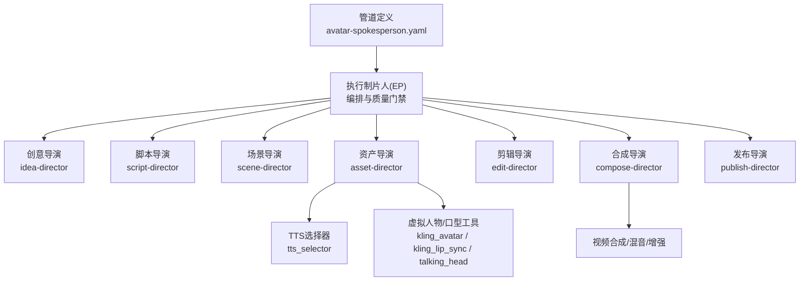
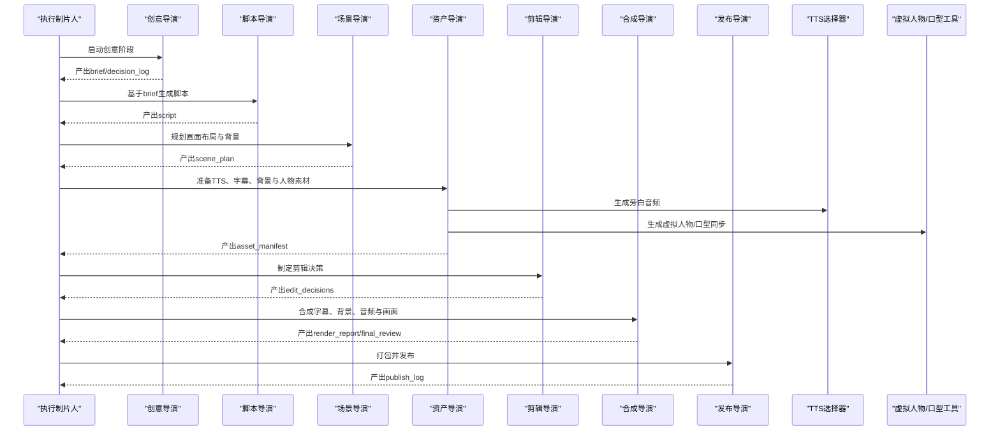
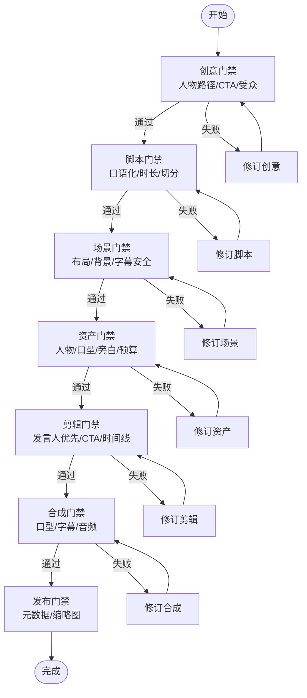
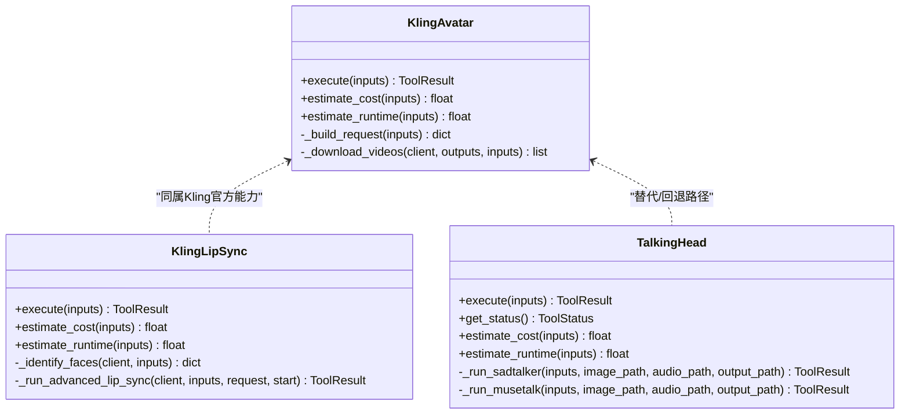
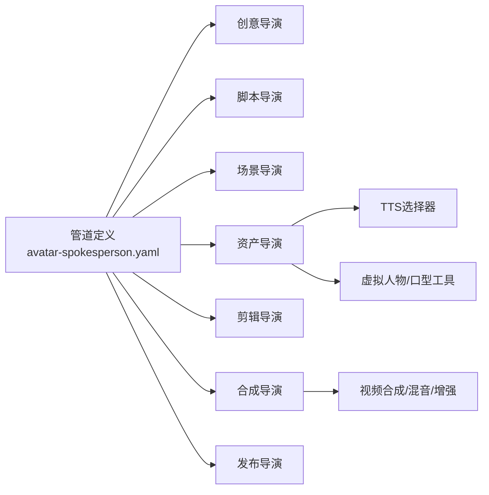

# 口播人物管道

<cite>
**本文引用的文件**
- [pipeline_defs/avatar-spokesperson.yaml](file://pipeline_defs/avatar-spokesperson.yaml)
- [pipeline_defs/talking-head.yaml](file://pipeline_defs/talking-head.yaml)
- [skills/pipelines/avatar-spokesperson/executive-producer.md](file://skills/pipelines/avatar-spokesperson/executive-producer.md)
- [skills/pipelines/talking-head/executive-producer.md](file://skills/pipelines/talking-head/executive-producer.md)
- [skills/pipelines/avatar-spokesperson/idea-director.md](file://skills/pipelines/avatar-spokesperson/idea-director.md)
- [skills/pipelines/avatar-spokesperson/script-director.md](file://skills/pipelines/avatar-spokesperson/script-director.md)
- [skills/pipelines/avatar-spokesperson/scene-director.md](file://skills/pipelines/avatar-spokesperson/scene-director.md)
- [skills/pipelines/avatar-spokesperson/asset-director.md](file://skills/pipelines/avatar-spokesperson/asset-director.md)
- [tools/avatar/kling_avatar.py](file://tools/avatar/kling_avatar.py)
- [tools/avatar/kling_lip_sync.py](file://tools/avatar/kling_lip_sync.py)
- [tools/avatar/talking_head.py](file://tools/avatar/talking_head.py)
- [tools/audio/tts_selector.py](file://tools/audio/tts_selector.py)
</cite>

## 目录
1. [简介](#简介)
2. [项目结构](#项目结构)
3. [核心组件](#核心组件)
4. [架构总览](#架构总览)
5. [详细组件分析](#详细组件分析)
6. [依赖关系分析](#依赖关系分析)
7. [性能与质量考量](#性能与质量考量)
8. [故障排查指南](#故障排查指南)
9. [结论](#结论)
10. [附录：制作指南与创意建议](#附录制作指南与创意建议)

## 简介
本文件为 OpenMontage 的“口播人物管道”提供系统化文档，覆盖从虚拟人物生成、语音合成、口型同步、背景合成到专业级后期制作的完整工作流。该管道以“数字发言人”为核心锚点，强调口型同步质量、画面构图一致性、音频清晰度与明确的行动号召（CTA）。文档同时给出知识分享、产品介绍与教育内容的制作指南与创意建议，帮助团队高效产出高质量口播视频。

## 项目结构
OpenMontage 通过“管道定义 + 导演技能 + 工具注册表”的方式组织口播人物生产流程：
- 管道定义：描述阶段、产物、可用工具、质量门禁与预算限制。
- 导演技能：每个阶段由专门的“导演”负责执行与评审，确保输出符合标准。
- 工具能力：包括虚拟人物生成、口型同步、TTS、字幕、音视频合成与增强等。

**图示来源**
- [pipeline_defs/avatar-spokesperson.yaml:1-207](file://pipeline_defs/avatar-spokesperson.yaml#L1-L207)
- [skills/pipelines/avatar-spokesperson/executive-producer.md:1-172](file://skills/pipelines/avatar-spokesperson/executive-producer.md#L1-L172)
- [tools/audio/tts_selector.py:1-324](file://tools/audio/tts_selector.py#L1-L324)
- [tools/avatar/kling_avatar.py:1-343](file://tools/avatar/kling_avatar.py#L1-L343)
- [tools/avatar/kling_lip_sync.py:1-740](file://tools/avatar/kling_lip_sync.py#L1-L740)
- [tools/avatar/talking_head.py:1-259](file://tools/avatar/talking_head.py#L1-L259)

**章节来源**
- [pipeline_defs/avatar-spokesperson.yaml:1-207](file://pipeline_defs/avatar-spokesperson.yaml#L1-L207)
- [pipeline_defs/talking-head.yaml:1-229](file://pipeline_defs/talking-head.yaml#L1-L229)

## 核心组件
- 执行制片人（EP）：维护累计状态、跨阶段检查、预算与时限控制、回退策略与最终质检。
- 导演技能：创意、脚本、场景、资产、剪辑、合成、发布各阶段负责人，按规范产出工件并通过质量门禁。
- 工具层：
  - TTS选择器：自动发现并选择最佳语音提供商，支持多语言、风格与速度控制。
  - 虚拟人物/口型：Kling官方API（头像视频、高级口型同步）、本地SadTalker/MuseTalk。
  - 音视频合成与增强：字幕、混音、画质增强、转码与拼接。

**章节来源**
- [skills/pipelines/avatar-spokesperson/executive-producer.md:1-172](file://skills/pipelines/avatar-spokesperson/executive-producer.md#L1-L172)
- [skills/pipelines/talking-head/executive-producer.md:1-447](file://skills/pipelines/talking-head/executive-producer.md#L1-L447)
- [tools/audio/tts_selector.py:1-324](file://tools/audio/tts_selector.py#L1-L324)
- [tools/avatar/kling_avatar.py:1-343](file://tools/avatar/kling_avatar.py#L1-L343)
- [tools/avatar/kling_lip_sync.py:1-740](file://tools/avatar/kling_lip_sync.py#L1-L740)
- [tools/avatar/talking_head.py:1-259](file://tools/avatar/talking_head.py#L1-L259)

## 架构总览
口播人物管道的端到端流程如下：
- 输入：创意简报、脚本、场景计划、素材清单、剪辑决策。
- 处理：TTS生成旁白 → 虚拟人物或口型同步 → 背景与字幕合成 → 音视频混音与增强 → 渲染输出。
- 输出：成品视频、元数据、发布包。

**图示来源**
- [pipeline_defs/avatar-spokesperson.yaml:45-207](file://pipeline_defs/avatar-spokesperson.yaml#L45-L207)
- [skills/pipelines/avatar-spokesperson/idea-director.md:1-89](file://skills/pipelines/avatar-spokesperson/idea-director.md#L1-L89)
- [skills/pipelines/avatar-spokesperson/script-director.md:1-86](file://skills/pipelines/avatar-spokesperson/script-director.md#L1-L86)
- [skills/pipelines/avatar-spokesperson/scene-director.md:1-92](file://skills/pipelines/avatar-spokesperson/scene-director.md#L1-L92)
- [skills/pipelines/avatar-spokesperson/asset-director.md:1-141](file://skills/pipelines/avatar-spokesperson/asset-director.md#L1-L141)
- [tools/audio/tts_selector.py:1-324](file://tools/audio/tts_selector.py#L1-L324)
- [tools/avatar/kling_avatar.py:1-343](file://tools/avatar/kling_avatar.py#L1-L343)
- [tools/avatar/kling_lip_sync.py:1-740](file://tools/avatar/kling_lip_sync.py#L1-L740)

## 详细组件分析

### 执行制片人（EP）与质量门禁
- 角色职责：串行编排各阶段，注入上下文与反馈，执行跨阶段检查，管理预算与时限，触发回退路径（如无可用人物工具时切换到“旁白+图形”模式）。
- 关键门禁：
  - 创意阶段：确认人物路径可行性、CTA与受众匹配。
  - 脚本阶段：口语化、时长合理、场景切分安全。
  - 场景阶段：发言人布局一致、背景系统简洁、字幕不遮挡面部。
  - 资产阶段：人物/口型可用性、旁白清晰、预算阈值预警。
  - 剪辑阶段：发言人视觉优先、CTA明确、时间线完整。
  - 合成阶段：口型/字幕/音频质量验证、无恐怖谷效应。
  - 发布阶段：元数据与缩略图清晰展示发言人。

**图示来源**
- [skills/pipelines/avatar-spokesperson/executive-producer.md:47-154](file://skills/pipelines/avatar-spokesperson/executive-producer.md#L47-L154)
- [pipeline_defs/avatar-spokesperson.yaml:45-207](file://pipeline_defs/avatar-spokesperson.yaml#L45-L207)

**章节来源**
- [skills/pipelines/avatar-spokesperson/executive-producer.md:1-172](file://skills/pipelines/avatar-spokesperson/executive-producer.md#L1-L172)
- [pipeline_defs/avatar-spokesperson.yaml:1-207](file://pipeline_defs/avatar-spokesperson.yaml#L1-L207)

### 创意导演（Idea Director）
- 任务：确定人物路径（平台头像、照片驱动说话头、现成发言人底片+口型），记录资源现状与缺失能力，锁定Remotion运行时。
- 产出：brief与决策日志，明确受众、CTA、目标时长与平台。

**章节来源**
- [skills/pipelines/avatar-spokesperson/idea-director.md:1-89](file://skills/pipelines/avatar-spokesperson/idea-director.md#L1-L89)

### 脚本导演（Script Director）
- 任务：将approved brief转化为适合口播的短句、直接动词、每段一个观点、自然过渡与口语强调；控制屏幕文字量，仅用于产品名、短证据点、CTA与合规文本。
- 产出：script，包含场景拷贝映射、CTA语言、发音备注与法律文本要求。

**章节来源**
- [skills/pipelines/avatar-spokesperson/script-director.md:1-86](file://skills/pipelines/avatar-spokesperson/script-director.md#L1-L86)

### 场景导演（Scene Director）
- 任务：锁定发言人布局（居中、侧边面板、下三分之一、品牌背景），统一背景家族，规划支持层（字幕、下三分、产品图、侧证点、CTA卡），谨慎规划变体。
- 回退：当无人物工具时，切换为“旁白+图形”模式，全幅视觉承载内容，保持脚本与字幕规划不变。

**章节来源**
- [skills/pipelines/avatar-spokesperson/scene-director.md:1-92](file://skills/pipelines/avatar-spokesperson/scene-director.md#L1-L92)

### 资产导演（Asset Director）
- 任务：锁定人物生成路径（照片驱动说话头、现有底片+新音频、外部渲染），先采样昂贵类型（TTS样本、人物样本）再批量生成；解析旁白来源（提供、TTS、嵌入底片），构建最小支持套件（字幕、下三分、CTA卡、背景/图片）。
- 无人物路径：跳过人物生成，产出旁白音频、场景视觉、字幕、文本卡片与背景。

**章节来源**
- [skills/pipelines/avatar-spokesperson/asset-director.md:1-141](file://skills/pipelines/avatar-spokesperson/asset-director.md#L1-L141)

### 语音合成（TTS选择器）
- 功能：自动发现并选择最佳TTS提供商，支持多语言、语速、音调、稳定性、风格、SSML、时间戳、种子与输出格式；可返回评分排名而不实际生成。
- 适配：将通用参数转换为提供商原生输入（例如Azure速率与音高格式、ElevenLabs风格数值）。

**章节来源**
- [tools/audio/tts_selector.py:1-324](file://tools/audio/tts_selector.py#L1-L324)

### 虚拟人物与口型同步
- Kling官方头像视频：输入肖像图像与音频，云端生成高质量人物视频片段，支持回调与账户用量诊断。
- Kling高级口型同步：识别多人脸、选择目标人脸、裁剪与插入音频、调整音量与原声比例，输出对口型视频。
- 本地说话头（SadTalker/MuseTalk）：基于静态人像与驱动音频生成口型动画，支持表达式强度、静止模式与预处理方式。

**图示来源**
- [tools/avatar/kling_avatar.py:1-343](file://tools/avatar/kling_avatar.py#L1-L343)
- [tools/avatar/kling_lip_sync.py:1-740](file://tools/avatar/kling_lip_sync.py#L1-L740)
- [tools/avatar/talking_head.py:1-259](file://tools/avatar/talking_head.py#L1-L259)

**章节来源**
- [tools/avatar/kling_avatar.py:1-343](file://tools/avatar/kling_avatar.py#L1-L343)
- [tools/avatar/kling_lip_sync.py:1-740](file://tools/avatar/kling_lip_sync.py#L1-L740)
- [tools/avatar/talking_head.py:1-259](file://tools/avatar/talking_head.py#L1-L259)

### 后期制作与合成
- 必需工具：视频合成（video_compose）、音频混音（audio_mixer）。
- 可选工具：视频拼接（video_stitch）、音频增强（audio_enhance）、字幕烧录（remotion_caption_burn）、展示卡（showcase_card）、视觉QA（visual_qa）。
- 关注点：口型/嘴部时序可接受、字幕位置干净、音频清晰且以发言人为中心、无破坏沉浸感的异常伪影。

**章节来源**
- [pipeline_defs/avatar-spokesperson.yaml:156-186](file://pipeline_defs/avatar-spokesperson.yaml#L156-L186)

## 依赖关系分析
- 管道与技能：avatar-spokesperson.yaml声明所需技能与阶段产物，EP串联各导演并确保工件通过schema校验。
- 工具注册与选择：TTS选择器动态发现所有具备“tts”能力的工具，按评分选择最优提供商；虚拟人物/口型工具作为回退链（kling_avatar → talking_head → kling_lip_sync）。
- 运行时约束：avatar-spokesperson在Phase 1依赖Remotion的TalkingHead组合与remotion_caption_burn，暂不支持HyperFrames。

**图示来源**
- [pipeline_defs/avatar-spokesperson.yaml:26-44](file://pipeline_defs/avatar-spokesperson.yaml#L26-L44)
- [tools/audio/tts_selector.py:157-176](file://tools/audio/tts_selector.py#L157-L176)
- [tools/avatar/kling_avatar.py:36-71](file://tools/avatar/kling_avatar.py#L36-L71)
- [tools/avatar/kling_lip_sync.py:36-71](file://tools/avatar/kling_lip_sync.py#L36-L71)
- [tools/avatar/talking_head.py:29-49](file://tools/avatar/talking_head.py#L29-L49)

**章节来源**
- [pipeline_defs/avatar-spokesperson.yaml:1-207](file://pipeline_defs/avatar-spokesperson.yaml#L1-L207)
- [tools/audio/tts_selector.py:1-324](file://tools/audio/tts_selector.py#L1-L324)

## 性能与质量考量
- 预算与时限：EP维护预算总额与已花费金额，超过阈值时提示缩减后续可选增强；设置最大修订次数、回退次数与总墙钟时间。
- 口型同步质量：合成阶段需验证口型/嘴部时序可接受；若不可接受，退回资产或合成阶段重做。
- 字幕对齐：字幕时间戳与语音严格对齐（±0.3秒容忍度），避免漂移导致观感不佳。
- 音频质量：目标响度约-16 LUFS，必要时降噪与ducking；确保人声清晰突出。
- 视觉质量：避免过度增强导致失真；背景变化克制，维持发言人视觉优先。
- 运行时选择：avatar-spokesperson使用Remotion以保证TalkingHead与字幕烧录能力；HyperFrames在该管道Phase 1不可用。

**章节来源**
- [skills/pipelines/avatar-spokesperson/executive-producer.md:143-172](file://skills/pipelines/avatar-spokesperson/executive-producer.md#L143-L172)
- [skills/pipelines/talking-head/executive-producer.md:152-192](file://skills/pipelines/talking-head/executive-producer.md#L152-L192)
- [pipeline_defs/avatar-spokesperson.yaml:12-18](file://pipeline_defs/avatar-spokesperson.yaml#L12-L18)

## 故障排查指南
- 无人物工具可用：
  - 现象：无法生成虚拟人物或进行口型同步。
  - 处理：EP触发回退至“旁白+图形”模式，跳过人物生成，改为全幅视觉承载内容。
- 口型不同步：
  - 现象：字幕与语音明显错位，或嘴部动作与音频不一致。
  - 处理：重新生成字幕（基于原始转录分段），或重新运行高级口型同步，检查音频裁剪与插入时间点。
- 音频质量差：
  - 现象：背景噪声大、响度不足或削波。
  - 处理：启用音频增强、降噪与标准化；必要时降低背景音乐音量并配置ducking。
- 预算超支：
  - 现象：已花费接近或超过预算阈值。
  - 处理：减少可选增强（如人脸增强、色彩校正），优先保证核心人物与旁白质量。
- 运行时不可用：
  - 现象：Remotion相关能力缺失。
  - 处理：确认Remotion环境；在avatar-spokesperson中不得默认使用HyperFrames。

**章节来源**
- [skills/pipelines/avatar-spokesperson/executive-producer.md:47-74](file://skills/pipelines/avatar-spokesperson/executive-producer.md#L47-L74)
- [tools/avatar/kling_lip_sync.py:193-255](file://tools/avatar/kling_lip_sync.py#L193-L255)
- [tools/avatar/kling_avatar.py:165-199](file://tools/avatar/kling_avatar.py#L165-L199)

## 结论
OpenMontage的口播人物管道通过严格的阶段划分、质量门禁与回退策略，确保在有限预算与时限内产出高质量的专业讲解视频。其核心在于：
- 以发言人为视觉锚点，保持画面与音频的一致性。
- 以TTS与虚拟人物/口型工具为基础，结合背景与字幕合成，实现端到端自动化生产。
- 以EP为中心，贯穿跨阶段检查与最终质检，保障最终交付物的专业水准。

## 附录：制作指南与创意建议
- 知识分享：
  - 采用“钩子—价值陈述—证据/特性—CTA”的结构，每段一个观点，口语化表达。
  - 背景简洁统一，支持层仅在必要时出现，避免喧宾夺主。
- 产品介绍：
  - 重点突出产品卖点与使用场景，配合产品截图或演示画面。
  - CTA明确且位于结尾独立段落，便于观众采取行动。
- 教育内容：
  - 使用图表、信息卡与步骤分解，强化理解；字幕与关键术语上屏，提升可读性。
  - 控制语速与停顿，确保复杂概念易于消化。
- 虚拟人物定制选项：
  - 选择合适的人物路径（平台头像、照片驱动、现成底片+口型）。
  - 根据受众与品牌调性选择背景家族与字体样式。
- 语音风格选择：
  - 使用TTS选择器评估多提供商，考虑语言、语速、音调与风格。
  - 对正式内容选择稳定音色，对轻松内容可选择更具表现力的声音。
- 背景素材管理：
  - 建立统一的背景库，遵循品牌规范；避免频繁切换背景。
  - 在无人物模式下，为每段设计强相关的视觉主体，避免空洞。
- 视频质量优化技术：
  - 音频：降噪、标准化、ducking；目标响度约-16 LUFS。
  - 画面：适度人脸增强与色彩校正；避免过度处理导致失真。
  - 字幕：严格对齐语音时间戳，位置避开面部区域。
  - 合成：使用Remotion的TalkingHead与字幕烧录，确保运行时能力完备。

**章节来源**
- [skills/pipelines/avatar-spokesperson/script-director.md:13-43](file://skills/pipelines/avatar-spokesperson/script-director.md#L13-L43)
- [skills/pipelines/avatar-spokesperson/scene-director.md:14-49](file://skills/pipelines/avatar-spokesperson/scene-director.md#L14-L49)
- [skills/pipelines/avatar-spokesperson/asset-director.md:37-55](file://skills/pipelines/avatar-spokesperson/asset-director.md#L37-L55)
- [tools/audio/tts_selector.py:39-155](file://tools/audio/tts_selector.py#L39-L155)
- [pipeline_defs/avatar-spokesperson.yaml:156-186](file://pipeline_defs/avatar-spokesperson.yaml#L156-L186)