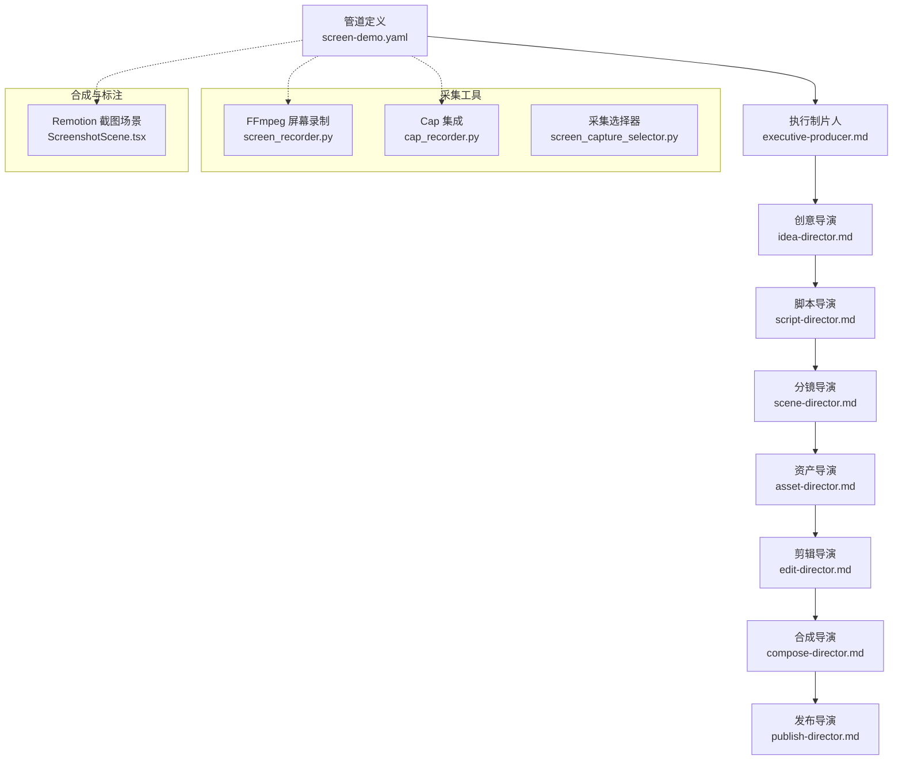
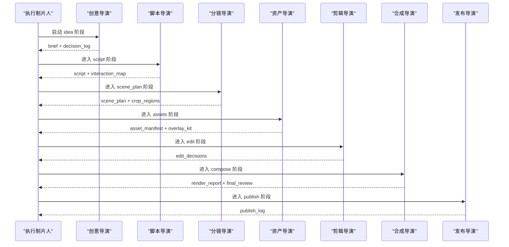
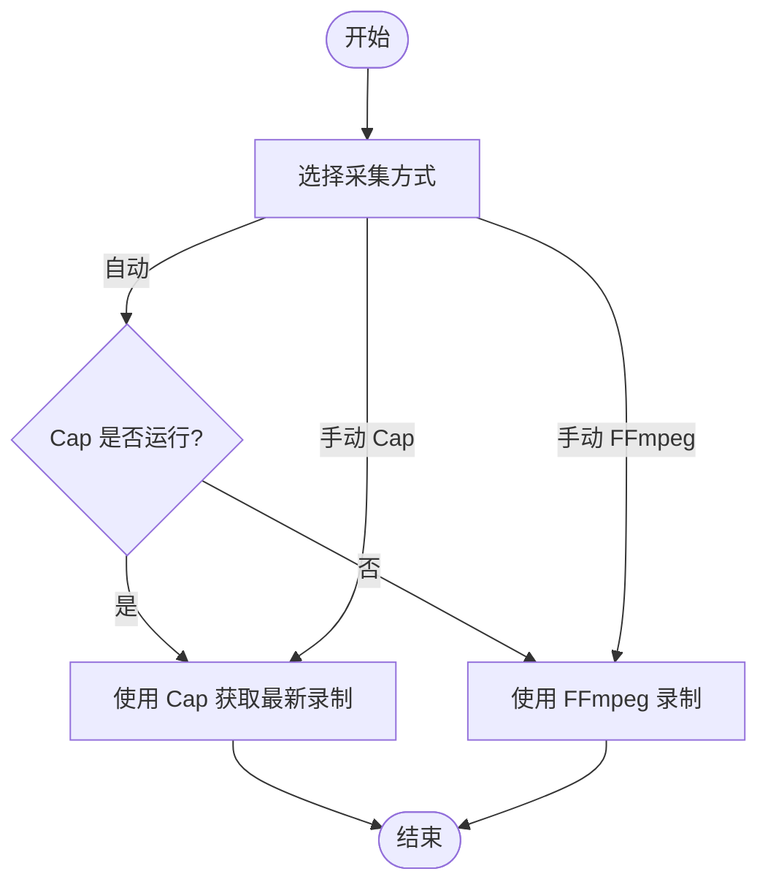
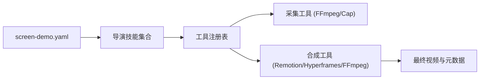

# 屏幕演示管道

<cite>
**本文引用的文件**
- [screen-demo.yaml](file://pipeline_defs/screen-demo.yaml)
- [executive-producer.md](file://skills/pipelines/screen-demo/executive-producer.md)
- [idea-director.md](file://skills/pipelines/screen-demo/idea-director.md)
- [script-director.md](file://skills/pipelines/screen-demo/script-director.md)
- [scene-director.md](file://skills/pipelines/screen-demo/scene-director.md)
- [asset-director.md](file://skills/pipelines/screen-demo/asset-director.md)
- [edit-director.md](file://skills/pipelines/screen-demo/edit-director.md)
- [compose-director.md](file://skills/pipelines/screen-demo/compose-director.md)
- [screen_recorder.py](file://tools/capture/screen_recorder.py)
- [cap_recorder.py](file://tools/capture/cap_recorder.py)
- [screen_capture_selector.py](file://tools/capture/screen_capture_selector.py)
- [ScreenshotScene.tsx](file://remotion-composer/src/components/ScreenshotScene.tsx)
- [screen-recording.md](file://skills/creative/screen-recording.md)
</cite>

## 目录
1. [简介](#简介)
2. [项目结构](#项目结构)
3. [核心组件](#核心组件)
4. [架构总览](#架构总览)
5. [详细组件分析](#详细组件分析)
6. [依赖关系分析](#依赖关系分析)
7. [性能与质量考量](#性能与质量考量)
8. [故障排查指南](#故障排查指南)
9. [结论](#结论)
10. [附录：模板与示例](#附录模板与示例)

## 简介
本文件为 OpenMontage 的“屏幕演示管道”提供系统化、可操作的文档。该管道面向“录制并编辑屏幕操作”的专业工作流，覆盖从屏幕捕获、鼠标键盘操作录制、界面元素标注、步骤分解说明到交互式演示生成的完整链路。它支持两种生产模式：
- 真实录制（real_capture）：基于系统级屏幕录制工具生成原始素材，再叠加字幕、缩放裁剪、高亮标注等后期处理。
- 合成终端（synthetic_terminal）：使用 Remotion TerminalScene 生成确定性、可重复的终端动画，适合 CLI/安装流程等可预测场景。

管道通过分阶段编排（创意→脚本→分镜→资产→剪辑→合成→发布），在每个阶段设置人类审批和质量门禁，确保最终输出在可读性、节奏和音频质量上达到专业标准。

## 项目结构
屏幕演示管道的核心由三部分构成：
- 管道定义：描述阶段、技能、产物、工具与评审要点。
- 导演技能：每个阶段的执行策略、输入输出、质量门禁与常见陷阱。
- 采集与渲染工具：跨平台屏幕录制、Cap 集成、Remotion 合成与 UI 标注组件。

图表来源
- [screen-demo.yaml:1-247](file://pipeline_defs/screen-demo.yaml#L1-L247)
- [executive-producer.md:1-278](file://skills/pipelines/screen-demo/executive-producer.md#L1-L278)
- [screen_recorder.py:1-395](file://tools/capture/screen_recorder.py#L1-L395)
- [cap_recorder.py:1-441](file://tools/capture/cap_recorder.py#L1-L441)
- [screen_capture_selector.py:1-350](file://tools/capture/screen_capture_selector.py#L1-L350)
- [ScreenshotScene.tsx:1-200](file://remotion-composer/src/components/ScreenshotScene.tsx#L1-L200)

章节来源
- [screen-demo.yaml:1-247](file://pipeline_defs/screen-demo.yaml#L1-L247)

## 核心组件
- 执行制片人（Executive Producer）：串行编排各阶段，维护累计状态、预算与问题日志；在各阶段后执行跨阶段检查（如文本可读性、音频清晰度、节奏）。
- 创意导演（Idea Director）：确定生产模式（真实录制或合成终端）、目标时长、平台形状、关键动作与死时间；锁定渲染运行时（Remotion/Hyperframes/FFmpeg）。
- 脚本导演（Script Director）：将素材转化为带时间戳的流程脚本，构建交互映射、速度计划与章节候选。
- 分镜导演（Scene Director）：规划注意力移动、缩放裁剪区域、标注策略与速度处理；产出 scene_plan。
- 资产导演（Asset Director）：生成字幕、清理音频、准备可复用标注套件（高亮框、箭头、步骤标签、快捷键徽章、模糊遮罩）；对合成模式产出 steps 列表与 TTS 对齐。
- 剪辑导演（Edit Director）：将计划转为可执行的剪辑决策（cuts、overlays、subtitles、transitions），记录元数据（裁剪关键帧、速度计划、字幕位置覆盖）。
- 合成导演（Compose Director）：按锁定的运行时进行渲染与验证，保证 UI 文字可读、节奏合理、多比例输出可用。
- 发布导演（Publish Director）：完成元数据、章节标记与导出包打包。

章节来源
- [executive-producer.md:1-278](file://skills/pipelines/screen-demo/executive-producer.md#L1-L278)
- [idea-director.md:1-145](file://skills/pipelines/screen-demo/idea-director.md#L1-L145)
- [script-director.md:1-137](file://skills/pipelines/screen-demo/script-director.md#L1-L137)
- [scene-director.md:1-141](file://skills/pipelines/screen-demo/scene-director.md#L1-L141)
- [asset-director.md:1-176](file://skills/pipelines/screen-demo/asset-director.md#L1-L176)
- [edit-director.md:1-88](file://skills/pipelines/screen-demo/edit-director.md#L1-L88)
- [compose-director.md:1-100](file://skills/pipelines/screen-demo/compose-director.md#L1-L100)

## 架构总览
屏幕演示管道采用“导演制”的分阶段流水线，配合严格的门禁与人类审批点，确保每一步都经过校验后再推进。采集层提供两种路径：快速 FFmpeg 录制与专业 Cap 录制；合成层支持 Remotion 与 Hyperframes，以及纯 FFmpeg 拼接。

图表来源
- [screen-demo.yaml:77-247](file://pipeline_defs/screen-demo.yaml#L77-L247)
- [executive-producer.md:67-137](file://skills/pipelines/screen-demo/executive-producer.md#L67-L137)

## 详细组件分析

### 屏幕录制与采集路由
- FFmpeg 屏幕录制：跨平台（Windows/macOS/Linux）调用系统设备，支持全屏或区域录制、可选系统/麦克风音频、指定 FPS 与时长；失败时提供错误信息并回退到 Cap。
- Cap 集成：检测安装与运行状态，查找最近录制文件，提供安装指引；适合需要摄像头画中画、光标高亮、点击效果与更干净音频的场景。
- 采集选择器：自动发现注册表中的 screen_capture 能力提供者，给出推荐（优先 Cap 若已运行，否则 FFmpeg），并可路由到具体实现。

图表来源
- [screen_capture_selector.py:149-319](file://tools/capture/screen_capture_selector.py#L149-L319)
- [cap_recorder.py:257-441](file://tools/capture/cap_recorder.py#L257-L441)
- [screen_recorder.py:176-254](file://tools/capture/screen_recorder.py#L176-L254)

章节来源
- [screen_recorder.py:1-395](file://tools/capture/screen_recorder.py#L1-L395)
- [cap_recorder.py:1-441](file://tools/capture/cap_recorder.py#L1-L441)
- [screen_capture_selector.py:1-350](file://tools/capture/screen_capture_selector.py#L1-L350)

### 创意与生产模式选择
- 生产模式：
  - real_capture：适用于真实应用 UI、浏览器流程、IDE 插件等不可预测行为。
  - synthetic_terminal：适用于 CLI/终端/安装流程等可预测命令与输出。
- 运行时选择：
  - 真实录制：Remotion（首选，混合录制与叠加）或 FFmpeg（纯拼接）。
  - 合成终端：仅 Remotion（TerminalScene）。
  - 合成 UI：Remotion 或 Hyperframes（需 lint+validate 通过）。
- 建议：以“能否提前预测每条命令及其输出”作为选择依据；记录在 brief.metadata.production_mode 与 decision_log.render_runtime_selection。

章节来源
- [idea-director.md:1-145](file://skills/pipelines/screen-demo/idea-director.md#L1-L145)
- [screen-demo.yaml:22-42](file://pipeline_defs/screen-demo.yaml#L22-L42)

### 脚本与交互映射
- 三种语音状态：voiced（转录并保留原话）、silent（文本主导或 TTS 就绪）、partial（部分转录并桥接）。
- 交互映射：记录精确任务边界、值得高亮的点击、需要放慢的输入、需要加速或剪掉的等待、结果时刻。
- 速度计划：重要点击/结果保持正常速度；常规输入导航加速；安装/编译/加载大幅加速或直接剪掉。
- 元数据：interaction_map、speed_plan、chapter_candidates、pronunciation_guides、callout_candidates、sections_needing_zoom。

章节来源
- [script-director.md:1-137](file://skills/pipelines/screen-demo/script-director.md#L1-L137)

### 分镜与注意力规划
- 注意力原则：仅在需要阅读或定位时缩放；理解阶段保持稳定；无点击锚点时手动缩放；主要步骤间重置到更广视角。
- 场景类型：screen_recording、text_card、diagram（谨慎使用）、transition（仅在重大阶段切换时使用）。
- 裁剪策略：存储于 metadata.crop_regions，包含 section_id、start/end_seconds、region、zoom_level、trigger、transition_duration、rationale。
- 标注克制：最多同时两个注意力提示；先出现再行动；行动后迅速移除；优先高亮或缩放，避免堆叠。

章节来源
- [scene-director.md:1-141](file://skills/pipelines/screen-demo/scene-director.md#L1-L141)

### 资产与可复用套件
- 必需资产：字幕、清理后的主音频。
- 常用套件：highlight_box_primary、arrow_primary、step_label_primary、keystroke_badge_primary、blur_mask_template。
- 合成模式资产：narration（TTS 对齐）、steps 列表（cmd/out/pause/pill 原语）、时序验证（必须通过）。
- 质量门禁：字幕存在且解析无误；清理音频存在且时长匹配；可复用套件覆盖计划标注类型；补充视觉仅在必要时生成。

章节来源
- [asset-director.md:1-176](file://skills/pipelines/screen-demo/asset-director.md#L1-L176)

### 剪辑与时间线完整性
- 顺序：先裁剪/剪掉死时间，再速度调整，再放置叠加层，再设置字幕行为，最后定义音频行为。
- 规则：前几秒要有用运动或结果；结果时刻保持正常速度；安装/等待加速或移除；避免过度剪辑引入多余运动。
- 元数据：crop_keyframes、speed_plan、subtitle_position_overrides、audio_notes、variant_notes。

章节来源
- [edit-director.md:1-88](file://skills/pipelines/screen-demo/edit-director.md#L1-L88)

### 合成与运行时治理
- 运行时路由：严格按 edit_decisions.render_runtime 执行；禁止静默替换；若锁定运行时不可用，需升级处理。
- 渲染顺序：裁剪与变速 → 构图与缩放 → 遮罩与叠加 → 烧录字幕 → 混音 → 编码（文本友好参数）。
- 输出形状：YouTube/docs 优先 16:9；LinkedIn 1:1；短视频 9:16（需确保可读）。
- 验证：文件有效性、时长/分辨率匹配、文本锐利度、缩放过渡平滑、标注可见性、敏感数据遮蔽、无黑帧与时序异常。

章节来源
- [compose-director.md:1-100](file://skills/pipelines/screen-demo/compose-director.md#L1-L100)

### 合成端 UI 标注与交互（Remotion ScreenshotScene）
- 坐标系统：所有叠加层使用归一化坐标（0-1），适配 letterboxing。
- 步骤类型：cursor_move、click_pulse、type_into、bubble_append、typing_dots、highlight_box、callout_balloon、pause。
- 时间计算：根据步骤类型与默认持续时间分配帧窗口；非阻塞步骤（如 highlight_box、callout_balloon）可与后续步骤重叠。
- 用途：将任意截图作为静态背景，在其上播放脚本化叠加层，模拟真实屏幕录制体验，适合 15-30 秒聚焦演示。

章节来源
- [ScreenshotScene.tsx:1-200](file://remotion-composer/src/components/ScreenshotScene.tsx#L1-L200)

## 依赖关系分析
- 管道定义依赖导演技能与工具注册表；导演技能依赖相应 schema 与工具能力。
- 采集层依赖系统工具（FFmpeg）或第三方应用（Cap）；选择器通过能力发现路由到具体实现。
- 合成层依赖 Remotion/Hyperframes/FFmpeg；运行时锁定需在创意阶段明确并在合成阶段严格执行。

图表来源
- [screen-demo.yaml:57-69](file://pipeline_defs/screen-demo.yaml#L57-L69)
- [screen_capture_selector.py:132-147](file://tools/capture/screen_capture_selector.py#L132-L147)

章节来源
- [screen-demo.yaml:57-69](file://pipeline_defs/screen-demo.yaml#L57-L69)
- [screen_capture_selector.py:132-147](file://tools/capture/screen_capture_selector.py#L132-L147)

## 性能与质量考量
- 文本可读性优先：缩放与压缩不得影响 UI 文字清晰度；必要时提高分辨率与比特率。
- 节奏控制：死时间（安装、编译、加载、重复输入）应加速或剪掉；结果时刻保持正常速度。
- 音频质量：去除键盘噪音与房间噪音；保持人声清晰；背景音乐谨慎使用并确保 ducking 有效。
- 标注克制：同时出现的注意力提示不超过两三个；避免遮挡关键 UI；字幕与标注不冲突。
- 运行时治理：严禁静默替换渲染引擎；若不可用需升级处理并记录决策。

[本节为通用指导，不直接分析具体文件]

## 故障排查指南
- 无法录制：
  - FFmpeg 未安装或设备不可用：检查系统设备列表与权限；参考安装指引。
  - Cap 未安装或未运行：使用 Cap 工具的状态检测与安装指引；确认录制目录存在。
- 输出无效：
  - 容器/编解码错误：使用 ffprobe 验证；调整编码参数与像素格式。
  - 文本模糊：降低压缩强度、提高比特率；避免过度缩放。
- 节奏问题：
  - 死时间过多：在脚本与分镜阶段标记 speed_up/cut；在剪辑阶段实施。
- 运行时漂移：
  - 合成阶段检测到运行时不一致：立即停止并上报；恢复至创意阶段锁定的运行时。

章节来源
- [screen_recorder.py:176-254](file://tools/capture/screen_recorder.py#L176-L254)
- [cap_recorder.py:257-441](file://tools/capture/cap_recorder.py#L257-L441)
- [compose-director.md:7-19](file://skills/pipelines/screen-demo/compose-director.md#L7-L19)

## 结论
OpenMontage 的屏幕演示管道通过明确的阶段划分、严格的质量门禁与人类审批点，结合跨平台采集与多种合成运行时，提供了从真实录制到合成终端的一体化解决方案。遵循“可读性优先、节奏可控、标注克制、运行时治理”的原则，可以稳定地产出专业级的软件演示、产品教程与操作指南。

[本节为总结，不直接分析具体文件]

## 附录：模板与示例
- 屏幕录制最佳实践：
  - IDE/编辑器：字体大小 18-22px 以上；暗色主题；行号开启；最小化侧边栏；缩放 150-175%。
  - 光标管理：放大至默认 1.5-2x；黄色/白色光环高亮；点击闪烁；轻微平滑减少抖动。
  - 缩放与平移：全览 1.0x；代码聚焦 1.5-2.0x；终端聚焦 1.5x；UI 元素高亮 2.0-2.5x；返回全览 1.0x；平滑过渡。
- UI 设计规范：
  - 标注与字幕不遮挡关键内容；高对比度；避免在同一区域堆叠多个提示。
- 用户体验指导：
  - 叙述意图与效果而非游标运动；简短直接；避免术语；保持画面与语言同步。
- 演示脚本编写技巧：
  - 将脚本与交互映射绑定；为每步标注重要性、建议处理方式（realtime/speed_up/cut/highlight/zoom）；章节候选用于导航。
- 制作模板与示例：
  - 真实录制：浏览器流程、IDE 插件、设计工具演示。
  - 合成终端：CLI 安装、make targets、git clone、API key 配置。
  - 合成 UI：自定义 HTML UI 演示（Hyperframes），需 lint+validate 通过。

章节来源
- [screen-recording.md:37-82](file://skills/creative/screen-recording.md#L37-L82)
- [screen-demo.yaml:22-42](file://pipeline_defs/screen-demo.yaml#L22-L42)
- [asset-director.md:17-23](file://skills/pipelines/screen-demo/asset-director.md#L17-L23)