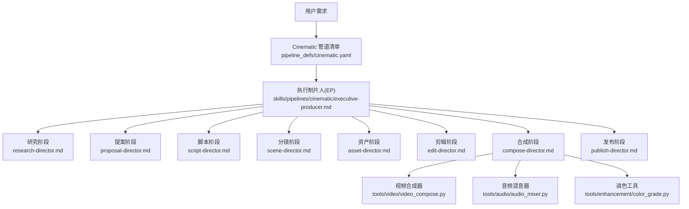
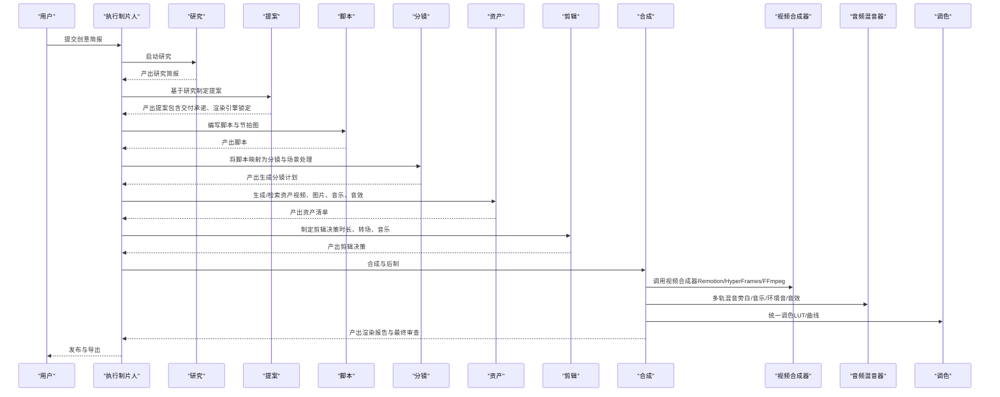
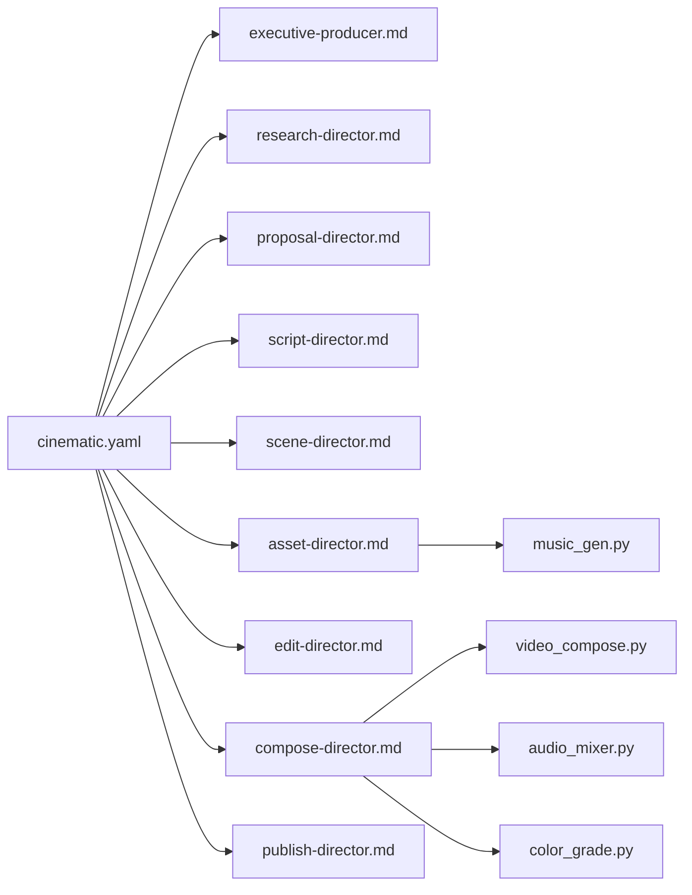

# 电影预告片管道

<cite>
**本文引用的文件**
- [README.md](file://README.md)
- [PROJECT_CONTEXT.md](file://PROJECT_CONTEXT.md)
- [cinematic.yaml](file://pipeline_defs/cinematic.yaml)
- [executive-producer.md](file://skills/pipelines/cinematic/executive-producer.md)
- [idea-director.md](file://skills/pipelines/cinematic/idea-director.md)
- [proposal-director.md](file://skills/pipelines/cinematic/proposal-director.md)
- [script-director.md](file://skills/pipelines/cinematic/script-director.md)
- [scene-director.md](file://skills/pipelines/cinematic/scene-director.md)
- [asset-director.md](file://skills/pipelines/cinematic/asset-director.md)
- [edit-director.md](file://skills/pipelines/cinematic/edit-director.md)
- [compose-director.md](file://skills/pipelines/cinematic/compose-director.md)
- [publish-director.md](file://skills/pipelines/cinematic/publish-director.md)
- [video_compose.py](file://tools/video/video_compose.py)
- [audio_mixer.py](file://tools/audio/audio_mixer.py)
- [music_gen.py](file://tools/audio/music_gen.py)
- [color_grade.py](file://tools/enhancement/color_grade.py)
- [color-grading.md](file://skills/core/color-grading.md)
- [cinematic.md](file://skills/creative/cinematic.md)
- [test_cinematic_remotion_adapter.py](file://tests/tools/test_cinematic_remotion_adapter.py)
</cite>

## 目录
1. [简介](#简介)
2. [项目结构](#项目结构)
3. [核心组件](#核心组件)
4. [架构总览](#架构总览)
5. [详细组件分析](#详细组件分析)
6. [依赖关系分析](#依赖关系分析)
7. [性能与质量保障](#性能与质量保障)
8. [故障排查指南](#故障排查指南)
9. [结论](#结论)
10. [附录：最佳实践与创意指导原则](#附录最佳实践与创意指导原则)

## 简介
本文件面向“电影预告片”这一专用工作流，系统化说明从创意构思、视觉风格设计、镜头规划到高质量视频合成的完整生产管线。该管线以“指令驱动（Agent-First）”为核心：AI 智能体读取 YAML 管道清单与各阶段导演技能，调用工具完成研究、提案、脚本、分镜、资产、剪辑、合成与发布，并在关键节点设置人类审批门。系统内置评分式供应商选择、预算治理、前后置校验与自审流程，确保输出达到电影级标准。

## 项目结构
OpenMontage 的电影预告片能力由“ cinematic ”管道定义与一系列导演技能共同实现，配合 Remotion/HyperFrames/FFmpeg 等渲染与后期工具链。

图表来源
- [cinematic.yaml:1-288](file://pipeline_defs/cinematic.yaml#L1-L288)
- [executive-producer.md:1-192](file://skills/pipelines/cinematic/executive-producer.md#L1-L192)
- [video_compose.py:1-200](file://tools/video/video_compose.py#L1-L200)

章节来源
- [README.md:356-378](file://README.md#L356-L378)
- [PROJECT_CONTEXT.md:9-57](file://PROJECT_CONTEXT.md#L9-L57)

## 核心组件
- 管道清单（YAML）：定义 cinematic 管道的阶段、技能、产物、工具、审批门与成功标准。
- 执行制片人（EP）：串联各阶段，维护累计状态，设置质量门与预算控制。
- 导演技能：每个阶段的具体操作指南与评审要点。
- 合成与后期：Remotion/HyperFrames/FFmpeg 的视频合成；多轨混音与侧链压缩；LUT 调色。
- 音乐与音效：生成或检索背景音乐与音效，适配叙事节拍。
- 创意与风格：电影化语言、镜头时长、节奏、色彩与声音分层规范。

章节来源
- [cinematic.yaml:60-288](file://pipeline_defs/cinematic.yaml#L60-L288)
- [executive-producer.md:18-192](file://skills/pipelines/cinematic/executive-producer.md#L18-L192)
- [video_compose.py:1-200](file://tools/video/video_compose.py#L1-L200)
- [audio_mixer.py:589-673](file://tools/audio/audio_mixer.py#L589-L673)
- [music_gen.py:46-84](file://tools/audio/music_gen.py#L46-L84)
- [color_grade.py:54-75](file://tools/enhancement/color_grade.py#L54-L75)
- [color-grading.md:1-32](file://skills/core/color-grading.md#L1-L32)
- [cinematic.md:1-146](file://skills/creative/cinematic.md#L1-L146)

## 架构总览
OpenMontage 的 cinematic 管道遵循统一的生产流：研究 → 提案 → 脚本 → 分镜 → 资产 → 剪辑 → 合成 → 发布。每个阶段都有明确的输入/输出、可用工具、检查点与人类审批门。EP 在各阶段之间进行跨阶段校验，确保情绪弧线、运动承诺、渲染引擎一致性与预算可控。

图表来源
- [cinematic.yaml:60-288](file://pipeline_defs/cinematic.yaml#L60-L288)
- [video_compose.py:1-200](file://tools/video/video_compose.py#L1-L200)
- [audio_mixer.py:589-673](file://tools/audio/audio_mixer.py#L589-L673)
- [color_grade.py:54-75](file://tools/enhancement/color_grade.py#L54-L75)

## 详细组件分析

### 创意概念开发（Idea Director）
- 目标：明确素材现实模式（仅素材/素材+静帧/静帧主导/生成支持/混合蒙太奇），判定是否“需要运动”，并定义情感弧线（紧张→揭示、惊奇→规模、亲密→回报、紧迫→解决、神秘→CTA）。
- 输出：创意简报，包含运动承诺、交付形状（预告/先导/品牌片/情绪切片/社交裁剪）、以及后续阶段的创作方向。

章节来源
- [idea-director.md:1-61](file://skills/pipelines/cinematic/idea-director.md#L1-L61)

### 视觉参考分析与提案（Proposal Director）
- 目标：在制作前盘点可用工具与提供商（视频/图像/TTS/音乐/增强/渲染引擎），提前呈现情绪板（参考画面、配色、基调、音乐情绪），并给出至少三种差异化概念。
- 约束：若“需要运动”，必须确认具备实际视频生成或真实素材路径；不得静默降级为静帧动画。

章节来源
- [proposal-director.md:91-116](file://skills/pipelines/cinematic/proposal-director.md#L91-L116)

### 分镜脚本创作（Script Director）
- 目标：将创意转化为可执行的节拍图，确保高潮与着陆点清晰，对白/标题卡克制且目的明确。
- 评审：节拍递进是否顺畅、时长是否匹配电影化语速与节奏。

章节来源
- [script-director.md:115-136](file://pipeline_defs/cinematic.yaml#L115-L136)

### 特效镜头生成（Asset Director）
- 目标：依据分镜生成或检索资产（视频片段、静帧、3D世界、音乐、音效），区分“源素材”和“支撑资产”，限制生成插入的比例并确保质量对齐。
- 约束：若“需要运动”，必须使用真实视频片段而非静帧替代；3D世界需保持连贯场景图与生产保真度层级。

章节来源
- [asset-director.md:161-208](file://pipeline_defs/cinematic.yaml#L161-L208)

### 音乐与音效集成（Audio Mixer & Music Generator）
- 目标：构建四层声音（旁白/音乐/环境音/音效），按节拍与情绪动态调整音量与淡入淡出；必要时使用侧链压缩让旁白更清晰。
- 工具：音乐生成（指定时长、乐器、BPM、动态范围）、音效检索/生成、分段音乐嵌入、降噪与标准化。

章节来源
- [music_gen.py:46-84](file://tools/audio/music_gen.py#L46-L84)
- [audio_mixer.py:589-673](file://tools/audio/audio_mixer.py#L589-L673)

### 专业调色处理（Color Grading）
- 目标：统一全片色调与对比度，保护肤色线，避免纯黑/纯白过曝，确保不同来源素材在视觉上融合。
- 工具：内置 LUT/曲线/色温/饱和度/对比度调节，支持自定义滤镜链。

章节来源
- [color_grade.py:54-75](file://tools/enhancement/color_grade.py#L54-L75)
- [color-grading.md:1-32](file://skills/core/color-grading.md#L1-L32)

### 高质量视频合成（Video Compose）
- 目标：根据剪辑决策将多源素材、字幕、叠加层、音频与调色组合成最终影片；默认优先 Remotion，其次 HyperFrames，最后 FFmpeg。
- 治理：禁止静默切换渲染引擎；若失败需上报阻塞并等待人工决策。

章节来源
- [video_compose.py:1-200](file://tools/video/video_compose.py#L1-L200)
- [test_cinematic_remotion_adapter.py:9-55](file://tests/tools/test_cinematic_remotion_adapter.py#L9-L55)

## 依赖关系分析
- 管道清单依赖导演技能与工具注册表；导演技能依赖具体工具（视频合成、音频混音、调色、音乐生成）。
- 渲染引擎在提案阶段锁定，合成阶段严格按约定路由，避免运行时漂移。
- 预算与成本追踪贯穿全流程，防止超支与意外账单。

图表来源
- [cinematic.yaml:60-288](file://pipeline_defs/cinematic.yaml#L60-L288)
- [video_compose.py:1-200](file://tools/video/video_compose.py#L1-L200)
- [audio_mixer.py:589-673](file://tools/audio/audio_mixer.py#L589-L673)
- [color_grade.py:54-75](file://tools/enhancement/color_grade.py#L54-L75)
- [music_gen.py:46-84](file://tools/audio/music_gen.py#L46-L84)

章节来源
- [PROJECT_CONTEXT.md:33-57](file://PROJECT_CONTEXT.md#L33-L57)

## 性能与质量保障
- 质量门：每阶段均有检查点与人类审批；提案阶段锁定渲染引擎与交付承诺；合成阶段进行 ffprobe 验证、帧采样、音频电平分析、字幕存在性检查。
- 幻灯片风险评分：多维度评估重复、装饰性视觉、弱运动、意图缺失、过度排版与不支持的电影化声明。
- 供应商评分：任务契合度、输出质量、控制力、可靠性、成本效率、延迟、连续性七维打分。
- 预算治理：预估→预留→对账，支持观察/警告/硬上限模式，单动作阈值审批与总预算封顶。

章节来源
- [README.md:652-686](file://README.md#L652-L686)
- [executive-producer.md:160-192](file://skills/pipelines/cinematic/executive-producer.md#L160-L192)

## 故障排查指南
- 渲染失败或超时：检查 Remotion/HyperFrames/FFmpeg 可用性；查看超时配置与场景数量关系；确认公共目录权限与清理策略。
- 音频问题：检查旁白与音乐的侧链压缩参数、目标响度与归一化；确认分段音乐仅在指定区间生效。
- 颜色不一致：确认全片使用统一 LUT/曲线；检查肤色线与高光/阴影滚降；避免过度调色导致失真。
- 运动承诺未满足：若“需要运动”却输出静帧动画，立即停止并上报，不得静默降级。

章节来源
- [video_compose.py:1375-2026](file://tools/video/video_compose.py#L1375-L2026)
- [audio_mixer.py:589-673](file://tools/audio/audio_mixer.py#L589-L673)
- [color_grade.py:54-75](file://tools/enhancement/color_grade.py#L54-L75)
- [executive-producer.md:184-192](file://skills/pipelines/cinematic/executive-producer.md#L184-L192)

## 结论
OpenMontage 的电影预告片管道通过“指令驱动 + 严格质量门 + 评分式供应商选择 + 预算治理”，实现了从创意到成片的全链路自动化与可控性。借助电影化语言、节奏控制与声音分层，结合 Remotion/HyperFrames/FFmpeg 的灵活合成能力，可在保证质量的前提下高效产出专业级预告片。

## 附录：最佳实践与创意指导原则
- 镜头语言与节奏
  - 平均镜头时长建议 4-8 秒，避免连续三次相同时长；采用“呼吸式”节奏变化。
  - 强调情绪优先于空间连续性；在生成内容中更注重节奏与故事推进。
- 声音设计
  - 四层声音：旁白/音乐/环境音/音效；音乐 BPM 60-90，动态而非循环；关键揭示处留白 3-5 秒。
  - 使用侧链压缩确保旁白清晰度；分段音乐只在必要段落出现。
- 色彩与画幅
  - 电影化画幅（如 2.39:1 letterbox）用于真正受益的内容；统一 LUT/曲线；保护肤色线。
- 资产与生成
  - 若“需要运动”，必须使用真实视频片段；生成插入应有限且合理；3D 世界需保持连贯场景图与生产保真度。
- 合规与治理
  - 提案阶段锁定渲染引擎；合成阶段禁止静默切换；所有重大决策记录审计轨迹。

章节来源
- [cinematic.md:21-146](file://skills/creative/cinematic.md#L21-L146)
- [color-grading.md:1-32](file://skills/core/color-grading.md#L1-L32)
- [music_gen.py:46-84](file://tools/audio/music_gen.py#L46-L84)
- [audio_mixer.py:589-673](file://tools/audio/audio_mixer.py#L589-L673)
- [video_compose.py:1-200](file://tools/video/video_compose.py#L1-L200)
- [executive-producer.md:160-192](file://skills/pipelines/cinematic/executive-producer.md#L160-L192)