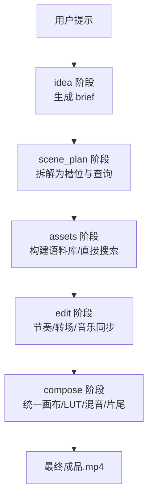
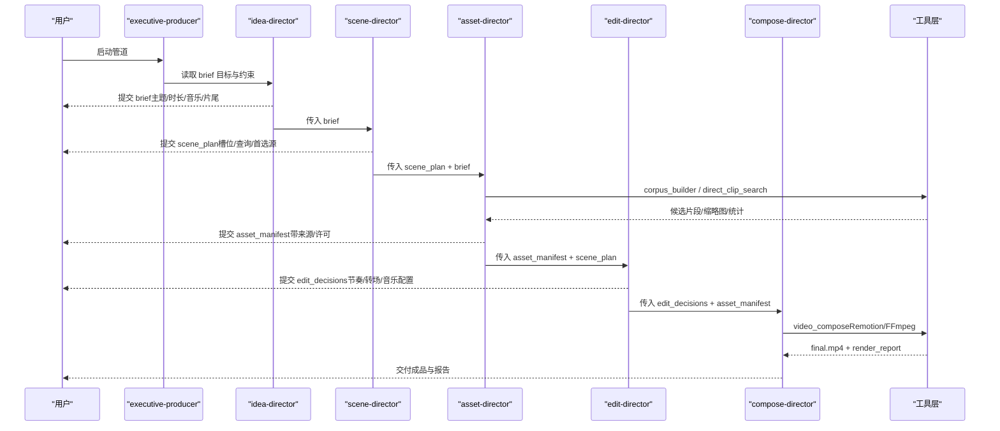
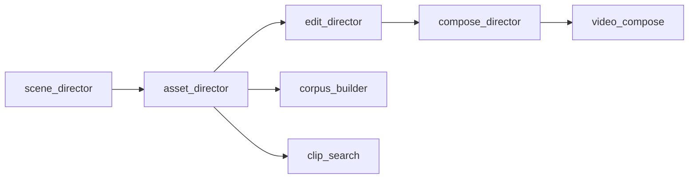

# 纪录片蒙太奇管道

<cite>
**本文引用的文件**
- [pipeline_defs/documentary-montage.yaml](file://pipeline_defs/documentary-montage.yaml)
- [skills/pipelines/documentary-montage/executive-producer.md](file://skills/pipelines/documentary-montage/executive-producer.md)
- [skills/pipelines/documentary-montage/idea-director.md](file://skills/pipelines/documentary-montage/idea-director.md)
- [skills/pipelines/documentary-montage/scene-director.md](file://skills/pipelines/documentary-montage/scene-director.md)
- [skills/pipelines/documentary-montage/asset-director.md](file://skills/pipelines/documentary-montage/asset-director.md)
- [skills/pipelines/documentary-montage/edit-director.md](file://skills/pipelines/documentary-montage/edit-director.md)
- [skills/pipelines/documentary-montage/compose-director.md](file://skills/pipelines/documentary-montage/compose-director.md)
- [tools/video/corpus_builder.py](file://tools/video/corpus_builder.py)
- [tools/video/clip_search.py](file://tools/video/clip_search.py)
- [tools/video/video_compose.py](file://tools/video/video_compose.py)
- [README.md](file://README.md)
</cite>

## 目录
1. [简介](#简介)
2. [项目结构](#项目结构)
3. [核心组件](#核心组件)
4. [架构总览](#架构总览)
5. [详细组件分析](#详细组件分析)
6. [依赖关系分析](#依赖关系分析)
7. [性能与质量保障](#性能与质量保障)
8. [故障排查指南](#故障排查指南)
9. [结论](#结论)
10. [附录：制作规范与创意方法](#附录制作规范与创意方法)

## 简介
本文件为 OpenMontage 的“纪录片蒙太奇”管道提供系统化、可操作的技术与创作文档。该管道以“检索优先”的方式，从多源免费素材库（Pexels、Archive.org、NASA、Wikimedia、Unsplash 等）构建语义化素材库，通过 CLIP 相似度检索填充叙事槽位，按叙事节拍编排剪辑，并统一色彩与音频混音，最终输出具有电影质感的纪录片蒙太奇作品。

该工作流覆盖：
- 多源素材采集与索引
- 内容相似度分析与去重
- 叙事线索梳理与节拍规划
- 转场设计与音乐同步
- 音频混音与片尾字幕叠加
- 版权与来源溯源管理
- 成片质量验证与治理

## 项目结构
OpenMontage 采用“清单 + 技能 + 工具”的分层组织方式：
- pipeline_defs：定义生产流水线（YAML），包括阶段、产物、工具与审查标准
- skills/pipelines：每个阶段的导演技能说明（Markdown），指导 AI 代理如何执行
- tools：具体实现工具（Python），如素材库构建、检索、视频合成等
- schemas：各阶段产物的 JSON Schema 校验契约
- remotion-composer：Remotion 渲染引擎（React 驱动）
- backlot：本地可视化看板，用于进度与审批

图表来源
- [pipeline_defs/documentary-montage.yaml:45-179](file://pipeline_defs/documentary-montage.yaml#L45-L179)

章节来源
- [pipeline_defs/documentary-montage.yaml:1-179](file://pipeline_defs/documentary-montage.yaml#L1-L179)
- [README.md:356-404](file://README.md#L356-L404)

## 核心组件
- 语料库构建器（corpus_builder）：跨多个素材源并行抓取、下载、缩略图提取、CLIP 嵌入与索引，支持增量追加与断点恢复
- 片段检索器（clip_search）：基于文本描述对语料库进行相似度排序、相似集合查找、多样性筛选与元数据查询
- 视频合成器（video_compose）：根据 edit_decisions 将素材拼接、应用 LUT、混音、叠加片尾，并输出符合平台规范的 MP4

章节来源
- [tools/video/corpus_builder.py:1-200](file://tools/video/corpus_builder.py#L1-L200)
- [tools/video/clip_search.py:1-200](file://tools/video/clip_search.py#L1-L200)
- [tools/video/video_compose.py:1-200](file://tools/video/video_compose.py#L1-L200)

## 架构总览
纪录片蒙太奇管道的五阶段流程由 YAML 清单驱动，每阶段产出受 Schema 约束，并由“导演技能”指导 AI 代理执行。关键路径如下：

图表来源
- [pipeline_defs/documentary-montage.yaml:45-179](file://pipeline_defs/documentary-montage.yaml#L45-L179)
- [tools/video/video_compose.py:1-200](file://tools/video/video_compose.py#L1-L200)

章节来源
- [pipeline_defs/documentary-montage.yaml:1-179](file://pipeline_defs/documentary-montage.yaml#L1-L179)

## 详细组件分析

### 理念与总控（Executive Producer）
- 定位：面向非叙事性、主题拼贴式短片（30–180s），强调真实素材与并置意义
- 原则：检索优先、扩大搜索空间、让画面并置说话、信任素材、节奏即信息
- 跨阶段规则：默认不生成片段、默认无旁白、先建语料再选片段、记录被拒绝的选择原因

章节来源
- [skills/pipelines/documentary-montage/executive-producer.md:1-90](file://skills/pipelines/documentary-montage/executive-producer.md#L1-L90)

### 创意构思（Idea Director）
- 任务：将用户意图提炼为“一句话主题问题”，确定情绪基调、时长与形状（单图扩展/前后对比/三幕/清单）
- 强制项：
  - 音乐计划必须存在（除非明确用户选择静音）
  - 片尾计划必须存在（默认 overlay 模式，使用 Remotion EndTag）
  - 旁白可选，但需显式声明
- 运行时锁定：本管道在 Phase 1 仅允许 Remotion 作为渲染运行时

章节来源
- [skills/pipelines/documentary-montage/idea-director.md:10-15](file://skills/pipelines/documentary-montage/idea-director.md#L10-L15)
- [skills/pipelines/documentary-montage/idea-director.md:80-118](file://skills/pipelines/documentary-montage/idea-director.md#L80-L118)
- [skills/pipelines/documentary-montage/idea-director.md:150-204](file://skills/pipelines/documentary-montage/idea-director.md#L150-L204)

### 场景规划（Scene Director）
- 任务：把主题问题拆解为可检索的“槽位”（描述+查询+首选源），并为每个槽位设定目标停留时长
- 要点：
  - 槽位描述遵循“名词+形容词”模板，避免抽象情感词
  - 每槽位 2–3 个短查询（字面/横向/联想）
  - era_mix 决定首选源分布（现代/复古/任意）
  - 标记 2–3 个“英雄槽位”（更长停留、更大候选池）
- 产出：scene_plan（含 metadata.slots[]）

章节来源
- [skills/pipelines/documentary-montage/scene-director.md:22-36](file://skills/pipelines/documentary-montage/scene-director.md#L22-L36)
- [skills/pipelines/documentary-montage/scene-director.md:39-59](file://skills/pipelines/documentary-montage/scene-director.md#L39-L59)
- [skills/pipelines/documentary-montage/scene-director.md:91-139](file://skills/pipelines/documentary-montage/scene-director.md#L91-L139)
- [skills/pipelines/documentary-montage/scene-director.md:140-217](file://skills/pipelines/documentary-montage/scene-director.md#L140-L217)
- [skills/pipelines/documentary-montage/scene-director.md:229-295](file://skills/pipelines/documentary-montage/scene-director.md#L229-L295)

### 素材采集（Asset Director）
- 两条路径：
  - 标准路径：corpus_builder 批量抓取→CLIP 嵌入→clip_search 排名→挑选
  - 快速路径：direct_clip_search 直接搜索并下载，人工审阅缩略图后映射到槽位
- 关键规则：
  - 先建语料再检索；语料只增不减；按槽位挑选且禁止重复使用同一 clip_id
  - 儿童/童话内容强制走 Pixabay Video 奇幻风格，保持视觉一致性
  - 音乐计划严格按 brief 执行，不得静默替换
- 产出：asset_manifest（每槽位一个视频资产，附带来源/许可/URL）

章节来源
- [skills/pipelines/documentary-montage/asset-director.md:1-49](file://skills/pipelines/documentary-montage/asset-director.md#L1-L49)
- [skills/pipelines/documentary-montage/asset-director.md:77-116](file://skills/pipelines/documentary-montage/asset-director.md#L77-L116)
- [skills/pipelines/documentary-montage/asset-director.md:117-183](file://skills/pipelines/documentary-montage/asset-director.md#L117-L183)
- [skills/pipelines/documentary-montage/asset-director.md:186-343](file://skills/pipelines/documentary-montage/asset-director.md#L186-L343)
- [skills/pipelines/documentary-montage/asset-director.md:344-449](file://skills/pipelines/documentary-montage/asset-director.md#L344-L449)

### 剪辑编排（Edit Director）
- 任务：将素材转化为时间线，决定入出点、转场、音乐同步与片尾位置
- 核心：
  - 依据 tone 计算基础/最小/最大停留，英雄槽位最长
  - 按叙事节拍排列，而非按分数
  - 严格限制转场词汇（cut/dissolve/fade_to_black/fade_in/out）
  - 混合时代素材需统一画幅与色度（LUT 在 compose 阶段应用）
  - 片尾 overlay 模式下计算 offset_seconds，使标签淡出与结尾淡出对齐
- 产出：edit_decisions（cuts/audio/end_tag/metadata）

章节来源
- [skills/pipelines/documentary-montage/edit-director.md:23-40](file://skills/pipelines/documentary-montage/edit-director.md#L23-L40)
- [skills/pipelines/documentary-montage/edit-director.md:59-97](file://skills/pipelines/documentary-montage/edit-director.md#L59-L97)
- [skills/pipelines/documentary-montage/edit-director.md:98-152](file://skills/pipelines/documentary-montage/edit-director.md#L98-L152)
- [skills/pipelines/documentary-montage/edit-director.md:153-227](file://skills/pipelines/documentary-montage/edit-director.md#L153-L227)
- [skills/pipelines/documentary-montage/edit-director.md:228-331](file://skills/pipelines/documentary-montage/edit-director.md#L228-L331)

### 合成与输出（Compose Director）
- 任务：将时间线渲染为成品，完成统一画布、LUT 着色、音频混音与片尾叠加
- 硬性约束：
  - 运行时锁定为 Remotion（Phase 1），不得静默降级
  - 片尾必须渲染（overlay 或 concat），除非 brief 中显式 opt-out
  - 音乐必须混入（除非 brief 中 music_plan.source=none 且有理由）
- 步骤：
  - 解析 target_platform 确定画布与遮幅
  - 构建 video_compose 渲染计划
  - 应用全局 LUT（warm_film_100/cool_archive_60/neutral_doc_20/bleach_bypass_80）
  - 一次性混音（音量/淡入淡出/静音窗/L-cut 环境声）
  - 片尾渲染与叠加（ProRes 4444 alpha 或 concat）
  - 编码规格（H.264/yuv420p/CRF18/24fps/aac 192k）
  - 后置验证（时长/分辨率/首尾帧/静音窗/音频通道）
- 产出：final.mp4 + render_report

章节来源
- [skills/pipelines/documentary-montage/compose-director.md:12-19](file://skills/pipelines/documentary-montage/compose-director.md#L12-L19)
- [skills/pipelines/documentary-montage/compose-director.md:69-129](file://skills/pipelines/documentary-montage/compose-director.md#L69-L129)
- [skills/pipelines/documentary-montage/compose-director.md:130-257](file://skills/pipelines/documentary-montage/compose-director.md#L130-L257)
- [skills/pipelines/documentary-montage/compose-director.md:258-342](file://skills/pipelines/documentary-montage/compose-director.md#L258-L342)

## 依赖关系分析
- 阶段依赖：idea → scene_plan → assets → edit → compose，每阶段产物被下游消费
- 工具依赖：
  - assets 阶段依赖 corpus_builder/clip_search 或直接依赖 direct_clip_search
  - compose 阶段依赖 video_compose（Remotion/FFmpeg）与 audio_mixer/color_grade（可选）
- 运行时依赖：Remotion 用于片尾叠加与高质量排版；FFmpeg 负责主体拼接与编码

图表来源
- [pipeline_defs/documentary-montage.yaml:45-179](file://pipeline_defs/documentary-montage.yaml#L45-L179)
- [tools/video/corpus_builder.py:74-123](file://tools/video/corpus_builder.py#L74-L123)
- [tools/video/clip_search.py:53-95](file://tools/video/clip_search.py#L53-L95)
- [tools/video/video_compose.py:58-79](file://tools/video/video_compose.py#L58-L79)

章节来源
- [pipeline_defs/documentary-montage.yaml:45-179](file://pipeline_defs/documentary-montage.yaml#L45-L179)

## 性能与质量保障
- 语料规模建议：至少 8x 槽位数，保证检索有足够选择空间
- 运动过滤：设置 motion_min 过滤静态片段，避免“幻灯片感”
- 多样性：使用 diversify 避免相邻镜头重复；编辑阶段再次检查相邻差异
- 质量门：
  - 每阶段 human_approval_default 开启，关键决策需人工批准
  - 预合成校验：阻止违反交付承诺的计划
  - 后渲染自检：ffprobe、帧采样、音频电平、交付承诺验证
- 预算与审计：每次调用记录成本、替代方案与理由，形成审计轨迹

章节来源
- [pipeline_defs/documentary-montage.yaml:45-179](file://pipeline_defs/documentary-montage.yaml#L45-L179)
- [skills/pipelines/documentary-montage/asset-director.md:250-343](file://skills/pipelines/documentary-montage/asset-director.md#L250-L343)
- [skills/pipelines/documentary-montage/edit-director.md:318-331](file://skills/pipelines/documentary-montage/edit-director.md#L318-L331)
- [skills/pipelines/documentary-montage/compose-director.md:275-342](file://skills/pipelines/documentary-montage/compose-director.md#L275-L342)

## 故障排查指南
- 语料过小或偏斜：运行 stats 查看 rows/per_source/mean_motion_score；必要时针对弱槽位追加查询重建
- 检索分数过低：<0.22 视为不可用，重写查询并二次增长语料；仍失败则反馈 idea director 调整槽位
- 重复使用素材：确保 exclude_ids 累积传递，避免同一 clip_id 命中多个槽位
- 运行时违规：若 edit_decisions 指定了非 Remotion，compose 阶段应中止并回滚至提案重新锁定
- 片尾未渲染：overlay 模式需确认 alpha 通道与偏移；concat 模式需确认最后帧为片尾卡
- 无声输出：若 brief 要求音乐但成品无声，属于严重违约，需回溯 brief 与 edit 阶段

章节来源
- [skills/pipelines/documentary-montage/asset-director.md:327-343](file://skills/pipelines/documentary-montage/asset-director.md#L327-L343)
- [skills/pipelines/documentary-montage/compose-director.md:12-19](file://skills/pipelines/documentary-montage/compose-director.md#L12-L19)
- [skills/pipelines/documentary-montage/compose-director.md:153-257](file://skills/pipelines/documentary-montage/compose-director.md#L153-L257)

## 结论
OpenMontage 的纪录片蒙太奇管道以“检索优先”为核心，通过严谨的阶段划分、严格的 Schema 契约与可审计的工具链，实现了从多源素材采集到成片输出的全链路自动化与可控性。其优势在于：
- 真实素材与开放档案的规模化利用
- 基于 CLIP 的语义检索与多样性控制
- 明确的叙事节拍与音乐同步
- 统一的画幅与色彩处理，提升跨时代素材的一致性
- 强治理的质量门与审计轨迹，确保合规与可追溯

## 附录：制作规范与创意方法
- 纪录片制作规范
  - 主题聚焦：brief 中的主题问题必须是一句话，避免多主题混杂
  - 时长与形状：根据 tone 选择合适时长与结构（清单/三幕/前后对比）
  - 音乐与片尾：默认必须包含；如需静音或省略片尾，需在 brief 中明确记录
  - 来源与版权：每段素材必须记录 provider/original_url/license，确保可发布
- 素材版权管理
  - 优先使用免费/开放源（Pexels、Pixabay、Archive.org、NASA、Wikimedia、Unsplash）
  - 对儿童/童话内容，统一走 Pixabay Video 奇幻风格，避免风格冲突
- 内容真实性验证
  - 使用 stats 与缩略图抽样验证语料质量
  - 对弱匹配槽位进行二次增长与人工复核
- 视觉效果增强技术
  - 统一画幅与遮幅（16:9/2.35:1/9:16）
  - 全局 LUT 着色（warm_film_100/cool_archive_60/neutral_doc_20/bleach_bypass_80）
  - 音频混音：淡入淡出、静音窗、L-cut 环境声、片尾叠加
- 实用技巧与创意方法论
  - 槽位描述要“可拍摄”：名词+形容词，避免抽象情感词
  - 每槽位准备 2–3 个短查询，提高命中率
  - 英雄槽位承载情感峰值，给予更长停留与更大候选池
  - 转场克制：最多 4 种，避免花哨特效破坏纪录片气质
  - 节奏即信息：切点落在音乐节拍上，合理使用一次静音窗口

章节来源
- [skills/pipelines/documentary-montage/idea-director.md:26-118](file://skills/pipelines/documentary-montage/idea-director.md#L26-L118)
- [skills/pipelines/documentary-montage/scene-director.md:91-167](file://skills/pipelines/documentary-montage/scene-director.md#L91-L167)
- [skills/pipelines/documentary-montage/asset-director.md:77-116](file://skills/pipelines/documentary-montage/asset-director.md#L77-L116)
- [skills/pipelines/documentary-montage/edit-director.md:153-227](file://skills/pipelines/documentary-montage/edit-director.md#L153-L227)
- [skills/pipelines/documentary-montage/compose-director.md:111-152](file://skills/pipelines/documentary-montage/compose-director.md#L111-L152)