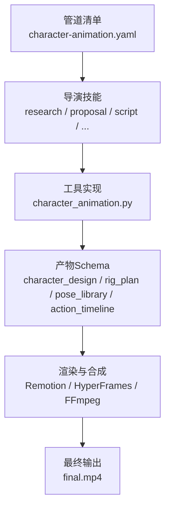
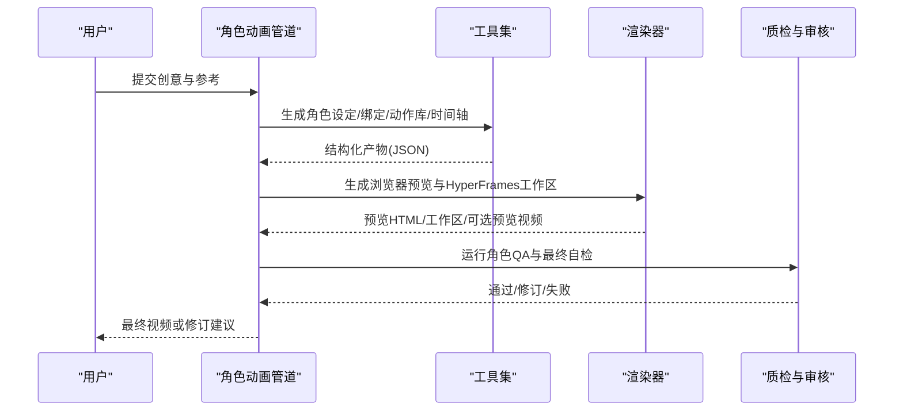
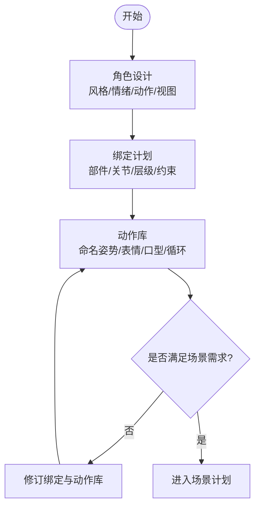
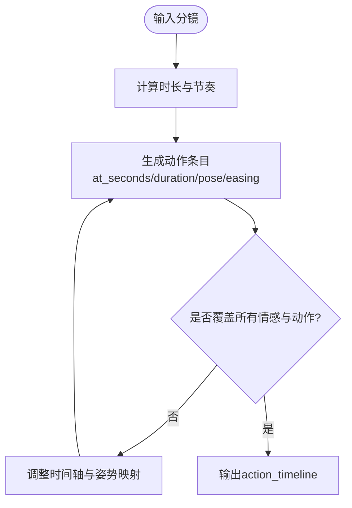
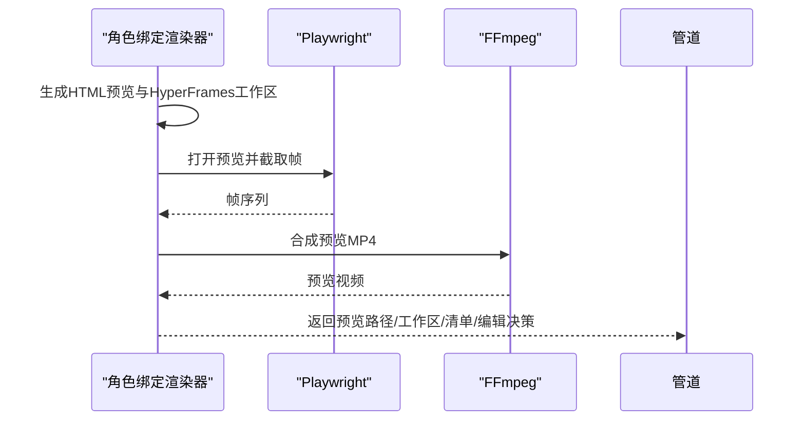
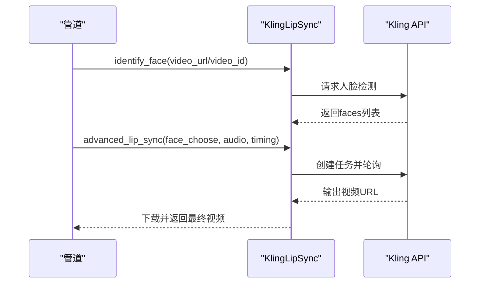
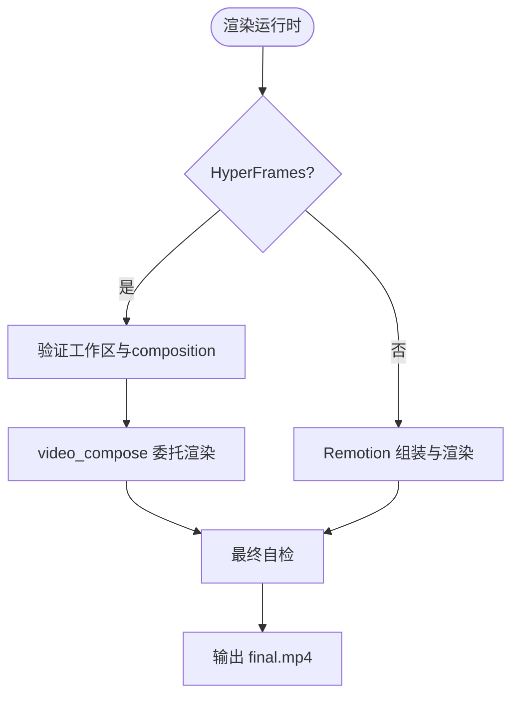
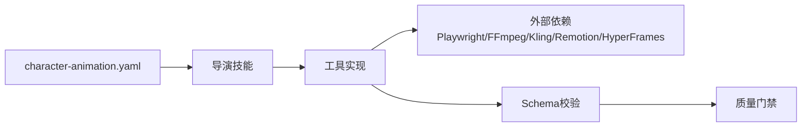

# 角色动画管道

<cite>
**本文引用的文件**
- [README.md](file://README.md)
- [character-animation.yaml](file://pipeline_defs/character-animation.yaml)
- [executive-producer.md](file://skills/pipelines/character-animation/executive-producer.md)
- [research-director.md](file://skills/pipelines/character-animation/research-director.md)
- [character-design-director.md](file://skills/pipelines/character-animation/character-design-director.md)
- [rig-plan-director.md](file://skills/pipelines/character-animation/rig-plan-director.md)
- [compose-director.md](file://skills/pipelines/character-animation/compose-director.md)
- [character_animation.py](file://tools/character/character_animation.py)
- [character_design.schema.json](file://schemas/artifacts/character_design.schema.json)
- [rig_plan.schema.json](file://schemas/artifacts/rig_plan.schema.json)
- [pose_library.schema.json](file://schemas/artifacts/pose_library.schema.json)
- [action_timeline.schema.json](file://schemas/artifacts/action_timeline.schema.json)
- [TalkingHead.tsx](file://remotion-composer/src/TalkingHead.tsx)
- [kling_lip_sync.py](file://tools/avatar/kling_lip_sync.py)
- [test_character_animation_pipeline.py](file://tests/contracts/test_character_animation_pipeline.py)
</cite>

## 目录
1. [简介](#简介)
2. [项目结构](#项目结构)
3. [核心组件](#核心组件)
4. [架构总览](#架构总览)
5. [详细组件分析](#详细组件分析)
6. [依赖关系分析](#依赖关系分析)
7. [性能与优化](#性能与优化)
8. [故障排查指南](#故障排查指南)
9. [结论](#结论)
10. [附录：数据格式与资产要求](#附录：数据格式与资产要求)

## 简介
本文件为 OpenMontage 的“角色动画管道”提供系统化文档。该管道面向可复用、本地可控的卡通角色表演，将脚本与分镜转化为角色设定、骨骼绑定计划、动作库、时间轴与最终渲染产物。它强调确定性、可审查性与质量门禁，避免以静态图运动替代真实表演；同时支持在 Remotion 与 HyperFrames 两种渲染运行时之间选择，并通过工具链生成浏览器预览、工作区包与最终视频。

## 项目结构
OpenMontage 采用“清单 + 技能 + 工具 + 模式”的分层组织方式：
- 管道清单定义阶段顺序、产出物、工具与评审标准
- 导演技能说明每个阶段如何执行、使用哪些工具与质量门槛
- 工具实现结构化产物的生成与校验
- JSON Schema 约束所有中间产物，确保跨阶段一致性

图表来源
- [character-animation.yaml:61-303](file://pipeline_defs/character-animation.yaml#L61-L303)
- [character_animation.py:109-800](file://tools/character/character_animation.py#L109-L800)

章节来源
- [character-animation.yaml:1-303](file://pipeline_defs/character-animation.yaml#L1-L303)
- [README.md:450-475](file://README.md#L450-L475)

## 核心组件
- 管道编排与阶段治理：通过 YAML 清单定义研究、提案、剧本、角色设计、绑定计划、场景计划、资产、剪辑、合成、发布等阶段，并设置检查点与人类审批门。
- 角色与绑定工具：
  - 角色规格生成器：将概念转为结构化角色设定
  - SVG 绑定构建器：生成部件、关节、层级、视角与风险标注
  - 动作库构建器：生成命名姿势、表情、口型形状与循环
  - 时间轴编译器：将分镜与动作映射为带时间戳的动作序列
  - 角色绑定渲染器：输出浏览器预览、HyperFrames 工作区与可选预览视频
- 审核与合成：
  - 角色动画审核器：对绑定、姿势、时间轴与预览进行 QA
  - 合成导演：根据已锁定的渲染运行时（Remotion/HyperFrames）完成最终渲染与自检
- 唇形同步（可选）：Kling 官方 API 提供多步人脸识别与高级口型同步流程，严格校验音频裁剪与时间字段一致性。

章节来源
- [character-animation.yaml:61-303](file://pipeline_defs/character-animation.yaml#L61-L303)
- [character_animation.py:109-800](file://tools/character/character_animation.py#L109-L800)
- [compose-director.md:1-50](file://skills/pipelines/character-animation/compose-director.md#L1-L50)
- [kling_lip_sync.py:36-165](file://tools/avatar/kling_lip_sync.py#L36-L165)

## 架构总览
角色动画管道的端到端流程如下：

图表来源
- [character-animation.yaml:61-303](file://pipeline_defs/character-animation.yaml#L61-L303)
- [character_animation.py:466-785](file://tools/character/character_animation.py#L466-L785)
- [compose-director.md:1-50](file://skills/pipelines/character-animation/compose-director.md#L1-L50)

## 详细组件分析

### 角色设计与绑定规划
- 角色设计阶段产出结构化角色设定，包含风格、情绪范围、动作需求与视图要求，便于后续绑定与动画复用。
- 绑定规划阶段将角色拆解为部件、关节、层级与约束，明确每类动作所需的姿势与风险点，保证不同角色差异由数据驱动而非硬编码分支。

图表来源
- [character_design.schema.json:1-46](file://schemas/artifacts/character_design.schema.json#L1-L46)
- [rig_plan.schema.json:1-60](file://schemas/artifacts/rig_plan.schema.json#L1-L60)
- [pose_library.schema.json:1-42](file://schemas/artifacts/pose_library.schema.json#L1-L42)
- [character-design-director.md:1-44](file://skills/pipelines/character-animation/character-design-director.md#L1-L44)
- [rig-plan-director.md:1-41](file://skills/pipelines/character-animation/rig-plan-director.md#L1-L41)

章节来源
- [character-design-director.md:1-44](file://skills/pipelines/character-animation/character-design-director.md#L1-L44)
- [rig-plan-director.md:1-41](file://skills/pipelines/character-animation/rig-plan-director.md#L1-L41)
- [character_design.schema.json:1-46](file://schemas/artifacts/character_design.schema.json#L1-L46)
- [rig_plan.schema.json:1-60](file://schemas/artifacts/rig_plan.schema.json#L1-L60)
- [pose_library.schema.json:1-42](file://schemas/artifacts/pose_library.schema.json#L1-L42)

### 动作编排与时间轴编译
- 时间轴编译器将分镜中的角色行为转换为带时间戳的动作条目，包括准备、执行、收尾等节拍，并考虑多角色错开与镜头构图。
- 动作条目关联到动作库中的命名姿势，确保渲染器可直接消费。

图表来源
- [action_timeline.schema.json:1-51](file://schemas/artifacts/action_timeline.schema.json#L1-L51)
- [character_animation.py:370-463](file://tools/character/character_animation.py#L370-L463)

章节来源
- [character_animation.py:370-463](file://tools/character/character_animation.py#L370-L463)
- [action_timeline.schema.json:1-51](file://schemas/artifacts/action_timeline.schema.json#L1-L51)

### 浏览器预览与渲染工作区
- 角色绑定渲染器会：
  - 生成轻量 HTML 预览，内置 GSAP 动画与 SVG 角色
  - 输出 HyperFrames 工作区与 composition HTML，供后续合成
  - 可选地通过 Playwright 截图帧并用 FFmpeg 合成预览 MP4
- 渲染器返回编辑决策与资产清单，锁定渲染运行时（默认 HyperFrames），避免静默降级为纯图片动效。

图表来源
- [character_animation.py:466-785](file://tools/character/character_animation.py#L466-L785)
- [compose-director.md:1-50](file://skills/pipelines/character-animation/compose-director.md#L1-L50)

章节来源
- [character_animation.py:466-785](file://tools/character/character_animation.py#L466-L785)
- [compose-director.md:1-50](file://skills/pipelines/character-animation/compose-director.md#L1-L50)

### 表情与口型同步（可选）
- 当需要基于真人或虚拟主持人的口型同步时，可使用 Kling 官方唇形同步工具：
  - 先识别人脸，再选择目标人脸（支持自动选择最大人脸或人工指定）
  - 校验音频裁剪与插入时间的一致性，拒绝冲突参数
  - 调用高级口型同步接口，轮询任务并下载结果
- 该流程适合配音与口型对齐，但需网络与付费 API；本地角色动画仍以 SVG/GSAP 为主。

图表来源
- [kling_lip_sync.py:36-165](file://tools/avatar/kling_lip_sync.py#L36-L165)
- [kling_lip_sync.py:193-346](file://tools/avatar/kling_lip_sync.py#L193-L346)
- [kling_lip_sync.py:495-563](file://tools/avatar/kling_lip_sync.py#L495-L563)

章节来源
- [kling_lip_sync.py:36-165](file://tools/avatar/kling_lip_sync.py#L36-L165)
- [kling_lip_sync.py:193-346](file://tools/avatar/kling_lip_sync.py#L193-L346)
- [kling_lip_sync.py:495-563](file://tools/avatar/kling_lip_sync.py#L495-L563)

### 场景集成与最终渲染
- 合成阶段读取编辑决策中的渲染运行时，若为 HyperFrames 则验证工作区并通过 video_compose 委托渲染；若为 Remotion 则组装 React 场景并渲染。
- 最终输出遵循 OpenMontage 约定路径，并在渲染后执行 ffprobe、帧采样、音频分析与承诺校验。

图表来源
- [compose-director.md:1-50](file://skills/pipelines/character-animation/compose-director.md#L1-L50)
- [TalkingHead.tsx:1-366](file://remotion-composer/src/TalkingHead.tsx#L1-L366)

章节来源
- [compose-director.md:1-50](file://skills/pipelines/character-animation/compose-director.md#L1-L50)
- [TalkingHead.tsx:1-366](file://remotion-composer/src/TalkingHead.tsx#L1-L366)

## 依赖关系分析
- 管道清单依赖一系列导演技能与元技能（如评审、检查点协议、渲染运行时选择）。
- 工具依赖外部能力：
  - 预览渲染依赖 Playwright 与 FFmpeg
  - 唇形同步依赖 Kling 官方 API 与网络
  - 渲染阶段可能依赖 Remotion 或 HyperFrames
- 测试契约确保阶段顺序与必需工具存在，保障管道稳定性。

图表来源
- [character-animation.yaml:29-47](file://pipeline_defs/character-animation.yaml#L29-L47)
- [character_animation.py:70-107](file://tools/character/character_animation.py#L70-L107)
- [kling_lip_sync.py:47-52](file://tools/avatar/kling_lip_sync.py#L47-L52)
- [test_character_animation_pipeline.py:27-50](file://tests/contracts/test_character_animation_pipeline.py#L27-L50)

章节来源
- [character-animation.yaml:29-47](file://pipeline_defs/character-animation.yaml#L29-L47)
- [test_character_animation_pipeline.py:27-50](file://tests/contracts/test_character_animation_pipeline.py#L27-L50)

## 性能与优化
- 控制角色数量与复杂度：一两个角色是 MVP 最佳平衡点；更多角色会增加绑定与时间轴复杂度。
- 重用动作与循环：仅在多次使用或关键叙事处定义动作循环，减少冗余。
- 限制预览帧数与时长：预览渲染按 FPS 计算帧数，过长的预览会增加时间与磁盘占用。
- 合理选择渲染运行时：HyperFrames 更适合 SVG/GSAP 驱动的本地角色动画；Remotion 适合数据驱动与复杂叠加。
- 避免静默降级：合成阶段禁止从字符表演降级为静态图动效，确保性能与质量一致。

[本节提供通用指导，不直接分析具体文件]

## 故障排查指南
- 预览渲染失败：
  - 检查 FFmpeg 是否可用；若无，将无法合成预览 MP4
  - 检查 Playwright 是否安装；若无，将无法截图帧
- 唇形同步失败：
  - 确认 KLING_API_KEY 已配置
  - 检查 face_choose 与 sound_end_time 等时间字段是否冲突或缺失
  - 多个人脸时需显式选择或启用自动选择
- 渲染运行时不一致：
  - 合成阶段必须使用提案中锁定的运行时；若变更需显式记录决策
- 质量门禁未通过：
  - 查看 character_qa_report 与 final_review 报告，定位问题（黑帧、无运动、音频静音等）

章节来源
- [character_animation.py:70-107](file://tools/character/character_animation.py#L70-L107)
- [kling_lip_sync.py:47-52](file://tools/avatar/kling_lip_sync.py#L47-L52)
- [kling_lip_sync.py:495-563](file://tools/avatar/kling_lip_sync.py#L495-L563)
- [compose-director.md:1-50](file://skills/pipelines/character-animation/compose-director.md#L1-L50)

## 结论
OpenMontage 的角色动画管道以结构化产物与严格的质量门禁为核心，将创意意图转化为可复用的角色资产与确定性动画。通过绑定计划、动作库与时间轴编译，配合浏览器预览与渲染工作区，能够在本地高效迭代并最终输出高质量视频。对于需要口型同步的场景，可通过 Kling 官方 API 完成专业级对齐。整体流程兼顾艺术创作与工程治理，适合制作生动、可控且可审计的角色动画内容。

[本节总结性内容，不直接分析具体文件]

## 附录：数据格式与资产要求
- 角色设定（character_design）：
  - 版本、风格、角色数组（id、role、body_type、style、required_emotions、required_actions、required_views、props、constraints）
- 绑定计划（rig_plan）：
  - 版本、角色数组（character_id、parts、joints、layers、views、required_poses、required_actions、risks）
- 动作库（pose_library）：
  - 版本、角色数组（character_id、poses、mouth_shapes、action_cycles）
- 动作时间轴（action_timeline）：
  - 版本、fps、场景数组（scene_id、start_seconds、end_seconds、camera、background、effects、actions）

章节来源
- [character_design.schema.json:1-46](file://schemas/artifacts/character_design.schema.json#L1-L46)
- [rig_plan.schema.json:1-60](file://schemas/artifacts/rig_plan.schema.json#L1-L60)
- [pose_library.schema.json:1-42](file://schemas/artifacts/pose_library.schema.json#L1-L42)
- [action_timeline.schema.json:1-51](file://schemas/artifacts/action_timeline.schema.json#L1-L51)