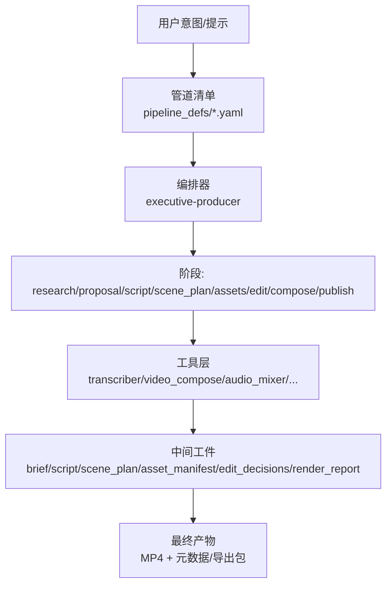
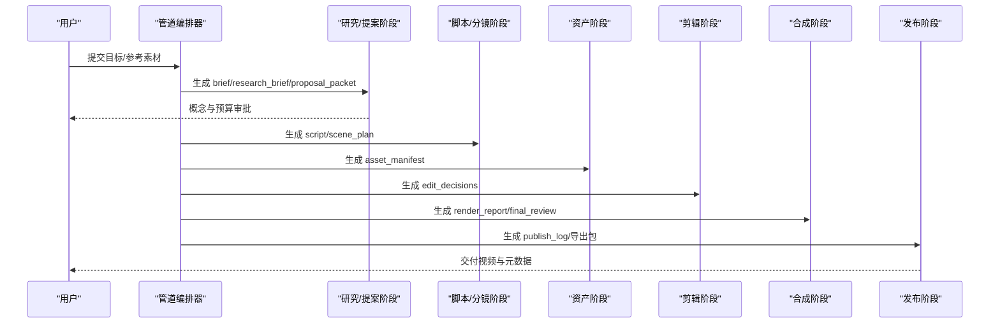
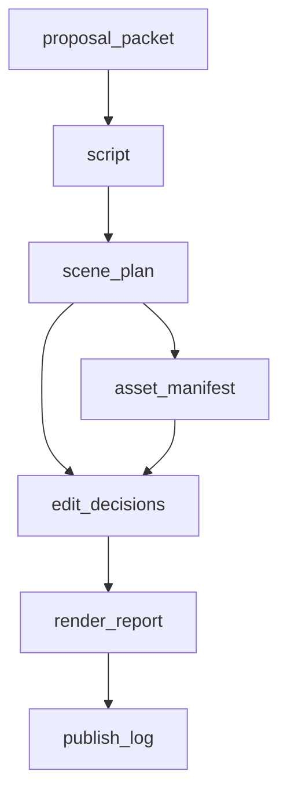

# 预定义管道系统

<cite>
**本文引用的文件**
- [README.md](file://README.md)
- [animated-explainer.yaml](file://pipeline_defs/animated-explainer.yaml)
- [animation.yaml](file://pipeline_defs/animation.yaml)
- [character-animation.yaml](file://pipeline_defs/character-animation.yaml)
- [cinematic.yaml](file://pipeline_defs/cinematic.yaml)
- [documentary-montage.yaml](file://pipeline_defs/documentary-montage.yaml)
- [screen-demo.yaml](file://pipeline_defs/screen-demo.yaml)
- [talking-head.yaml](file://pipeline_defs/talking-head.yaml)
- [avatar-spokesperson.yaml](file://pipeline_defs/avatar-spokesperson.yaml)
- [clip-factory.yaml](file://pipeline_defs/clip-factory.yaml)
- [hybrid.yaml](file://pipeline_defs/hybrid.yaml)
- [localization-dub.yaml](file://pipeline_defs/localization-dub.yaml)
- [podcast-repurpose.yaml](file://pipeline_defs/podcast-repurpose.yaml)
- [framework-smoke.yaml](file://pipeline_defs/framework-smoke.yaml)
</cite>

## 目录
1. [简介](#简介)
2. [项目结构](#项目结构)
3. [核心组件](#核心组件)
4. [架构总览](#架构总览)
5. [详细组件分析](#详细组件分析)
6. [依赖关系分析](#依赖关系分析)
7. [性能与成本考量](#性能与成本考量)
8. [故障排查指南](#故障排查指南)
9. [结论](#结论)
10. [附录：快速选择与使用示例](#附录快速选择与使用示例)

## 简介
本文件系统化梳理 OpenMontage 的预定义管道，覆盖动画解释器、角色动画、电影预告片、纪录片蒙太奇、屏幕演示、口播人物、虚拟发言人、多片段工厂、混合媒体、本地化配音、播客复用等十余种管道。每个管道均提供：功能特性、适用场景、输入要求、处理流程、输出格式、可配置项、最佳实践与常见问题定位。读者可据此快速匹配业务需求并理解端到端工作流。

## 项目结构
OpenMontage 将“管道”以 YAML 清单形式声明在 pipeline_defs 目录下，每个文件描述一个完整的生产流水线（阶段、所需技能、工具、检查点、成功标准）。运行时由编排器加载清单，驱动各阶段技能执行，产出中间工件（如脚本、分镜、资产清单、剪辑决策、渲染报告）并最终生成视频与元数据。

图表来源
- [framework-smoke.yaml:7-26](file://pipeline_defs/framework-smoke.yaml#L7-L26)

章节来源
- [framework-smoke.yaml:1-26](file://pipeline_defs/framework-smoke.yaml#L1-L26)

## 核心组件
- 管道清单（YAML）：声明名称、版本、类别、稳定性、默认检查点策略、参考输入支持、扩展能力、必需技能、编排参数、兼容风格集、阶段序列及每阶段的输入/输出、可用工具、检查点、人类审批默认值、审查重点与成功标准。
- 阶段（Stage）：按顺序推进生产，典型包括 idea/research、proposal、script、scene_plan、assets、edit、compose、publish。
- 工件（Artifact）：阶段产出的结构化数据，如 brief、research_brief、proposal_packet、decision_log、script、scene_plan、asset_manifest、edit_decisions、render_report、final_review、publish_log 等。
- 工具（Tool）：转录、字幕、音视频合成、混音、转场、色彩校正、3D/图形生成、音频增强、自动裁剪等。
- 检查点与治理：关键阶段需人工审批；多处强制校验 render_runtime 一致性，禁止静默降级或替换。

章节来源
- [animated-explainer.yaml:1-44](file://pipeline_defs/animated-explainer.yaml#L1-L44)
- [animation.yaml:1-61](file://pipeline_defs/animation.yaml#L1-L61)
- [character-animation.yaml:1-60](file://pipeline_defs/character-animation.yaml#L1-L60)
- [cinematic.yaml:1-59](file://pipeline_defs/cinematic.yaml#L1-L59)
- [documentary-montage.yaml:1-44](file://pipeline_defs/documentary-montage.yaml#L1-L44)
- [screen-demo.yaml:1-76](file://pipeline_defs/screen-demo.yaml#L1-L76)
- [talking-head.yaml:1-41](file://pipeline_defs/talking-head.yaml#L1-L41)
- [avatar-spokesperson.yaml:1-44](file://pipeline_defs/avatar-spokesperson.yaml#L1-L44)
- [clip-factory.yaml:1-44](file://pipeline_defs/clip-factory.yaml#L1-L44)
- [hybrid.yaml:1-45](file://pipeline_defs/hybrid.yaml#L1-L45)
- [localization-dub.yaml:1-43](file://pipeline_defs/localization-dub.yaml#L1-L43)
- [podcast-repurpose.yaml:1-45](file://pipeline_defs/podcast-repurpose.yaml#L1-L45)

## 架构总览
所有管道共享统一的阶段模型与工件契约，差异体现在：
- 输入类型：参考视频、真实录屏、长视频源、音频播客、主题简报等。
- 阶段侧重：研究/提案、角色绑定与动作时间线、素材检索与语义剪辑、终端合成等。
- 工具组合：不同管道启用不同的可选/必选工具集合。
- 渲染后端：remotion（视频主导/复杂合成）、hyperframes（HTML/GSAP 动效）、ffmpeg（简单拼接）。

图表来源
- [animated-explainer.yaml:61-270](file://pipeline_defs/animated-explainer.yaml#L61-L270)
- [cinematic.yaml:60-288](file://pipeline_defs/cinematic.yaml#L60-L288)
- [screen-demo.yaml:77-247](file://pipeline_defs/screen-demo.yaml#L77-L247)

## 详细组件分析

### 动画解释器管道（animated-explainer）
- 功能特性：从主题/想法自动生成带旁白、画面与音乐的讲解视频；强调“先研究后制作”，在生成任何资产前给出多个概念与成本估算并获批准。
- 适用场景：知识科普、产品原理说明、教育类短视频。
- 输入要求：可接受参考视频进行深度分析（转录、场景检测、帧采样等）。
- 处理流程：research → proposal（含 sample 预览）→ script → scene_plan → assets（TTS/图像/视频/数学动画/图表/音乐）→ edit → compose（video_compose + audio_mixer，可选 hyperframes_compose/video_stitch）→ publish。
- 输出格式：MP4 + 渲染报告 + 最终评审 + 发布日志与导出包。
- 自定义选项：兼容多种风格集；允许自定义脚本/玩法/技能；预算、最大修订次数、最长运行时长可配置。
- 最佳实践：严格遵循提案中锁定的 render_runtime；HyperFrames 渲染前必须通过 lint/validate；控制时长误差在 ±5% 内。

章节来源
- [animated-explainer.yaml:1-270](file://pipeline_defs/animated-explainer.yaml#L1-L270)

### 动画优先管道（animation）
- 功能特性：面向动态图形、图解讲解、动态排版、数学可视化、显式 Three.js 世界与风格化插画序列；同样采用“先研究后制作”。
- 适用场景：技术演示、数据可视化、品牌动效短片。
- 输入要求：支持参考视频分析。
- 处理流程：research → proposal（含 sample）→ script → scene_plan → assets（TTS/图像/视频/数学动画/图表/代码片段/3D 世界/音乐）→ edit → compose → publish。
- 输出格式：MP4 + 渲染报告 + 最终评审 + 发布日志。
- 自定义选项：推荐/兼容风格集；允许自定义脚本/玩法/技能；预算与时长上限可配。
- 最佳实践：明确动画模式与复用策略；优先使用选择器工具而非直调供应商；最大化片段时长以降低调用成本；确保文本/图表在最终分辨率下清晰。

章节来源
- [animation.yaml:1-300](file://pipeline_defs/animation.yaml#L1-L300)

### 角色动画管道（character-animation）
- 功能特性：面向本地、可复用的卡通角色；从脚本与分镜生成角色规范、绑定计划、姿势库、动作时间线，并在浏览器中渲染 SVG/Canvas/Remotion/HyperFrames 动画。
- 适用场景：角色表演、剧情动画、教学角色演示。
- 输入要求：支持参考视频分析。
- 处理流程：research → proposal（含 sample）→ script → character_design → rig_plan → scene_plan → assets → edit（生成 action_timeline）→ compose（含角色 QA）→ publish。
- 输出格式：MP4 + 渲染报告 + 最终评审 + 角色质量报告 + 发布日志。
- 自定义选项：推荐/兼容风格集；允许自定义脚本/玩法/技能。
- 最佳实践：保持提案中的 render_runtime 不变；避免静默降级为静态图运动；确保动作时间线保留表演节奏与情感可读性。

章节来源
- [character-animation.yaml:1-303](file://pipeline_defs/character-animation.yaml#L1-L303)

### 电影预告片管道（cinematic）
- 功能特性：情绪驱动的预告片、品牌片、蒙太奇、短剧向剪辑与显式 3D 世界漫游；适合已有素材或图片，可补充生成视觉填补空白。
- 适用场景：品牌宣传片、影视预告、情绪向短片。
- 输入要求：支持参考视频深度分析。
- 处理流程：research → proposal（含 sample）→ script → scene_plan → assets（字幕/音频增强/图像/视频/3D 世界/音乐）→ edit → compose（可选 trim/color_grade/audio_enhance）→ publish。
- 输出格式：MP4 + 渲染报告 + 最终评审 + 发布日志。
- 自定义选项：推荐/兼容风格集；允许自定义脚本/玩法/技能。
- 最佳实践：锁定渲染家族；对需要运动的段落务必使用真实视频片段；统一色调与动态范围；结尾海报/缩略图与整体基调一致。

章节来源
- [cinematic.yaml:1-288](file://pipeline_defs/cinematic.yaml#L1-L288)

### 纪录片蒙太奇管道（documentary-montage）
- 功能特性：检索优先的主题蒙太奇；构建来自公开库的真实素材语料，基于 CLIP 检索填充主题槽位；按叙事节拍剪辑，统一色彩与音乐同步。
- 适用场景：历史/文化/科学主题短片、诗意蒙太奇。
- 输入要求：不支持参考视频输入。
- 处理流程：idea（brief）→ scene_plan（槽位+查询）→ assets（直接检索或语料检索+去重）→ edit（锁定纪录片渲染族）→ compose（统一 LUT、混音、结尾标签 overlay/concat）。
- 输出格式：MP4 + 渲染报告（含 end_tag_rendered/music_mixed 标记）。
- 自定义选项：允许自定义风格集。
- 最佳实践：严格满足音乐与结尾标签的强制性要求；保持时长与节拍约束；避免相邻镜头重复主体与景别。

章节来源
- [documentary-montage.yaml:1-179](file://pipeline_defs/documentary-montage.yaml#L1-L179)

### 屏幕演示管道（screen-demo）
- 功能特性：两种模式——真实录制（桌面/浏览器）与合成终端（Remotion TerminalScene），产出带标注、缩放裁剪、字幕与降噪的演示视频。
- 适用场景：软件教程、CLI 安装流程、API 配置演示。
- 输入要求：依据模式选择真实录屏或脚本化终端会话。
- 处理流程：idea → script（转录/场景检测/音频增强）→ scene_plan（标注关键 UI）→ assets（字幕/TTS/图像/图表/音频增强）→ edit → compose（video_compose + audio_mixer，可选 trim/enhance）→ publish。
- 输出格式：MP4 + 渲染报告 + 最终评审 + 发布日志。
- 自定义选项：推荐/兼容风格集；允许自定义脚本/玩法/技能。
- 最佳实践：终端演示优先 Remotion TerminalScene；UI 文字在裁剪后仍须可读；避免频繁缩放导致眩晕；严格对齐旁白与操作节拍。

章节来源
- [screen-demo.yaml:1-247](file://pipeline_defs/screen-demo.yaml#L1-L247)

### 口播人物管道（talking-head）
- 功能特性：端到端口播视频处理；转录、剪辑决策、字幕生成、音频混音与最终合成。
- 适用场景：个人讲解、课程片段、访谈精剪。
- 输入要求：原始人物说话视频。
- 处理流程：idea → script（转录）→ scene_plan（帧采样/人脸跟踪/静音检测）→ assets（字幕/音频预处理）→ edit（静音跳切/变速/裁剪）→ compose（人脸增强/眼部优化/调色/自动重框/逐字字幕/展示卡/拼接/视觉质检）→ publish。
- 输出格式：MP4 + 渲染报告 + 最终评审 + 发布日志。
- 自定义选项：推荐/兼容风格集；允许自定义脚本/玩法/技能。
- 最佳实践：保证字幕与语音同步；控制跳切自然度；保持音频清晰度与平衡；必要时使用自动重框适配多平台。

章节来源
- [talking-head.yaml:1-229](file://pipeline_defs/talking-head.yaml#L1-L229)

### 虚拟发言人管道（avatar-spokesperson）
- 功能特性：以数字发言人为主角的视频；适用于内部更新、入职培训、销售介绍与简短脚本化讲解。
- 输入要求：发言人路径与旁白来源明确。
- 处理流程：idea → script → scene_plan → assets（发言人生成/唇形同步/TTS/字幕/图像/音频增强/视频选择）→ edit → compose（视频合成+混音，可选拼接/音频增强）→ publish。
- 输出格式：MP4 + 渲染报告 + 最终评审 + 发布日志。
- 自定义选项：推荐/兼容风格集；允许自定义脚本/玩法/技能。
- 最佳实践：确保唇形/口型质量；字幕与构图整洁；突出发言人主体；CTA 时机清晰。

章节来源
- [avatar-spokesperson.yaml:1-207](file://pipeline_defs/avatar-spokesperson.yaml#L1-L207)

### 多片段工厂管道（clip-factory）
- 功能特性：从长内容（研讨会、直播、演讲、访谈）批量提取多条短视频，适配社交分发。
- 输入要求：长视频源。
- 处理流程：idea → script（全量转录/候选片段排序）→ scene_plan（入出点/平台画幅规划）→ assets（分段字幕/音频增强）→ edit（独立自洽/钩子前置/字幕风格一致）→ compose（批量渲染/规格校验）→ publish（按平台组织）。
- 输出格式：多条 MP4 + 渲染报告 + 最终评审 + 发布日志。
- 自定义选项：推荐/兼容风格集；允许自定义脚本/玩法/技能。
- 最佳实践：每条片段前 2-3 秒放置强钩子；跨片段保持一致的音频电平与字幕样式。

章节来源
- [clip-factory.yaml:1-207](file://pipeline_defs/clip-factory.yaml#L1-L207)

### 混合媒体管道（hybrid）
- 功能特性：结合源素材与设计/生成辅助元素（采访+图示、产品拍摄+叠加、录屏+配套图形、蒙太奇+插入素材）。
- 输入要求：源素材与辅助素材并存。
- 处理流程：idea → script（区分源与辅助节拍）→ scene_plan（主次层次与画幅变体）→ assets（字幕/TTS/图像/视频/图表/代码片段/音乐/音频增强）→ edit（先锚点剪辑再叠加）→ compose（视频合成+混音，可选拼接/裁剪/调色/音频增强）→ publish。
- 输出格式：MP4 + 渲染报告 + 最终评审 + 发布日志。
- 自定义选项：推荐/兼容风格集；允许自定义脚本/玩法/技能。
- 最佳实践：保持源素材视觉主导；叠加层不喧宾夺主；跨交付物保持一致的变体逻辑。

章节来源
- [hybrid.yaml:1-228](file://pipeline_defs/hybrid.yaml#L1-L228)

### 本地化配音管道（localization-dub）
- 功能特性：基于现有源视频，产出翻译字幕、配音音频与可选唇形同步的多语言版本。
- 输入要求：源视频与目标语言列表。
- 处理流程：idea → script（源转录+翻译结构）→ scene_plan（配音模式/时序漂移/屏显文本风险）→ assets（TTS/字幕/可选唇形/音频增强）→ edit（保持源结构/保留 CTA 与法务文案）→ compose（多语言输出/版本标识）→ publish（按语言打包）。
- 输出格式：多语言 MP4 + 渲染报告 + 最终评审 + 发布日志。
- 自定义选项：推荐/兼容风格集；允许自定义脚本/玩法/技能。
- 最佳实践：术语表与受保护词贯穿全流程；严格控制时序漂移；唇形仅用于合适镜头。

章节来源
- [localization-dub.yaml:1-208](file://pipeline_defs/localization-dub.yaml#L1-L208)

### 播客复用管道（podcast-repurpose）
- 功能特性：将播客音频（或视频播客）转化为可视化内容：波形图/字幕片段、语录卡片、可选整集伴影视频。
- 输入要求：播客音频或视频。
- 处理流程：idea → script（全集转录/说话人分离/亮点识别）→ scene_plan（各段视觉方案/独立钩子/整集可行性）→ assets（字幕/图像/图表/音乐/音频增强）→ edit（快速开场/归属清晰/轻视觉整集）→ compose（音频保真/波形或动效）→ publish（按平台优化元数据/建议排期）。
- 输出格式：多条 MP4（片段+可选整集）+ 渲染报告 + 最终评审 + 发布日志。
- 自定义选项：推荐/兼容风格集；允许自定义脚本/玩法/技能。
- 最佳实践：保留原播客音质；语录卡片与字幕时机精准；整集避免过度包装。

章节来源
- [podcast-repurpose.yaml:1-213](file://pipeline_defs/podcast-repurpose.yaml#L1-L213)

### 框架冒烟管道（framework-smoke）
- 功能特性：最小清单，用于验证 Phase 0 框架契约。
- 适用场景：开发测试、集成回归。
- 处理流程：research → script。
- 输出格式：schema 有效的中间工件。
- 最佳实践：作为管道基础设施的回归用例。

章节来源
- [framework-smoke.yaml:1-26](file://pipeline_defs/framework-smoke.yaml#L1-L26)

## 依赖关系分析
- 阶段依赖：后续阶段依赖前一阶段工件（如 script 依赖 proposal_packet，assets 依赖 scene_plan 与 script，compose 依赖 edit_decisions 与 asset_manifest）。
- 工具依赖：compose 阶段普遍依赖 video_compose 与 audio_mixer；部分管道额外启用 hyperframes_compose、video_stitch、color_grade、audio_enhance 等。
- 渲染后端：多处强制 render_runtime 一致性，禁止静默切换；不同管道对 remotion/hyperframes/ffmpeg 有偏好。

图表来源
- [animated-explainer.yaml:61-270](file://pipeline_defs/animated-explainer.yaml#L61-L270)
- [cinematic.yaml:60-288](file://pipeline_defs/cinematic.yaml#L60-L288)
- [screen-demo.yaml:77-247](file://pipeline_defs/screen-demo.yaml#L77-L247)

章节来源
- [animated-explainer.yaml:61-270](file://pipeline_defs/animated-explainer.yaml#L61-L270)
- [cinematic.yaml:60-288](file://pipeline_defs/cinematic.yaml#L60-L288)
- [screen-demo.yaml:77-247](file://pipeline_defs/screen-demo.yaml#L77-L247)

## 性能与成本考量
- 预算与时限：各管道在 orchestration 中设定默认预算（USD）与最大墙钟时间，便于控制成本与等待时间。
- 调用优化：动画管道建议优先使用选择器工具（视频/TTS/图像选择器），避免直调供应商；尽量拉长片段时长以减少 API 调用。
- 渲染效率：根据内容选择合适渲染后端（remotion 适合视频主导/复杂合成；hyperframes 适合 HTML/GSAP 动效；ffmpeg 适合简单拼接）。
- 质量与速度权衡：纪录片蒙太奇与多片段工厂通过批量处理与模板化提升吞吐；角色动画与电影预告片更注重质量门控与情绪一致性。

[本节为通用指导，无需特定文件引用]

## 故障排查指南
- 渲染后端不一致：若 edit_decisions 中的 render_runtime 与提案不一致，视为严重违规。请回查提案阶段是否记录并锁定渲染后端。
- HyperFrames 校验失败：HyperFrames 渲染前必须通过 lint 与 validate，否则无法进入渲染步骤。
- 时长偏差：compose 阶段通常要求输出时长在目标 ±5% 以内；若超出，检查剪辑决策与转场设置。
- 缺失资产：assets 阶段会校验所有引用文件是否存在；若缺失，需补全或调整场景计划。
- 音频问题：确保混音阶段对白/音乐比例合理，必要时启用音频增强与降噪。
- 字幕不同步：口播与本地化管道需确保字幕与语音时间戳一致；必要时重新生成或手动校对。

章节来源
- [animated-explainer.yaml:219-249](file://pipeline_defs/animated-explainer.yaml#L219-L249)
- [animation.yaml:245-278](file://pipeline_defs/animation.yaml#L245-L278)
- [cinematic.yaml:229-266](file://pipeline_defs/cinematic.yaml#L229-L266)
- [screen-demo.yaml:194-226](file://pipeline_defs/screen-demo.yaml#L194-L226)
- [talking-head.yaml:162-211](file://pipeline_defs/talking-head.yaml#L162-L211)
- [localization-dub.yaml:157-186](file://pipeline_defs/localization-dub.yaml#L157-L186)

## 结论
OpenMontage 的预定义管道以“阶段—工件—工具”的统一契约为基础，针对不同创作目标提供差异化流程与质量门控。通过明确的输入要求、处理流程、输出格式与可配置项，用户可快速选择合适的管道并高效完成从创意到交付的全链路生产。建议在每次生产中重视提案阶段的预算与渲染后端锁定，并在 compose 阶段严格执行校验与自检，以获得稳定、可控且高质量的产出。

[本节为总结性内容，无需特定文件引用]

## 附录：快速选择与使用示例
- 选择指南
  - 教育类讲解/原理说明：动画解释器管道
  - 复杂角色表演/剧情动画：角色动画管道
  - 品牌/影视预告/情绪短片：电影预告片管道
  - 主题资料汇编/历史/科学短片：纪录片蒙太奇管道
  - 软件/CLI/安装流程演示：屏幕演示管道
  - 个人讲解/课程/访谈精剪：口播人物管道
  - 数字发言人/内部通告：虚拟发言人管道
  - 长视频批量切片：多片段工厂管道
  - 源素材+设计叠加：混合媒体管道
  - 多语言字幕/配音：本地化配音管道
  - 播客转视频/语录卡片：播客复用管道

- 使用示例（基于仓库 README 的工作方式）
  - 粘贴一段你喜欢的参考视频，让代理分析其节奏、结构与风格，并生成 2-3 个差异化概念、工具路径、成本估算与样片，再进行全量制作。
  - 通过 Backlot 看板实时观察生产进度，在关键检查点（脚本、分镜、资产、成片）进行人工审批与反馈。

章节来源
- [README.md:125-176](file://README.md#L125-L176)