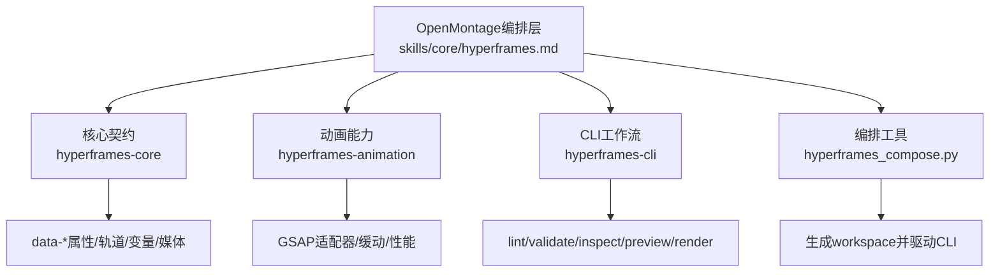
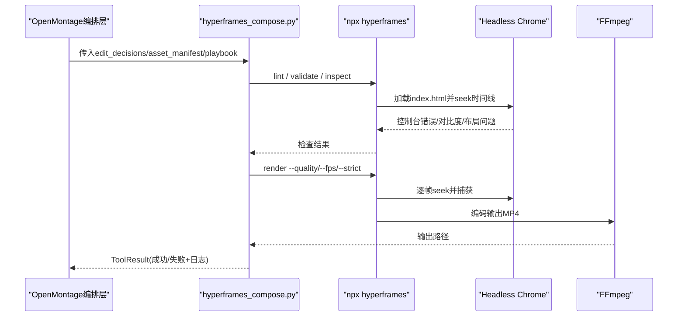
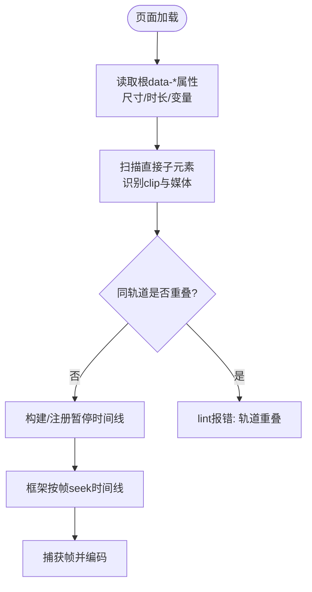
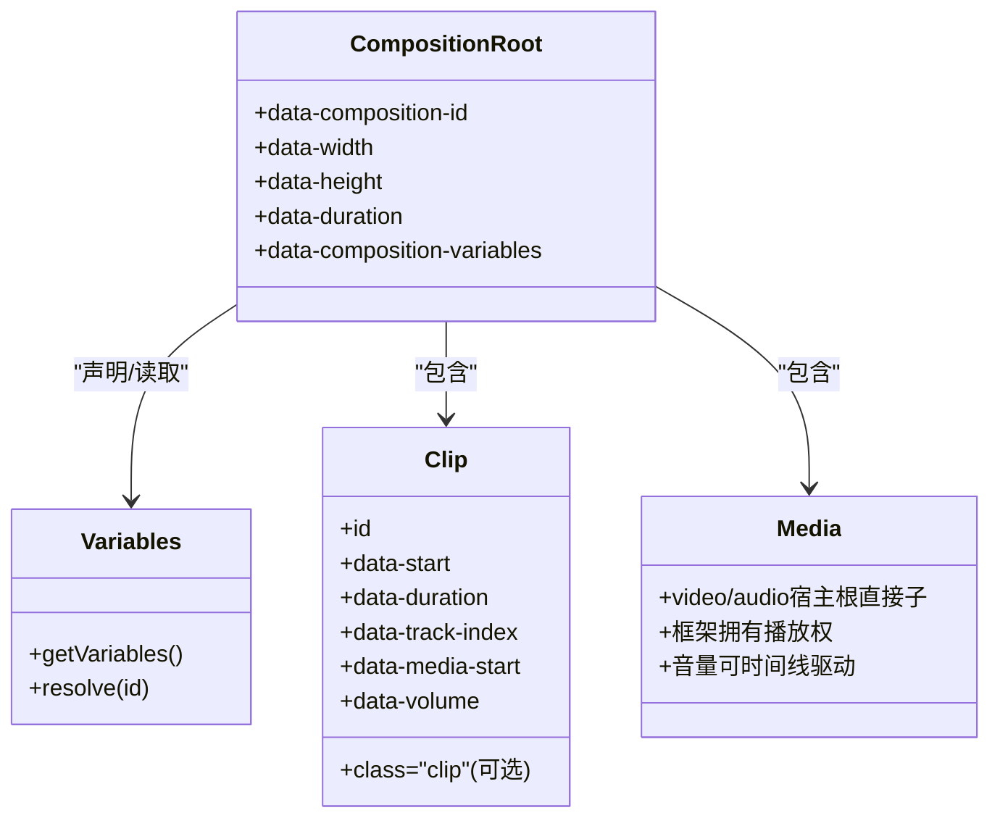
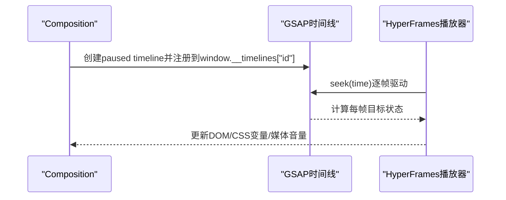
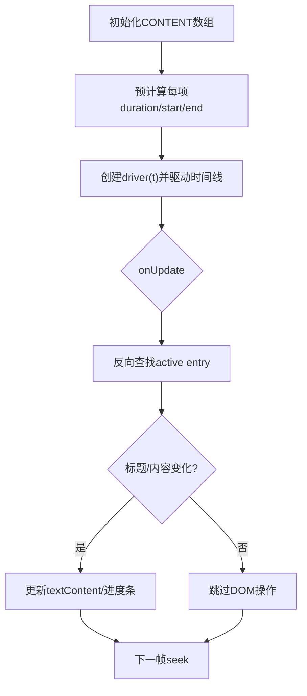
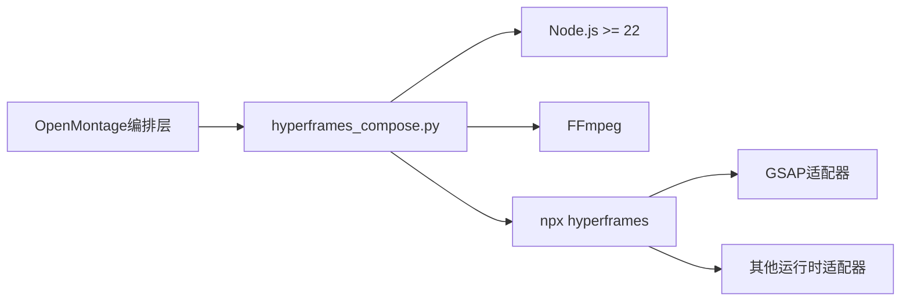

# HyperFrames动画引擎

<cite>
**本文引用的文件**
- [skills/core/hyperframes.md](file://skills/core/hyperframes.md)
- [.agents/skills/hyperframes/SKILL.md](file://.agents/skills/hyperframes/SKILL.md)
- [.agents/skills/hyperframes-core/SKILL.md](file://.agents/skills/hyperframes-core/SKILL.md)
- [.agents/skills/hyperframes-core/references/data-attributes.md](file://.agents/skills/hyperframes-core/references/data-attributes.md)
- [.agents/skills/hyperframes-core/references/variables-and-media.md](file://.agents/skills/hyperframes-core/references/variables-and-media.md)
- [.agents/skills/hyperframes-animation/SKILL.md](file://.agents/skills/hyperframes-animation/SKILL.md)
- [.agents/skills/hyperframes-animation/adapters/gsap.md](file://.agents/skills/hyperframes-animation/adapters/gsap.md)
- [.agents/skills/hyperframes-animation/adapters/gsap-timeline-and-labels.md](file://.agents/skills/hyperframes-animation/adapters/gsap-timeline-and-labels.md)
- [.agents/skills/hyperframes-animation/adapters/gsap-easing-and-stagger.md](file://.agents/skills/hyperframes-animation/adapters/gsap-easing-and-stagger.md)
- [.agents/skills/hyperframes-animation/adapters/gsap-transforms-and-perf.md](file://.agents/skills/hyperframes-animation/adapters/gsap-transforms-and-perf.md)
- [.agents/skills/hyperframes-animation/blueprints/dataviz-countup.md](file://.agents/skills/hyperframes-animation/blueprints/dataviz-countup.md)
- [.agents/skills/hyperframes-animation/rules/dynamic-content-sequencing.md](file://.agents/skills/hyperframes-animation/rules/dynamic-content-sequencing.md)
- [.agents/skills/hyperframes-cli/SKILL.md](file://.agents/skills/hyperframes-cli/SKILL.md)
- [tools/video/hyperframes_compose.py](file://tools/video/hyperframes_compose.py)
</cite>

## 目录
1. [简介](#简介)
2. [项目结构](#项目结构)
3. [核心组件](#核心组件)
4. [架构总览](#架构总览)
5. [详细组件分析](#详细组件分析)
6. [依赖关系分析](#依赖关系分析)
7. [性能考量](#性能考量)
8. [故障排除指南](#故障排除指南)
9. [结论](#结论)
10. [附录](#附录)

## 简介
HyperFrames是OpenMontage中的HTML/GSAP动画引擎，通过声明式的时间与媒体数据（data-*属性）组织画面，并以可寻址（seek-driven）的渲染模型驱动GSAP时间线，实现确定性、可复现的视频输出。其核心特性包括：
- 声明式动画语法：用HTML结构与data-*属性声明时长、轨道、起止时间、变量与媒体；无需手写播放控制。
- 时间轴控制：每个composition注册一个暂停的GSAP时间线，由框架统一seek驱动，保证预览与渲染一致。
- 媒体集成能力：视频/音频作为宿主根的直接子元素交由框架管理播放；支持字幕、旁白、音乐分层与音量淡入淡出。

本文件面向创作者与工程师，系统说明脚本格式规范、数据结构定义、变量系统使用，以及与GSAP集成的时间线管理、缓动函数与性能优化，并给出在视频制作中的应用场景、设计原则、调优技巧与排错方法。

## 项目结构
OpenMontage将HyperFrames相关能力拆分为多个“技能”文档与工具：
- 入口与路由：skills/core/hyperframes.md 提供选择HyperFrames或Remotion的决策矩阵与工作流指引。
- 核心契约：hyperframes-core 规定composition结构、data-*属性、轨道与子composition、变量与媒体规则、确定性渲染约束。
- 动画能力：hyperframes-animation 提供原子规则、蓝图、转场、技术方法与运行时适配器（默认GSAP）。
- CLI工作流：hyperframes-cli 提供init/lint/validate/inspect/preview/render等命令。
- 编排工具：tools/video/hyperframes_compose.py 负责生成workspace、调用CLI进行lint/validate/render。

图表来源
- [skills/core/hyperframes.md:29-69](file://skills/core/hyperframes.md#L29-L69)
- [.agents/skills/hyperframes-core/SKILL.md:31-49](file://.agents/skills/hyperframes-core/SKILL.md#L31-L49)
- [.agents/skills/hyperframes-animation/SKILL.md:12-46](file://.agents/skills/hyperframes-animation/SKILL.md#L12-L46)
- [.agents/skills/hyperframes-cli/SKILL.md:10-26](file://.agents/skills/hyperframes-cli/SKILL.md#L10-L26)
- [tools/video/hyperframes_compose.py:51-99](file://tools/video/hyperframes_compose.py#L51-L99)

章节来源
- [skills/core/hyperframes.md:29-69](file://skills/core/hyperframes.md#L29-L69)
- [.agents/skills/hyperframes-core/SKILL.md:31-49](file://.agents/skills/hyperframes-core/SKILL.md#L31-L49)
- [.agents/skills/hyperframes-animation/SKILL.md:12-46](file://.agents/skills/hyperframes-animation/SKILL.md#L12-L46)
- [.agents/skills/hyperframes-cli/SKILL.md:10-26](file://.agents/skills/hyperframes-cli/SKILL.md#L10-L26)
- [tools/video/hyperframes_compose.py:51-99](file://tools/video/hyperframes_compose.py#L51-L99)

## 核心组件
- 组合根与片段：composition根声明尺寸、时长、变量；clip声明起止时间与轨道，class="clip"用于可见性窗口。
- 轨道与时间：data-track-index划分层级；同一轨道不得重叠；visibility窗口包含两端点。
- 变量系统：在<html>上以data-composition-variables声明类型化参数；可在子composition实例覆盖；渲染时可通过CLI注入。
- 媒体管理：<video>/<audio>必须为宿主根的直接子元素；框架拥有播放权，禁止手动play/pause/seek。
- 动画运行时：默认GSAP，每个composition注册一个暂停时间线到window.__timelines["id"]，由框架seek驱动。

章节来源
- [.agents/skills/hyperframes-core/references/data-attributes.md:5-35](file://.agents/skills/hyperframes-core/references/data-attributes.md#L5-L35)
- [.agents/skills/hyperframes-core/references/variables-and-media.md:5-40](file://.agents/skills/hyperframes-core/references/variables-and-media.md#L5-L40)
- [.agents/skills/hyperframes-core/references/variables-and-media.md:46-88](file://.agents/skills/hyperframes-core/references/variables-and-media.md#L46-L88)
- [.agents/skills/hyperframes-core/SKILL.md:47-59](file://.agents/skills/hyperframes-core/SKILL.md#L47-L59)
- [.agents/skills/hyperframes-animation/adapters/gsap.md:10-32](file://.agents/skills/hyperframes-animation/adapters/gsap.md#L10-L32)

## 架构总览
HyperFrames渲染流程由OpenMontage编排层触发，工具层生成workspace并调用CLI完成静态检查、浏览器验证、截图审计与最终渲染。

图表来源
- [tools/video/hyperframes_compose.py:927-961](file://tools/video/hyperframes_compose.py#L927-L961)
- [.agents/skills/hyperframes-cli/SKILL.md:10-26](file://.agents/skills/hyperframes-cli/SKILL.md#L10-L26)
- [.agents/skills/hyperframes-core/SKILL.md:47-59](file://.agents/skills/hyperframes-core/SKILL.md#L47-L59)

章节来源
- [tools/video/hyperframes_compose.py:927-961](file://tools/video/hyperframes_compose.py#L927-L961)
- [.agents/skills/hyperframes-cli/SKILL.md:10-26](file://.agents/skills/hyperframes-cli/SKILL.md#L10-L26)
- [.agents/skills/hyperframes-core/SKILL.md:47-59](file://.agents/skills/hyperframes-core/SKILL.md#L47-L59)

## 详细组件分析

### 脚本格式与数据结构（data-*属性）
- composition根：data-composition-id、data-width、data-height、data-duration、data-fps、data-composition-variables。
- clip：id、data-start、data-duration、data-track-index、data-media-start、data-volume、data-has-audio；可见元素需class="clip"。
- 子composition宿主：data-composition-id、data-composition-src、data-width、data-height、data-variable-values。
- 可见性窗口：start ≤ t ≤ start + duration，包含两端点；最后一帧仍显示结束状态。

图表来源
- [.agents/skills/hyperframes-core/references/data-attributes.md:5-35](file://.agents/skills/hyperframes-core/references/data-attributes.md#L5-L35)
- [.agents/skills/hyperframes-core/references/data-attributes.md:37-48](file://.agents/skills/hyperframes-core/references/data-attributes.md#L37-L48)

章节来源
- [.agents/skills/hyperframes-core/references/data-attributes.md:5-35](file://.agents/skills/hyperframes-core/references/data-attributes.md#L5-L35)
- [.agents/skills/hyperframes-core/references/data-attributes.md:37-48](file://.agents/skills/hyperframes-core/references/data-attributes.md#L37-L48)

### 变量系统与媒体集成
- 变量：在<html>声明类型化变量（string/number/color/boolean/enum），读取一次并在初始化阶段应用；支持子composition实例覆盖与渲染时CLI注入。
- 媒体：<video>/<audio>必须位于宿主根的直接子级；框架拥有播放权；音频单独元素承载声音；音量可通过时间线关键帧淡入淡出。

图表来源
- [.agents/skills/hyperframes-core/references/variables-and-media.md:5-40](file://.agents/skills/hyperframes-core/references/variables-and-media.md#L5-L40)
- [.agents/skills/hyperframes-core/references/variables-and-media.md:46-88](file://.agents/skills/hyperframes-core/references/variables-and-media.md#L46-L88)

章节来源
- [.agents/skills/hyperframes-core/references/variables-and-media.md:5-40](file://.agents/skills/hyperframes-core/references/variables-and-media.md#L5-L40)
- [.agents/skills/hyperframes-core/references/variables-and-media.md:46-88](file://.agents/skills/hyperframes-core/references/variables-and-media.md#L46-L88)

### 与GSAP动画库的集成
- 时间线管理：每个composition创建并注册一个暂停的gsap.timeline到window.__timelines["id"]；渲染时长来自根data-duration而非时间线长度。
- 位置参数与标签：使用绝对秒数、相对偏移、标签与前后引用精确编排。
- 缓动与交错：内置缓动族（power/back/elastic/bounce/expo/sine/circ/steps）；stagger对象支持from/amount/grid/axis。
- 允许的属性：transform别名、opacity、颜色类、CSS变量、media volume、innerText计数；避免layout属性与display/visibility。

图表来源
- [.agents/skills/hyperframes-animation/adapters/gsap.md:10-32](file://.agents/skills/hyperframes-animation/adapters/gsap.md#L10-L32)
- [.agents/skills/hyperframes-animation/adapters/gsap-timeline-and-labels.md:22-56](file://.agents/skills/hyperframes-animation/adapters/gsap-timeline-and-labels.md#L22-L56)
- [.agents/skills/hyperframes-animation/adapters/gsap-easing-and-stagger.md:3-38](file://.agents/skills/hyperframes-animation/adapters/gsap-easing-and-stagger.md#L3-L38)

章节来源
- [.agents/skills/hyperframes-animation/adapters/gsap.md:10-32](file://.agents/skills/hyperframes-animation/adapters/gsap.md#L10-L32)
- [.agents/skills/hyperframes-animation/adapters/gsap-timeline-and-labels.md:22-56](file://.agents/skills/hyperframes-animation/adapters/gsap-timeline-and-labels.md#L22-L56)
- [.agents/skills/hyperframes-animation/adapters/gsap-easing-and-stagger.md:3-38](file://.agents/skills/hyperframes-animation/adapters/gsap-easing-and-stagger.md#L3-L38)

### 复杂逻辑示例：动态内容序列
动态内容序列根据文本长度自动计算每项持续时间，预计算绝对起止时间，onUpdate中反向查找当前项并仅切换必要DOM节点，避免每帧重绘。

图表来源
- [.agents/skills/hyperframes-animation/rules/dynamic-content-sequencing.md:12-18](file://.agents/skills/hyperframes-animation/rules/dynamic-content-sequencing.md#L12-L18)
- [.agents/skills/hyperframes-animation/rules/dynamic-content-sequencing.md:146-197](file://.agents/skills/hyperframes-animation/rules/dynamic-content-sequencing.md#L146-L197)

章节来源
- [.agents/skills/hyperframes-animation/rules/dynamic-content-sequencing.md:12-18](file://.agents/skills/hyperframes-animation/rules/dynamic-content-sequencing.md#L12-L18)
- [.agents/skills/hyperframes-animation/rules/dynamic-content-sequencing.md:146-197](file://.agents/skills/hyperframes-animation/rules/dynamic-content-sequencing.md#L146-L197)

### 应用场景：数据可视化与动态字幕
- 数据可视化：count-up数字、环形进度、趋势图绘制、卡片网格滚动与聚焦、相机推入/平移等，适合产品引入、问题量化、指标强调。
- 动态字幕：基于时间线与文本测量工具，确保字幕可见性与可读性；可使用注册组件快速套用样式。

章节来源
- [.agents/skills/hyperframes-animation/blueprints/dataviz-countup.md:1-24](file://.agents/skills/hyperframes-animation/blueprints/dataviz-countup.md#L1-L24)
- [.agents/skills/hyperframes-media/references/captions/motion.md:81-88](file://.agents/skills/hyperframes-media/references/captions/motion.md#L81-L88)

## 依赖关系分析
- OpenMontage编排层通过hyperframes_compose.py协调workspace生成与CLI调用。
- CLI依赖Node.js与FFmpeg；doctor检查环境可用性。
- 动画运行时默认GSAP，其他适配器（Anime.js/Lottie/Three.js/CSS/WAAPI/TypeGPU）可按需启用。

图表来源
- [tools/video/hyperframes_compose.py:51-79](file://tools/video/hyperframes_compose.py#L51-L79)
- [.agents/skills/hyperframes-cli/SKILL.md:6-8](file://.agents/skills/hyperframes-cli/SKILL.md#L6-L8)
- [.agents/skills/hyperframes-animation/SKILL.md:48-58](file://.agents/skills/hyperframes-animation/SKILL.md#L48-L58)

章节来源
- [tools/video/hyperframes_compose.py:51-79](file://tools/video/hyperframes_compose.py#L51-L79)
- [.agents/skills/hyperframes-cli/SKILL.md:6-8](file://.agents/skills/hyperframes-cli/SKILL.md#L6-L8)
- [.agents/skills/hyperframes-animation/SKILL.md:48-58](file://.agents/skills/hyperframes-animation/SKILL.md#L48-L58)

## 性能考量
- 优先使用transform与opacity：x/y/scale/rotation/opacity走合成器，避免width/height/top/left等布局属性。
- 合理使用will-change：仅在真正动画的元素上声明。
- 高频交互使用gsap.quickTo（仅限预览模式）。
- 视频密集场景使用--workers 1降低并发压力；确保素材关键帧间隔合理。
- 字体与渲染：使用编译器支持的字体；避免Space Grotesk等未映射字体导致回退。
- 背景视频陷阱：确认源分辨率与缩放策略，避免小视频黑边被正确渲染为letterbox。

章节来源
- [.agents/skills/hyperframes-animation/adapters/gsap-transforms-and-perf.md:58-96](file://.agents/skills/hyperframes-animation/adapters/gsap-transforms-and-perf.md#L58-L96)
- [skills/core/hyperframes.md:301-417](file://skills/core/hyperframes.md#L301-L417)

## 故障排除指南
- 静态检查：先运行lint，再validate，最后inspect；三者均通过后再preview与render。
- 常见错误：
  - 轨道重叠、缺少data-composition-id、未注册时间线。
  - 媒体不在宿主根直接子级导致黑屏/空白。
  - 子composition宿主ID与模板ID不一致导致时间线未挂载。
  - 背景视频source-resolution陷阱导致画面居中黑边。
- 调试手段：
  - snapshot抓取关键时间点帧进行目视检查。
  - preview在Studio中手动编辑与回放。
  - doctor检查环境与依赖。
  - 对字幕组在end时刻后检测可见性，避免残留。

章节来源
- [.agents/skills/hyperframes-cli/SKILL.md:10-26](file://.agents/skills/hyperframes-cli/SKILL.md#L10-L26)
- [.agents/skills/hyperframes-cli/SKILL.md:72-109](file://.agents/skills/hyperframes-cli/SKILL.md#L72-L109)
- [.agents/skills/hyperframes-core/references/variables-and-media.md:46-88](file://.agents/skills/hyperframes-core/references/variables-and-media.md#L46-L88)
- [skills/core/hyperframes.md:301-417](file://skills/core/hyperframes.md#L301-L417)

## 结论
HyperFrames以HTML为中心、GSAP为默认动画运行时，结合严格的data-*契约与确定性渲染模型，为OpenMontage提供了高性能、可维护、可复现的动画与视频合成能力。通过清晰的脚本格式、变量系统与媒体管理，配合完善的CLI工作流与性能优化建议，能够高效支撑动态字幕、数据可视化、交互式元素等多种视频制作场景。遵循本文档的设计原则与排错步骤，可显著降低迭代成本并提升产出质量。

## 附录
- 推荐工作流：init → author → lint → validate → inspect → preview → render（高质量交付）。
- 最佳实践：
  - 使用从属属性与transform别名；避免布局抖动。
  - 预计算布局常量，不在tween-time测量DOM。
  - 有限repeat；不使用Math.random/Date.now等破坏确定性的API。
  - 媒体音量通过时间线关键帧控制；保持data-volume为基线。
  - 背景视频采用cover裁剪与锐化，避免letterbox。

章节来源
- [.agents/skills/hyperframes-cli/SKILL.md:10-26](file://.agents/skills/hyperframes-cli/SKILL.md#L10-L26)
- [.agents/skills/hyperframes-animation/SKILL.md:60-68](file://.agents/skills/hyperframes-animation/SKILL.md#L60-L68)
- [.agents/skills/hyperframes-core/references/variables-and-media.md:46-88](file://.agents/skills/hyperframes-core/references/variables-and-media.md#L46-L88)
- [skills/core/hyperframes.md:301-417](file://skills/core/hyperframes.md#L301-L417)