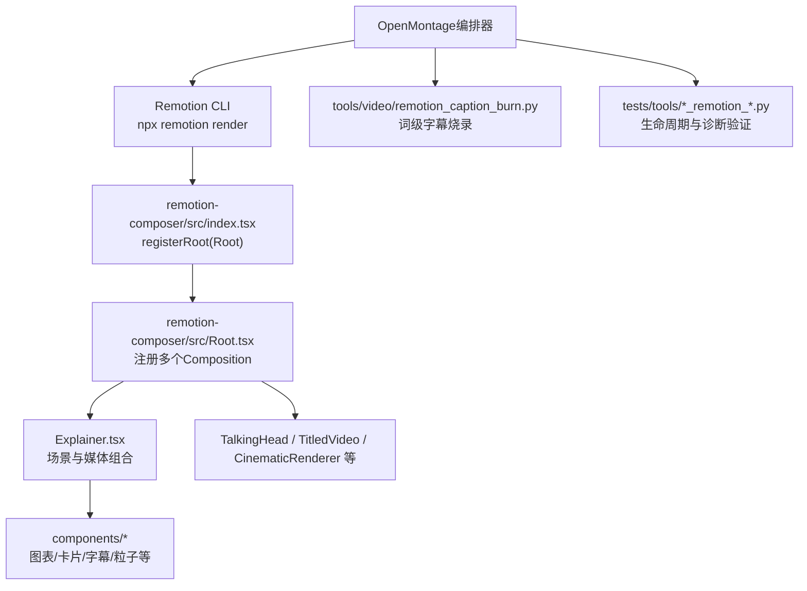
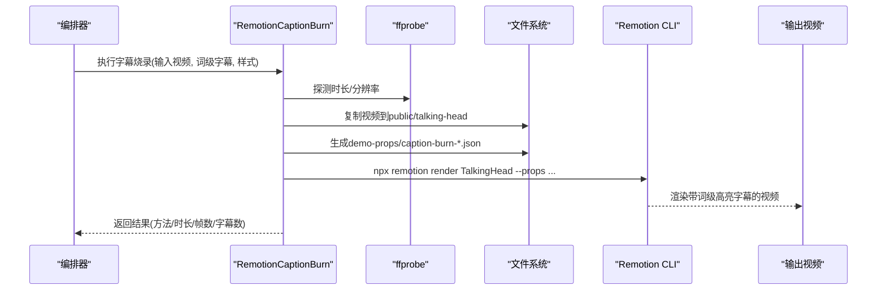
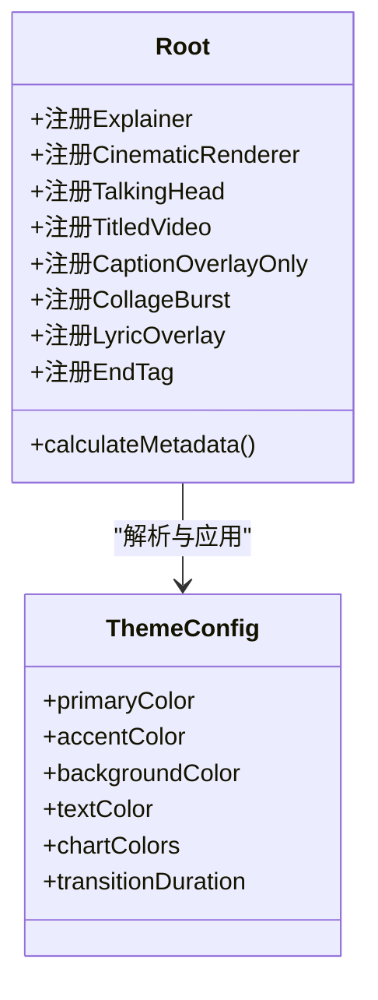
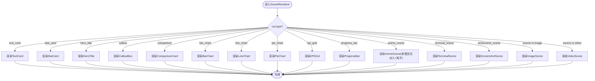
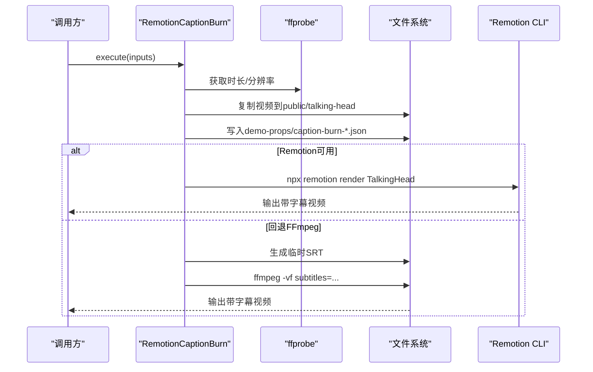
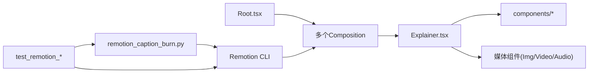

# Remotion渲染引擎

<cite>
**本文引用的文件**
- [skills/core/remotion.md](file://skills/core/remotion.md)
- [.agents/skills/remotion/SKILL.md](file://.agents/skills/remotion/SKILL.md)
- [.agents/skills/remotion/reference.md](file://.agents/skills/remotion/reference.md)
- [remotion-composer/src/Root.tsx](file://remotion-composer/src/Root.tsx)
- [remotion-composer/src/index.tsx](file://remotion-composer/src/index.tsx)
- [remotion-composer/src/Explainer.tsx](file://remotion-composer/src/Explainer.tsx)
- [tools/video/remotion_caption_burn.py](file://tools/video/remotion_caption_burn.py)
- [tests/tools/test_remotion_staging_lifecycle.py](file://tests/tools/test_remotion_staging_lifecycle.py)
- [tests/tools/test_remotion_diagnostics.py](file://tests/tools/test_remotion_diagnostics.py)
</cite>

## 目录
1. [简介](#简介)
2. [项目结构](#项目结构)
3. [核心组件](#核心组件)
4. [架构总览](#架构总览)
5. [详细组件分析](#详细组件分析)
6. [依赖关系分析](#依赖关系分析)
7. [性能考虑](#性能考虑)
8. [故障排查指南](#故障排查指南)
9. [结论](#结论)
10. [附录](#附录)

## 简介
本文件面向OpenMontage中基于Remotion的视频渲染能力，系统性说明Remotion作为React-based视频渲染框架在工程中的角色、组件架构、配置选项、与OpenMontage管道的集成方式、以及性能优化与调试实践。Remotion在本项目中承担“默认最终渲染引擎”的职责：统一处理视频片段、静态图片、动画场景、转场、字幕与音频叠加，实现数据驱动的批量渲染与高质量输出。

## 项目结构
OpenMontage中与Remotion相关的代码主要分布在以下位置：
- remotion-composer：Remotion工程源码，包含根注册、多Composition定义、场景与媒体组件、主题系统。
- skills/core/remotion.md：Remotion在OpenMontage中的使用策略、场景类型、管道映射、渲染调用约定与质量检查清单。
- .agents/skills/remotion/*：Remotion工具扩展、最佳实践与API参考。
- tools/video/remotion_caption_burn.py：将词级字幕以Remotion方式烧录到视频的专用工具（含FFmpeg回退）。
- tests/tools/*_remotion_*.py：针对Remotion渲染生命周期、诊断与并发安全的测试用例。

**图示来源**
- [remotion-composer/src/index.tsx:1-5](file://remotion-composer/src/index.tsx#L1-L5)
- [remotion-composer/src/Root.tsx:135-333](file://remotion-composer/src/Root.tsx#L135-L333)
- [remotion-composer/src/Explainer.tsx:1-800](file://remotion-composer/src/Explainer.tsx#L1-L800)
- [tools/video/remotion_caption_burn.py:52-489](file://tools/video/remotion_caption_burn.py#L52-L489)

**章节来源**
- [skills/core/remotion.md:1-377](file://skills/core/remotion.md#L1-L377)
- [remotion-composer/src/index.tsx:1-5](file://remotion-composer/src/index.tsx#L1-L5)
- [remotion-composer/src/Root.tsx:135-333](file://remotion-composer/src/Root.tsx#L135-L333)

## 核心组件
- 根注册与Composition注册
  - index.tsx通过registerRoot挂载Root，使Remotion自动发现并注册所有Composition。
  - Root.tsx集中声明多个Composition（如Explainer、CinematicRenderer、TalkingHead、TitledVideo、CaptionOverlayOnly、CollageBurst、LyricOverlay、EndTag等），并提供calculateMetadata动态计算时长与尺寸。
- 主题系统
  - Root.tsx定义了ThemeConfig与多套主题（clean-professional、flat-motion-graphics、minimalist-diagram、anime-ghibli），并通过resolveTheme从props或playbook解析主题，驱动颜色、字体、动效曲线与过渡时长。
- 场景与媒体组合
  - Explainer.tsx实现强大的场景调度：文本卡、统计卡、对比卡、图表（柱状/折线/饼/KPI网格）、进度条、终端/截图场景、动漫风格多图交叉淡入、背景图/视频层、字幕覆盖等。
  - 支持多种cut.type与丰富的props，便于数据驱动生成视频。
- 字幕与音频
  - CaptionOverlay用于词级高亮字幕；Audio组件用于旁白、音乐、音效的叠加与淡入淡出控制。
- 专用工具
  - remotion_caption_burn.py将词级转录结果转换为WordCaption JSON，写入props后调用Remotion渲染TalkingHead Composition，若不可用则回退至FFmpeg字幕烧录。

**章节来源**
- [remotion-composer/src/index.tsx:1-5](file://remotion-composer/src/index.tsx#L1-L5)
- [remotion-composer/src/Root.tsx:24-121](file://remotion-composer/src/Root.tsx#L24-L121)
- [remotion-composer/src/Root.tsx:135-333](file://remotion-composer/src/Root.tsx#L135-L333)
- [remotion-composer/src/Explainer.tsx:186-775](file://remotion-composer/src/Explainer.tsx#L186-L775)
- [tools/video/remotion_caption_burn.py:52-489](file://tools/video/remotion_caption_burn.py#L52-L489)

## 架构总览
Remotion在OpenMontage中的职责是“默认最终渲染引擎”，负责将编辑决策（cuts、overlays、captions、audio）与素材（images/videos）组合为最终视频。Python侧通过CLI调用Remotion，或使用专用工具进行字幕烧录。

**图示来源**
- [tools/video/remotion_caption_burn.py:267-356](file://tools/video/remotion_caption_burn.py#L267-L356)
- [tools/video/remotion_caption_burn.py:443-489](file://tools/video/remotion_caption_burn.py#L443-L489)

**章节来源**
- [skills/core/remotion.md:16-44](file://skills/core/remotion.md#L16-L44)
- [tools/video/remotion_caption_burn.py:52-489](file://tools/video/remotion_caption_burn.py#L52-L489)

## 详细组件分析

### Root组件与Composition注册
- 作用：集中注册所有Composition，提供默认props与动态元数据计算。
- 关键点：
  - 通过calculateMetadata根据cuts或scenes计算durationInFrames，避免固定时长导致内容被截断。
  - 提供多套主题与解析逻辑，确保不同风格一致输出。
  - 暴露TalkingHead、TitledVideo、CinematicRenderer等Composition供不同场景使用。

**图示来源**
- [remotion-composer/src/Root.tsx:24-121](file://remotion-composer/src/Root.tsx#L24-L121)
- [remotion-composer/src/Root.tsx:135-333](file://remotion-composer/src/Root.tsx#L135-L333)

**章节来源**
- [remotion-composer/src/Root.tsx:135-333](file://remotion-composer/src/Root.tsx#L135-L333)

### Explainer场景与媒体处理
- 场景类型：text_card、stat_card、hero_title、callout、comparison、bar_chart、line_chart、pie_chart、kpi_grid、progress_bar、anime_scene、terminal_scene、screenshot_scene等。
- 媒体处理：
  - 背景层：BackgroundImageLayer与BackgroundVideoLayer提供可配置的暗色遮罩与Ken Burns效果。
  - 图像与视频：ImageScene与VideoScene支持淡入淡出、缩放平移、过渡控制。
  - 字幕：CaptionOverlay支持词级高亮。
  - 音频：Audio组件支持旁白、音乐、音效叠加与淡入淡出。
- 关键约束：
  - 使用useCurrentFrame与interpolate做帧级动画，避免CSS动画。
  - useVideoConfig().durationInFrames返回的是Composition时长而非Sequence时长，需通过父级传入sceneDurationSeconds计算有效时长。

**图示来源**
- [remotion-composer/src/Explainer.tsx:558-775](file://remotion-composer/src/Explainer.tsx#L558-L775)

**章节来源**
- [remotion-composer/src/Explainer.tsx:186-775](file://remotion-composer/src/Explainer.tsx#L186-L775)

### 字幕烧录工具（Remotion与FFmpeg回退）
- 功能：将词级转录结果转为WordCaption JSON，生成props并调用TalkingHead Composition渲染；若Remotion不可用，则使用FFmpeg subtitles滤镜烧录SRT。
- 流程：
  - 探测输入视频时长与分辨率（ffprobe）。
  - 复制视频到public/talking-head，生成demo-props/caption-burn-*.json。
  - 调用npx remotion render TalkingHead，指定宽度、高度、帧范围与编码参数。
  - 失败时回退FFmpeg，生成临时SRT并烧录到底部。

**图示来源**
- [tools/video/remotion_caption_burn.py:267-356](file://tools/video/remotion_caption_burn.py#L267-L356)
- [tools/video/remotion_caption_burn.py:362-429](file://tools/video/remotion_caption_burn.py#L362-L429)
- [tools/video/remotion_caption_burn.py:443-489](file://tools/video/remotion_caption_burn.py#L443-L489)

**章节来源**
- [tools/video/remotion_caption_burn.py:52-489](file://tools/video/remotion_caption_burn.py#L52-L489)

### 管道集成与参数传递
- 场景计划到Composition映射：
  - scene_plan.json → scenes[] → <TransitionSeries>子节点。
  - scene.type → 组件选择器（如talking_head→Video，diagram→DiagramOverlay）。
  - start_seconds/end_seconds → from/durationInFrames转换。
  - transition_in/transition_out → TransitionSeries.Transition。
  - asset_manifest.json → assets prop → staticFile或绝对路径。
  - style_playbook → theme prop → 颜色、字体、动画曲线。
  - edit_decisions.json → cuts prop → Series中裁剪后的Video片段。
  - media_profile → Composition宽高与fps。
- 渲染调用：
  - 标准渲染：npx remotion render Explainer --props=... --output=... --codec=h264 --crf=18。
  - 指定媒体配置：--width/--height/--fps。
  - Python侧通过subprocess调用video_compose.py（backend="remotion"）。

**章节来源**
- [skills/core/remotion.md:168-213](file://skills/core/remotion.md#L168-L213)
- [skills/core/remotion.md:181-201](file://skills/core/remotion.md#L181-L201)

### 配置选项
- 帧率设置：默认30fps；可通过media profile映射到Composition fps。
- 分辨率配置：根据平台目标（YouTube横屏/竖屏、TikTok、Instagram Reels、正方形、电影宽屏）映射到width/height。
- 音频处理：
  - 旁白、音乐、音效并行< Audio >叠加。
  - 支持offsetSeconds、loop、fadeInSeconds/fadeOutSeconds。
- 转场效果：
  - TransitionSeries.Transition配合自定义转场（glitch、lightLeak、clockWipe、pixelate、checkerboard等）。
  - 推荐时长：快速切15-20帧、标准30-45帧、戏剧性50-60帧。

**章节来源**
- [skills/core/remotion.md:282-302](file://skills/core/remotion.md#L282-L302)
- [.agents/skills/remotion/SKILL.md:31-107](file://.agents/skills/remotion/SKILL.md#L31-L107)
- [skills/core/remotion.md:203-213](file://skills/core/remotion.md#L203-L213)

## 依赖关系分析
- 组件耦合与内聚：
  - Root.tsx聚合多个Composition，降低分散注册成本；Explainer.tsx内聚场景调度与媒体处理逻辑。
  - 主题系统解耦视觉风格，通过props注入，提升复用性。
- 直接依赖：
  - Remotion API（Composition、Sequence、Series、Audio、OffthreadVideo、interpolate、spring、useVideoConfig等）。
  - FFmpeg/ffprobe用于探测与回退。
- 间接依赖：
  - 样式与字体（Google Fonts、Tailwind静态类）。
  - 工具链（npx、Node.js 18+）。
- 外部集成点：
  - OpenMontage编排器通过CLI与工具调用Remotion。
  - 测试用例保障公共目录隔离与诊断信息透传。

**图示来源**
- [remotion-composer/src/Root.tsx:135-333](file://remotion-composer/src/Root.tsx#L135-L333)
- [remotion-composer/src/Explainer.tsx:1-800](file://remotion-composer/src/Explainer.tsx#L1-L800)
- [tools/video/remotion_caption_burn.py:52-489](file://tools/video/remotion_caption_burn.py#L52-L489)
- [tests/tools/test_remotion_staging_lifecycle.py:69-128](file://tests/tools/test_remotion_staging_lifecycle.py#L69-L128)
- [tests/tools/test_remotion_diagnostics.py:28-129](file://tests/tools/test_remotion_diagnostics.py#L28-L129)

**章节来源**
- [tests/tools/test_remotion_staging_lifecycle.py:69-128](file://tests/tools/test_remotion_staging_lifecycle.py#L69-L128)
- [tests/tools/test_remotion_diagnostics.py:28-129](file://tests/tools/test_remotion_diagnostics.py#L28-L129)

## 性能考虑
- 渲染性能
  - 优先使用OffthreadVideo以获得更好性能。
  - 避免CSS动画与Tailwind动画类，使用useCurrentFrame与interpolate做帧级动画。
  - 插值务必clamp边界，防止数值溢出。
  - 渲染串行化：除非内存充足，否则不要并行渲染（每个渲染启动Chromium实例）。
- 资源管理
  - 使用staticFile引用public下资源；必要时prefetch并waitUntilDone。
  - 公共目录隔离：每次渲染使用唯一临时目录，避免并发冲突与残留。
- 超时与诊断
  - 支持--timeout参数透传，便于长耗时渲染；失败时保留Remotion stderr以便定位问题。
- 质量保障
  - 预渲染校验：composition_validator检测缺失资产、音频时长不匹配、无效时间戳等。
  - 后渲染验证：ffprobe确认音视频流存在、时长合理；抽取审查帧；转录音频核对字幕完整性。

**章节来源**
- [.agents/skills/remotion/SKILL.md:117-127](file://.agents/skills/remotion/SKILL.md#L117-L127)
- [skills/core/remotion.md:324-332](file://skills/core/remotion.md#L324-L332)
- [skills/core/remotion.md:333-377](file://skills/core/remotion.md#L333-L377)
- [tests/tools/test_remotion_diagnostics.py:28-129](file://tests/tools/test_remotion_diagnostics.py#L28-L129)

## 故障排查指南
- 常见问题
  - 无音频流：检查是否将narration/music传入Remotion audio props；使用ffprobe确认输出包含音频流。
  - 字幕未显示：确认WordCaption时间轴正确；若Remotion不可用，回退FFmpeg会丢失词级高亮。
  - 渲染超时：调整remotion_timeout_ms并增大subprocess timeout；查看stderr定位具体错误。
  - 公共目录冲突：确保每次渲染使用唯一--public-dir；清理完成后不应删除非自身创建的目录。
- 诊断步骤
  - 使用ffprobe检查输出文件的视频/音频流、分辨率、FPS、时长。
  - 抽取各场景中位帧进行视觉审查。
  - 转录输出音频并与脚本比对，确保完整。
  - 查看Remotion stderr尾部信息，定位实际原因。

**章节来源**
- [skills/core/remotion.md:333-377](file://skills/core/remotion.md#L333-L377)
- [tests/tools/test_remotion_diagnostics.py:28-129](file://tests/tools/test_remotion_diagnostics.py#L28-L129)
- [tests/tools/test_remotion_staging_lifecycle.py:69-128](file://tests/tools/test_remotion_staging_lifecycle.py#L69-L128)

## 结论
Remotion在OpenMontage中作为默认最终渲染引擎，提供了强大的组件化、数据驱动与生态集成能力。通过Root集中注册Composition、Explainer统一场景调度、主题系统驱动视觉风格、以及专用的字幕烧录工具，实现了从编辑决策到高质量输出的完整链路。结合严格的预/后渲染校验、性能优化与诊断机制，确保了稳定高效的视频生产流程。

## 附录
- 常用命令参考
  - 标准渲染：npx remotion render Explainer --props=public/demo-props/my-video.json --output=output/final.mp4 --codec=h264 --crf=18
  - 指定媒体配置：npx remotion render Explainer --width=1080 --height=1920 --fps=30 --props=... --output=output.mp4
- 推荐实践
  - 帧级动画与插值clamp。
  - 使用calculateMetadata动态计算时长。
  - 使用TransitionSeries与自定义转场增强叙事节奏。
  - 严格遵循质量检查清单，确保音视频同步与字幕完整。

**章节来源**
- [skills/core/remotion.md:181-213](file://skills/core/remotion.md#L181-L213)
- [skills/core/remotion.md:363-377](file://skills/core/remotion.md#L363-L377)