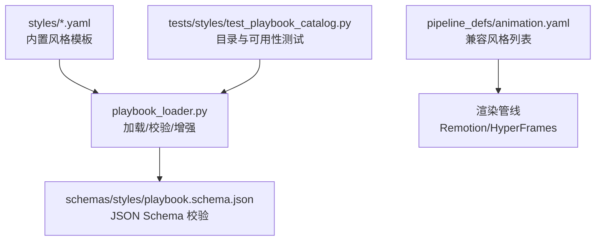
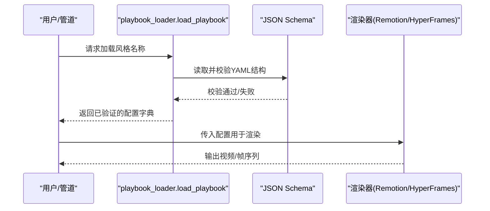
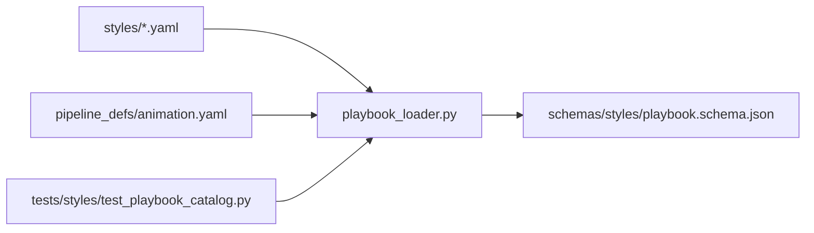

# 内置风格模板

<cite>
**本文引用的文件**
- [anime-ghibli.yaml](file://styles/anime-ghibli.yaml)
- [clean-professional.yaml](file://styles/clean-professional.yaml)
- [flat-motion-graphics.yaml](file://styles/flat-motion-graphics.yaml)
- [minimalist-diagram.yaml](file://styles/minimalist-diagram.yaml)
- [premium-minimalist.yaml](file://styles/premium-minimalist.yaml)
- [playbook_loader.py](file://styles/playbook_loader.py)
- [test_playbook_catalog.py](file://tests/styles/test_playbook_catalog.py)
- [animation.yaml](file://pipeline_defs/animation.yaml)
</cite>

## 目录
1. [简介](#简介)
2. [项目结构](#项目结构)
3. [核心组件](#核心组件)
4. [架构总览](#架构总览)
5. [详细组件分析](#详细组件分析)
6. [依赖关系分析](#依赖关系分析)
7. [性能与可访问性](#性能与可访问性)
8. [故障排查指南](#故障排查指南)
9. [结论](#结论)
10. [附录：YAML配置字段参考](#附录yaml配置字段参考)

## 简介
本文件为 OpenMontage 的内置风格模板提供系统化文档，覆盖五种预设风格的配置项、颜色主题、字体方案、布局参数、运动节奏、音频策略、资产生成提示词、叠加层样式以及质量规则。同时说明各风格的适用场景与自定义建议，帮助用户快速选择并理解其技术实现细节。

## 项目结构
OpenMontage 将“风格”以 YAML 形式定义在 styles 目录下，并通过 playbook_loader 加载、校验与增强（色彩对比度、色盲安全、排版层级等）。管道定义中声明兼容的风格集合，测试用例确保所有列出的风格均可被正确加载与验证。

图表来源
- [playbook_loader.py:37-84](file://styles/playbook_loader.py#L37-L84)
- [animation.yaml:53-60](file://pipeline_defs/animation.yaml#L53-L60)
- [test_playbook_catalog.py:20-40](file://tests/styles/test_playbook_catalog.py#L20-L40)

章节来源
- [playbook_loader.py:37-84](file://styles/playbook_loader.py#L37-L84)
- [animation.yaml:53-60](file://pipeline_defs/animation.yaml#L53-L60)
- [test_playbook_catalog.py:20-40](file://tests/styles/test_playbook_catalog.py#L20-L40)

## 核心组件
- 风格清单：五种内置风格 YAML，分别定义身份、视觉语言、排版、运动、音频、资产生成、叠加层、图表调色板与颜色规则。
- 加载器与校验：统一加载、按 JSON Schema 校验，并提供对比度、色盲安全、排版层级等设计智能。
- 管道集成：动画管道声明推荐/兼容风格；测试保证目录中的风格可被列出与加载。

章节来源
- [anime-ghibli.yaml:1-123](file://styles/anime-ghibli.yaml#L1-L123)
- [clean-professional.yaml:1-105](file://styles/clean-professional.yaml#L1-L105)
- [flat-motion-graphics.yaml:1-105](file://styles/flat-motion-graphics.yaml#L1-L105)
- [minimalist-diagram.yaml:1-104](file://styles/minimalist-diagram.yaml#L1-L104)
- [premium-minimalist.yaml:1-118](file://styles/premium-minimalist.yaml#L1-L118)
- [playbook_loader.py:37-84](file://styles/playbook_loader.py#L37-L84)
- [animation.yaml:53-60](file://pipeline_defs/animation.yaml#L53-L60)

## 架构总览
风格模板通过 YAML 描述视觉与行为，加载器负责解析与校验，并在渲染阶段驱动 Remotion/HyperFrames 等运行时进行画面合成与动效。

图表来源
- [playbook_loader.py:37-70](file://styles/playbook_loader.py#L37-L70)
- [animation.yaml:53-60](file://pipeline_defs/animation.yaml#L53-L60)

## 详细组件分析

### 动漫吉卜力风格（Anime Ghibli）
- 适用场景：叙事动画、自然主题故事、情感表达、奇幻视觉、带有惊奇感的教育内容。
- 视觉语言：深森林绿为主色，暖金/樱花粉/精灵光点缀；深色夜空背景；构图居中或三分法，留白充足，层次分明；质感为水彩边缘、笔触与有机形状。
- 字体方案：标题使用衬线体（如 Noto Serif JP），正文无衬线（Noto Sans），代码等宽（Fira Code）；统计卡片放大倍数较大，强调数据呈现。
- 运动与节奏：转场柔和（交叉淡入淡出、漂移、溶解），缓入缓出，无过冲；每场景停留较长，文本/统计卡片停留时间适中。
- 音频策略：温暖轻柔旁白，环境钢琴/弦乐与自然音，轻微音效，音乐音量较低。
- 资产生成：图像提示词强调手绘水彩、柔光、自然生态；一致性锚点包括主色调、水彩边缘、分层深度、柔光、魔法元素辉光、自然元素常驻；每场景多图交叉淡入模拟动态。
- 叠加层：半透明深色背景卡片、浅青边框、圆角与柔和阴影；关键词与章节标题采用高亮配色。
- 图表调色板：柔和且具辨识度的多色系，适配数据可视化。
- 质量规则：对比度达标、限制单场景图片数、每场景至少一个动效、固定镜头停留、跨图淡入时长控制、暗角增强电影感、色彩一致、文字不烧录到图像中。

最佳使用与自定义建议
- 适合长镜头叙事与情绪铺陈；如需更明亮氛围，可提高背景明度或替换为浅米色背景，但需保持主色与点缀色的和谐。
- 若面向移动端竖屏，适当增大正文行高与字号，确保可读性。

章节来源
- [anime-ghibli.yaml:1-123](file://styles/anime-ghibli.yaml#L1-L123)

### 专业简洁风格（Clean Professional）
- 适用场景：企业解释视频、教育内容、SaaS演示、会议演讲。
- 视觉语言：蓝为主色，辅以橙/绿点缀；纯白背景；居中构图与大量留白；扁平化无噪点。
- 字体方案：Inter 作为标题与正文，JetBrains Mono 用于代码；统计卡片放大明显。
- 运动与节奏：淡入淡出、滑动等干净转场；缓入缓出无弹跳；场景停留适中，过渡时间短促。
- 音频策略：专业清晰旁白，轻快但不干扰的企业背景音乐，轻微点击/呼啸音效。
- 资产生成：扁平插画、白底、一致的光照与蓝白灰配色；图表线条圆润、带轻微阴影。
- 叠加层：浅色卡片、蓝色边框、圆角与微阴影；代码块深色背景配高亮。
- 图表调色板：蓝/橙/绿/紫/红/青等，满足业务图表需求。
- 质量规则：对比度达标、屏幕颜色数量受限、720p可读、统一蓝白灰、建立镜头最小停留、避免快速剪辑。

最佳使用与自定义建议
- 适合信息密度较高的企业内容；如需品牌化，可将主色替换为企业标准色，并保持对比度与色盲安全。
- 在移动端优先保证正文大小与行距，必要时提高 stat_card 的 size_multiplier。

章节来源
- [clean-professional.yaml:1-105](file://styles/clean-professional.yaml#L1-L105)

### 扁平化动态图形（Flat Motion Graphics）
- 适用场景：社交媒体解释视频、TikTok/Reels、产品发布、创业路演。
- 视觉语言：紫色系主色，粉红/青色点缀；深色背景；边缘到边缘构图，大胆框定，偏置构图增加动感；几何色块与形状。
- 字体方案：Space Grotesk 作为标题与正文，Fira Code 用于代码；stat_card 放大显著。
- 运动与节奏：擦除、缩放、形变、硬切；弹簧动画、弹性与过冲；短停留、快节奏，新视觉元素频繁出现。
- 音频策略：活力对话式旁白，电子/Lo-fi节拍，关键节点加入打击/呼啸/故障音效。
- 资产生成：扁平矢量、几何形状、霓虹描边、暗背景；一致性锚点强调主色与暗背景。
- 叠加层：深色卡片、紫色边框、发光阴影；代码块高亮用粉色。
- 图表调色板：高饱和多色，适配强对比与动态展示。
- 质量规则：对比度达标、颜色数量限制、移动端可读、每场景至少一个动效、节奏紧凑、每次重大转场加音效。

最佳使用与自定义建议
- 适合短视频平台与年轻化受众；如需降低刺激感，可降低饱和度或延长停留时间。
- 注意在低亮度设备上保证对比度，必要时调整背景明度或文本颜色。

章节来源
- [flat-motion-graphics.yaml:1-105](file://styles/flat-motion-graphics.yaml#L1-L105)

### 极简图表风格（Minimalist Diagram）
- 适用场景：技术深挖、架构解释、数学/计算机科学概念、文档类视频。
- 视觉语言：深色系主色与红色点缀；浅灰背景；居中留白、白板感、网格对齐；纸张质感可选手绘线条。
- 字体方案：IBM Plex Sans 系列，代码使用 IBM Plex Mono；stat_card 适度放大。
- 运动与节奏：淡入淡出；缓出、克制、无弹跳；逐步揭示图表，每个步骤停留足够。
- 音频策略：沉稳、有节制的旁白，极简环境音，极低的音乐音量；细笔触与连接提示音。
- 资产生成：极简技术图、细线、浅色背景、蓝图风格；一致性锚点强调单一强调色与一致线宽。
- 叠加层：白色卡片、细边框、无阴影；代码块深色背景配强调色高亮。
- 图表调色板：少色、高对比，便于小屏阅读。
- 质量规则：更高对比度要求、最多两种颜色、480p可读、渐进揭示、每步停留、概念拆分、留白占比高。

最佳使用与自定义建议
- 适合复杂概念分步讲解；如需强调重点，可增加强调色使用频次但保持整体克制。
- 在高分辨率大屏上可适当增加线宽与节点尺寸以提升清晰度。

章节来源
- [minimalist-diagram.yaml:1-104](file://styles/minimalist-diagram.yaml#L1-L104)

### 高级极简风格（Premium Minimalist）
- 适用场景：投资者更新、专家解释、产品叙事、高信任度发布视频。
- 品味画像：冷静权威、高信任、低装饰；信息密度适中；版式交替编辑分割、居中证据帧、全出血产品细节；严格对齐与大留白。
- 视觉语言：炭灰主色，钴蓝/青绿点缀；近白背景；扁平哑光区域、细分隔线、仅在必要时添加摄影颗粒。
- 字体方案：Inter 标题与正文，JetBrains Mono 代码；stat_card 放大明显。
- 运动与节奏：克制缓出、精准揭示、无弹跳；转场柔和；停留与过渡时间平衡。
- 音频策略：沉稳专家旁白，极简脉冲合成垫，轻微触感音效。
- 资产生成：高端极简编辑帧、克制调色、精确构图、大留白；一致性锚点强调近白背景、炭灰排版、仅用强调色做层级或证明点。
- 叠加层：白色卡片、浅灰边框、微阴影；代码块深色背景配浅蓝高亮。
- 图表调色板：少色、高可信度配色。
- 质量规则：对比度达标、最多两个强调色、每帧单一焦点、运动服务于层级、避免装饰渐变与过大浮动形状。

最佳使用与自定义建议
- 适合需要建立信任与专业感的内容；如需品牌化，可将强调色替换为品牌主色，但保持克制与留白。
- 在移动端注意正文行高与字重，避免过小导致阅读疲劳。

章节来源
- [premium-minimalist.yaml:1-118](file://styles/premium-minimalist.yaml#L1-L118)

## 依赖关系分析
- 风格 YAML 是输入，playbook_loader 负责加载与校验，并通过 JSON Schema 保证结构正确。
- 动画管道声明兼容风格，确保所选风格与流水线能力匹配。
- 测试用例遍历目录中的所有风格，确保它们能被列出、加载并通过初始化流程。

图表来源
- [playbook_loader.py:37-84](file://styles/playbook_loader.py#L37-L84)
- [animation.yaml:53-60](file://pipeline_defs/animation.yaml#L53-L60)
- [test_playbook_catalog.py:20-40](file://tests/styles/test_playbook_catalog.py#L20-L40)

章节来源
- [playbook_loader.py:37-84](file://styles/playbook_loader.py#L37-L84)
- [animation.yaml:53-60](file://pipeline_defs/animation.yaml#L53-L60)
- [test_playbook_catalog.py:20-40](file://tests/styles/test_playbook_catalog.py#L20-L40)

## 性能与可访问性
- 对比度与色盲安全：加载器会计算 WCAG 对比度并检查色盲混淆对，确保文本可读性与包容性。
- 排版层级：支持模块化字号比例系统，自动校验标题/正文/副标题/说明的层级差异。
- 最小字号：针对视频内容设定正文最小字号，避免移动端不可读。
- 图表与叠加层：对叠加层的背景与文本组合进行对比度校验，保障可读性。

章节来源
- [playbook_loader.py:210-396](file://styles/playbook_loader.py#L210-L396)
- [playbook_loader.py:435-565](file://styles/playbook_loader.py#L435-L565)
- [playbook_loader.py:739-800](file://styles/playbook_loader.py#L739-L800)

## 故障排查指南
- 无法找到风格：确认风格名称是否存在于 styles 目录或 custom 子目录，并确保文件名不含扩展名。
- 校验失败：检查 YAML 结构是否符合 JSON Schema；关注 overlays 字段是否包含渲染器所需的类型。
- 对比度不达标：调整文本与背景颜色，或使用加载器的对比度工具评估并修正。
- 色盲安全警告：避免相近色相与相近明度的颜色组合，必要时引入纹理或图标区分。
- 管道不兼容：确认所选风格在 pipeline_defs 的 compatible_playbooks 列表中。

章节来源
- [playbook_loader.py:37-70](file://styles/playbook_loader.py#L37-L70)
- [test_playbook_catalog.py:61-81](file://tests/styles/test_playbook_catalog.py#L61-L81)

## 结论
OpenMontage 的内置风格模板以结构化 YAML 定义视觉与行为，配合加载器的设计与可访问性校验，确保在不同场景下获得一致的视觉品质与良好的用户体验。根据内容目标选择合适的风格，并按建议进行微调，即可快速产出高质量的视频内容。

## 附录：YAML配置字段参考
以下为各风格共用的主要字段及其作用说明（具体取值请参考对应风格文件）：
- identity：风格名称、类别、情绪、节奏、适用场景。
- visual_language.color_palette：主色、点缀色、背景、文本、弱化色。
- visual_language.composition/texture：构图原则与材质质感。
- typography：标题、正文、代码、统计卡片的字体、字重、行高、字号比例系统与权重矩阵。
- motion：转场类型、动画风格、节奏规则（场景停留、卡片停留、过渡时长）、进入/退出动效。
- audio：旁白风格、音乐情绪与音量、音效风格、音频避让阈值。
- asset_generation：图像提示词前缀/负向提示、图表风格、一致性锚点、每场景图片数量与变化指导。
- overlays：统计卡片、关键词、章节标题、代码块的背景、边框、圆角、阴影等样式。
- chart_palette：图表专用调色板。
- color_rules：色彩和谐类型、对比度校验开关、色盲安全开关。

章节来源
- [anime-ghibli.yaml:1-123](file://styles/anime-ghibli.yaml#L1-L123)
- [clean-professional.yaml:1-105](file://styles/clean-professional.yaml#L1-L105)
- [flat-motion-graphics.yaml:1-105](file://styles/flat-motion-graphics.yaml#L1-L105)
- [minimalist-diagram.yaml:1-104](file://styles/minimalist-diagram.yaml#L1-L104)
- [premium-minimalist.yaml:1-118](file://styles/premium-minimalist.yaml#L1-L118)