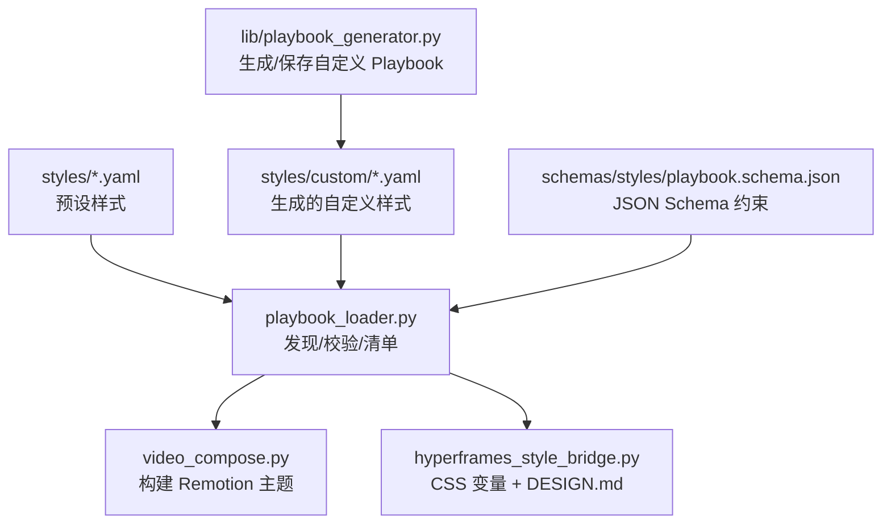
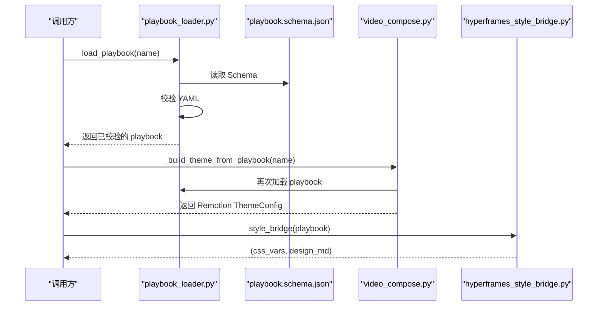
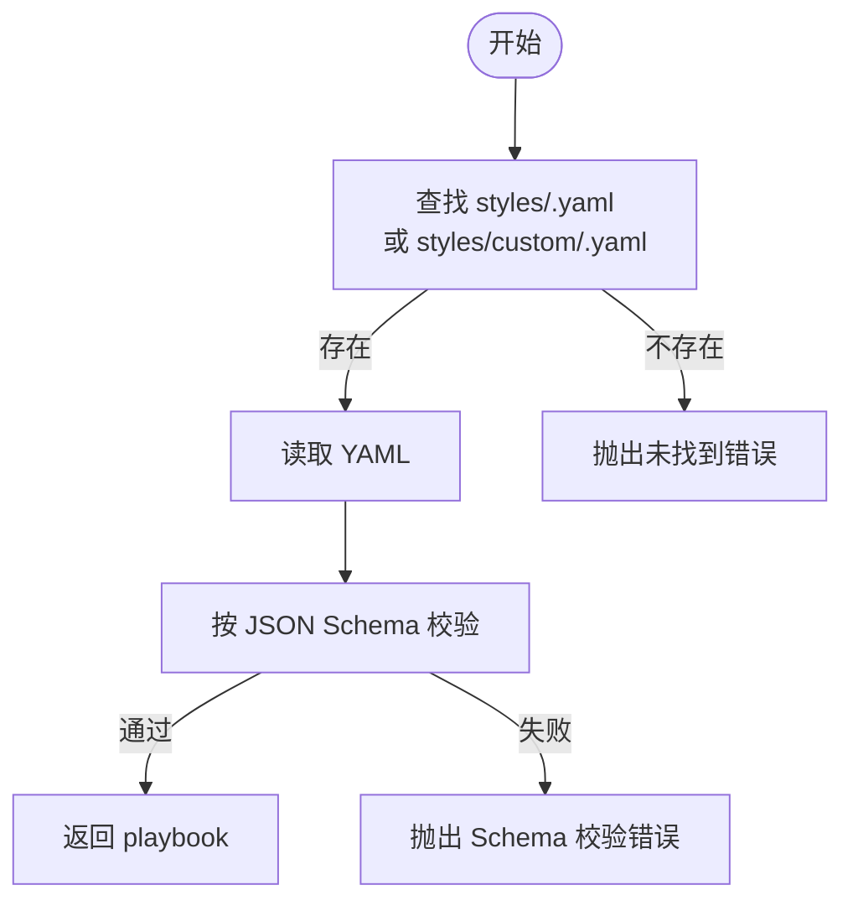
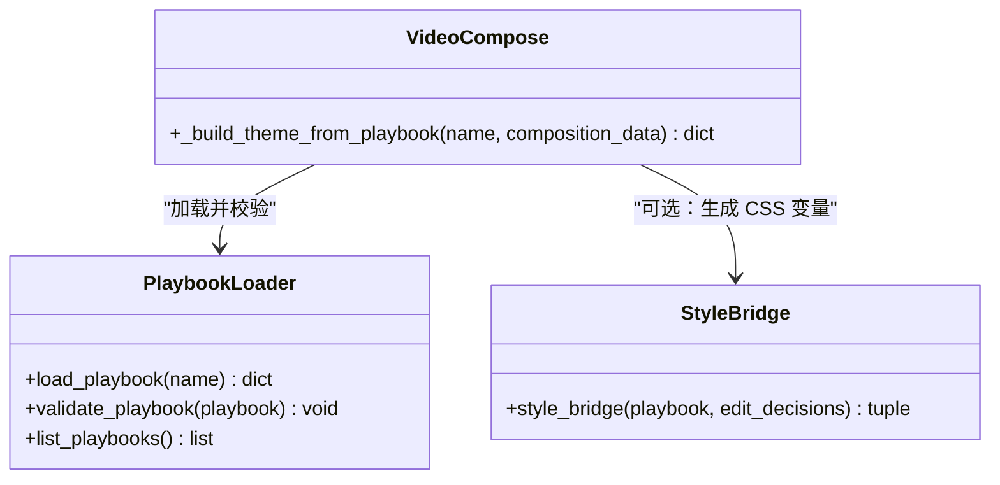
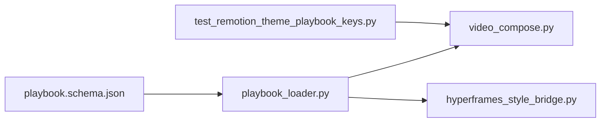

# 风格定制指南

<cite>
**本文引用的文件**
- [styles/playbook_loader.py](file://styles/playbook_loader.py)
- [schemas/styles/playbook.schema.json](file://schemas/styles/playbook.schema.json)
- [styles/clean-professional.yaml](file://styles/clean-professional.yaml)
- [styles/minimalist-diagram.yaml](file://styles/minimalist-diagram.yaml)
- [lib/hyperframes_style_bridge.py](file://lib/hyperframes_style_bridge.py)
- [tools/video/video_compose.py](file://tools/video/video_compose.py)
- [lib/playbook_generator.py](file://lib/playbook_generator.py)
- [tests/contracts/test_remotion_theme_playbook_keys.py](file://tests/contracts/test_remotion_theme_playbook_keys.py)
</cite>

## 目录
1. [简介](#简介)
2. [项目结构](#项目结构)
3. [核心组件](#核心组件)
4. [架构总览](#架构总览)
5. [详细组件分析](#详细组件分析)
6. [依赖关系分析](#依赖关系分析)
7. [性能考虑](#性能考虑)
8. [故障排查指南](#故障排查指南)
9. [结论](#结论)
10. [附录：完整定制流程与案例](#附录完整定制流程与案例)

## 简介
本指南面向需要在 OpenMontage 中创建与维护品牌一致视频风格的工程师与设计师。内容涵盖样式文件结构与配置项（颜色主题、字体方案、布局模板、动画效果）、Playbook 加载器工作原理（样式发现、配置验证、动态加载）、品牌一致性维护方法（色彩管理、字体策略、设计规范遵循）、响应式适配建议，以及从需求到部署的完整定制流程与示例路径。

## 项目结构
OpenMontage 的风格系统以“Playbook”为核心：YAML 描述视觉语言、排版、动效、音频与资产生成指引；加载器负责发现、校验与提供设计智能；渲染侧将 Playbook 转换为运行时主题或 CSS 变量，驱动 Remotion/HyperFrames 输出。

图表来源
- [styles/playbook_loader.py:1-84](file://styles/playbook_loader.py#L1-L84)
- [schemas/styles/playbook.schema.json:1-323](file://schemas/styles/playbook.schema.json#L1-L323)
- [tools/video/video_compose.py:1264-1373](file://tools/video/video_compose.py#L1264-L1373)
- [lib/hyperframes_style_bridge.py:1-195](file://lib/hyperframes_style_bridge.py#L1-L195)
- [lib/playbook_generator.py:1-226](file://lib/playbook_generator.py#L1-L226)

章节来源
- [styles/playbook_loader.py:1-84](file://styles/playbook_loader.py#L1-L84)
- [schemas/styles/playbook.schema.json:1-323](file://schemas/styles/playbook.schema.json#L1-L323)

## 核心组件
- Playbook 加载器：负责在 styles 与 styles/custom 下发现 YAML，按 JSON Schema 校验，并提供配色、排版与无障碍性检查等设计智能。
- 样式 Schema：定义 identity、visual_language、typography、motion、audio、asset_generation、overlays、quality_rules、chart_palette、color_rules、taste_profile、overrides 等字段及约束。
- 渲染桥接：
  - Remotion：从 Playbook 提取具体颜色与字体，构造 ThemeConfig 并注入渲染。
  - HyperFrames：将 Playbook 转为 CSS 自定义属性与 DESIGN.md，便于跨工程复用。
- 自定义生成器：根据生产上下文生成符合 Schema 的自定义 Playbook，并持久化到 styles/custom。

章节来源
- [styles/playbook_loader.py:1-84](file://styles/playbook_loader.py#L1-L84)
- [schemas/styles/playbook.schema.json:1-323](file://schemas/styles/playbook.schema.json#L1-L323)
- [tools/video/video_compose.py:1264-1373](file://tools/video/video_compose.py#L1264-L1373)
- [lib/hyperframes_style_bridge.py:1-195](file://lib/hyperframes_style_bridge.py#L1-L195)
- [lib/playbook_generator.py:1-226](file://lib/playbook_generator.py#L1-L226)

## 架构总览
Playbook 是单一事实源，贯穿“设计—校验—渲染—文档”全链路。加载器保证数据质量；渲染侧按需映射为运行时主题或 CSS 变量；生成器支持基于上下文的自动化产出。

图表来源
- [styles/playbook_loader.py:37-70](file://styles/playbook_loader.py#L37-L70)
- [schemas/styles/playbook.schema.json:1-323](file://schemas/styles/playbook.schema.json#L1-L323)
- [tools/video/video_compose.py:1264-1373](file://tools/video/video_compose.py#L1264-L1373)
- [lib/hyperframes_style_bridge.py:70-141](file://lib/hyperframes_style_bridge.py#L70-L141)

## 详细组件分析

### Playbook 加载器与样式发现机制
- 发现顺序：优先 styles 根目录同名 YAML，若不存在则回退至 styles/custom 同名 YAML；两者冲突时，根目录覆盖 custom。
- 校验流程：加载后通过 JSON Schema 严格校验，确保必填字段与类型正确。
- 清单能力：列出所有可用 Playbook（含预设与生成）。
- 设计智能：
  - 配色：对比度计算（WCAG 2.1）、色盲安全检测、调色板和谐生成。
  - 排版：模块化字号比例、层级权重校验、字体搭配建议。
  - 无障碍：最小字号、叠加层文本对比度、整体可访问性评分。

图表来源
- [styles/playbook_loader.py:37-70](file://styles/playbook_loader.py#L37-L70)
- [schemas/styles/playbook.schema.json:1-323](file://schemas/styles/playbook.schema.json#L1-L323)

章节来源
- [styles/playbook_loader.py:37-84](file://styles/playbook_loader.py#L37-L84)

### 样式 Schema 与配置选项
- identity：名称、类别、情绪、节奏、适用场景。
- visual_language：主色/强调色/背景/文本/弱化色、构图与纹理。
- typography：标题/正文/代码/统计卡片字体与权重、比例尺系统、权重矩阵。
- motion：过渡、动画风格、节奏规则、入场/出场。
- audio：配音风格、音乐情绪与音量、音效风格、避让阈值等。
- asset_generation：图像提示前缀/负向提示、图表风格、一致性锚点、粒子/暗角默认值等。
- overlays：各类叠加层的背景、边框、文字、圆角、阴影、高亮、强调色。
- quality_rules：质量规则数组。
- chart_palette：有序图表色板。
- color_rules：和弦类型、对比度校验开关、色盲安全开关。
- taste_profile：设计可读性、视觉方差、动效强度、信息密度等品味维度。
- overrides：允许少量场景偏离默认规则。

章节来源
- [schemas/styles/playbook.schema.json:1-323](file://schemas/styles/playbook.schema.json#L1-L323)

### 颜色主题与无障碍性
- 对比度：基于 sRGB 相对亮度计算 WCAG 2.1 对比度，支持普通/大号文本 AA/AAA 判定。
- 色盲安全：模拟红绿色弱、蓝黄色弱混淆对，结合饱和度与明度差异给出警告。
- 叠加层：自动合成半透明背景/文本后再做对比度检查。
- 调色板和谐：支持互补、类似、三角、分裂互补等算法生成和谐色板。

章节来源
- [styles/playbook_loader.py:210-429](file://styles/playbook_loader.py#L210-L429)

### 字体方案与排版层级
- 模块化字号比例：支持多种命名比例与自定义数值，自动生成 caption/body/subheading/heading/display 级别。
- 层级校验：标题权重应大于正文，统计卡片需更醒目；比例过紧会提示。
- 字体搭配建议：内置已知良好搭配库，未知字体按类别推荐。

章节来源
- [styles/playbook_loader.py:435-729](file://styles/playbook_loader.py#L435-L729)

### 动画与节奏控制
- 节奏：identity.pace 影响 Remotion 弹簧参数与过渡时长；slow/fast/slow 分别调整阻尼、刚度与时长。
- 过渡与入场/出场：由 motion.transitions、entrance、exit 指定。
- 节奏规则：最小/最大场景停留、卡片停留、过渡时长等。

章节来源
- [schemas/styles/playbook.schema.json:83-108](file://schemas/styles/playbook.schema.json#L83-L108)
- [tools/video/video_compose.py:1342-1350](file://tools/video/video_compose.py#L1342-L1350)

### 渲染桥接：Remotion 主题与 HyperFrames 变量
- Remotion：从 Playbook 提取 primary/accent/background/text/surface/muted 与字体，生成 ThemeConfig，并推导字幕高亮/背景色；同时根据 pace 调整动效参数。
- HyperFrames：将 Playbook 映射为 :root CSS 变量与 DESIGN.md，便于跨项目复用与人工审阅。

图表来源
- [tools/video/video_compose.py:1264-1373](file://tools/video/video_compose.py#L1264-L1373)
- [styles/playbook_loader.py:37-84](file://styles/playbook_loader.py#L37-L84)
- [lib/hyperframes_style_bridge.py:70-141](file://lib/hyperframes_style_bridge.py#L70-L141)

章节来源
- [tools/video/video_compose.py:1264-1373](file://tools/video/video_compose.py#L1264-L1373)
- [lib/hyperframes_style_bridge.py:1-195](file://lib/hyperframes_style_bridge.py#L1-L195)

### 自定义 Playbook 生成与保存
- 生成：基于上下文（mood/tone/colors/fonts/pace/audience）或已有 Playbook 作为基底，生成符合 Schema 的配置。
- 保存：写入 styles/custom 目录，文件名规范化；后续加载器可自动发现。

章节来源
- [lib/playbook_generator.py:52-226](file://lib/playbook_generator.py#L52-L226)

### 实际样式示例
- 专业简洁风格：以蓝色为主、强调色点缀、干净平面纹理、适度节奏、清晰层级。
- 极简图表风格：低饱和背景、单强调色、留白充足、技术感强、渐进揭示。

章节来源
- [styles/clean-professional.yaml:1-105](file://styles/clean-professional.yaml#L1-L105)
- [styles/minimalist-diagram.yaml:1-104](file://styles/minimalist-diagram.yaml#L1-L104)

## 依赖关系分析
- 加载器依赖 JSON Schema 进行强校验，避免无效配置进入渲染管线。
- 渲染侧依赖加载器提供的结构化数据，不硬编码主题名，而是直接读取实际颜色与字体。
- 测试用例确保渲染侧键名与 Schema 对齐，防止键名漂移导致主题失效。

图表来源
- [schemas/styles/playbook.schema.json:1-323](file://schemas/styles/playbook.schema.json#L1-L323)
- [styles/playbook_loader.py:37-84](file://styles/playbook_loader.py#L37-L84)
- [tools/video/video_compose.py:1264-1373](file://tools/video/video_compose.py#L1264-L1373)
- [lib/hyperframes_style_bridge.py:70-141](file://lib/hyperframes_style_bridge.py#L70-L141)
- [tests/contracts/test_remotion_theme_playbook_keys.py:1-42](file://tests/contracts/test_remotion_theme_playbook_keys.py#L1-L42)

章节来源
- [tests/contracts/test_remotion_theme_playbook_keys.py:1-42](file://tests/contracts/test_remotion_theme_playbook_keys.py#L1-L42)

## 性能考虑
- 加载缓存：加载器与生成器使用本地文件系统 I/O，建议在批量渲染时复用已加载对象或缓存结果。
- 对比度与色盲检测：仅在预渲染阶段执行，避免在热路径重复计算。
- 动效参数：依据节奏选择合理的阻尼与时长，减少过度动画带来的重排与重绘。
- 资源体积：字体与图片尽量使用子集与压缩格式，降低首帧开销。

[本节为通用指导，无需特定文件引用]

## 故障排查指南
- 找不到 Playbook：确认名称与扩展名，检查 styles 与 styles/custom 是否存在同名文件；加载器会在两者间搜索，根目录优先级更高。
- Schema 校验失败：对照 schemas/styles/playbook.schema.json 检查必填字段与类型；必要时使用生成器重新产出合规配置。
- 主题键名不一致：测试用例指出渲染侧曾误用非 Schema 键名；请确保使用 Schema 定义的字段（如 headings、muted 等）。
- 无障碍问题：使用加载器的对比度与色盲检测工具定位问题，调整文本/背景或强调色组合。

章节来源
- [styles/playbook_loader.py:37-70](file://styles/playbook_loader.py#L37-L70)
- [schemas/styles/playbook.schema.json:1-323](file://schemas/styles/playbook.schema.json#L1-L323)
- [tests/contracts/test_remotion_theme_playbook_keys.py:1-42](file://tests/contracts/test_remotion_theme_playbook_keys.py#L1-L42)

## 结论
OpenMontage 的风格系统以 Playbook 为中心，通过严格的 Schema 校验与丰富的设计智能，确保从设计到渲染的一致性与可维护性。借助加载器、渲染桥接与生成器，团队可以高效地创建、验证与落地品牌风格，并在不同渲染后端保持一致体验。

[本节为总结，无需特定文件引用]

## 附录：完整定制流程与案例

### 从零到一：定制流程
1. 需求分析
   - 明确品牌基调（mood/tone）、受众、设备目标与节奏偏好。
   - 确定关键视觉元素：主色/强调色、背景/文本、字体家族与层级。
2. 选择或生成 Playbook
   - 直接使用现有预设（如 clean-professional、minimalist-diagram）。
   - 或使用生成器基于上下文生成自定义 Playbook，并保存到 styles/custom。
3. 设计与验证
   - 使用加载器的配色与排版检查，确保对比度与色盲安全达标。
   - 调整 typography 比例与 weight_matrix，保证层级清晰。
4. 渲染集成
   - Remotion：通过 video_compose._build_theme_from_playbook 获取主题并注入渲染。
   - HyperFrames：通过 style_bridge 导出 CSS 变量与 DESIGN.md，统一多工程风格。
5. 测试与回归
   - 运行相关测试，确保键名与 Schema 一致，主题稳定生效。
6. 发布与治理
   - 将最终 Playbook 纳入版本管理；在流水线中加入 Schema 校验与无障碍检查门禁。

章节来源
- [lib/playbook_generator.py:52-226](file://lib/playbook_generator.py#L52-L226)
- [styles/playbook_loader.py:37-84](file://styles/playbook_loader.py#L37-L84)
- [tools/video/video_compose.py:1264-1373](file://tools/video/video_compose.py#L1264-L1373)
- [lib/hyperframes_style_bridge.py:70-141](file://lib/hyperframes_style_bridge.py#L70-L141)

### 实际案例参考
- 专业简洁风格：适合企业讲解、教育内容、SaaS 演示。
- 极简图表风格：适合技术深潜、架构图解、数学/计算机概念。

章节来源
- [styles/clean-professional.yaml:1-105](file://styles/clean-professional.yaml#L1-L105)
- [styles/minimalist-diagram.yaml:1-104](file://styles/minimalist-diagram.yaml#L1-L104)

### 品牌一致性维护方法
- 色彩管理系统
  - 集中维护 color_palette 与 chart_palette，启用 contrast_validation 与 colorblind_safe。
  - 使用 generate_harmony 生成和谐色板，避免随意新增颜色。
- 字体策略
  - 使用 scale_system 与 weight_matrix 规范层级；利用 suggest_font_pairing 选择搭配字体。
  - 限制字体家族数量，保持跨端一致。
- 设计规范遵循
  - 通过 quality_rules 与 taste_profile 固化原则与禁忌。
  - 在 CI 中加入 Schema 校验与无障碍检查，阻断不合格变更。

章节来源
- [schemas/styles/playbook.schema.json:191-223](file://schemas/styles/playbook.schema.json#L191-L223)
- [styles/playbook_loader.py:210-429](file://styles/playbook_loader.py#L210-L429)
- [styles/playbook_loader.py:435-729](file://styles/playbook_loader.py#L435-L729)

### 响应式设计适配
- 多设备兼容性
  - 使用 HyperFrames 的 CSS 变量体系，便于在不同视口下快速切换主题。
  - 在预览环境可使用媒体查询进行交互调试（注意：HyperFrames 渲染固定视口，媒体查询主要用于预览）。
- 屏幕尺寸适配
  - 合理设置最小字号与行高，确保移动端可读性；统计卡片与图表在小屏下简化展示。
- 性能优化
  - 减少不必要的动画与重绘；在低端设备上降低动效强度。
  - 使用子集字体与压缩资源，缩短首帧时间。

章节来源
- [lib/hyperframes_style_bridge.py:1-195](file://lib/hyperframes_style_bridge.py#L1-L195)