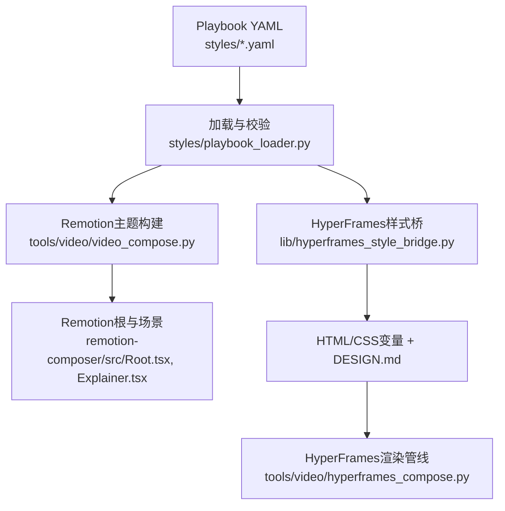
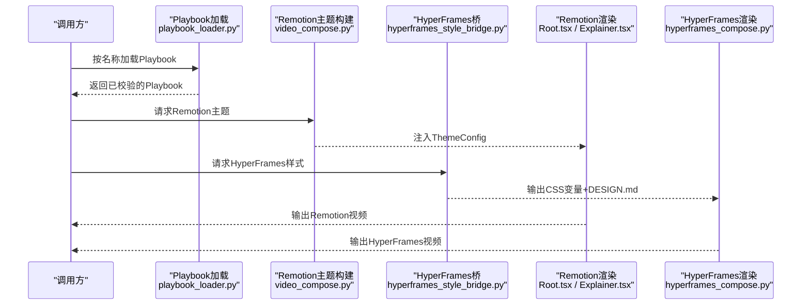
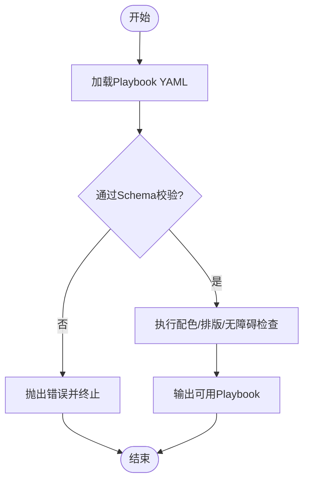
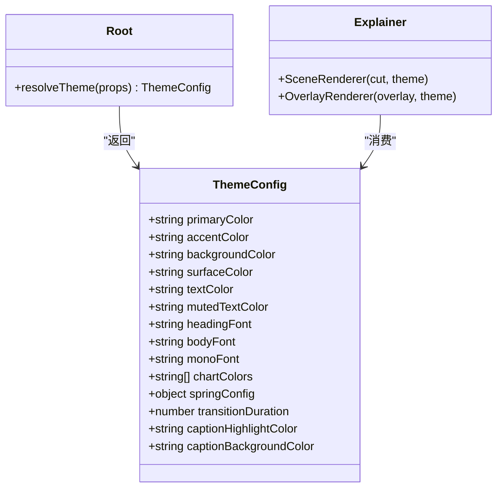
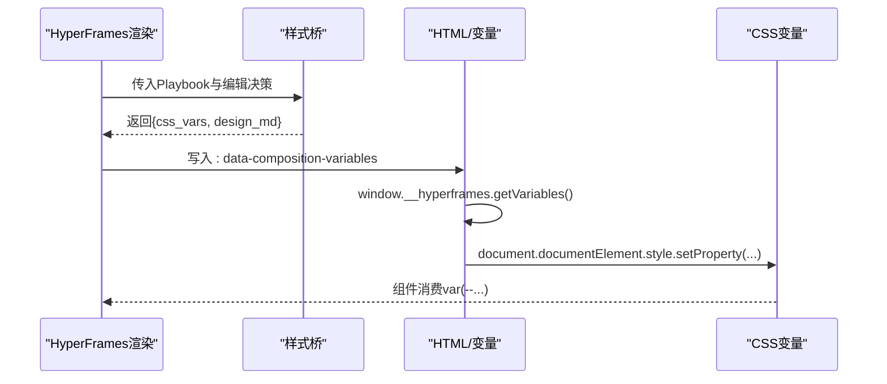
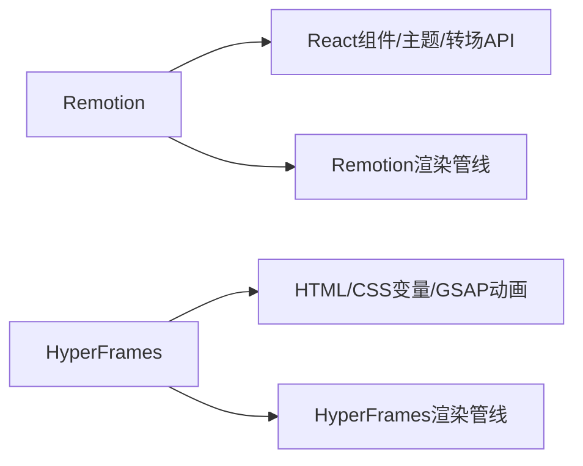
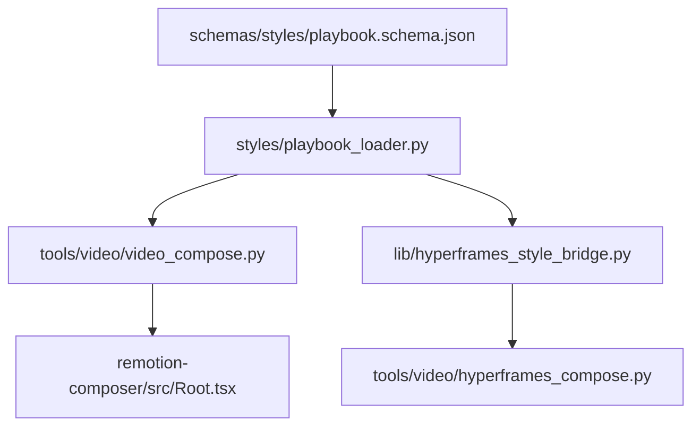

# 风格系统与模板

<cite>
**本文引用的文件**
- [styles/playbook_loader.py](file://styles/playbook_loader.py)
- [schemas/styles/playbook.schema.json](file://schemas/styles/playbook.schema.json)
- [styles/clean-professional.yaml](file://styles/clean-professional.yaml)
- [styles/anime-ghibli.yaml](file://styles/anime-ghibli.yaml)
- [lib/hyperframes_style_bridge.py](file://lib/hyperframes_style_bridge.py)
- [tools/video/video_compose.py](file://tools/video/video_compose.py)
- [tools/video/hyperframes_compose.py](file://tools/video/hyperframes_compose.py)
- [remotion-composer/src/Root.tsx](file://remotion-composer/src/Root.tsx)
- [remotion-composer/src/Explainer.tsx](file://remotion-composer/src/Explainer.tsx)
- [skills/core/hyperframes.md](file://skills/core/hyperframes.md)
- [.agents/skills/remotion-to-hyperframes/references/api-map.md](file://.agents/skills/remotion-to-hyperframes/references/api-map.md)
- [.agents/skills/remotion-to-hyperframes/references/transitions.md](file://.agents/skills/remotion-to-hyperframes/references/transitions.md)
- [.agents/skills/hyperframes-core/references/variables-and-media.md](file://.agents/skills/hyperframes-core/references/variables-and-media.md)
- [.agents/skills/hyperframes-core/references/sub-compositions.md](file://.agents/skills/hyperframes-core/references/sub-compositions.md)
</cite>

## 目录
1. [简介](#简介)
2. [项目结构](#项目结构)
3. [核心组件](#核心组件)
4. [架构总览](#架构总览)
5. [详细组件分析](#详细组件分析)
6. [依赖关系分析](#依赖关系分析)
7. [性能考量](#性能考量)
8. [故障排查指南](#故障排查指南)
9. [结论](#结论)
10. [附录](#附录)

## 简介
本文件面向OpenMontage的风格系统与模板库，系统性说明：
- 内置视觉风格的配置项：颜色主题、字体方案、布局与覆盖层样式、动画与转场、音频基调等。
- 两种渲染引擎的特点与对比：Remotion（React生态集成）与HyperFrames（HTML/GSAP驱动）。
- 模板定制方法：样式文件结构、变量替换机制、动态内容注入。
- 风格设计指南与最佳实践：品牌一致性、响应式适配、性能优化技巧。
目标是帮助用户快速创建符合品牌要求的定制化视频模板，并在不同渲染后端保持一致的视觉体验。

## 项目结构
OpenMontage将“风格”抽象为可验证的Playbook YAML，并通过两条路径分别驱动Remotion与HyperFrames：
- Playbook定义：位于styles/*.yaml，受schemas/styles/playbook.schema.json约束。
- Remotion路径：通过工具层解析Playbook并生成themeConfig，注入到Remotion根组件与各场景组件。
- HyperFrames路径：通过桥接器将Playbook翻译为CSS自定义属性与DESIGN.md，供HTML/GSAP消费。

图表来源
- [styles/playbook_loader.py:37-70](file://styles/playbook_loader.py#L37-L70)
- [tools/video/video_compose.py:1264-1373](file://tools/video/video_compose.py#L1264-L1373)
- [remotion-composer/src/Root.tsx:24-121](file://remotion-composer/src/Root.tsx#L24-L121)
- [lib/hyperframes_style_bridge.py:70-141](file://lib/hyperframes_style_bridge.py#L70-L141)
- [tools/video/hyperframes_compose.py:1113-1139](file://tools/video/hyperframes_compose.py#L1113-L1139)

章节来源
- [styles/playbook_loader.py:1-84](file://styles/playbook_loader.py#L1-L84)
- [schemas/styles/playbook.schema.json:1-323](file://schemas/styles/playbook.schema.json#L1-L323)

## 核心组件
- Playbook加载与校验：统一从styles目录或styles/custom子目录加载YAML，并按schema校验，确保字段完整与类型正确。
- Remotion主题映射：将Playbook中的颜色、字体、动效参数转换为Remotion的ThemeConfig对象，供各组件消费。
- HyperFrames样式桥：将同一份Playbook翻译为CSS自定义属性（如--color-bg、--font-heading等）与DESIGN.md文档，便于HTML/GSAP使用。
- 内置风格示例：clean-professional、anime-ghibli等YAML提供完整的色彩、排版、动效、覆盖层与质量规则。

章节来源
- [styles/playbook_loader.py:37-84](file://styles/playbook_loader.py#L37-L84)
- [tools/video/video_compose.py:1264-1373](file://tools/video/video_compose.py#L1264-L1373)
- [lib/hyperframes_style_bridge.py:22-141](file://lib/hyperframes_style_bridge.py#L22-L141)
- [styles/clean-professional.yaml:1-105](file://styles/clean-professional.yaml#L1-L105)
- [styles/anime-ghibli.yaml:1-123](file://styles/anime-ghibli.yaml#L1-L123)

## 架构总览
下图展示从Playbook到两种渲染后端的完整数据流与职责划分。

图表来源
- [styles/playbook_loader.py:37-70](file://styles/playbook_loader.py#L37-L70)
- [tools/video/video_compose.py:1264-1373](file://tools/video/video_compose.py#L1264-L1373)
- [lib/hyperframes_style_bridge.py:70-141](file://lib/hyperframes_style_bridge.py#L70-L141)
- [remotion-composer/src/Root.tsx:24-121](file://remotion-composer/src/Root.tsx#L24-L121)
- [tools/video/hyperframes_compose.py:1113-1139](file://tools/video/hyperframes_compose.py#L1113-L1139)

## 详细组件分析

### 风格Playbook与Schema
- 必填字段：identity、visual_language、typography、motion、audio、asset_generation、quality_rules。
- 颜色系统：primary/accent/background/text/muted，支持chart_palette与color_rules（对比度、色盲安全等）。
- 字体系统：headings/body/code/stat_card，支持scale_system与weight_matrix。
- 动效系统：transitions、animation_style、pacing_rules、entrance/exit。
- 覆盖层样式：stat_card/key_term/code_block/section_title等，支持bg/border/text/radius/shadow/highlight/accent。
- 质量规则：文本对比度、屏幕元素数量、可读性、节奏控制等。

图表来源
- [schemas/styles/playbook.schema.json:1-323](file://schemas/styles/playbook.schema.json#L1-L323)
- [styles/playbook_loader.py:67-84](file://styles/playbook_loader.py#L67-L84)

章节来源
- [schemas/styles/playbook.schema.json:1-323](file://schemas/styles/playbook.schema.json#L1-L323)
- [styles/playbook_loader.py:67-84](file://styles/playbook_loader.py#L67-L84)

### Remotion主题与场景组件
- 主题对象：包含主色、强调色、背景、表面、文本、图表色板、弹簧动效参数、过渡时长、字幕高亮等。
- 主题解析：优先从props.theme或props.playbook选择内置主题；也支持传入完整themeConfig进行覆盖。
- 场景渲染：Explainer根据cut.type路由到具体组件（文本卡、统计卡、图表、终端、截图、动漫场景等），并应用主题色与动效。
- 背景与叠加：支持背景图/视频层、暗化遮罩、景深晕影等，保证可读性与层次感。

图表来源
- [remotion-composer/src/Root.tsx:24-121](file://remotion-composer/src/Root.tsx#L24-L121)
- [remotion-composer/src/Explainer.tsx:558-775](file://remotion-composer/src/Explainer.tsx#L558-L775)

章节来源
- [remotion-composer/src/Root.tsx:24-121](file://remotion-composer/src/Root.tsx#L24-L121)
- [remotion-composer/src/Explainer.tsx:186-311](file://remotion-composer/src/Explainer.tsx#L186-L311)
- [remotion-composer/src/Explainer.tsx:558-775](file://remotion-composer/src/Explainer.tsx#L558-L775)

### HyperFrames样式桥与变量系统
- 样式桥：将Playbook翻译为CSS自定义属性（--color-bg、--color-fg、--color-accent、--font-heading、--ease-primary、--duration-entrance等），并生成DESIGN.md说明如何使用这些变量。
- 变量声明：在HTML的<html>元素上以data-composition-variables声明变量（id/type/label/default），运行时通过window.__hyperframes.getVariables()读取并应用到DOM或CSS变量。
- 子组合变量：宿主可通过data-variable-values为每个实例传递变量值，实现多实例差异化。

图表来源
- [lib/hyperframes_style_bridge.py:70-141](file://lib/hyperframes_style_bridge.py#L70-L141)
- [.agents/skills/hyperframes-core/references/variables-and-media.md:1-24](file://.agents/skills/hyperframes-core/references/variables-and-media.md#L1-L24)
- [.agents/skills/hyperframes-core/references/sub-compositions.md:220-238](file://.agents/skills/hyperframes-core/references/sub-compositions.md#L220-L238)

章节来源
- [lib/hyperframes_style_bridge.py:22-141](file://lib/hyperframes_style_bridge.py#L22-L141)
- [.agents/skills/hyperframes-core/references/variables-and-media.md:1-24](file://.agents/skills/hyperframes-core/references/variables-and-media.md#L1-L24)
- [.agents/skills/hyperframes-core/references/sub-compositions.md:220-238](file://.agents/skills/hyperframes-core/references/sub-compositions.md#L220-L238)

### 渲染引擎对比：Remotion vs HyperFrames
- Remotion特点：
  - React生态集成，适合复杂组件树、状态管理与动画库（springTiming/linearTiming等）。
  - 通过ThemeConfig集中管理主题，场景组件按需消费。
  - 转场与时间线由Remotion API管理，计算总时长时考虑重叠。
- HyperFrames特点：
  - 基于HTML与GSAP，适合轻量级页面与高性能动画。
  - 通过CSS变量与DESIGN.md统一风格，变量在初始化阶段读取并注入。
  - 成本模型：本地渲染，无API费用，CPU密集（headless Chrome + FFmpeg）。

图表来源
- [skills/core/hyperframes.md:265-293](file://skills/core/hyperframes.md#L265-L293)
- [.agents/skills/remotion-to-hyperframes/references/api-map.md:14-120](file://.agents/skills/remotion-to-hyperframes/references/api-map.md#L14-L120)
- [.agents/skills/remotion-to-hyperframes/references/transitions.md:39-60](file://.agents/skills/remotion-to-hyperframes/references/transitions.md#L39-L60)

章节来源
- [skills/core/hyperframes.md:265-293](file://skills/core/hyperframes.md#L265-L293)
- [.agents/skills/remotion-to-hyperframes/references/api-map.md:14-120](file://.agents/skills/remotion-to-hyperframes/references/api-map.md#L14-L120)
- [.agents/skills/remotion-to-hyperframes/references/transitions.md:39-60](file://.agents/skills/remotion-to-hyperframes/references/transitions.md#L39-L60)

### 模板定制方法
- 样式文件结构：
  - 在styles目录下新增或修改YAML，遵循schema约束。
  - 使用内置风格作为基础，调整颜色、字体、动效、覆盖层与质量规则。
- 变量替换机制：
  - Remotion：通过ThemeConfig注入到组件props，组件内部消费主题变量。
  - HyperFrames：通过CSS变量与data-composition-variables声明，运行时读取并设置到DOM。
- 动态内容注入：
  - 通过cut/overlay数据结构向场景注入文本、图表、媒体、粒子等。
  - 支持背景图/视频层与遮罩，提升可读性与层次。

章节来源
- [schemas/styles/playbook.schema.json:1-323](file://schemas/styles/playbook.schema.json#L1-L323)
- [remotion-composer/src/Explainer.tsx:186-311](file://remotion-composer/src/Explainer.tsx#L186-L311)
- [.agents/skills/hyperframes-core/references/variables-and-media.md:1-24](file://.agents/skills/hyperframes-core/references/variables-and-media.md#L1-L24)

### 风格设计指南与最佳实践
- 品牌一致性：
  - 使用统一的primary/accent/background/text，避免随意引入新色。
  - 通过chart_palette限定图表色板，保持数据可视化一致。
- 响应式设计适配：
  - 合理设置字体比例与行高，确保移动端可读性。
  - 使用覆盖层与遮罩增强文字可读性。
- 性能优化技巧：
  - Remotion：合理使用spring/linear timing，避免过度重绘；注意转场重叠对总时长的影响。
  - HyperFrames：避免全帧背景视频分辨率陷阱，确保输入质量；减少不必要的DOM操作与滤镜。

章节来源
- [styles/clean-professional.yaml:86-105](file://styles/clean-professional.yaml#L86-L105)
- [styles/anime-ghibli.yaml:101-123](file://styles/anime-ghibli.yaml#L101-L123)
- [.agents/skills/remotion-best-practices/rules/transitions.md:119-198](file://.agents/skills/remotion-best-practices/rules/transitions.md#L119-L198)
- [skills/core/hyperframes.md:296-307](file://skills/core/hyperframes.md#L296-L307)

## 依赖关系分析
- Playbook加载依赖schema校验，确保所有风格定义合法。
- Remotion主题构建依赖video_compose中的主题提取逻辑，将Playbook映射为ThemeConfig。
- HyperFrames样式桥依赖Playbook字段，输出CSS变量与DESIGN.md，供HTML/GSAP消费。
- 渲染管线分别调用Remotion与HyperFrames执行最终输出。

图表来源
- [schemas/styles/playbook.schema.json:1-323](file://schemas/styles/playbook.schema.json#L1-L323)
- [styles/playbook_loader.py:37-84](file://styles/playbook_loader.py#L37-L84)
- [tools/video/video_compose.py:1264-1373](file://tools/video/video_compose.py#L1264-L1373)
- [lib/hyperframes_style_bridge.py:70-141](file://lib/hyperframes_style_bridge.py#L70-L141)
- [tools/video/hyperframes_compose.py:1113-1139](file://tools/video/hyperframes_compose.py#L1113-L1139)

章节来源
- [styles/playbook_loader.py:37-84](file://styles/playbook_loader.py#L37-L84)
- [tools/video/video_compose.py:1264-1373](file://tools/video/video_compose.py#L1264-L1373)
- [lib/hyperframes_style_bridge.py:70-141](file://lib/hyperframes_style_bridge.py#L70-L141)
- [tools/video/hyperframes_compose.py:1113-1139](file://tools/video/hyperframes_compose.py#L1113-L1139)

## 性能考量
- Remotion：
  - 转场会重叠相邻场景，总时长短于各段之和；需合理设置transition_duration。
  - 使用springTiming时，duration可能依赖fps，需注意计算。
- HyperFrames：
  - 本地渲染，无API费用但CPU密集；需关注headless Chrome与FFmpeg资源占用。
  - 全帧背景视频需确保源质量，避免渲染为小框黑边问题。

章节来源
- [.agents/skills/remotion-best-practices/rules/transitions.md:119-198](file://.agents/skills/remotion-best-practices/rules/transitions.md#L119-L198)
- [skills/core/hyperframes.md:283-307](file://skills/core/hyperframes.md#L283-L307)

## 故障排查指南
- Playbook未找到：检查styles目录与styles/custom是否存在对应YAML，确认名称无误。
- Schema校验失败：对照schemas/styles/playbook.schema.json修正字段类型与必填项。
- Remotion主题未生效：确认video_compose中主题构建逻辑是否成功加载Playbook；必要时回退到edit_decisions元数据。
- HyperFrames渲染失败：查看render步骤日志与退出码；若输出文件缺失，检查stdout_tail定位真实路径。
- 超分背景视频异常：确认输入分辨率与CSS设置一致，优先修复输入质量而非调整CSS。

章节来源
- [styles/playbook_loader.py:37-70](file://styles/playbook_loader.py#L37-L70)
- [tools/video/video_compose.py:1264-1373](file://tools/video/video_compose.py#L1264-L1373)
- [tools/video/hyperframes_compose.py:829-861](file://tools/video/hyperframes_compose.py#L829-L861)
- [skills/core/hyperframes.md:296-307](file://skills/core/hyperframes.md#L296-L307)

## 结论
OpenMontage通过统一的Playbook定义，同时驱动Remotion与HyperFrames两种渲染后端，既满足React生态的复杂场景，又兼顾HTML/GSAP的高性能动画需求。借助schema校验、主题映射与样式桥，用户可快速定制符合品牌要求的视频模板，并在不同平台保持一致的视觉体验。建议在设计时重视品牌一致性、响应式适配与性能优化，以获得更佳的渲染效果与用户体验。

## 附录
- 内置风格示例：
  - clean-professional：专业、清晰、企业解释类内容。
  - anime-ghibli：温暖、奇幻、叙事动画。
- 变量与媒体：
  - 在HTML中声明变量，运行时读取并应用到DOM或CSS变量。
  - 子组合支持每实例变量覆盖，实现多实例差异化。

章节来源
- [styles/clean-professional.yaml:1-105](file://styles/clean-professional.yaml#L1-L105)
- [styles/anime-ghibli.yaml:1-123](file://styles/anime-ghibli.yaml#L1-L123)
- [.agents/skills/hyperframes-core/references/variables-and-media.md:1-24](file://.agents/skills/hyperframes-core/references/variables-and-media.md#L1-L24)
- [.agents/skills/hyperframes-core/references/sub-compositions.md:220-238](file://.agents/skills/hyperframes-core/references/sub-compositions.md#L220-L238)