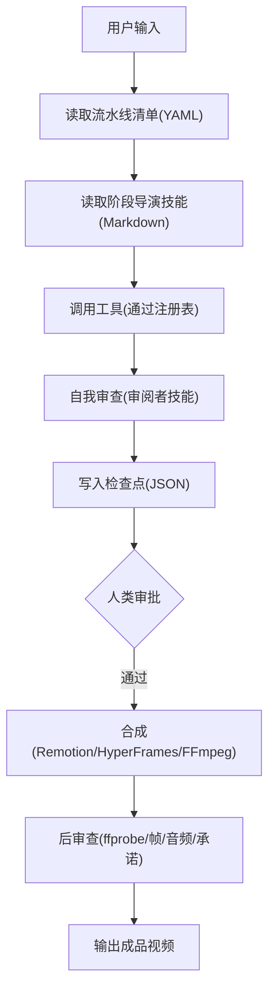
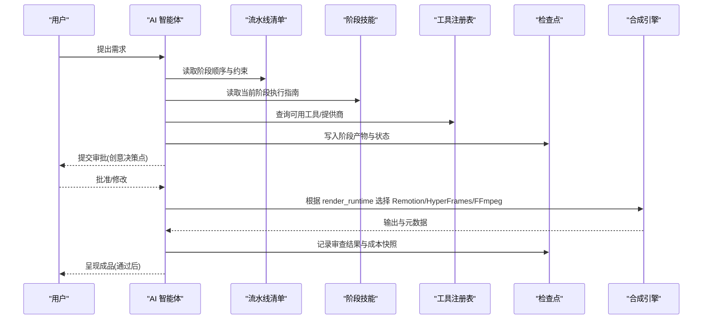
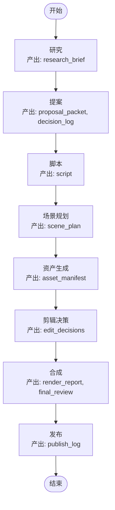
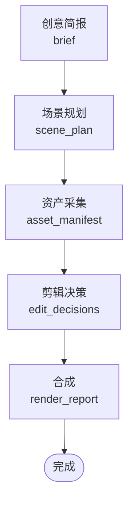
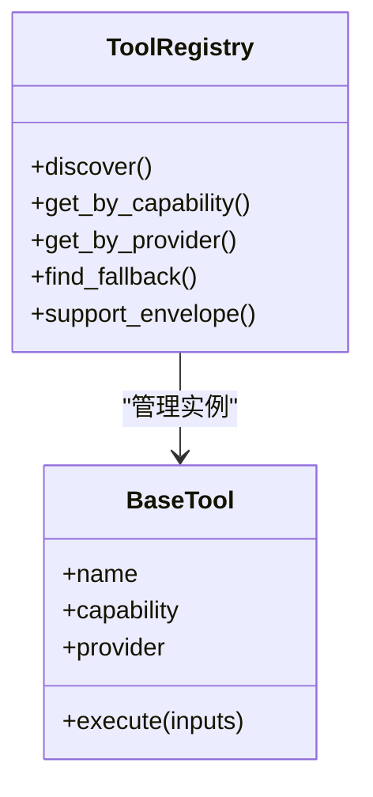
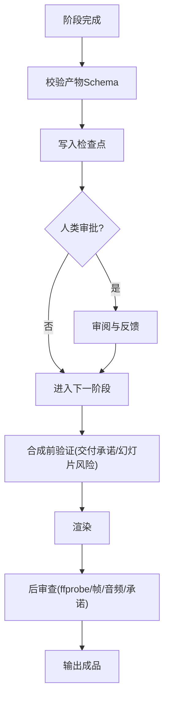
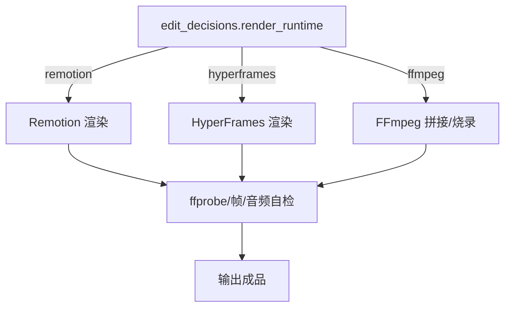
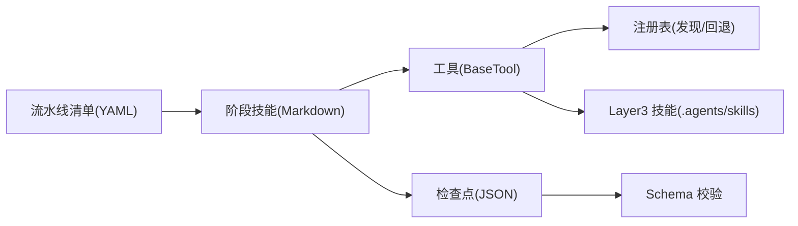

# 项目介绍与核心价值

<cite>
**本文引用的文件**
- [README.md](file://README.md)
- [README_zh-CN.md](file://README_zh-CN.md)
- [PROJECT_CONTEXT.md](file://PROJECT_CONTEXT.md)
- [docs/ARCHITECTURE.md](file://docs/ARCHITECTURE.md)
- [pipeline_defs/animated-explainer.yaml](file://pipeline_defs/animated-explainer.yaml)
- [pipeline_defs/documentary-montage.yaml](file://pipeline_defs/documentary-montage.yaml)
- [tools/tool_registry.py](file://tools/tool_registry.py)
- [lib/checkpoint.py](file://lib/checkpoint.py)
</cite>

## 目录
1. [引言](#引言)
2. [项目结构](#项目结构)
3. [核心组件](#核心组件)
4. [架构总览](#架构总览)
5. [详细组件分析](#详细组件分析)
6. [依赖关系分析](#依赖关系分析)
7. [性能考量](#性能考量)
8. [故障排查指南](#故障排查指南)
9. [结论](#结论)
10. [附录](#附录)

## 引言
OpenMontage 是首个开源、代理驱动的视频生产系统。与传统“提示词→单段生成”的 AI 视频工具不同，OpenMontage 将创意构思到成品输出的完整制作流水线交给 AI 智能体编排：研究、提案、脚本、场景规划、资产生成、剪辑、合成与发布，每一步都有明确的导演技能、质量关卡和审计轨迹。它不仅能做基于图片的动画视频，更能从零 API 密钥起步，构建真实镜头素材库，检索、编辑并合成真正的视频成片。

其独特价值主张在于：
- 端到端的生产流程：从主题研究到最终渲染，全流程可追踪、可审批、可恢复。
- 多模态 AI 集成：视频、图像、TTS、音乐、字幕、增强与分析等能力统一接入。
- 智能提供商选择：按任务契合度、质量、控制、可靠性、成本、延迟、连续性七维评分自动择优。
- 质量治理系统：交付承诺校验、幻灯片风险评分、源媒体探测、前后审查闭环。
- 强大的管道生态：支持 10+ 种管道类型、100+ 生产工具、60+ 提供商集成。
- 零 API 密钥即可使用：内置免费 TTS、开源素材库、Remotion/HyperFrames 合成与 FFmpeg 后期，开箱即用。

**章节来源**
- [README.md:10-12](file://README.md#L10-L12)
- [README.md:73-76](file://README.md#L73-L76)
- [README.md:282-305](file://README.md#L282-L305)
- [README.md:356-405](file://README.md#L356-L405)
- [README_zh-CN.md:10-12](file://README_zh-CN.md#L10-L12)
- [README_zh-CN.md:42-44](file://README_zh-CN.md#L42-L44)
- [README_zh-CN.md:210-233](file://README_zh-CN.md#L210-L233)
- [README_zh-CN.md:284-332](file://README_zh-CN.md#L284-L332)

## 项目结构
OpenMontage 采用“指令驱动（Agent-First）”的三层知识架构：
- 第 1 层：工具与流水线清单（存在什么）
- 第 2 层：项目内技能与规范（如何使用）
- 第 3 层：外部技术知识包（如何工作）

仓库关键目录职责：
- tools：注册表驱动的 100+ 生产工具（视频、音频、图像、增强、分析、字幕等）
- pipeline_defs：YAML 流水线清单，定义阶段、技能、工具、审查标准与成功条件
- skills：Markdown 技能文件，指导智能体在每个阶段如何执行
- schemas：JSON Schema 契约，校验所有阶段产物
- styles：视觉风格剧本，统一排版、色彩、动效与音频配置
- remotion-composer：React/Remotion 视频合成引擎
- lib：核心基础设施（配置、检查点、流水线加载器、媒体规格）
- tests：契约测试、QA 集成测试、评估回归

**图表来源**
- [docs/ARCHITECTURE.md:9-27](file://docs/ARCHITECTURE.md#L9-L27)
- [PROJECT_CONTEXT.md:9-19](file://PROJECT_CONTEXT.md#L9-L19)

**章节来源**
- [PROJECT_CONTEXT.md:9-19](file://PROJECT_CONTEXT.md#L9-L19)
- [docs/ARCHITECTURE.md:31-76](file://docs/ARCHITECTURE.md#L31-L76)
- [README.md:450-486](file://README.md#L450-L486)

## 核心组件
- 工具注册表：自动发现 BaseTool 子类，提供按能力/提供商/状态查询与回退链解析。
- 流水线清单：声明式 YAML 描述阶段顺序、所需技能、可用工具、产出物、审查焦点与成功标准。
- 检查点系统：持久化阶段状态与产物，支持恢复、人类审批门与审计。
- 多运行时合成：Remotion（数据驱动/React）、HyperFrames（HTML/CSS/GSAP）、FFmpeg（基础拼接/烧录）。
- 预算治理：预估—预留—结算全链路，支持观察/警告/封顶模式与单项审批阈值。
- 风格系统：Playbook 统一视觉语言，贯穿资产生成与合成阶段。

**章节来源**
- [tools/tool_registry.py:55-134](file://tools/tool_registry.py#L55-L134)
- [pipeline_defs/animated-explainer.yaml:61-270](file://pipeline_defs/animated-explainer.yaml#L61-L270)
- [lib/checkpoint.py:1-48](file://lib/checkpoint.py#L1-L48)
- [docs/ARCHITECTURE.md:448-475](file://docs/ARCHITECTURE.md#L448-L475)
- [docs/ARCHITECTURE.md:290-318](file://docs/ARCHITECTURE.md#L290-L318)
- [docs/ARCHITECTURE.md:417-425](file://docs/ARCHITECTURE.md#L417-L425)

## 架构总览
OpenMontage 以“智能体优先”的编排方式运行：没有 Python 编排器，LLM 编程助手即编排器；Python 仅提供工具与持久化。每个阶段由 Markdown 技能指导，工具通过注册表动态发现，产物经 JSON Schema 校验，关键节点设置人类审批门，合成前进行交付承诺与幻灯片风险校验，渲染后进行 ffprobe 与音频分析自检。

**图表来源**
- [docs/ARCHITECTURE.md:9-27](file://docs/ARCHITECTURE.md#L9-L27)
- [PROJECT_CONTEXT.md:9-19](file://PROJECT_CONTEXT.md#L9-L19)
- [pipeline_defs/animated-explainer.yaml:219-249](file://pipeline_defs/animated-explainer.yaml#L219-L249)

**章节来源**
- [docs/ARCHITECTURE.md:80-99](file://docs/ARCHITECTURE.md#L80-L99)
- [README.md:408-447](file://README.md#L408-L447)

## 详细组件分析

### 流水线：动画解说（示例）
该流水线覆盖研究、提案、脚本、场景规划、资产生成、剪辑、合成与发布，每阶段均有明确产出、工具集、审查焦点与成功标准，并在关键节点设置人类审批。

**图表来源**
- [pipeline_defs/animated-explainer.yaml:61-270](file://pipeline_defs/animated-explainer.yaml#L61-L270)

**章节来源**
- [pipeline_defs/animated-explainer.yaml:61-270](file://pipeline_defs/animated-explainer.yaml#L61-L270)

### 流水线：纪录片蒙太奇（真实素材路径）
该流水线强调“检索优先”，从免费/开放档案与素材库构建语料库，用 CLIP 语义检索填充场景槽位，按叙事节拍剪辑，并统一调色与音乐混音。

**图表来源**
- [pipeline_defs/documentary-montage.yaml:45-179](file://pipeline_defs/documentary-montage.yaml#L45-L179)

**章节来源**
- [pipeline_defs/documentary-montage.yaml:1-179](file://pipeline_defs/documentary-montage.yaml#L1-L179)

### 工具注册表与选择器
注册表自动发现所有 BaseTool 子类，支持按能力/提供商/状态查询，并提供回退链解析。选择器在七维度上对可用提供商打分，透明适配输入输出格式，确保缺失 API Key 时降级到本地或免费替代。

**图表来源**
- [tools/tool_registry.py:55-134](file://tools/tool_registry.py#L55-L134)
- [docs/ARCHITECTURE.md:102-150](file://docs/ARCHITECTURE.md#L102-L150)

**章节来源**
- [tools/tool_registry.py:55-134](file://tools/tool_registry.py#L55-L134)
- [docs/ARCHITECTURE.md:102-150](file://docs/ARCHITECTURE.md#L102-L150)

### 检查点系统与质量关卡
检查点保存阶段状态、产物、成本快照与审批信息，支持恢复与审计。每个阶段要求产出符合 JSON Schema 的产物，并在关键节点设置人类审批门。合成前进行交付承诺与幻灯片风险校验，渲染后进行 ffprobe、抽帧与音频分析自检。

**图表来源**
- [lib/checkpoint.py:1-48](file://lib/checkpoint.py#L1-L48)
- [lib/checkpoint.py:124-191](file://lib/checkpoint.py#L124-L191)
- [docs/ARCHITECTURE.md:243-288](file://docs/ARCHITECTURE.md#L243-L288)

**章节来源**
- [lib/checkpoint.py:1-48](file://lib/checkpoint.py#L1-L48)
- [lib/checkpoint.py:124-191](file://lib/checkpoint.py#L124-L191)
- [docs/ARCHITECTURE.md:243-288](file://docs/ARCHITECTURE.md#L243-L288)

### 多运行时合成（Remotion / HyperFrames / FFmpeg）
合成阶段根据 edit_decisions.render_runtime 选择渲染引擎：
- Remotion：数据驱动、React 场景、字幕与过渡、TalkingHead 等
- HyperFrames：HTML/CSS/GSAP，适合动效与角色绑定
- FFmpeg：基础拼接、字幕烧录、编码

**图表来源**
- [docs/ARCHITECTURE.md:448-475](file://docs/ARCHITECTURE.md#L448-L475)
- [pipeline_defs/animated-explainer.yaml:219-249](file://pipeline_defs/animated-explainer.yaml#L219-L249)

**章节来源**
- [docs/ARCHITECTURE.md:448-475](file://docs/ARCHITECTURE.md#L448-L475)
- [pipeline_defs/animated-explainer.yaml:219-249](file://pipeline_defs/animated-explainer.yaml#L219-L249)

## 依赖关系分析
- 工具与流水线解耦：流水线清单仅声明阶段与工具名，具体实现由注册表发现。
- 技能与工具桥接：工具的 agent_skills 字段指向 Layer 3 技术知识，使智能体在写提示词前能读取对应最佳实践。
- 检查点与产物契约：所有阶段产物受 JSON Schema 约束，避免错误传播。
- 供应商无关性：选择器屏蔽底层差异，支持云端与本地/开源替代。

**图表来源**
- [PROJECT_CONTEXT.md:33-41](file://PROJECT_CONTEXT.md#L33-L41)
- [docs/ARCHITECTURE.md:321-341](file://docs/ARCHITECTURE.md#L321-L341)
- [tools/tool_registry.py:118-134](file://tools/tool_registry.py#L118-L134)

**章节来源**
- [PROJECT_CONTEXT.md:33-41](file://PROJECT_CONTEXT.md#L33-L41)
- [docs/ARCHITECTURE.md:321-341](file://docs/ARCHITECTURE.md#L321-L341)
- [tools/tool_registry.py:118-134](file://tools/tool_registry.py#L118-L134)

## 性能考量
- 选择器优化：按七维度评分减少无效调用与失败重试，提升整体吞吐。
- 本地优先策略：在无 API Key 或网络受限环境下，自动降级至本地模型与开源工具，降低延迟与成本。
- 合成前验证：拦截低质量计划，避免浪费 GPU/时间。
- 资源画像：工具声明 CPU/RAM/VRAM/磁盘/网络需求，便于调度与容量规划。

[本节为通用性能讨论，不直接分析具体文件]

## 故障排查指南
- 检查点校验失败：确认阶段产物是否符合 JSON Schema，查看 checkpoint 日志中的错误消息。
- 提供商不可用：通过注册表查询 get_available()/get_unavailable()，必要时启用回退链。
- 合成失败：确认 render_runtime 是否被锁定，检查 Remotion/HyperFrames/FFmpeg 环境依赖。
- 预算超支：查看 cost_log，调整 single_action_approval_usd 与 total_usd 上限。
- 参考视频输入：确保 video_analyzer/transcript_fetcher/video_downloader/scene_detect/frame_sampler 可用。

**章节来源**
- [lib/checkpoint.py:124-191](file://lib/checkpoint.py#L124-L191)
- [tools/tool_registry.py:141-196](file://tools/tool_registry.py#L141-L196)
- [docs/ARCHITECTURE.md:290-318](file://docs/ARCHITECTURE.md#L290-L318)
- [pipeline_defs/animated-explainer.yaml:12-22](file://pipeline_defs/animated-explainer.yaml#L12-L22)

## 结论
OpenMontage 将“提示词驱动”的视频生成升级为“流水线驱动”的智能体编排生产系统。它以可审计的质量关卡、多模态集成、智能提供商选择与零 API 密钥的免费能力，让初学者也能快速产出真正视频，而非简单图片动画。无论是教育解说、品牌预告、纪录片蒙太奇还是屏幕演示，OpenMontage 都能以工程化的方式保障质量与效率。

[本节为总结，不直接分析具体文件]

## 附录
- 快速开始与零密钥体验：安装依赖后，直接用自然语言描述需求，系统将自动研究、生成资产、配音、配乐、字幕并渲染成片。
- 尝试提示词：从参考视频开始、零密钥路径、真实素材纪录片路径、配置提供商后的进阶路径，均可一键运行完整流水线。
- 平台输出配置：内置 YouTube、TikTok、Instagram、LinkedIn、电影级等多平台分辨率与宽高比预设。

**章节来源**
- [README.md:180-216](file://README.md#L180-L216)
- [README.md:282-352](file://README.md#L282-L352)
- [README.md:635-649](file://README.md#L635-L649)
- [README_zh-CN.md:122-148](file://README_zh-CN.md#L122-L148)
- [README_zh-CN.md:210-280](file://README_zh-CN.md#L210-L280)
- [README_zh-CN.md:549-563](file://README_zh-CN.md#L549-L563)