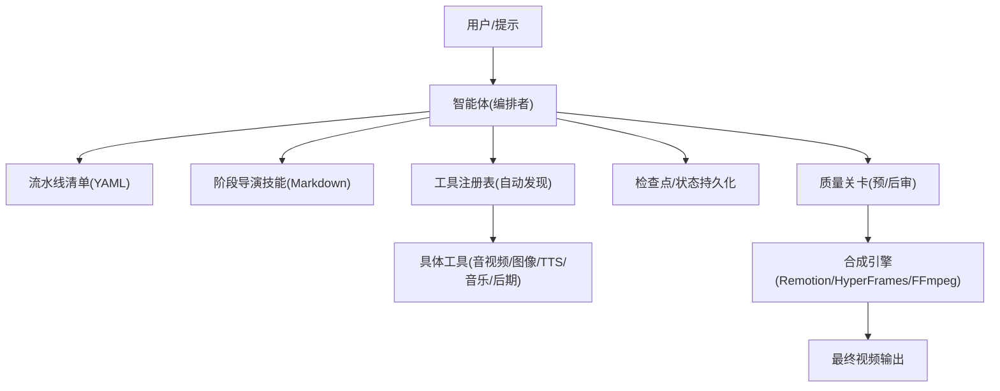
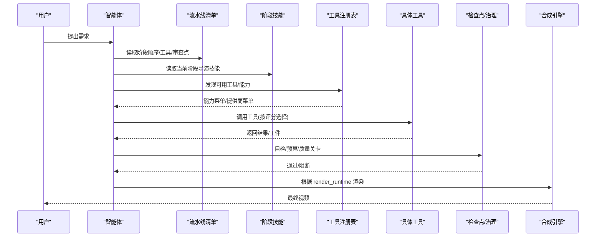
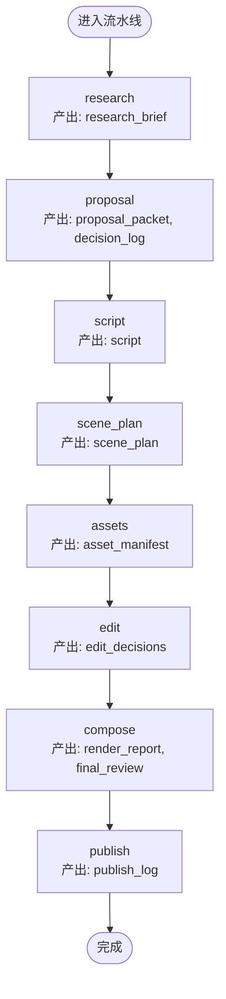
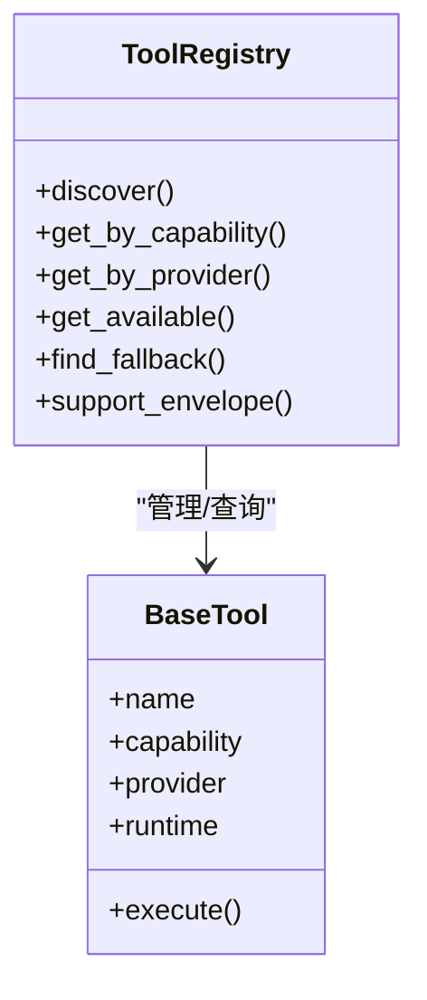
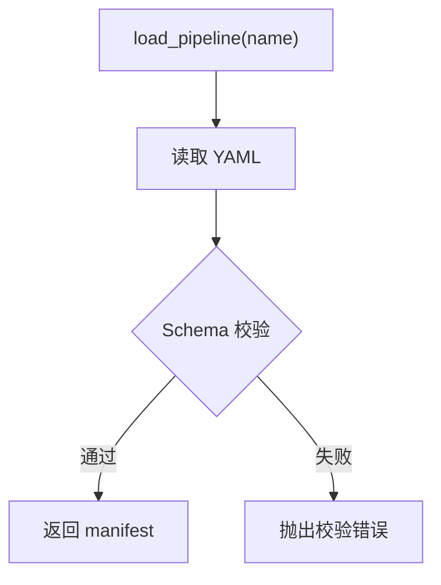
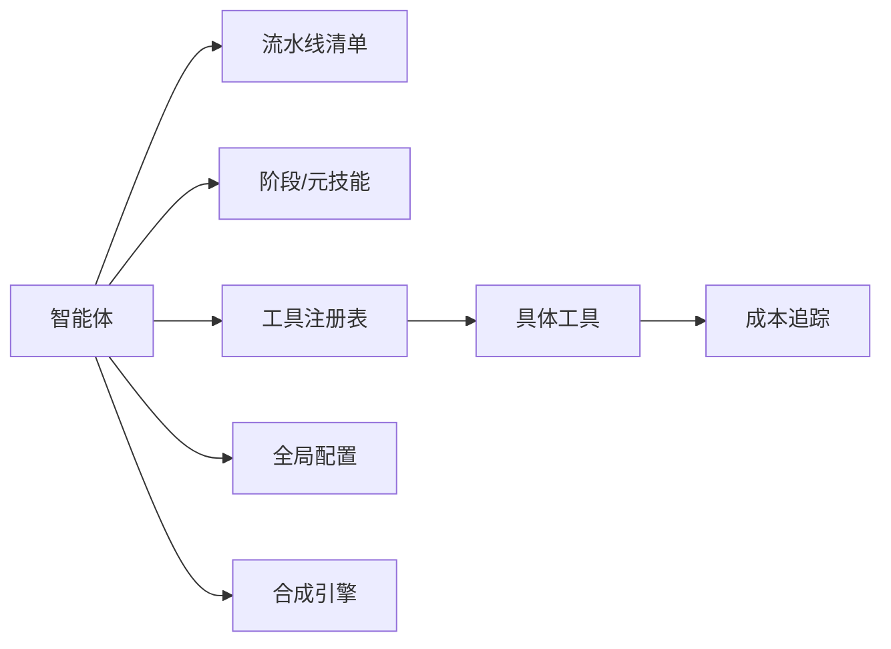

# 项目概述

<cite>
**本文引用的文件**
- [README.md](file://README.md)
- [README_zh-CN.md](file://README_zh-CN.md)
- [PROJECT_CONTEXT.md](file://PROJECT_CONTEXT.md)
- [AGENTS.md](file://AGENTS.md)
- [AGENT_GUIDE.md](file://AGENT_GUIDE.md)
- [config.yaml](file://config.yaml)
- [docs/ARCHITECTURE.md](file://docs/ARCHITECTURE.md)
- [pipeline_defs/animated-explainer.yaml](file://pipeline_defs/animated-explainer.yaml)
- [tools/tool_registry.py](file://tools/tool_registry.py)
- [lib/pipeline_loader.py](file://lib/pipeline_loader.py)
</cite>

## 目录
1. [引言](#引言)
2. [项目结构](#项目结构)
3. [核心组件](#核心组件)
4. [架构总览](#架构总览)
5. [详细组件分析](#详细组件分析)
6. [依赖关系分析](#依赖关系分析)
7. [性能与质量治理](#性能与质量治理)
8. [快速开始指南](#快速开始指南)
9. [故障排查指南](#故障排查指南)
10. [结论](#结论)

## 引言
OpenMontage 是首个开源、代理驱动的视频生产系统。它将“创意构思—研究—脚本—素材生成—剪辑—合成”的完整视频制作流水线，交由 AI 智能体编排执行，并以可审计的质量关卡和预算控制保障产出质量与成本可控。与传统“仅将静态图动一下”的工具不同，OpenMontage 支持从免费/开源素材库检索真实运动片段，构建时间线并渲染成品视频；同时提供多模态 AI 集成（图像、视频、语音、音乐）、智能提供商选择与评分、以及贯穿全流程的质量治理体系。

## 项目结构
仓库采用“指令驱动 + 工具注册表 + 流水线清单”的分层组织方式：
- 顶层入口与说明：README、中文 README、项目上下文、Agent 引导等
- 配置与运行时：全局配置、环境加载、媒体输出规格
- 流水线定义：YAML 清单描述阶段、技能、工具与审查点
- 技能与知识：三层知识架构（工具能力、项目约定、外部技术知识）
- 工具实现：音视频、图像、后期、分析、字幕、角色动画等
- 合成引擎：Remotion（React）、HyperFrames（HTML/GSAP）、FFmpeg
- 测试与评估：契约测试、QA 集成、回放基准

图表来源
- [docs/ARCHITECTURE.md:9-27](file://docs/ARCHITECTURE.md#L9-L27)
- [AGENT_GUIDE.md:74-80](file://AGENT_GUIDE.md#L74-L80)
- [tools/tool_registry.py:55-134](file://tools/tool_registry.py#L55-L134)

章节来源
- [README.md:450-475](file://README.md#L450-L475)
- [docs/ARCHITECTURE.md:31-76](file://docs/ARCHITECTURE.md#L31-L76)

## 核心组件
- 智能体编排：以 LLM 编程助手为编排者，读取 YAML 清单与 Markdown 技能，调用 Python 工具，写入检查点，并在关键节点请求人类审批。
- 流水线系统：声明式 YAML 定义阶段顺序、可用工具、审查重点与成功标准；每个阶段有对应的导演技能指导执行。
- 工具注册表：自动发现所有 BaseTool 子类，按能力族（TTS、视频生成、图像生成、音乐、后期等）查询与路由，支持降级与回退链。
- 质量治理：交付承诺校验、幻灯片风险评分、源媒体探测、前后审（ffprobe/帧采样/音频分析）、决策日志与预算控制。
- 合成引擎：Remotion（数据驱动/React 场景）、HyperFrames（HTML/CSS/GSAP 动态图形）、FFmpeg（基础剪辑与烧录）。
- 风格与平台：样式剧本统一视觉语言；内置多平台输出规格（YouTube、TikTok、竖屏等）。

章节来源
- [PROJECT_CONTEXT.md:9-57](file://PROJECT_CONTEXT.md#L9-L57)
- [AGENT_GUIDE.md:49-68](file://AGENT_GUIDE.md#L49-L68)
- [docs/ARCHITECTURE.md:102-167](file://docs/ARCHITECTURE.md#L102-L167)
- [README.md:652-686](file://README.md#L652-L686)

## 架构总览
OpenMontage 采用“指令驱动（Agent-First）”的架构：Python 仅提供工具与持久化，编排逻辑、创意决策、审查标准全部位于可读的指令文件中。智能体按流水线阶段推进，每步产出规范化的 JSON 工件并通过 Schema 校验，确保下游阶段输入可靠。

图表来源
- [docs/ARCHITECTURE.md:9-27](file://docs/ARCHITECTURE.md#L9-L27)
- [AGENT_GUIDE.md:181-201](file://AGENT_GUIDE.md#L181-L201)
- [tools/tool_registry.py:118-134](file://tools/tool_registry.py#L118-L134)

章节来源
- [docs/ARCHITECTURE.md:80-99](file://docs/ARCHITECTURE.md#L80-L99)
- [PROJECT_CONTEXT.md:9-19](file://PROJECT_CONTEXT.md#L9-L19)

## 详细组件分析

### 流水线与阶段（以“动画解说”为例）
- 阶段序列：research → proposal → script → scene_plan → assets → edit → compose → publish
- 每个阶段由 YAML 清单声明 skill、produces、tools_available、review_focus、success_criteria、human_approval_default
- 资产阶段要求 TTS/图像/可选视频/音乐等工具；合成阶段强制 video_compose 与 audio_mixer，并验证输出

图表来源
- [pipeline_defs/animated-explainer.yaml:61-270](file://pipeline_defs/animated-explainer.yaml#L61-L270)

章节来源
- [pipeline_defs/animated-explainer.yaml:1-270](file://pipeline_defs/animated-explainer.yaml#L1-L270)

### 工具注册表与选择器
- 自动发现：扫描 tools 包下所有 BaseTool 子类并注册
- 能力查询：按 capability/provider/status/stability 分组查询
- 回退机制：find_fallback 按声明的 fallback_tools 链查找可用替代
- 提供商菜单：support_envelope/provider_menu_summary 用于预检展示“已配置/未配置”的能力全景

图表来源
- [tools/tool_registry.py:55-196](file://tools/tool_registry.py#L55-L196)
- [docs/ARCHITECTURE.md:102-150](file://docs/ARCHITECTURE.md#L102-L150)

章节来源
- [tools/tool_registry.py:1-200](file://tools/tool_registry.py#L1-L200)
- [docs/ARCHITECTURE.md:102-167](file://docs/ARCHITECTURE.md#L102-L167)

### 流水线清单加载与校验
- 加载 pipeline_defs/*.yaml，使用 JSON Schema 校验
- 缓存提升热路径性能（lru_cache）
- 提供 stage order、required tools、human approval 默认值等辅助方法

图表来源
- [lib/pipeline_loader.py:49-70](file://lib/pipeline_loader.py#L49-L70)

章节来源
- [lib/pipeline_loader.py:1-200](file://lib/pipeline_loader.py#L1-L200)

### 合成引擎与运行时选择
- Remotion：React 场景、数据可视化、词级字幕、TalkingHead
- HyperFrames：HTML/CSS/GSAP 动态排版、产品宣传、网站转视频、SVG 角色绑定
- FFmpeg：纯剪辑、字幕烧录、编码
- 运行时在提案阶段锁定，禁止静默切换；不可用则视为阻塞并上报

章节来源
- [AGENT_GUIDE.md:368-427](file://AGENT_GUIDE.md#L368-L427)
- [docs/ARCHITECTURE.md:448-474](file://docs/ARCHITECTURE.md#L448-L474)

## 依赖关系分析
- 智能体依赖：流水线清单、阶段技能、元技能（审阅者、检查点协议）
- 工具依赖：BaseTool 契约、注册表、成本追踪器、环境加载
- 合成依赖：Remotion/HyperFrames/FFmpeg 可用性检测与路由
- 配置依赖：config.yaml（LLM、预算、检查点策略、输出规格、路径）

图表来源
- [PROJECT_CONTEXT.md:33-57](file://PROJECT_CONTEXT.md#L33-L57)
- [config.yaml:1-34](file://config.yaml#L1-L34)
- [docs/ARCHITECTURE.md:102-167](file://docs/ARCHITECTURE.md#L102-L167)

章节来源
- [PROJECT_CONTEXT.md:33-57](file://PROJECT_CONTEXT.md#L33-L57)
- [config.yaml:1-34](file://config.yaml#L1-L34)

## 性能与质量治理
- 质量关卡
  - 合成前验证：交付承诺、幻灯片风险、渲染器可用性
  - 渲染后自审：ffprobe、抽帧、音频电平、字幕存在性
  - 源媒体探测：分辨率、编解码、声道、时长
- 提供商选择：7 维评分（任务契合、质量、控制、可靠性、成本、延迟、连续性），记录决策日志
- 预算治理：预估→预留→结算；模式 observe/warn/cap；单动作审批阈值与总预算上限
- 性能优化：流水线清单缓存、注册表一次性发现、按需加载 Layer 3 技能

章节来源
- [README.md:652-686](file://README.md#L652-L686)
- [docs/ARCHITECTURE.md:290-318](file://docs/ARCHITECTURE.md#L290-L318)
- [lib/pipeline_loader.py:27-46](file://lib/pipeline_loader.py#L27-L46)

## 快速开始指南
- 环境要求
  - Python 3.10+、FFmpeg、Node.js 18+、任意 AI 编程助手
- 安装与运行
  - 克隆仓库，执行 make setup
  - 在 AI 编程助手中打开项目，直接给出自然语言需求即可启动流水线
- 零密钥体验
  - 开箱即用：离线 TTS（Piper）、开源素材库（Archive.org/NASA/Wikimedia）、Remotion/HyperFrames/FFmpeg 本地合成
- 可选 API Key（解锁更多能力）
  - 图像/视频网关（FAL_KEY、ATLASCLOUD_API_KEY）
  - 官方直连（KLING_API_KEY、HEYGEN_API_KEY、RUNWAY_API_KEY）
  - 免费素材（PEXELS_API_KEY、PIXABAY_API_KEY、UNSPLASH_ACCESS_KEY）
  - 音乐（SUNO_API_KEY）
  - 语音/图像（ELEVENLABS_API_KEY、OPENAI_API_KEY、GOOGLE_API_KEY、XAI_API_KEY）
- GPU 本地视频生成（可选）
  - 安装 GPU 依赖，设置环境变量启用本地模型（如 wan/hunyuan/ltx/cogvideo）

章节来源
- [README.md:180-278](file://README.md#L180-L278)
- [README_zh-CN.md:113-206](file://README_zh-CN.md#L113-L206)
- [docs/ARCHITECTURE.md:382-403](file://docs/ARCHITECTURE.md#L382-L403)

## 故障排查指南
- 预检问题
  - 使用 provider_menu_summary 查看“已配置/未配置”能力，按 install_instructions 补齐缺失项
  - 若 Remotion/HyperFrames 不可用，需在提案阶段明确并锁定，避免静默切换
- 运行时问题
  - 检查 ffmpeg 是否可用；Node.js 版本是否符合要求（HyperFrames ≥ 22）
  - 确认 .env 中 API Key 正确加载（注册表会尝试加载 .env）
- 质量关卡拦截
  - 若被“幻灯片风险”或“交付承诺”阻断，调整素材类型与运动强度，或更换更合适的提供商/模型
- 预算超支
  - 调整 budget.mode 与 single_action_approval_usd，或在提案阶段降低预期规模

章节来源
- [AGENT_GUIDE.md:263-351](file://AGENT_GUIDE.md#L263-L351)
- [tools/tool_registry.py:86-117](file://tools/tool_registry.py#L86-L117)
- [docs/ARCHITECTURE.md:498-512](file://docs/ARCHITECTURE.md#L498-L512)

## 结论
OpenMontage 将传统影视制作的严谨流程引入 AI 时代：以智能体为编排者，以 YAML 清单与 Markdown 技能为“程序”，以工具注册表与多层知识为“能力底座”，以质量关卡与预算治理为“护栏”。它既能从零生成高质量动画与解说，也能基于真实素材构建纪录片蒙太奇；既兼容云端 API，也支持本地开源模型。对初学者而言，零密钥即可上手；对资深开发者而言，可扩展流水线、新增工具与风格，持续演进。